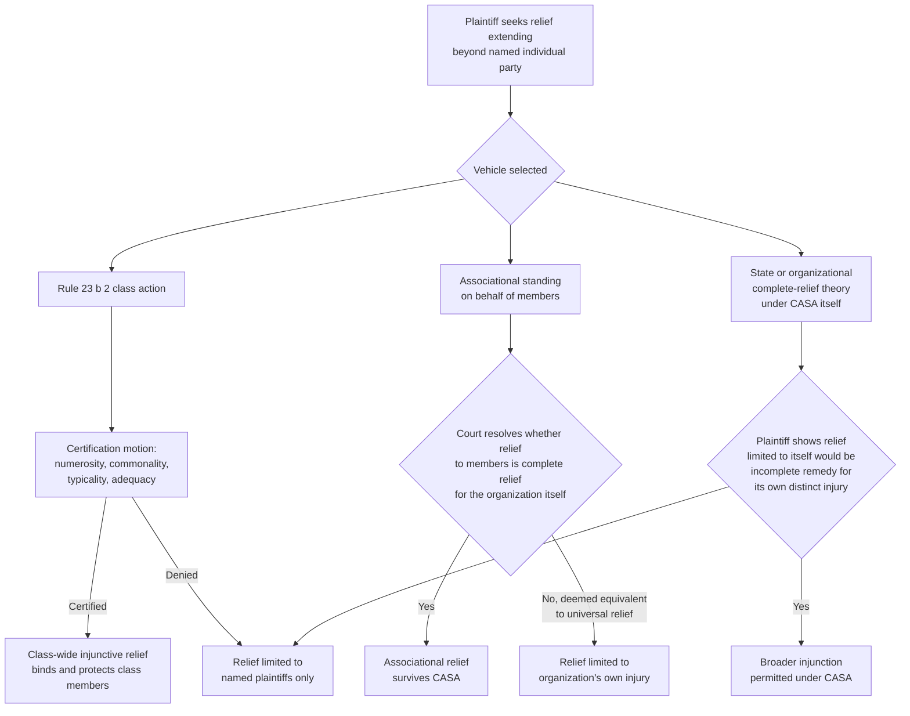

## Class Actions and Associational Relief as Alternatives to Universal Injunctions

### Overview

In the wake of *Trump v. CASA, Inc.* (2025), which held that federal courts lack statutory authority to issue injunctions reaching beyond what is necessary to provide "complete relief" to the parties before the court, litigants seeking broad-scope relief against unlawful agency or executive action must turn to procedural vehicles that formally incorporate non-parties into the litigation itself. The two principal such vehicles are the Rule 23 class action and associational standing on behalf of an organization's members. Both predate CASA by decades, but CASA's narrowing of universal injunctive relief substantially elevates their practical importance as the primary lawful pathways to non-party-inclusive remedies in administrative litigation.

### Rule 23 Class Actions: Structural Overview

A class action allows a court to bind absent class members to a judgment — extending relief (or, in defendant classes, liability) beyond the named plaintiffs — through a formal certification process rather than through the breadth of an injunction alone.

**Certification Requirements — Rule 23(a) (all four required):**

1. **Numerosity** — the class is so numerous that joinder of all members is impracticable
2. **Commonality** — there are questions of law or fact common to the class
3. **Typicality** — the claims or defenses of the representative parties are typical of the claims or defenses of the class
4. **Adequacy** — the representative parties will fairly and adequately protect the interests of the class

**Certification Category — Rule 23(b) (at least one required):**

For challenges to agency or executive action, the relevant category is typically **Rule 23(b)(2)**: the party opposing the class (here, the government) has acted or refused to act on grounds generally applicable to the class, making injunctive or declaratory relief appropriate for the class as a whole. Unlike Rule 23(b)(3) damages classes, (b)(2) classes:

- Do not require the more demanding "predominance and superiority" showing
- Do not require individual notice and opt-out rights as a matter of course (unlike (b)(3))
- Are the natural fit for challenges seeking to block enforcement of a rule or policy against an entire category of affected persons

### Class Actions as a Post-CASA Vehicle

CASA's majority opinion did not disturb Rule 23; the Court's statutory holding concerned the scope of equitable injunctive authority independent of class certification. A certified Rule 23(b)(2) class therefore remains a lawful mechanism for obtaining relief that binds and protects absent class members — the functional equivalent of what a universal injunction previously achieved, but through a procedurally regulated pathway.

**Structural distinctions between a certified class and a universal injunction:**

| Dimension | Certified Rule 23(b)(2) Class | Pre-CASA Universal Injunction |
| --- | --- | --- |
| Non-parties bound/protected | Yes, but only class members formally defined by the certification order | Yes, all persons nationwide, undefined |
| Adequacy-of-representation review | Required (Rule 23(a)(4)) | None |
| Court scrutiny of class definition | Required; class must be ascertainable and properly defined | None — scope set unilaterally by the injunction's terms |
| Preclusive effect on absent members | Binding (subject to due process protections) | Ambiguous; non-parties were protected but not bound by adverse rulings |
| Procedural rigor before broad relief issues | Certification motion, briefing, often evidentiary hearing | Could follow directly from a preliminary injunction motion |
| Appellate review posture | Certification order independently appealable (Rule 23(f)) | Injunction appealable; scope not independently certified |

[Inference] This last distinction was a significant part of the pre-CASA critique of universal injunctions: they permitted class-like scope of relief without any of the certification-stage scrutiny that safeguards absent parties' interests, and CASA's holding can be understood as pushing litigants back toward the procedurally regulated class mechanism for exactly this reason.

### Practical Challenges of Post-CASA Class Certification in Administrative Litigation

1. **Timing pressure.** Class certification is not instantaneous; briefing and a certification ruling take time that may not be available when a plaintiff needs emergency relief from an agency action with an imminent effective date. Litigants may need to seek a preliminary injunction for the named plaintiffs while certification is pending, then broaden relief upon certification — a two-step process where universal injunctions previously offered a single step.
2. **Nationwide class definition and personal jurisdiction.** [Unverified — actively litigated] Whether and how nationwide classes can be certified against the federal government post-CASA, and whether any jurisdictional or venue constraints specific to suits against federal officials complicate nationwide class definitions, remains a developing area that should be verified against current case law.
3. **Commonality in the face of individualized agency application.** Agency action that is applied with some degree of individualized discretion (e.g., case-by-case benefit determinations) may be harder to certify under Rule 23(a)(2)'s commonality requirement than a facially uniform rule or executive order.
4. **Government defendant dynamics.** Courts have sometimes expressed skepticism about certifying classes against government defendants where individualized relief might otherwise suffice, though this skepticism predates and is independent of CASA.

### Associational Standing as a Complementary Vehicle

Separate from Rule 23, an organization may sue on behalf of its members without formal class certification, under the doctrine of **associational standing**, established in **Hunt v. Washington State Apple Advertising Comm'n** (1977). An association has standing to sue on behalf of its members when:

1. Its members would otherwise have standing to sue in their own right
2. The interests the organization seeks to protect are germane to the organization's purpose
3. Neither the claim asserted nor the relief requested requires the participation of individual members in the lawsuit

**Relationship to CASA's "complete relief" framework:**

CASA's opinion expressly left ambiguous — "cast doubt" upon without squarely resolving — the scope of relief available to organizational plaintiffs. The unresolved question is whether an injunction protecting an organization's *members* (who are not individually named parties) is:

(a) properly understood as relief necessary to make the *organization itself* whole (and therefore consistent with CASA's complete-relief framework, since the organization is the actual party before the court), or

(b) functionally equivalent to a universal injunction extended to non-party members (and therefore subject to the same statutory objection CASA raised).

[Unverified — open question] This distinction is likely to be a central battleground in post-CASA administrative litigation, particularly for advocacy organizations, trade associations, and unions that have historically relied on associational standing to challenge agency rules on behalf of large, diffuse memberships without the burden of individually naming each affected member as a plaintiff.

### Comparative Table: Class Actions vs. Associational Relief vs. (Former) Universal Injunctions

| Dimension | Rule 23(b)(2) Class | Associational Standing | Pre-CASA Universal Injunction |
| --- | --- | --- | --- |
| Formal certification required | Yes | No | No |
| Non-party protection mechanism | Class membership | Organizational membership | Geographic/categorical scope of the order itself |
| Adequacy safeguards | Rule 23(a)(4) | Organization's own incentive alignment with members (no formal test) | None |
| Post-CASA viability | Preserved; CASA does not restrict | Uncertain; explicitly flagged as unresolved by CASA | Foreclosed absent qualifying complete-relief showing |
| Speed to obtain broad relief | Slower (certification process) | Faster (no certification step) | Fastest (pre-CASA) |
| Typical use case | Large, definable class sharing common legal exposure to a rule | Trade associations, unions, advocacy groups suing for their membership | Any plaintiff seeking maximal relief scope |

### Diagram: Post-CASA Pathways to Broad-Scope Relief

### Practical Illustration

**Example — Environmental/Regulatory Context:**

A national environmental advocacy organization wishes to challenge an EPA rule narrowing Clean Water Act jurisdiction, on the ground that the rule harms its members' recreational and conservation interests across many states.

- **Pre-CASA approach:** The organization could seek a single preliminary injunction in a favorable district court, framed to block the rule's enforcement nationwide, relying on general equitable discretion and completeness-of-relief reasoning applied loosely to the organization's diffuse membership.
- **Post-CASA approach (associational standing):** The organization sues on behalf of its members under *Hunt*, but faces the open question of whether relief benefiting non-named members is "complete relief" for the organization itself or impermissible universal relief — likely requiring the organization to build a record showing why relief limited strictly to its own organizational operations would be inadequate.
- **Post-CASA approach (class action):** The organization instead seeks to certify a Rule 23(b)(2) class of all persons with cognizable recreational, aesthetic, or economic interests in waters affected by the rule, accepting the additional time and procedural burden of certification in exchange for a more secure post-CASA basis for class-wide relief.

**Key Points**

- Rule 23(b)(2) classes are the most doctrinally secure post-CASA vehicle for broad-scope injunctive relief, precisely because CASA's holding targeted judge-made universal injunctions, not the congressionally sanctioned class-action mechanism.
- Associational standing remains available but occupies a zone of genuine post-CASA uncertainty, since CASA's opinion flagged (without resolving) whether relief to an organization's members constitutes complete relief for the organization or disguised universal relief.
- Litigants should expect a shift toward earlier and more frequent use of class certification motions in administrative litigation challenging agency rules, alongside continued reliance on multi-state and multi-plaintiff joinder strategies to broaden the practical footprint of relief without exceeding CASA's limits.
- The interaction between these alternative vehicles and APA §706(2) vacatur (which may independently provide broad-scope relief in record-review cases, an issue CASA left open) should be considered jointly when designing a litigation strategy against a challenged rule.

**Related Topics**

- Trump v. CASA and the narrowing of universal injunctive relief
- APA §706(2) vacatur and its uncertain post-CASA relationship to injunctive relief
- Hunt v. Washington State Apple Advertising Comm'n and the associational standing doctrine
- Rule 23(b)(2) versus Rule 23(b)(3) certification standards
- Multi-state coalition litigation and the "complete relief" theory for state plaintiffs
- Organizational standing doctrine generally, including Havens Realty and injury-in-fact for associations
- Practical litigation strategy: sequencing preliminary relief and class certification motions post-CASA