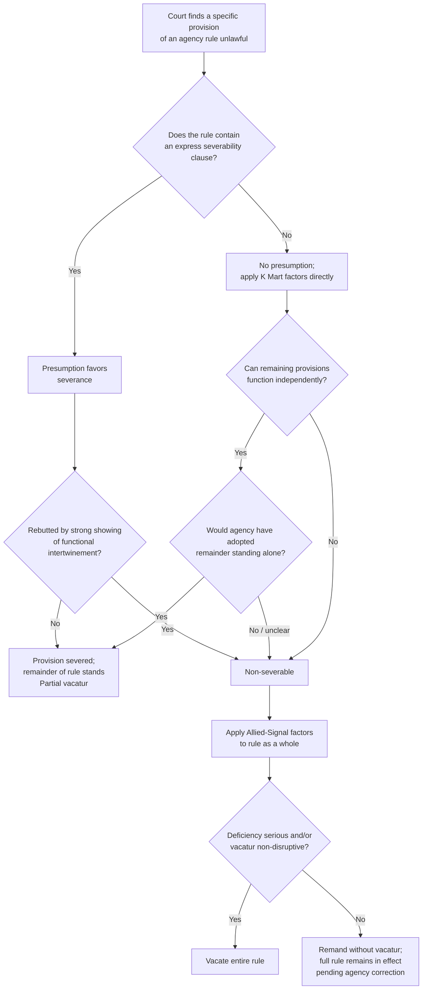

## Severability of Unlawful Rule Provisions

### Overview

Severability doctrine addresses a distinct remedial question from the scope-of-relief issues raised by injunctions and vacatur: when a court finds that *part* of an agency rule is unlawful, must the entire rule fall, or can the offending provision be excised while the remainder survives? This is a question of remedial scope along a different axis — not *who* is bound by the court's judgment (the injunction/vacatur/class-action axis), but *how much of the rule itself* the judgment reaches. Severability determines whether a partial legal defect produces a partial or total remedy.

### The Basic Doctrinal Framework

The governing test, articulated most influentially in **K Mart Corp. v. Cartier, Inc.** (1988) and developed further in subsequent administrative law cases, asks two questions:

1. **Functional independence.** Can the remaining provisions of the rule function sensibly and operate independently without the invalid provision? If the valid and invalid portions are so intertwined that the rule cannot operate as intended without the excised piece, severance is inappropriate.
2. **Agency intent.** Would the agency have adopted the valid portions of the rule standing alone, absent the invalid portion? This is fundamentally a counterfactual inquiry into what the agency would have done if it had known the offending provision was unlawful.

[Inference] Courts frequently treat these two questions as related but analytically distinct: functional independence is largely a textual and structural inquiry into the rule as written, while agency intent is an inquiry into the rule's stated purposes, its rulemaking record, and sometimes the agency's own litigating position on severability.

### Sources of the Severability Presumption

**Severability clauses.** Many rules (and their authorizing statutes) include an express severability clause — boilerplate language stating that if any provision is held invalid, the remainder shall continue in effect. Courts generally treat such a clause as creating a presumption in favor of severance, though the clause is not dispositive; it does not override a finding that the valid and invalid provisions are inextricably functionally intertwined.

**Absence of a severability clause.** Where a rule contains no severability clause, courts do not apply an automatic presumption against severance; instead, they apply the K Mart functional-independence and agency-intent factors directly, often looking to the rule's preamble and the administrative record for evidence of how the agency itself characterized the relationship between the rule's component provisions.

**Statutory severability provisions.** Some organic statutes contain their own severability directives applicable to rules issued under them, which take precedence over general judicial severability doctrine to the extent they specifically address the situation at hand.

### Severability and the Choice of Remedy

Severability interacts directly with the vacatur-versus-remand question under APA §706(2) discussed elsewhere in this chapter:

- If a court finds a rule's flaw severable, it may **vacate only the offending provision** while leaving the remainder of the rule in effect — a partial vacatur.
- If the court finds the flaw non-severable, it must choose between **vacating the entire rule** or, in appropriate cases, **remanding without vacatur**, leaving the whole rule in effect while the agency addresses the defect (the *Allied-Signal* remand-without-vacatur framework).
- [Inference] Because non-severability forces an all-or-nothing choice on the underlying rule as a whole, courts confronting borderline severability questions sometimes have an implicit incentive toward finding severability, since it allows the court to excise precisely the unlawful portion without disturbing lawful, functioning regulatory provisions that neither party has challenged.

### The *Allied-Signal* Factors, Applied to Non-Severable Defects

Where severance is unavailable and the court must decide the fate of the rule as a whole, the **Allied-Signal, Inc. v. NRC** (D.C. Cir. 1993) framework for the vacatur-versus-remand choice applies:

1. **The seriousness of the deficiency** — whether the agency may be able to justify its decision on remand, or whether the defect is so fundamental that the agency's original reasoning cannot be salvaged
2. **The disruptive consequences of vacatur** — whether vacating the rule (or the non-severable remainder) would cause significant disruption, particularly to regulated parties who have relied on the rule or to public health, safety, or environmental protections the rule was designed to secure

### Comparative Table: Remedial Outcomes Based on Severability

| Scenario | Remedial Outcome |
| --- | --- |
| Provision severable; agency would have adopted remainder alone | Partial vacatur — invalid provision struck, remainder stands |
| Provision severable; remainder functions independently but agency intent to adopt it alone is unclear | Courts split; some vacate only the provision, others remand for agency clarification of intent |
| Provision non-severable; deficiency minor/curable | Remand without vacatur (*Allied-Signal*) — full rule remains in effect during remand |
| Provision non-severable; deficiency serious/fundamental | Vacatur of entire rule |
| Rule contains express severability clause | Presumption favors partial vacatur, rebuttable by strong functional-intertwinement showing |
| Rule silent on severability | K Mart factors applied without presumption either direction |

### Diagram: Severability Decision Pathway

### Practical Illustration

**Example — Environmental Law Context:**

EPA promulgates a rule under the Clean Air Act establishing both (a) a numeric emissions limit for a pollutant and (b) a monitoring and reporting protocol for compliance with that limit. A court finds that the monitoring protocol was adopted without adequate notice-and-comment, in violation of APA §553, but the numeric emissions limit itself was properly promulgated and is substantively unchallenged.

- **If severable:** The court vacates only the monitoring and reporting protocol, remanding that piece to EPA for renewed notice-and-comment, while the numeric emissions limit remains in effect and enforceable — because the emissions limit can function independently (regulated parties still have an independent legal obligation to meet the limit, even without the specific reporting mechanism), and EPA plainly would have adopted the emissions limit regardless of the reporting protocol's fate.
- **If non-severable:** If the monitoring protocol turns out to be the *sole* enforcement mechanism by which compliance with the numeric limit can be verified — such that the limit is unenforceable without it — the court would treat the two provisions as functionally intertwined and proceed to the *Allied-Signal* analysis for the rule as a whole, likely favoring remand without vacatur given the disruption that would result from eliminating enforceable emissions limits altogether during the remand period.

**Key Points**

- Severability is a distinct remedial inquiry from the injunction/vacatur/class-action scope-of-relief questions covered elsewhere in this chapter; it operates on the substantive content of the rule itself rather than on who is bound by the judgment.
- The K Mart test's two prongs — functional independence and agency intent — are applied together, and an express severability clause creates a rebuttable presumption favoring partial vacatur.
- Non-severability forces courts into the *Allied-Signal* vacatur-versus-remand analysis for the rule as a whole, making the severability determination a threshold gate that shapes the entire downstream remedial inquiry.
- [Inference] In multi-provision rules — common in environmental and administrative regulation, where a single rulemaking often bundles substantive standards with procedural, monitoring, and enforcement mechanisms — severability analysis frequently becomes the decisive remedial battleground, since litigants have strong incentives to argue for or against severance depending on which specific provisions they favor or oppose.

**Related Topics**

- APA §706(2) vacatur and the vacatur-versus-remand choice under Allied-Signal v. NRC
- Notice-and-comment defects as a common trigger for severability disputes
- Trump v. CASA and the narrowing of universal injunctive relief (contrast: severability concerns rule scope, not party scope)
- Statutory severability clauses versus judicially-implied severability doctrine
- The role of the administrative record in establishing agency intent for severability purposes
- Partial remand: correcting a severed provision while the remainder of a rule remains in force