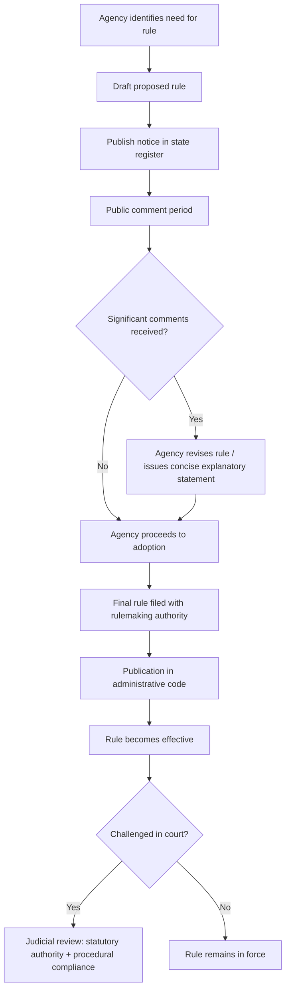
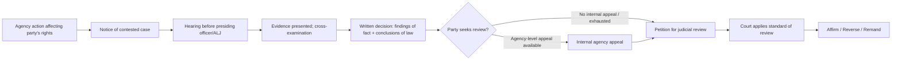

## The Model State Administrative Procedure Act

### Overview and Historical Development

The Model State Administrative Procedure Act (MSAPA) is a uniform act drafted by the National Conference of Commissioners on Uniform State Laws (NCCUSL, now the Uniform Law Commission) to provide states with a template for structuring administrative procedure at the state level, paralleling the role the federal Administrative Procedure Act (APA) of 1946 plays for federal agencies.

Key revisions:

- **1946 MSAPA** — first version, drafted contemporaneously with the federal APA, establishing basic rulemaking and adjudication procedures.
- **1961 MSAPA** — refined rulemaking notice-and-comment requirements and judicial review provisions; widely adopted by states through the 1960s–1980s.
- **1981 MSAPA** — introduced more detailed provisions on contested cases, declaratory rulings, and licensing; added the concept of the "presiding officer."
- **2010 MSAPA** — the most recent revision, modernizing the Act to address electronic rulemaking, e-filing, negotiated rulemaking, and provided a framework more adaptable to states with existing separation-of-powers concerns (e.g., unified vs. non-unified administrative hearing systems).

Because the MSAPA is a *model* act rather than binding federal law, states adopt it with significant variation — some adopt an early version wholesale, others adopt hybrid versions, and some (like California) maintain entirely independent administrative procedure acts that predate or diverge sharply from the MSAPA framework.

### Purpose and Function

**Key Points**

- Provides uniformity across states in agency rulemaking and adjudication procedures, reducing interstate inconsistency for regulated parties operating in multiple jurisdictions.
- Establishes minimum procedural due process protections for individuals affected by state agency action.
- Creates a framework for judicial review of agency action, defining scope of review and standing.
- Balances legislative delegation of authority to agencies against the need for accountability and procedural regularity.

### Structural Framework

The MSAPA is typically organized around four core pillars:

#### 1. Rulemaking

Governs how state agencies promulgate, amend, and repeal rules (the state-law analog to federal "regulations").

- **Notice** — publication of proposed rule in a state register (analogous to the *Federal Register*)
- **Comment period** — minimum period (commonly 20–30 days under various state versions) for public comment
- **Adoption** — agency must consider comments and may need to issue a concise explanatory statement
- **Filing/publication** — final rule filed with a central rulemaking authority (e.g., Secretary of State or Office of Administrative Rules) and published in an administrative code
- **Emergency rulemaking** — expedited procedures bypassing notice-and-comment when necessary to address imminent threats to health, safety, or welfare, subject to time limits and subsequent ratification

#### 2. Adjudication (Contested Cases)

Governs formal agency proceedings resolving disputes affecting specific parties' legal rights, duties, or privileges (e.g., license revocations, benefit denials, enforcement actions).

- Right to notice of the proceeding and the issues involved
- Right to a hearing before an impartial presiding officer or Administrative Law Judge (ALJ)
- Rules of evidence (typically relaxed relative to judicial trials — hearsay admissible if reliable)
- Right to present evidence, cross-examine witnesses, and be represented by counsel
- Requirement of a written decision with findings of fact and conclusions of law
- Separation of prosecutorial and adjudicative functions (ex parte communication restrictions)

#### 3. Judicial Review

Establishes the pathway and standard by which a court reviews final agency action.

- **Exhaustion of administrative remedies** — generally required before seeking judicial review
- **Standing** — limited to persons aggrieved or adversely affected by final agency action
- **Standard of review** — varies by version and by type of agency action:
  - Questions of law: reviewed *de novo*
  - Findings of fact in contested cases: reviewed for substantial evidence on the record
  - Discretionary/policy decisions: reviewed for arbitrary and capricious action or abuse of discretion
  - Rule validity: reviewed for compliance with statutory authority and rulemaking procedure

#### 4. Declaratory Orders / Declaratory Rulings

Allows a person to petition an agency for a binding ruling on how a statute, rule, or order applies to a specific set of facts, without waiting for enforcement action.

### Comparative Systems: State Variation

**Key Points**

- **"Unified" hearing systems** (e.g., a central Office of Administrative Hearings, as in California, Florida, Minnesota) — ALJs are housed in an independent central panel, not embedded within the agency they adjudicate for, strengthening perceived neutrality.
- **"Non-unified" systems** — each agency maintains its own hearing officers/ALJs, who may be agency employees, raising more significant concerns about institutional bias and separation of prosecutorial/adjudicative functions.
- States diverge on:
  - Whether small/local agencies are exempted from full MSAPA procedures
  - Scope of legislative oversight (e.g., legislative rule review committees with veto power)
  - Sunset provisions requiring periodic reauthorization of rules
  - Treatment of interpretive rules, guidance documents, and policy statements as exempt from notice-and-comment (mirroring the federal APA's distinction between legislative and interpretive rules)

[Inference] The degree of adoption fidelity to the 2010 MSAPA specifically remains uneven; many states still operate under 1961 or 1981-based frameworks with local amendments, so practitioners must verify the operative version in the relevant jurisdiction rather than assume the most recent model text applies.

### Comparison: MSAPA vs. Federal APA

| Feature | Federal APA (1946) | MSAPA (2010) |
| --- | --- | --- |
| Rulemaking notice | Federal Register | State administrative register |
| Formal vs. informal rulemaking | Distinguished (§§ 556–557 trigger) | Generally informal (notice-and-comment) as default; formal rulemaking rarer |
| ALJ structure | Agency-specific, protected under 5 U.S.C. § 3105 | Varies — unified central panel or agency-specific |
| Judicial review standard | Arbitrary/capricious; substantial evidence for formal proceedings | Similar, but codified per-state with local variation |
| Emergency rulemaking | Good cause exception (5 U.S.C. § 553(b)(3)(B)) | Emergency rule provisions with stricter sunset/ratification requirements |
| Negotiated rulemaking | Separate statute (Negotiated Rulemaking Act 1990) | Incorporated directly into 2010 MSAPA text |

### Rulemaking Process Flow

### Contested Case Hearing Structure

### Example: Applying MSAPA Judicial Review Standards

**Example**

A state environmental agency denies a wastewater discharge permit renewal, citing new findings on stream turbidity. The permittee seeks judicial review.

- If the permittee challenges the *underlying rule* setting turbidity limits → court reviews for **statutory authority and rulemaking procedural compliance** (was notice-and-comment properly conducted? did the agency have authority to set this standard?).
- If the permittee challenges the *factual finding* that its discharge exceeded turbidity limits → court reviews for **substantial evidence** on the administrative record.
- If the permittee challenges the *agency's discretionary choice* to deny rather than condition the permit → court reviews for **arbitrary and capricious** action or abuse of discretion.

This tripartite distinction — legal question / factual finding / discretionary judgment — is the analytical backbone practitioners apply when structuring a judicial review petition under most MSAPA-derived state schemes.

### Interaction with Environmental Law

**Key Points**

- State environmental agencies (e.g., state EPAs, departments of environmental quality/conservation) typically operate under the state's MSAPA-derived procedural framework for permitting, enforcement, and rulemaking.
- Cooperative federalism programs (Clean Air Act SIPs, Clean Water Act NPDES delegation, RCRA authorization) require state permitting and enforcement actions to satisfy both federal program requirements *and* state APA procedural requirements — creating dual-track compliance obligations.
- Contested case procedures under MSAPA govern permit denial/revocation challenges, enforcement order appeals, and variance requests before matters reach state court.
- Declaratory ruling provisions are frequently used by regulated entities to obtain agency guidance on rule applicability before undertaking capital-intensive projects (e.g., whether a specific discharge falls under a general permit).

### Common Pitfalls in Practice

- Failing to exhaust administrative remedies before seeking judicial review, resulting in dismissal for lack of ripeness/jurisdiction
- Misidentifying which version of the MSAPA (1961 vs. 1981 vs. 2010) a state has actually adopted, since standards of review and procedural deadlines differ materially between versions
- Treating agency guidance documents or interpretive rules as binding "rules" subject to notice-and-comment, when many state APAs exempt these from formal rulemaking (mirroring the federal legislative/interpretive rule distinction)
- Overlooking state-specific ex parte communication restrictions in contested cases, which are stricter in unified ALJ systems than in agency-employed hearing officer systems

**Related Topics**

- Federal Administrative Procedure Act (5 U.S.C. § 551 et seq.) — comparative baseline
- *Chevron* deference and its state-law analogs (state-level deference doctrines post-*Loper Bright*)
- Negotiated rulemaking under the 2010 MSAPA
- Cooperative federalism in environmental permitting (Clean Air Act, Clean Water Act, RCRA)
- Exhaustion of administrative remedies doctrine
- Due process requirements in administrative adjudication (*Mathews v. Eldridge* balancing test)
- State environmental permit appeal boards and specialized environmental courts
- Ex parte communication rules in agency adjudication