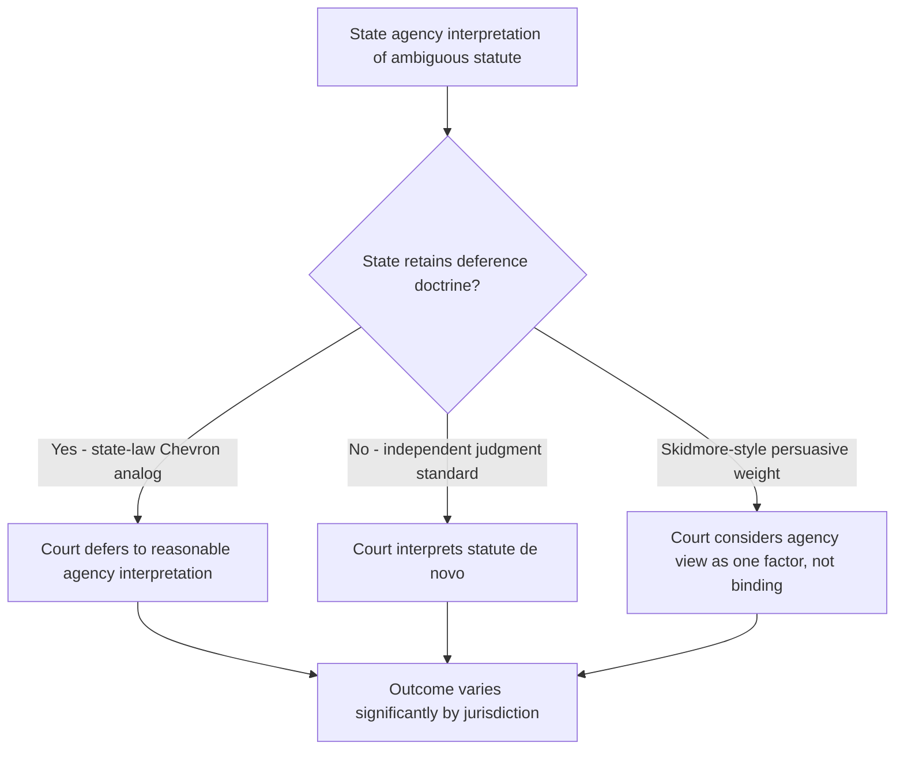

## Variation in State Rulemaking, Adjudication, and Review Procedures

### Overview

While the Model State Administrative Procedure Act (MSAPA) provides a common template, actual state administrative procedure varies substantially across jurisdictions. This variation arises from differences in adopted MSAPA version, state constitutional structure, political economy of agency oversight, and idiosyncratic statutory carve-outs. Understanding this variation is essential for multistate practice, since procedural missteps calibrated to one state's rules can be fatal in another.

### Sources of Variation

**Key Points**

- **Adopted MSAPA vintage** — states operate under 1946, 1961, 1981, or 2010 versions, or hybrids, or reject the MSAPA entirely in favor of independent codes (e.g., California's Administrative Procedure Act, Government Code §§ 11340 et seq.; New York's State Administrative Procedure Act).
- **Constitutional separation-of-powers doctrine** — some state constitutions impose stricter nondelegation limits than the federal nondelegation doctrine, constraining how much discretion agencies may receive from the legislature.
- **Legislative oversight mechanisms** — some states grant legislative committees or joint rules-review committees power to suspend or veto agency rules; others rely solely on judicial review.
- **Hearing officer structure** — unified central panel vs. non-unified agency-embedded ALJs.
- **Sunset and reauthorization requirements** — some states require periodic re-adoption or automatic expiration of rules absent legislative action.

### Rulemaking Variation

| Dimension | Typical MSAPA Approach | Common State Variations |
| --- | --- | --- |
| Comment period length | 20–30 days | Ranges from 15 days (some expedited tracks) to 45+ days for significant rules |
| Economic impact analysis | Not always required | Many states require fiscal notes or small-business impact statements (e.g., regulatory flexibility acts modeled on the federal Regulatory Flexibility Act) |
| Legislative review | Not present in earlier MSAPA versions | States like Illinois (Joint Committee on Administrative Rules) and Wisconsin grant legislative committees suspensive or objection power |
| Emergency rulemaking duration | Time-limited, subject to ratification | Duration limits vary from 90 days to 180 days; some states allow renewal, others prohibit consecutive emergency rules on the same subject |
| Negotiated rulemaking | Optional under 2010 MSAPA | Some states mandate negotiated rulemaking for specific high-impact rule categories (e.g., environmental standards) |
| Publication medium | State register | Electronic-only registers increasingly standard post-2010; some states retain print requirements as a procedural backstop |

### Adjudication Variation

**Key Points**

- **Unified systems** (central Office of Administrative Hearings model) — California, Florida (Division of Administrative Hearings), Minnesota, Georgia. ALJs are institutionally independent of the referring agency, reducing bias concerns and standardizing procedural rules across agencies.
- **Non-unified systems** — many states retain agency-specific hearing officers who may be current or former agency staff, raising heightened concern under due process analysis for combination of prosecutorial and adjudicative functions.
- **Hybrid systems** — some states unify only for certain agency types (e.g., licensing boards) while leaving high-volume benefits agencies (e.g., unemployment insurance) with internal hearing officers.
- **Standard of proof** — most contested cases apply preponderance of the evidence, but some license revocation proceedings require clear and convincing evidence given the severity of the deprivation.
- **Ex parte rules** — stricter separation is typical in unified systems; non-unified systems often permit more internal agency communication subject to disclosure requirements.

### Judicial Review Variation

**Key Points**

- **Standard of review for factual findings**:
  - Substantial evidence (most common, mirrors federal APA formal-proceeding standard)
  - Some states apply a "clearly erroneous" standard for certain agency types
  - A minority apply de novo review for specific categories (e.g., some states for revenue/tax agency determinations)
- **Standard of review for legal questions**: generally de novo, though a shrinking number of states retain some form of judicial deference to agency statutory interpretation post-*Loper Bright Enterprises v. Raimondo* (2024), which eliminated *Chevron* deference at the federal level and has prompted several states to reexamine their own deference doctrines.
- **Standard of review for discretionary action**: arbitrary and capricious / abuse of discretion, applied with varying intensity — some states apply a "hard look" doctrine analogous to federal D.C. Circuit practice; others apply more deferential rational-basis-style review.
- **Venue and forum**: some states channel judicial review directly to an intermediate appellate court (bypassing trial-level review) for efficiency; others require initial filing in a trial court of general jurisdiction.
- **Exhaustion doctrine strictness**: varies from strict (no judicial review without full exhaustion, including internal agency appeals) to more flexible futility-based exceptions.

### State Deference Doctrine Divergence (Post-*Loper Bright*)

[Inference] Because *Loper Bright* is a federal constitutional/statutory interpretation ruling under the federal APA, it does not automatically bind state courts interpreting state APAs; however, it has triggered a wave of scholarly and judicial reexamination of analogous state deference doctrines. Practitioners should not assume uniform post-*Loper Bright* convergence across states — this is a rapidly evolving area requiring jurisdiction-specific verification rather than reliance on the federal trend.

### Comparative Table: Selected State Approaches

| State | MSAPA Basis | Hearing Structure | Legislative Rule Review | Judicial Review Deference |
| --- | --- | --- | --- | --- |
| California | Independent APA (Govt. Code Title 2, Div. 3, Pt. 1) | Unified (Office of Administrative Hearings for many agencies) | Office of Administrative Law reviews for procedural/legal compliance | Independent judgment for some fact questions; substantial evidence for others |
| Florida | 1981-derived with amendments | Unified (Division of Administrative Hearings) | Joint Administrative Procedures Committee | Substantial evidence; no *Chevron*-style deference (abolished by 2018 constitutional amendment, Art. V, § 21) |
| New York | Independent SAPA | Non-unified (agency-specific) | Limited | Substantial evidence standard |
| Texas | 1981-derived (Govt. Code Ch. 2001) | Hybrid (State Office of Administrative Hearings for many agencies) | Standing legislative committees | Substantial evidence |
| Illinois | 1975 Illinois APA (independent, MSAPA-influenced) | Non-unified | Joint Committee on Administrative Rules (JCAR) — suspensive veto power | Clearly erroneous for mixed questions of law/fact |

[Unverified] Exact statutory citations and current committee powers should be confirmed against the current state code, as legislative rule-review authority is a frequent target of amendment.

### Practical Implications for Multistate Practice

**Key Points**

- Filing deadlines for judicial review petitions vary widely (as short as 10 days from final order in some states, 30–60 days in others) — missing this window is jurisdictionally fatal in most states.
- The choice between unified and non-unified hearing systems materially affects litigation strategy: in unified systems, procedural rules are more standardized and precedent from the central panel carries more predictive weight across agencies.
- Environmental and land-use practice is particularly sensitive to this variation because permitting decisions often trigger contested case hearings, and the availability/scope of stays pending judicial review differs by state (some states have automatic stays for certain permit challenges; others require a separate motion demonstrating irreparable harm).
- Practitioners must verify whether the relevant state has adopted negotiated rulemaking, legislative veto mechanisms, or specialized environmental review boards before assuming a generic MSAPA procedural roadmap applies.

### Illustration: Divergence in Review Pathways (SVG)

<svg xmlns="http://www.w3.org/2000/svg" viewBox="0 0 760 340">
<text x="380" y="24" text-anchor="middle" font-size="15" font-weight="bold" fill="#1a1a1a">Divergence in State Judicial Review Pathways (svg_diagram)</text>
<rect x="20" y="50" width="200" height="50" rx="6" fill="#e8f0fe" stroke="#4a6fa5" />
<text x="120" y="80" text-anchor="middle" font-size="12" fill="#1a1a1a">Final Agency Order</text>
<line x1="220" y1="75" x2="280" y2="75" stroke="#333" stroke-width="1.5" marker-end="url(#arrow)" />
<rect x="280" y="20" width="220" height="45" rx="6" fill="#fdf3e0" stroke="#c9962c" />
<text x="390" y="47" text-anchor="middle" font-size="11" fill="#1a1a1a">Unified System: Direct to Central Panel Record</text>
<rect x="280" y="90" width="220" height="45" rx="6" fill="#fdf3e0" stroke="#c9962c" />
<text x="390" y="117" text-anchor="middle" font-size="11" fill="#1a1a1a">Non-Unified: Agency Internal Appeal First</text>
<line x1="120" y1="100" x2="120" y2="112" stroke="#333" stroke-width="1.5" />
<line x1="120" y1="112" x2="280" y2="112" stroke="#333" stroke-width="1.5" marker-end="url(#arrow)" />
<line x1="120" y1="100" x2="120" y2="42" stroke="#333" stroke-width="1.5" />
<line x1="120" y1="42" x2="280" y2="42" stroke="#333" stroke-width="1.5" marker-end="url(#arrow)" />
<line x1="500" y1="42" x2="560" y2="42" stroke="#333" stroke-width="1.5" />
<line x1="500" y1="112" x2="560" y2="112" stroke="#333" stroke-width="1.5" />
<line x1="560" y1="42" x2="560" y2="112" stroke="#333" stroke-width="1.5" />
<line x1="560" y1="77" x2="600" y2="77" stroke="#333" stroke-width="1.5" marker-end="url(#arrow)" />
<rect x="600" y="52" width="140" height="50" rx="6" fill="#e6f4ea" stroke="#3a8f52" />
<text x="670" y="72" text-anchor="middle" font-size="11" fill="#1a1a1a">Judicial Review</text>
<text x="670" y="88" text-anchor="middle" font-size="10" fill="#333">(standard varies)</text>
<rect x="20" y="180" width="720" height="130" rx="6" fill="#fafafa" stroke="#999" />
<text x="40" y="205" font-size="12" font-weight="bold" fill="#1a1a1a">Standard applied at final court stage (illustrative, not exhaustive):</text>
<text x="40" y="228" font-size="11" fill="#333">• Law questions: de novo (majority); some deference doctrines persist post-Loper Bright in select states</text>
<text x="40" y="248" font-size="11" fill="#333">• Fact findings: substantial evidence (majority) / clearly erroneous (minority)</text>
<text x="40" y="268" font-size="11" fill="#333">• Discretionary action: arbitrary and capricious / abuse of discretion, intensity varies by state</text>
<text x="40" y="288" font-size="11" fill="#333">• Filing deadline: 10–60 days from final order, strictly jurisdictional in most states</text>
</svg>

### Common Pitfalls in Practice

- Assuming a "standard" MSAPA procedure applies without confirming the state's actual adopted version or independent code
- Missing jurisdiction-specific, often short, judicial review filing deadlines
- Misapplying substantial evidence review where the state actually requires independent judgment or clearly erroneous review for the relevant fact category
- Assuming legislative rule-review committees exist or have veto power without confirming current statutory authority
- Overlooking that some states have abolished agency deference by constitutional amendment (e.g., Florida) independent of the federal *Loper Bright* trend

**Related Topics**

- The Model State Administrative Procedure Act (foundational template)
- *Loper Bright Enterprises v. Raimondo* and the end of *Chevron* deference
- State constitutional nondelegation doctrines
- Unified vs. non-unified administrative hearing systems
- Negotiated rulemaking procedures
- Legislative veto of agency rules (state-level)
- Exhaustion of administrative remedies across jurisdictions
- Stays pending judicial review of environmental permits