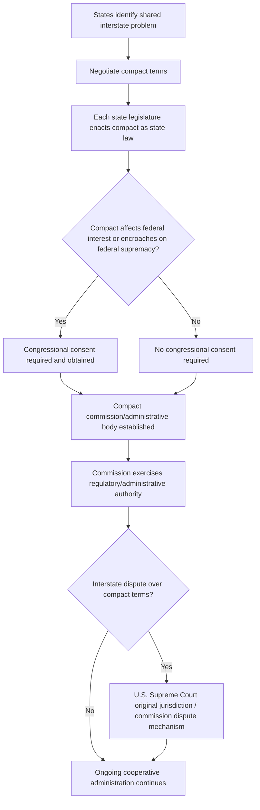

## Interstate Compacts and Cooperative Administration

### Overview and Constitutional Basis

Interstate compacts are agreements between two or more states that create binding legal obligations, authorized under the U.S. Constitution's Compact Clause (Art. I, § 10, cl. 3), which provides that "no state shall, without the Consent of Congress... enter into any Agreement or Compact with another State." Compacts allow states to address problems that cross state boundaries — water rights, pollution control, transportation, law enforcement, professional licensure — through cooperative administrative structures rather than relying solely on federal preemption or uncoordinated unilateral state action.

### Constitutional Framework

**Key Points**

- **Compact Clause text** requires congressional consent, but the Supreme Court in *Virginia v. Tennessee* (1893) held that consent is only constitutionally required for compacts that increase state political power in a way that encroaches on federal supremacy.
- **Categories of compacts**:
  - Compacts requiring congressional consent (those affecting federal interests or increasing state power relative to the federal government)
  - Compacts not requiring consent (largely administrative or technical agreements with minimal federal implication)
- **Effect of congressional consent**: once Congress consents, a compact's provisions can take on the character of federal law for purposes of interpretation, and disputes over compact interpretation can arise under federal question jurisdiction (28 U.S.C. § 1331), giving federal courts (including original Supreme Court jurisdiction under Art. III for disputes between states) a role in compact enforcement.
- **Dormant Commerce Clause interaction**: compacts must not be used as a vehicle for states to engage in impermissible economic protectionism that would independently violate the dormant Commerce Clause.

### Structural Anatomy of a Compact

An interstate compact typically establishes:

1. **Substantive obligations** — the specific rights, duties, and resource allocations agreed to by member states (e.g., water allocation percentages, licensure reciprocity terms)
2. **Compact commission or administrative body** — an interstate agency created by the compact to administer, interpret, and enforce its terms (e.g., the Port Authority of New York and New Jersey, river basin commissions)
3. **Dispute resolution mechanism** — arbitration, commission adjudication, or reservation of original jurisdiction to the U.S. Supreme Court
4. **Withdrawal/amendment provisions** — procedures for a member state to exit or for the compact to be modified
5. **Congressional consent clause** (where applicable) — express acknowledgment of the consent mechanism and any conditions Congress attached

### Major Categories of Interstate Compacts

**Key Points**

- **Water allocation compacts** — e.g., Colorado River Compact (1922), Delaware River Basin Compact, Susquehanna River Basin Compact. These allocate water rights among riparian/basin states and often create a standing administrative commission with regulatory authority over withdrawals, water quality standards, and drought management.
- **Environmental and natural resource compacts** — e.g., Great Lakes–St. Lawrence River Basin Water Resources Compact (2008), which regulates water diversions from the Great Lakes basin and requires unanimous consent of member states/provinces for new diversions.
- **Regional planning and infrastructure compacts** — e.g., Port Authority of New York and New Jersey, Washington Metropolitan Area Transit Authority Compact.
- **Professional licensure compacts** — e.g., Nurse Licensure Compact, Interstate Medical Licensure Compact, Physical Therapy Compact — administrative mechanisms allowing license portability across member states without full re-licensure.
- **Law enforcement and corrections compacts** — e.g., Interstate Compact for Adult Offender Supervision (ICAOS), which governs supervision transfer of probationers/parolees across state lines.
- **Emergency management compacts** — e.g., Emergency Management Assistance Compact (EMAC), enabling mutual aid resource-sharing during declared disasters.

### Administrative Enforcement Mechanisms

**Key Points**

- **Compact commissions** function as quasi-independent administrative agencies with authority delegated jointly by multiple state legislatures (and sometimes ratified by Congress), distinguishing them from single-state agencies bound only by one state's APA.
- Compact commission rulemaking and adjudication procedures are typically **not governed by any single state's Administrative Procedure Act** unless the compact expressly incorporates one — creating potential procedural due process gaps that litigants and drafters must address directly in compact text or commission bylaws.
- **Enforcement disputes** between member states over compact compliance can be brought directly to the U.S. Supreme Court under its original jurisdiction (Art. III, § 2) for controversies between states, bypassing lower federal courts entirely.
- **Interpretation as federal law**: where Congress has consented, compact terms are treated as a matter of federal law, meaning federal courts (not just state courts) may authoritatively construe compact provisions, and state legislation inconsistent with compact terms can be preempted.

### Cooperative Administration Beyond Formal Compacts

Not all interstate cooperative administration takes the form of a formal Compact Clause compact. Related mechanisms include:

- **Uniform acts** (e.g., the MSAPA itself, Uniform Commercial Code) — states independently adopt substantively identical statutory text without creating a joint administrative body or triggering the Compact Clause, since there is no binding interstate agreement, merely parallel voluntary adoption.
- **Reciprocity agreements** — narrower bilateral or informal arrangements (e.g., driver's license reciprocity) that may not rise to the level of a "compact" requiring congressional consent under *Virginia v. Tennessee*'s federal-encroachment test.
- **Memoranda of understanding (MOUs) between state agencies** — informal cooperative arrangements for information sharing or coordinated enforcement, typically not creating binding legal obligations enforceable as compact law.
- **Cooperative federalism programs** — vertical (state-federal) rather than horizontal (state-state) cooperation, such as EPA-delegated NPDES permitting under the Clean Water Act; distinct from interstate compacts but often operating alongside them in environmental contexts (e.g., a river basin compact commission coordinating with EPA-delegated state water quality programs).

### Interstate Compacts in Environmental Law

**Key Points**

- River basin and water allocation compacts are among the most litigated compact categories, given the zero-sum nature of water scarcity disputes (e.g., ongoing Colorado River Compact disputes among Lower and Upper Basin states amid prolonged drought).
- Compact commissions in this space often exercise **regulatory authority functionally equivalent to a state environmental agency** — issuing withdrawal permits, setting flow requirements, and enforcing water quality standards — but their procedural obligations to permit-holders depend entirely on the compact's own text rather than any single state's APA.
- Climate change and prolonged drought have increased litigation pressure on legacy compacts drafted under different hydrological assumptions (e.g., Colorado River Compact allocations based on early 20th-century flow data now understood to have overestimated long-term average flow).
- Cross-border pollution issues not covered by an existing compact may instead proceed under federal common law of interstate nuisance or Clean Air Act/Clean Water Act interstate provisions (e.g., CAA "good neighbor" provisions addressing upwind-downwind pollution transport) rather than compact mechanisms.

### Compact Formation and Enforcement Flow

### Example: Colorado River Compact Administrative Structure

**Example**

The Colorado River Compact (1922) divides the river basin into Upper and Lower Basin states, allocating a fixed annual acre-foot quantity to each. Administration involves:

- The **Bureau of Reclamation** (federal agency) operating major infrastructure (Hoover Dam, Glen Canyon Dam) under federal statute, not the compact commission itself
- **State water agencies** in each basin state administering intrastate allocations consistent with compact-derived entitlements
- **Ongoing renegotiation processes** (e.g., 2007 Interim Guidelines, 2023–2026 post-2026 guideline negotiations) conducted cooperatively among the seven basin states and the federal government, illustrating how compacts function as living administrative frameworks requiring periodic executive-branch and interstate renegotiation rather than static one-time agreements.

[Unverified] Specific current allocation figures and interim guideline terms should be verified against current Bureau of Reclamation and state water agency publications, as this is an actively renegotiated area.

### Common Pitfalls in Practice

- Assuming every interstate agreement is a Compact Clause "compact" requiring congressional consent — the *Virginia v. Tennessee* test limits this to agreements encroaching on federal supremacy
- Assuming a compact commission is bound by any individual member state's APA absent express incorporation in the compact text
- Overlooking that compact interpretation, once congressionally consented to, is a federal question — litigators may incorrectly proceed solely under state law theories
- Failing to distinguish uniform acts (independently adopted parallel statutes) from true compacts (binding joint agreements) when analyzing enforceability
- Underestimating the litigation exposure of legacy natural-resource compacts drafted under outdated environmental/hydrological assumptions

**Related Topics**

- The Model State Administrative Procedure Act
- Variation in state rulemaking, adjudication, and review procedures
- Dormant Commerce Clause and interstate economic regulation
- Cooperative federalism in environmental permitting (Clean Water Act, Clean Air Act)
- U.S. Supreme Court original jurisdiction over interstate disputes
- Colorado River Compact and Western water law
- Professional licensure portability compacts
- Federal common law of interstate nuisance