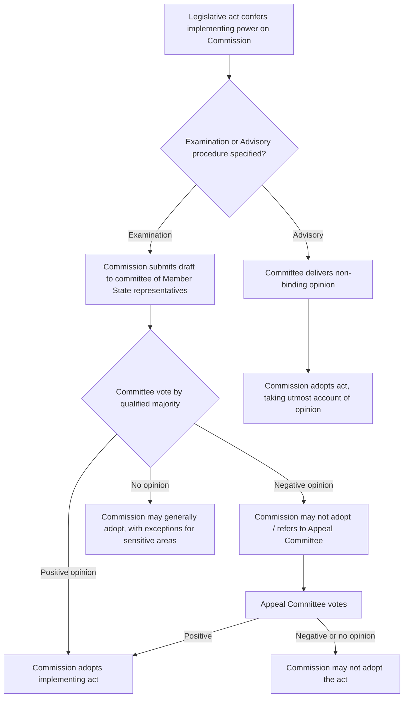

## EU Administrative Law: Comitology, Subsidiarity, and Judicial Review

### Overview

European Union administrative law governs how EU institutions — the European Commission, Council of the European Union, European Parliament, and a dense network of committees and agencies — exercise delegated regulatory authority, and how that exercise is constrained by foundational principles of EU constitutional law. Unlike U.S. state administrative law, which operates within a unitary sovereign's delegation framework, EU administrative law operates within a supranational structure where authority is conferred by Member States through treaties, and regulatory legitimacy depends heavily on principles like subsidiarity and proportionality that have no direct U.S. analog.

### Institutional Architecture

**Key Points**

- **European Commission** — the EU's primary executive/administrative body, proposes legislation and holds delegated and implementing rulemaking authority.
- **Council of the European Union** — represents Member State governments; co-legislates with Parliament and retains oversight authority over certain delegated acts.
- **European Parliament** — directly elected body; co-legislates and exercises scrutiny over delegated legislation.
- **Court of Justice of the European Union (CJEU)** — comprises the Court of Justice and the General Court; provides judicial review of EU administrative action, roughly analogous in function (though not in doctrine) to U.S. federal courts reviewing agency action.
- **EU agencies** — specialized bodies (e.g., European Chemicals Agency (ECHA), European Medicines Agency (EMA), European Environment Agency (EEA)) exercising technical/scientific regulatory functions, generally with more constrained rulemaking authority than U.S. agencies due to the *Meroni* doctrine (below).

### Comitology: Delegated and Implementing Acts

Comitology refers to the system of committees composed of Member State representatives that oversee the Commission's exercise of delegated and implementing rulemaking authority — the EU's structural analog to U.S. notice-and-comment rulemaking oversight, though procedurally and politically distinct.

**Legal basis**: Treaty on the Functioning of the European Union (TFEU) Articles 290 and 291, and Regulation (EU) No. 182/2011 (the "Comitology Regulation").

#### Delegated Acts (TFEU Art. 290)

- Non-legislative acts of general application that supplement or amend non-essential elements of a legislative act
- The Commission adopts these directly, but subject to:
  - **Call-back**: the European Parliament or Council may revoke the delegation at any time
  - **Objection period**: Parliament or Council may object within a specified period (commonly two months, extendable), preventing entry into force
- No formal committee vote is required — oversight runs directly to Parliament and Council, not to a Member State committee

#### Implementing Acts (TFEU Art. 291)

- Adopted by the Commission to ensure uniform conditions for implementing legally binding EU acts
- **Subject to comitology committee procedures** under Regulation 182/2011, which establishes two primary procedures:
  - **Examination procedure** — used for measures of general scope or with significant impact (e.g., agriculture, environment, health, trade); the committee (composed of Member State representatives, chaired by the Commission) must approve by qualified majority; if the committee delivers a negative opinion, the Commission generally cannot adopt the act absent further steps (including a possible appeal committee)
  - **Advisory procedure** — the committee's opinion does not bind the Commission, though the Commission must take "utmost account" of it

### The *Meroni* Doctrine and Limits on Agency Delegation

**Key Points**

- Derived from *Meroni & Co. v. High Authority* (Case 9/56, 1958), a foundational ECSC-era ruling limiting delegation of discretionary power to bodies not established by the treaties.
- The doctrine holds that EU institutions may delegate only **clearly defined executive powers, subject to review**, and may not delegate **discretionary power involving a wide margin of judgment** to agencies, since such delegation would alter the institutional balance established by the treaties.
- This significantly constrains EU regulatory agencies compared to U.S. federal agencies, which routinely exercise broad discretionary rulemaking authority under statutory delegations upheld against nondelegation challenges.
- The CJEU has permitted some erosion of strict *Meroni* limits in later case law (e.g., *United Kingdom v. Parliament and Council* (Case C‑270/12, the "short selling" case, 2014), upholding ESMA's emergency intervention powers), but discretionary policy-making delegation to agencies remains more constrained in the EU than in comparable U.S. administrative contexts.

### Subsidiarity and Proportionality

**Key Points**

- **Subsidiarity principle** (Treaty on European Union (TEU) Art. 5(3)): in areas of shared competence, the EU may act only if and insofar as the objectives cannot be sufficiently achieved by Member States at central, regional, or local level, and can, by reason of scale or effects, be better achieved at EU level.
- **Proportionality principle** (TEU Art. 5(4)): the content and form of EU action must not exceed what is necessary to achieve the treaty objectives.
- **Protocol No. 2** to the treaties establishes an "early warning mechanism" allowing national parliaments to issue **reasoned opinions** objecting to draft legislative acts on subsidiarity grounds:
  - **"Yellow card"** — if reasoned opinions represent at least one-third of allocated votes (one-quarter for justice/home affairs), the Commission must review the proposal and justify, amend, or withdraw it
  - **"Orange card"** — a simple majority of reasoned opinions triggers additional legislative scrutiny by Council and Parliament
- Subsidiarity has **no direct U.S. federal or state administrative law analog** — the closest conceptual parallel is federalism-based limits on congressional power (e.g., Commerce Clause limits, anti-commandeering doctrine), but subsidiarity operates as an affirmative justificatory burden on EU legislative action itself, not merely a limit on delegated agency authority.

### Judicial Review Before the CJEU

**Key Points**

- **Action for annulment** (TFEU Art. 263) — the primary mechanism for challenging the legality of a binding EU act (including delegated/implementing acts), analogous in function to U.S. judicial review of final agency action, but with materially different standing rules.
  - **Privileged applicants** — Member States, Parliament, Council, Commission — may challenge any binding act without demonstrating individual concern
  - **Non-privileged applicants** — individuals/companies — must demonstrate the act is of **direct and individual concern** to them (the *Plaumann* test, from *Plaumann & Co. v. Commission*, Case 25/62, 1963), historically a significant barrier to private-party judicial review compared to the more permissive U.S. standing doctrine for "persons aggrieved" under the federal APA
  - The Lisbon Treaty relaxed this for **regulatory acts** not entailing implementing measures, removing the individual concern requirement in that narrower category
- **Grounds for annulment** (TFEU Art. 263) mirror, but are not identical to, U.S. arbitrary-and-capricious review:
  - Lack of competence
  - Infringement of an essential procedural requirement
  - Infringement of the treaties or any rule of law relating to their application (including subsidiarity/proportionality)
  - Misuse of powers
- **Preliminary reference procedure** (TFEU Art. 267) — national courts may (and courts of last instance generally must) refer questions of EU law interpretation or validity to the CJEU; this is the dominant mechanism by which most EU administrative law issues actually reach the CJEU, since most EU law is applied and enforced through national administrative and judicial systems rather than direct EU-level adjudication
- **Action for failure to act** (TFEU Art. 265) — parallel remedy for unlawful institutional inaction, loosely analogous to U.S. APA § 706(1) "unlawfully withheld" agency action claims

### Comparative Table: EU vs. U.S. State/Federal Administrative Law

| Feature | EU Administrative Law | U.S. Federal/State (MSAPA-based) |
| --- | --- | --- |
| Source of authority | Treaties (conferred competence) | Constitution + statutory delegation |
| Discretionary agency rulemaking | Constrained by *Meroni* doctrine | Broadly permitted under statutory delegation |
| Legislative oversight of rules | Comitology committees, Parliament/Council objection | Legislative veto committees in some states; none federally post-*INS v. Chadha* |
| Standing for private judicial review | *Plaumann* test (direct + individual concern), relaxed for regulatory acts | "Persons aggrieved"/adversely affected — comparatively permissive |
| Core review grounds | Competence, procedure, treaty infringement, misuse of powers | Arbitrary and capricious, substantial evidence, de novo legal review |
| Federalism-style constraint | Subsidiarity (affirmative justificatory burden on EU action) | Commerce Clause limits, anti-commandeering (constrains, does not require justification) |
| Primary review pathway | Preliminary reference from national courts (indirect); direct annulment actions (less common for individuals) | Direct petition for judicial review of final agency action |

### Environmental Law Application

**Key Points**

- EU environmental regulation (e.g., REACH chemicals regulation, administered by ECHA) illustrates *Meroni* constraints in practice: ECHA exercises significant technical/scientific evaluation functions, but final risk-management decisions with discretionary policy content are typically reserved to the Commission via comitology (examination procedure), reflecting the doctrine's limit on discretionary delegation to agencies.
- Subsidiarity analysis is frequently invoked in environmental legislative debates (e.g., whether specific pollution standards should be harmonized at EU level or left to Member States), given environmental policy is an area of **shared competence** under TFEU Art. 4(2)(e).
- Judicial review of environmental administrative decisions is complicated by standing limitations: environmental NGOs historically faced significant *Plaumann*-based standing barriers to direct annulment actions, prompting reliance on the **Aarhus Regulation** (Regulation (EC) No. 1367/2006, as amended) to provide expanded access to environmental justice mechanisms at the EU level, and on preliminary references from national courts as the more accessible review pathway.
- [Inference] Because environmental standing reform at the EU level has been incremental and regulation-specific rather than a wholesale adoption of U.S.-style broad "aggrieved person" standing, practitioners should verify the specific procedural regulation (e.g., Aarhus Regulation scope) governing standing in any given environmental matter rather than assuming general TFEU Art. 263 standing rules apply unmodified.

### Common Pitfalls in Practice

- Treating comitology committee review as equivalent to U.S. notice-and-comment rulemaking — comitology is Member State governmental oversight, not general public participation
- Assuming EU agencies can exercise broad discretionary rulemaking authority comparable to U.S. federal agencies, without accounting for *Meroni* doctrine constraints
- Applying U.S.-style permissive standing assumptions to TFEU Art. 263 annulment actions brought by private parties, without addressing the *Plaumann* direct-and-individual-concern test
- Conflating subsidiarity (a justificatory principle constraining whether the EU may legislate at all) with ordinary judicial review of agency discretion (which assumes the underlying authority to act already exists)
- Overlooking that most EU administrative law disputes reach the CJEU via preliminary reference from national courts, not direct action — meaning national procedural law often shapes the practical path to EU-level review

**Related Topics**

- The Model State Administrative Procedure Act
- Variation in state rulemaking, adjudication, and review procedures
- Interstate compacts and cooperative administration
- U.S. nondelegation doctrine compared to the *Meroni* doctrine
- Aarhus Convention and environmental access-to-justice mechanisms
- REACH regulation and EU chemical safety administration
- Preliminary reference procedure and national court cooperation with the CJEU
- Comparative federalism: U.S. Commerce Clause limits vs. EU subsidiarity