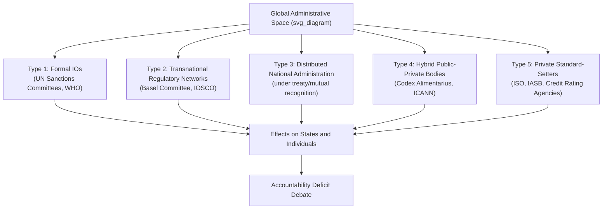
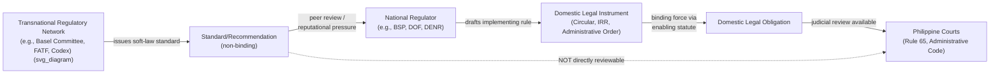

## Global Administrative Law and Transnational Regulatory Networks

### Definition and Conceptual Origins

Global administrative law (GAL) refers to the body of legal norms, principles, and mechanisms that apply to administrative decision-making by international bodies, transnational networks, hybrid public-private institutions, and domestic agencies acting under international mandates. It emerged as a distinct field of study in the early 2000s, most prominently through the work of the New York University Global Administrative Law Project (Kingsbury, Krisch, and Stewart), which framed global governance as fundamentally administrative in character rather than purely diplomatic or treaty-based.

The core premise is that much of global governance today does not occur through classical international law (treaties negotiated and ratified by states) but through the everyday regulatory activity of bodies such as the Basel Committee on Banking Supervision, the Codex Alimentarius Commission, the International Organization for Standardization (ISO), and countless transnational networks of regulators. These bodies produce standards, guidelines, and decisions that have significant real-world effects on individuals, corporations, and states, yet they often operate outside traditional constitutional accountability structures.

**Key Points**

- GAL treats global governance bodies as exercising a species of "administration" analogous to domestic administrative agencies
- The field borrows administrative law concepts (transparency, participation, reasoned decision-making, review) and applies them at the transnational level
- It is a lens or analytical framework more than a codified body of law with a single authoritative source

### Distinguishing GAL from Traditional International Law and Domestic Administrative Law

| Dimension | Traditional International Law | Domestic Administrative Law | Global Administrative Law |
| --- | --- | --- | --- |
| Primary actors | States, IGOs via treaty | National agencies | Transnational networks, hybrid bodies, IGOs |
| Source of authority | State consent, treaties, custom | Constitutional/statutory delegation | Fragmented — soft law, MOUs, network norms |
| Accountability mechanism | State responsibility, ICJ | Judicial review, ombudsman | Emerging/contested — peer review, disclosure |
| Formality of instruments | Binding treaties | Binding regulations | Predominantly soft law (standards, guidelines) |
| Enforcement | State-to-state, sanctions | Courts, administrative tribunals | Market discipline, reputational pressure, incorporation into domestic law |

### The Five Types of Global Administrative Action (Kingsbury-Krisch-Stewart Taxonomy)

1. **Administration by formal international organizations** — e.g., UN Security Council sanctions committees, WHO's International Health Regulations decisions
2. **Administration through collective action by transnational networks of cooperative arrangements between national regulators** — e.g., Basel Committee, International Organization of Securities Commissions (IOSCO)
3. **Distributed administration conducted by national regulators under treaty regimes, mutual recognition, or cooperative standards** — e.g., domestic implementation of WTO Sanitary and Phytosanitary (SPS) Agreement obligations
4. **Administration by hybrid intergovernmental-private arrangements** — e.g., Codex Alimentarius, Internet Corporation for Assigned Names and Numbers (ICANN)
5. **Administration by private institutions with regulatory functions** — e.g., ISO, credit rating agencies, International Accounting Standards Board (IASB)

### Transnational Regulatory Networks (TRNs): Structure and Function

Transnational regulatory networks are horizontal arrangements among domestic regulatory agencies (rather than states as unitary actors) that coordinate policy, share information, and harmonize standards without forming a formal international organization. Anne-Marie Slaughter's concept of "government networks" is foundational here — the idea that the state is disaggregating into its component parts (central banks, securities regulators, competition authorities), which then network directly with their foreign counterparts.

**Characteristic Features of TRNs**

- **Informality**: Typically constituted through Memoranda of Understanding (MOUs) or charters rather than treaties, avoiding domestic ratification requirements
- **Technocratic composition**: Membership consists of expert regulators/agency officials, not diplomats
- **Soft law output**: Standards, recommendations, "best practices," and frameworks that are not directly binding
- **Peer-based enforcement**: Compliance is driven by peer review, reputational concerns, and market/credit-rating consequences rather than formal sanctions
- **Domestic incorporation pathway**: Standards gain binding force only once translated into domestic law or regulation by national legislatures/agencies

**Example**

The Basel Committee on Banking Supervision produces the Basel Accords (Basel I, II, III) — capital adequacy standards for banks. The Committee has no treaty basis and no formal legal personality; it operates under the aegis of the Bank for International Settlements. Basel III became binding in the Philippines only through Bangko Sentral ng Pilipinas (BSP) circulars implementing the framework domestically, illustrating the "distributed administration" pathway (Type 3) working alongside network administration (Type 2).

### The Accountability Deficit Problem

The central normative concern in GAL scholarship is the "accountability deficit": transnational regulatory bodies exercise significant power affecting individuals and states, yet lack the accountability mechanisms — electoral, judicial, or otherwise — that legitimize domestic administrative action.

**Key Points — Sources of the Deficit**

- No single demos to which global regulators answer
- Limited judicial review; national courts are often reluctant to review foreign/international regulatory decisions on justiciability or standing grounds
- Diffuse and opaque decision-making processes, often conducted in closed technical committees
- Regulatory capture risk is amplified because industry actors frequently have privileged access to technical standard-setting (e.g., financial industry input into Basel processes)
- "Blame-shifting" dynamics: domestic regulators can attribute unpopular measures to international standards ("we had no choice, Basel/FATF required it")

### GAL's Proposed Accountability Mechanisms

GAL scholarship proposes transplanting administrative law principles onto the global level as partial remedies:

1. **Transparency requirements** — publication of proposed rules, meeting minutes, and decisions (modeled on notice)
2. **Participation rights** — notice-and-comment-style procedures allowing affected stakeholders (states, NGOs, industry, individuals) to submit input before rules are finalized
3. **Reasoned decision-making** — requiring regulatory bodies to articulate the rationale for standards, enabling critique and review
4. **Review mechanisms** — internal review panels, ombudspersons, or referral to domestic/international courts (e.g., World Bank Inspection Panel, UN Ombudsperson for Al-Qaida Sanctions List delisting)
5. **Proportionality and legality review** — assessing whether measures are proportionate to stated objectives, borrowed from EU and domestic administrative law doctrine

**Example**

The UN Security Council's 1267 Sanctions Committee (targeted sanctions against individuals linked to terrorism) faced sustained criticism for lacking due process for listed individuals to challenge their designation. This led to the creation of the Office of the Ombudsperson in 2009, which reviews delisting petitions — a direct GAL-inspired reform introducing quasi-judicial review into what was previously an unreviewable executive-style listing process.

### Case Study: Codex Alimentarius Commission

The Codex Alimentarius Commission, established jointly by the FAO and WHO, sets international food safety and quality standards. It exemplifies the Type 4 hybrid model.

- **Legal status**: Codex standards are not binding per se, but the WTO SPS Agreement gives them powerful indirect legal force — a national food safety measure that conforms to Codex standards is presumed WTO-consistent, while a measure that departs from Codex standards and is challenged shifts the burden onto the defending state to justify the deviation with scientific risk assessment
- **Participation structure**: National delegations, but with significant industry and NGO observer participation in technical committees
- **GAL relevance**: Illustrates how ostensibly "voluntary" technical standards acquire binding-like effect through incorporation into a hard-law treaty framework (WTO), and how administrative-law-style participation guarantees at the standard-setting level become critical precisely because domestic judicial review of the underlying Codex standard is unavailable

### Case Study: Financial Action Task Force (FATF)

FATF sets anti-money laundering (AML) and counter-terrorism financing (CFT) standards through 40 Recommendations. It has no treaty basis and no independent legal personality.

- **Compliance mechanism**: Mutual evaluations and a public "grey list"/"black list" of non-compliant jurisdictions
- **Enforcement without formal sanctions power**: Blacklisting triggers correspondent banking restrictions and de-risking by international financial institutions — a market-based enforcement mechanism rather than legal sanction
- **Philippine relevance**: The Philippines was placed on the FATF grey list in 2021 and exited in 2025; compliance required legislative amendments to the Anti-Money Laundering Act (AMLA) and Terrorism Financing Prevention and Suppression Act, illustrating distributed administration (Type 3) — domestic legal reform driven by transnational network standards without any treaty obligation to comply

### Relationship to Comparative Administrative Law and State Sovereignty

GAL raises acute questions about sovereignty because compliance pressure operates through channels that bypass conventional treaty-ratification consent mechanisms.

**Key Points**

- **Soft law paradox**: Instruments are formally non-binding, yet functionally coercive due to market access consequences, reputational costs, and conditionality attached by IFIs (IMF/World Bank) to compliance
- **Democratic deficit at the domestic level**: Executive agencies (central banks, financial regulators) that participate in these networks often commit their states to de facto obligations without legislative involvement, raising separation-of-powers concerns under domestic constitutional law
- **Convergence effect**: TRNs are a major driver of the "convergence" phenomenon in comparative administrative law — the observed tendency of divergent national regulatory systems to adopt structurally similar rules over time (e.g., near-universal adoption of Basel-style capital adequacy frameworks, IFRS-aligned accounting standards)

### GAL and Judicial Review: The Kadi Litigation

The *Kadi* cases (European Court of Justice, 2008 and 2013) are the paradigmatic judicial engagement with GAL accountability concerns. Yassin Abdullah Kadi, listed by the UN 1267 Committee as a terrorism financier, challenged the EU regulation implementing his asset freeze.

- **Holding**: The ECJ held that EU measures implementing UN Security Council sanctions remain subject to full review for compliance with EU fundamental rights (due process, right to effective judicial protection, right to property), regardless of the measure's origin in a binding Security Council resolution
- **GAL significance**: *Kadi* represents domestic/regional courts asserting a "constitutional" check on global administrative action, rejecting the argument that UN-derived measures are immune from review merely because of their international pedigree
- [Inference] This line of reasoning has influenced, but not been uniformly adopted by, other domestic courts assessing the reviewability of internationally-derived administrative measures; national approaches vary significantly and remain unsettled in many jurisdictions

### Philippine Administrative Law Interface

While the Philippines is not a primary GAL rule-generator, it is a significant rule-taker, and understanding this interface is essential for administrative law practice.

**Key Points — Domestic Incorporation Pathways**

- **BSP and Basel/FATF standards**: BSP Circulars implementing capital adequacy and AML requirements are issued under the New Central Bank Act (RA 7653, as amended by RA 11211) and AMLA (RA 9160, as amended), giving domestic legal force to network-derived standards
- **Bureau of Food and Drugs / FDA and Codex standards**: Food safety regulations under the Food Safety Act (RA 10611) reference and incorporate Codex Alimentarius standards
- **Environmental regulatory networks**: DENR's participation in transnational environmental compliance networks (e.g., Basel Convention Secretariat guidance on hazardous waste, IMO standards via MARPOL implementation through the Philippine Clean Water Act and related issuances)
- **Constitutional anchor**: Article II, Section 2 of the 1987 Constitution ("The Philippines... adopts the generally accepted principles of international law as part of the law of the land") provides a doctrinal — though contested — basis (incorporation clause) for treating certain widely-accepted transnational standards as having domestic legal status even absent specific implementing legislation, though this is more firmly established for customary international law than for soft-law regulatory standards

### GAL in Environmental Regulatory Networks

Environmental administrative law is one of the richest domains for GAL analysis due to the proliferation of transnational and hybrid environmental governance bodies.

**Key Points**

- **Intergovernmental Panel on Climate Change (IPCC)**: A hybrid scientific-administrative body whose assessment reports, while not binding, provide the authoritative technical basis for UNFCCC/Paris Agreement obligations and are incorporated by reference into domestic climate legislation worldwide
- **Convention on International Trade in Endangered Species (CITES)**: Its Conference of the Parties and Standing Committee exercise quasi-administrative authority over species listings that directly bind domestic wildlife trade regulation (in the Philippines, implemented through the Wildlife Resources Conservation and Protection Act, RA 9147, and DENR administrative issuances)
- **Basel Convention on hazardous waste**: The Secretariat and Conference of Parties issue technical guidelines that shape domestic hazardous waste classification (RA 6969 in the Philippines)
- **Extended Producer Responsibility (EPR) networks**: Transnational policy diffusion of EPR frameworks (pioneered in the EU) into domestic law, as seen in the Philippines' Extended Producer Responsibility Act (RA 11898)

### Critiques and Limitations of the GAL Framework

**Key Points**

- **Descriptive overreach critique**: Critics (e.g., Martti Koskenniemi) argue GAL's "administrative" framing obscures underlying power asymmetries and political contestation by recasting fundamentally political choices as neutral technical administration
- **Legitimacy transplant problem**: Domestic administrative law accountability mechanisms (notice-and-comment, judicial review) presuppose a bounded political community and a court system with jurisdiction; transplanting them to the global level without an equivalent demos or court raises questions about whether procedural mimicry substitutes for genuine accountability
- **Selective application concern**: [Inference] GAL scholarship has been critiqued for focusing disproportionately on economic/financial regulatory networks (where Western states and industry have strong voice) relative to networks more directly affecting developing states, though this emphasis reflects the historical development of the literature rather than an inherent limitation of the framework
- **Fragmentation**: Because there is no unified global administrative code, GAL remains a patchwork of sector-specific regimes (finance, trade, environment, health) with inconsistent accountability standards across sectors

### Illustrative Diagram: Domestic Incorporation of Transnational Standards

### Related Topics

- Soft law versus hard law in international and administrative regulation
- The subsidiarity principle in transnational and EU administrative governance
- Regulatory capture theory applied to international standard-setting bodies
- The Philippine incorporation and transformation doctrines under Article II, Section 2 of the Constitution
- Judicial review of executive compliance with international regulatory standards (Rule 65 certiorari in the Philippine context)
- Extraterritoriality and transnational administrative enforcement (e.g., extraterritorial application of AML/CFT regimes)
- Comparative administrative law convergence theory
- The role of international financial institutions (IMF/World Bank) conditionality as an accountability-forcing mechanism