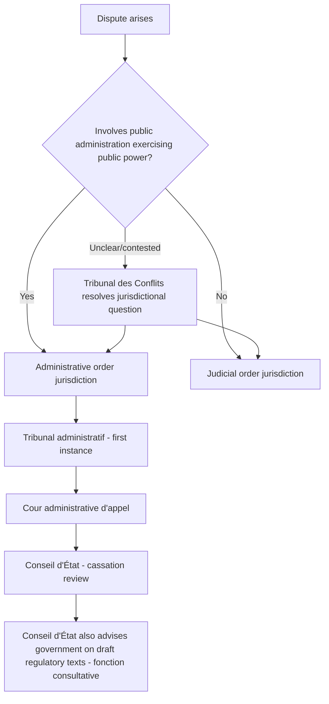

## Civil Law Administrative Traditions and the Conseil d'État Model

### Overview

Civil law administrative traditions, most fully developed in France through the Conseil d'État, represent a structurally distinct approach to administrative law compared to common law systems like the United States. Where U.S. administrative law developed within a unitary judicial system (ordinary courts review both private disputes and agency action), the civil law tradition — particularly the French model — developed a **dual jurisdiction** system in which administrative disputes are resolved by specialized administrative courts entirely separate from the ordinary judiciary, applying a body of law (*droit administratif*) largely developed through judicial precedent rather than codified statute.

### Historical Foundations

**Key Points**

- Rooted in the post-Revolutionary French principle of **separation of powers strictly construed** — the 1790 law (Law of 16–24 August 1790) prohibited ordinary courts from interfering with the administration, reflecting distrust of the pre-Revolutionary *parlements*' interference with royal administrative acts.
- This produced a structural paradox relative to Anglo-American separation-of-powers theory: in France, keeping courts *out* of administration was seen as protecting the executive from judicial overreach, whereas in the U.S. tradition, subjecting agencies *to* judicial review is seen as the separation-of-powers safeguard.
- The **Conseil d'État** was established in 1799 under Napoleon, initially as an advisory body to the executive, gradually acquiring genuine adjudicative independence over the 19th century, culminating in the **Blanco decision** (*Tribunal des Conflits*, 1873), which established that liability of the state is governed by special rules distinct from private civil law (Code Civil) and falls under administrative court jurisdiction — the foundational moment for modern French administrative law as an autonomous legal domain.

### Dual Jurisdiction Structure

**Key Points**

- **Ordre judiciaire** (judicial order) — ordinary courts handling private law disputes (civil, criminal, commercial)
- **Ordre administratif** (administrative order) — separate hierarchy of administrative courts:
  - **Tribunaux administratifs** (administrative tribunals) — courts of first instance
  - **Cours administratives d'appel** (administrative courts of appeal)
  - **Conseil d'État** — apex administrative court, functioning simultaneously as:
    - The supreme administrative court (*juge de cassation* and *juge de premier et dernier ressort* for certain matters)
    - An advisory body to the government on draft legislation and major regulatory texts (*fonction consultative*)
- **Tribunal des Conflits** — a specialized jurisdictional court resolving conflicts over whether a given dispute belongs before the judicial or administrative order, since French litigants must first determine the correct jurisdictional track before filing

### Substantive Body of Law: *Droit Administratif*

**Key Points**

- Unlike U.S. administrative law, which is heavily statutory (federal and state APAs, enabling statutes, judicial doctrines interpreting them), French *droit administratif* is substantially **judge-made law**, developed through Conseil d'État jurisprudence over more than two centuries, applying general principles rather than primarily codified rules.
- Core doctrines developed through case law include:
  - **Excès de pouvoir** (*recours pour excès de pouvoir*, "action for abuse of power") — the primary vehicle for challenging the legality of an administrative decision, roughly analogous to U.S. judicial review of final agency action, but conceived as an *objective* legality review (was the act lawful?) rather than a *subjective* rights-vindication proceeding
  - **Détournement de pouvoir** (misuse of power) — administrative action taken for a purpose other than that for which the power was granted, conceptually similar to U.S. review for action taken outside statutory authority or in bad faith
  - **Principes généraux du droit** (general principles of law) — unwritten principles the Conseil d'État has recognized as binding on administration even absent express statutory text (e.g., equality before public service, rights of defense), functioning similarly to how U.S. courts have developed procedural due process content under the Fifth/Fourteenth Amendments absent specific statutory direction
- Since 2015, much of this jurisprudence has been consolidated into the **Code des relations entre le public et l'administration (CRPA)**, partially codifying procedures for administrative decision-making, transparency, and citizen rights of access to administrative acts — a move toward the codified-statute model more familiar to common law administrative lawyers, though substantial doctrine remains judge-developed.

### The *Recours pour Excès de Pouvoir*: Structure and Grounds

The *excès de pouvoir* action is the closest French functional analog to a U.S. petition for judicial review of final agency action, though doctrinally distinct.

**Grounds for annulment** (broadly parallel, in function though not doctrine, to U.S. arbitrary-and-capricious and ultra vires review):

1. **Incompétence** (lack of competence) — the decision-maker lacked authority to act
2. **Vice de forme/de procédure** (procedural defect) — failure to follow required procedure
3. **Violation de la loi** (violation of law) — substantive illegality, including violation of statute, regulation, or general principles of law
4. **Détournement de pouvoir** (misuse of power)

**Key Points**

- Historically, standing (*intérêt à agir*) for *excès de pouvoir* actions has been comparatively permissive relative to some common law standing doctrines — any person with a sufficient interest affected by the decision may generally challenge it, without the stricter direct-and-individual-concern-type analysis seen in EU law's *Plaumann* test for private annulment actions.
- The Conseil d'État exercises a variable **intensity of review** depending on the nature of the administrative decision:
  - **Contrôle restreint** (limited/marginal review) — for highly discretionary decisions, court checks only for manifest error (*erreur manifeste d'appréciation*)
  - **Contrôle normal** (normal review) — standard legality review of most administrative decisions
  - **Contrôle maximum** (maximum/proportionality review) — for decisions significantly restricting fundamental rights or freedoms, the court examines proportionality between the measure and its justification — conceptually adjacent to U.S. "hard look" review or heightened scrutiny, though rooted in a distinct doctrinal lineage

### Comparative Table: Conseil d'État Model vs. U.S. Administrative Law

| Feature | French/Conseil d'État Model | U.S. Federal/State (MSAPA-based) |
| --- | --- | --- |
| Court structure | Dual jurisdiction (separate administrative courts) | Unitary judiciary (ordinary courts review agency action) |
| Primary source of law | Judge-made *droit administratif*, partially codified (CRPA since 2015) | Statutory (APA/MSAPA) supplemented by judicial doctrine |
| Core review action | *Recours pour excès de pouvoir* (objective legality review) | Petition for judicial review (often framed around individual rights/interests) |
| Standing | Comparatively permissive ("sufficient interest") | Varies by jurisdiction; "persons aggrieved"/adversely affected |
| Review intensity | Tiered: restricted / normal / maximum (proportionality) | Tiered: substantial evidence / arbitrary-capricious / de novo, by issue type |
| Advisory function | Conseil d'État formally advises government on draft legislation/regulations | No direct U.S. analog; U.S. agencies do not receive binding advisory review from the reviewing court itself |
| Separation-of-powers rationale | Courts excluded from ordinary judiciary to protect administration from judicial interference | Judicial review of agencies affirmatively required as a separation-of-powers check |

### Influence on Other Civil Law Systems

**Key Points**

- The Conseil d'État model has been highly influential across continental Europe and francophone/former French-administered jurisdictions, though implementation varies:
  - **Belgium** — Conseil d'État (Raad van State) modeled closely on the French institution, combining advisory and adjudicative functions
  - **Italy** — Consiglio di Stato, a similar dual-function apex administrative court
  - **Germany** — took a partially divergent path: separate administrative courts exist (*Verwaltungsgerichte*), but Germany developed a more thoroughly codified administrative procedure code (*Verwaltungsverfahrensgesetz*, 1976) earlier and more comprehensively than France, reflecting a stronger codification tradition within German civil law generally
  - **Francophone African and other post-colonial systems** — many retain Conseil d'État-modeled institutions inherited from French colonial administrative structure, with varying degrees of independence and adaptation
- [Inference] Because implementation details (codification extent, judicial independence guarantees, advisory function scope) vary substantially by country even within the "Conseil d'État model" family, comparative claims should be verified against the specific national system rather than treated as uniform across civil law jurisdictions generally.

### Application to Environmental Administrative Law

**Key Points**

- French environmental administrative decisions (e.g., industrial facility permits under the *Installations Classées pour la Protection de l'Environnement* (ICPE) regime, land-use and environmental impact assessment decisions) are challenged via *excès de pouvoir* actions before administrative tribunals, not ordinary courts.
- The **Charte de l'environnement** (Environmental Charter, given constitutional status in 2005) has been invoked before the Conseil d'État to review environmental administrative decisions against constitutionally-anchored environmental principles (precautionary principle, participation rights), illustrating how *droit administratif*'s general-principles methodology absorbed environmental constitutionalism.
- The 2021 *Grande-Synthe* decision (Conseil d'État) is a notable example of the court reviewing the French government's climate policy adequacy against its own greenhouse gas reduction commitments, ordering the government to take additional measures — illustrating an expansive application of *contrôle normal/maximum* review to climate administrative inaction, with no direct doctrinal equivalent in standard U.S. arbitrary-and-capricious review of agency inaction.
- [Unverified] Specific procedural details and subsequent enforcement history of climate-related Conseil d'État rulings should be confirmed against current case reporting, as this remains an actively developing area of French administrative jurisprudence.

### Common Pitfalls in Practice

- Assuming French administrative law is purely statutory/codified like U.S. APAs — much remains judge-developed doctrine even after the 2015 CRPA codification
- Treating the Conseil d'État as purely a court — its dual advisory/adjudicative function has no direct U.S. institutional analog and affects how draft regulations are vetted before challenge ever arises
- Conflating the dual-jurisdiction structure's separation-of-powers rationale with the U.S. rationale for judicial review — the historical logic runs in opposite directions
- Assuming uniform implementation of the "Conseil d'État model" across all civil law jurisdictions without verifying country-specific codification and independence structures
- Overlooking the tiered intensity-of-review framework (restricted/normal/maximum) when comparing French review outcomes to U.S. arbitrary-and-capricious analysis, since the doctrinal triggers for heightened scrutiny differ substantially

**Related Topics**

- The Model State Administrative Procedure Act
- EU administrative law: comitology, subsidiarity, and judicial review
- Variation in state rulemaking, adjudication, and review procedures
- Comparative separation-of-powers theory in administrative law
- *Blanco* decision and the origins of French state liability doctrine
- Constitutional environmental rights (Charte de l'environnement and comparative analogs)
- Proportionality review across common law and civil law systems