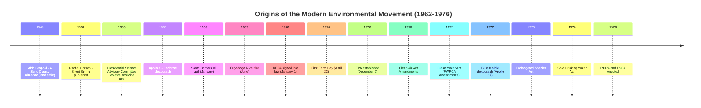

## Origins of the Modern Environmental Movement and the First Earth Day

### Overview

The modern environmental movement in the United States emerged from a confluence of scientific alarm, industrial disasters, literary catalysts, and grassroots political organizing during the 1960s. It culminated in the first Earth Day on April 22, 1970, an event widely credited with catalyzing the "environmental decade" of federal legislation that followed. Understanding this origin period is foundational to Administrative & Environmental Law because it explains *why* Congress shifted from a patchwork of resource-management statutes to comprehensive pollution-control and environmental-review regimes, and *why* those statutes were structured the way they were (citizen suits, public participation requirements, and administrative rulemaking mandates all trace back to the movement's populist, participatory character).

### Pre-1960s Antecedents

**Key Points**

- Conservation movement (1890s-1940s): Focused on resource management and preservation, not pollution control. Key figures: John Muir (preservationist, wilderness-for-its-own-sake ethic, founder of the Sierra Club in 1892) and Gifford Pinchot (utilitarian conservationist, "wise use" doctrine, first Chief of the U.S. Forest Service).
- This early conservation-preservation split created a durable philosophical tension that persists in environmental law: preservationist statutes (e.g., the Wilderness Act of 1964) versus multiple-use/sustained-yield statutes (e.g., the Multiple-Use Sustained-Yield Act of 1960).
- The Dust Bowl (1930s) prompted early soil-conservation administrative apparatus (Soil Conservation Service, 1935), an early example of federal environmental administration predating "environmental law" as a distinct field.
- Aldo Leopold's *A Sand County Almanac* (1949, published posthumously) introduced the "land ethic," an early articulation of ecological interdependence that influenced later environmental philosophy and, indirectly, the ecosystem-based reasoning found in later statutes like the Endangered Species Act of 1973.

These antecedents are distinct from the "modern" environmental movement in a legally significant way: conservation-era law concerned itself primarily with allocation of public lands and natural resources, whereas the modern movement (post-1962) shifted the legal center of gravity toward pollution, public health, and ecosystem-wide harm — a shift that required new administrative machinery altogether.

### Catalytic Events and Publications

**Key Points**

**Rachel Carson's *Silent Spring* (1962)**

- Documented the ecological and human-health effects of synthetic pesticides, particularly DDT, including bioaccumulation and biomagnification up the food chain.
- Directly challenged the chemical industry and the regulatory posture of agencies like the USDA, which at the time both promoted and regulated pesticide use — an early illustration of the "captured agency" problem that later informed institutional design debates (e.g., why EPA was created as an independent agency rather than housed within USDA or Interior).
- Prompted a Presidential Science Advisory Committee review (1963) and is widely credited as a direct intellectual precursor to the eventual banning of DDT for most uses in the U.S. (1972, under the newly formed EPA).

**Industrial and pollution disasters**

- The Cuyahoga River fire (Cleveland, Ohio, June 1969): The river, heavily contaminated with industrial oil and debris, caught fire. Although smaller than prior Cuyahoga fires (1936, 1952), 1969 coverage by *Time* magazine amplified national attention. [Inference: the fire itself was relatively minor and quickly extinguished; its outsized legal-historical significance stems more from media framing and timing than from the physical event's severity.] This event is frequently cited in legislative history discussions of the Clean Water Act's 1972 predecessor, the Federal Water Pollution Control Act Amendments.
- The Santa Barbara oil spill (January 1969): A blowout on a Union Oil platform released an estimated 3 million gallons of crude oil off the California coast, causing extensive wildlife mortality and coastline fouling. This event is often identified as the single most direct catalyst for Senator Gaylord Nelson's proposal of Earth Day and is frequently cited in the legislative history of the National Environmental Policy Act (NEPA) of 1969, signed January 1, 1970.

**Photographic and cultural touchstones**

- "Earthrise" (Apollo 8, December 1968) and later "The Blue Marble" (Apollo 17, 1972): Images of Earth from space contributed to a shift in public consciousness toward planetary-scale environmental thinking, reinforcing the ecological (rather than purely local-nuisance) framing that would characterize the new statutes.

### The First Earth Day (April 22, 1970)

**Key Points**

- Conceived by U.S. Senator Gaylord Nelson (D-Wisconsin), who was directly motivated by the Santa Barbara spill and by the model of campus "teach-ins" used in the anti-Vietnam War movement.
- Denis Hayes was recruited by Nelson as national coordinator and built a young staff that organized events across the country.
- Structured deliberately as a decentralized, grassroots "national teach-in on the environment" rather than a single centrally planned event, which allowed simultaneous participation across a very large number of independently organized local events.
- Estimated participation: approximately 20 million Americans, roughly 10% of the U.S. population at the time — a scale [Unverified: precise attendance figures from 1970 rely on period estimates rather than rigorously audited counts, though the ~20 million figure is the consistently cited historical consensus].
- Notable for bipartisan and cross-ideological participation: it drew support from labor unions, suburban homemakers, students, and members of both major political parties, distinguishing it from other social movements of the era that were more sharply polarized.
- Congress recessed for the day, and many members of Congress participated in local events, signaling the issue's unusual cross-partisan political viability at that moment.

### Direct Legal and Institutional Consequences

**Key Points**

- **National Environmental Policy Act (NEPA)**: Signed January 1, 1970 (technically preceding Earth Day, but part of the same legislative momentum). Established the environmental impact statement (EIS) requirement and the Council on Environmental Quality (CEQ). NEPA is frequently called the "Magna Carta" of environmental law due to its role in mandating procedural environmental review across federal agency action.
- **Creation of the U.S. Environmental Protection Agency (EPA)**: Established via Reorganization Plan No. 3 of 1970, effective December 2, 1970, consolidating pollution-control functions previously scattered across multiple departments (e.g., pesticide regulation from USDA/HEW, air pollution control from HEW, water pollution control from Interior).
- **The "environmental decade" legislative wave**: The political momentum generated substantially overlaps with, and is frequently cited as a contributing cause of, the rapid passage of:
  - Clean Air Act Amendments of 1970
  - Federal Water Pollution Control Act Amendments of 1972 (Clean Water Act)
  - Endangered Species Act of 1973
  - Safe Drinking Water Act of 1974
  - Resource Conservation and Recovery Act (RCRA) of 1976
  - Toxic Substances Control Act (TSCA) of 1976

[Inference: while Earth Day is popularly credited as *the* trigger for this legislative wave, the causal relationship runs in both directions — NEPA predates Earth Day by four months, indicating that congressional momentum was already building independently. Earth Day is more accurately understood as a mass-mobilization event that reinforced and accelerated a legislative trend already in motion, rather than as its sole origin point.]

### Institutional Design Legacy

**Key Points**

- The movement's grassroots, participatory character is reflected structurally in the environmental statutes it helped produce, notably through:
  - **Citizen suit provisions**: Found in the Clean Air Act §304, Clean Water Act §505, and others, allowing private citizens to sue for statutory violations — a direct legal descendant of the movement's emphasis on public vigilance over agency and industry conduct.
  - **Public comment and notice-and-comment rulemaking requirements**: Reinforced under the Administrative Procedure Act (APA) framework, but given specific environmental teeth through statute-specific public participation mandates (e.g., NEPA's public review of draft EISs).
  - **Independent agency structure of EPA**: A direct institutional response to the "captured agency" critique that *Silent Spring* had implicitly leveled against USDA's dual promotion/regulation role for pesticides.

### Timeline Diagram

### Conceptual Map (SVG)

<svg xmlns="http://www.w3.org/2000/svg" viewBox="0 0 900 480">
<text x="450" y="30" font-size="18" font-weight="bold" text-anchor="middle" fill="#1a1a1a">Origins of the Modern Environmental Movement (svg_diagram)</text>
<rect x="30" y="60" width="220" height="90" rx="8" fill="#e8f0fe" stroke="#4285f4" stroke-width="1.5" />
<text x="140" y="85" font-size="13" font-weight="bold" text-anchor="middle" fill="#1a1a1a">Scientific Catalyst</text>
<text x="140" y="105" font-size="11" text-anchor="middle" fill="#333">Silent Spring (1962)</text>
<text x="140" y="122" font-size="11" text-anchor="middle" fill="#333">Pesticide bioaccumulation</text>
<text x="140" y="139" font-size="11" text-anchor="middle" fill="#333">Agency capture critique</text>
<rect x="340" y="60" width="220" height="90" rx="8" fill="#fce8e6" stroke="#ea4335" stroke-width="1.5" />
<text x="450" y="85" font-size="13" font-weight="bold" text-anchor="middle" fill="#1a1a1a">Disaster Catalysts</text>
<text x="450" y="105" font-size="11" text-anchor="middle" fill="#333">Santa Barbara spill (1969)</text>
<text x="450" y="122" font-size="11" text-anchor="middle" fill="#333">Cuyahoga River fire (1969)</text>
<text x="450" y="139" font-size="11" text-anchor="middle" fill="#333">Media amplification</text>
<rect x="650" y="60" width="220" height="90" rx="8" fill="#fef7e0" stroke="#fbbc04" stroke-width="1.5" />
<text x="760" y="85" font-size="13" font-weight="bold" text-anchor="middle" fill="#1a1a1a">Cultural Shift</text>
<text x="760" y="105" font-size="11" text-anchor="middle" fill="#333">Earthrise photo (1968)</text>
<text x="760" y="122" font-size="11" text-anchor="middle" fill="#333">Anti-war teach-in model</text>
<text x="760" y="139" font-size="11" text-anchor="middle" fill="#333">Planetary consciousness</text>
<line x1="140" y1="150" x2="400" y2="220" stroke="#5f6368" stroke-width="1.5" />
<line x1="450" y1="150" x2="430" y2="220" stroke="#5f6368" stroke-width="1.5" />
<line x1="760" y1="150" x2="470" y2="220" stroke="#5f6368" stroke-width="1.5" />
<rect x="310" y="220" width="280" height="70" rx="8" fill="#e6f4ea" stroke="#34a853" stroke-width="2" />
<text x="450" y="248" font-size="14" font-weight="bold" text-anchor="middle" fill="#1a1a1a">First Earth Day</text>
<text x="450" y="266" font-size="11" text-anchor="middle" fill="#333">April 22, 1970 — ~20 million participants</text>
<text x="450" y="281" font-size="10" text-anchor="middle" fill="#555">Sen. Gaylord Nelson / Denis Hayes</text>
<line x1="450" y1="290" x2="450" y2="330" stroke="#5f6368" stroke-width="2" />
<polygon points="445,325 455,325 450,335" fill="#5f6368" />
<rect x="130" y="335" width="180" height="70" rx="8" fill="#f3e8fd" stroke="#a142f4" stroke-width="1.5" />
<text x="220" y="358" font-size="12" font-weight="bold" text-anchor="middle" fill="#1a1a1a">NEPA (1970)</text>
<text x="220" y="375" font-size="10" text-anchor="middle" fill="#333">EIS requirement, CEQ</text>
<text x="220" y="390" font-size="10" text-anchor="middle" fill="#333">(preceded Earth Day)</text>
<rect x="360" y="335" width="180" height="70" rx="8" fill="#f3e8fd" stroke="#a142f4" stroke-width="1.5" />
<text x="450" y="358" font-size="12" font-weight="bold" text-anchor="middle" fill="#1a1a1a">EPA Created</text>
<text x="450" y="375" font-size="10" text-anchor="middle" fill="#333">Dec. 2, 1970</text>
<text x="450" y="390" font-size="10" text-anchor="middle" fill="#333">Reorg. Plan No. 3</text>
<rect x="590" y="335" width="230" height="70" rx="8" fill="#f3e8fd" stroke="#a142f4" stroke-width="1.5" />
<text x="705" y="353" font-size="12" font-weight="bold" text-anchor="middle" fill="#1a1a1a">Environmental Decade Statutes</text>
<text x="705" y="371" font-size="10" text-anchor="middle" fill="#333">CAA (1970), CWA (1972),</text>
<text x="705" y="386" font-size="10" text-anchor="middle" fill="#333">ESA (1973), RCRA/TSCA (1976)</text>
<line x1="220" y1="405" x2="220" y2="440" stroke="#5f6368" stroke-width="1" />
<line x1="450" y1="405" x2="450" y2="440" stroke="#5f6368" stroke-width="1" />
<line x1="705" y1="405" x2="705" y2="440" stroke="#5f6368" stroke-width="1" />
<line x1="220" y1="440" x2="705" y2="440" stroke="#5f6368" stroke-width="1" />
<rect x="330" y="440" width="260" height="30" rx="6" fill="#fff" stroke="#5f6368" stroke-width="1.5" />
<text x="460" y="460" font-size="11" font-weight="bold" text-anchor="middle" fill="#1a1a1a">Citizen suits, public comment, EIS review</text>
</svg>

### Example: Legal Reasoning Application

A hypothetical bar-exam-style application: A community group learns that a federal agency plans to approve a highway extension through a wetland without a prior environmental review. The group's ability to (1) demand an environmental impact statement and (2) sue if one is not prepared traces directly to NEPA's procedural mandate — a mandate whose *political* viability was secured by the same 1969-1970 mass mobilization discussed above. Understanding the origin story therefore is not merely historical color: it explains why NEPA's EIS requirement is *procedural* rather than substantive (courts generally cannot force an agency to reach a particular environmental outcome, only to have adequately considered environmental effects), reflecting the era's political compromise between environmentalist demand for accountability and industry/agency resistance to substantive constraints on discretion.

### Distinguishing Facts from Contested Interpretation

- **Well-established**: The dates, key figures (Nelson, Hayes, Carson), the Santa Barbara spill's scale, NEPA's signing date, and EPA's creation date are documented historical facts.
- **[Inference]**: The precise causal weight of Earth Day itself (as opposed to the broader confluence of *Silent Spring*, the disasters, and pre-existing congressional activity) in producing the 1970s legislative wave is a matter of historiographical interpretation rather than settled fact. Historians and legal scholars differ on how much independent causal force to assign to the single-day event versus the multi-year mobilization it culminated.
- **[Unverified]**: Specific participation figures for the first Earth Day (the ~20 million figure) rely on contemporaneous estimates rather than modern audited methodology.

### Related Topics

- National Environmental Policy Act (NEPA): structure, EIS process, and judicial review standards
- Creation and organizational structure of the EPA (Reorganization Plan No. 3 of 1970)
- The conservation vs. preservation philosophical divide (Pinchot vs. Muir) and its statutory legacy
- Citizen suit provisions across major federal environmental statutes
- Comparative origins: environmental movements and law in other jurisdictions (e.g., EU environmental law's post-1970s development)
- The "environmental decade" statutes: Clean Air Act, Clean Water Act, ESA, RCRA, TSCA as a legislative package
- Agency capture theory and its influence on administrative design