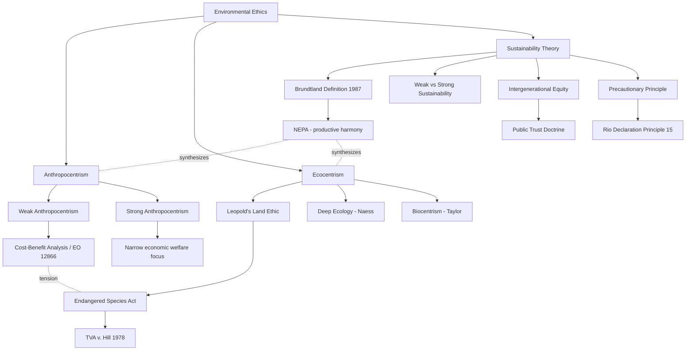

## Environmental Ethics: Anthropocentrism, Ecocentrism, and Sustainability Theory

### Overview

Environmental ethics is the branch of philosophy examining the moral relationship between humans and the natural environment, including questions of moral standing (who or what deserves moral consideration), value theory (what kinds of value nature possesses), and normative obligation (what duties, if any, humans owe to non-human entities). This field is foundational to Administrative & Environmental Law because the underlying ethical framework a statute embodies directly shapes its structure: standing doctrine, cost-benefit analysis requirements, the burden of proof for environmental harm, and the substantive-versus-procedural character of environmental review all reflect implicit ethical commitments.

### Anthropocentrism

**Key Points**

- **Definition**: The view that humans are the sole or primary locus of intrinsic moral value, and that non-human nature has value only instrumentally — insofar as it serves human interests (economic, aesthetic, recreational, health-related, or even future-generational).
- **Weak anthropocentrism**: Human interests remain primary, but are defined broadly to include aesthetic, spiritual, and long-term ecological interests, which can generate substantial environmental protection even without granting nature intrinsic value.
- **Strong anthropocentrism**: Human interests are narrowly defined (short-term economic welfare), generating minimal independent environmental protection except where pollution or resource depletion directly harms human health or economic productivity.
- **Legal manifestation**: Cost-benefit analysis (CBA) frameworks, as required for major federal rules under Executive Order 12866 and its successors, are paradigmatically anthropocentric — they monetize environmental harms and benefits primarily through human welfare proxies (willingness-to-pay, statistical value of a human life, property value impacts).
- **Standing doctrine**: Article III standing requirements in U.S. federal courts (injury-in-fact, causation, redressability) are anthropocentric by construction — a plaintiff must show a *particularized injury to a human person* (or, for organizations, to their members), not merely harm to an ecosystem or species as such. *Sierra Club v. Morton*, 405 U.S. 727 (1972), rejected the theory that an organization could sue based solely on its institutional interest in preserving nature, instead requiring that a member's recreational or aesthetic use of the affected area be alleged — a doctrinal move that preserved anthropocentric standing while still permitting suits grounded in human aesthetic/recreational interests in nature.

### Ecocentrism

**Key Points**

- **Definition**: The view that ecosystems, species, and/or individual non-human organisms possess intrinsic value independent of their usefulness to humans, and that moral consideration should extend to the biotic community as a whole.
- **Aldo Leopold's "Land Ethic"** (*A Sand County Almanac*, 1949): The foundational ecocentric text in American environmental thought. Leopold's central maxim: "A thing is right when it tends to preserve the integrity, stability, and beauty of the biotic community. It is wrong when it tends otherwise." This reframes the "community" to which ethical obligation is owed to include soils, waters, plants, and animals collectively — the "land."
- **Deep ecology** (Arne Naess, 1973): A more radical ecocentric position holding that all living beings have equal intrinsic worth ("biocentric egalitarianism") and that human population and consumption must be substantially reduced to preserve ecological flourishing. Distinguished from "shallow ecology," which Naess characterized as anthropocentric pollution/resource-focused environmentalism.
- **Biocentrism** (a related but distinct position, e.g., Paul Taylor's *Respect for Nature*, 1986): Extends moral standing to all individual living organisms (not necessarily whole ecosystems) on the grounds that each is a "teleological center of life" pursuing its own good.
- **Legal manifestation**: The Endangered Species Act (ESA) of 1973 is the strongest ecocentric artifact in U.S. federal law — Section 7's "God Squad" exemption process aside, the Act's substantive protections do not require a showing of human economic or recreational benefit from a species' survival; the species' continued existence is the protected value in itself. *TVA v. Hill*, 437 U.S. 153 (1978) (the "snail darter case") upheld an injunction halting a nearly completed federal dam project to protect a small, economically valueless fish, with the Supreme Court reading the ESA's text as reflecting Congress's judgment that species have value "whatever the cost" — an unusually explicit judicial acknowledgment of ecocentric statutory intent.
- **Rights of Nature movements**: More recent (and largely non-U.S. or sub-national) legal developments granting rivers, ecosystems, or "Mother Earth" legal personhood or enforceable rights (e.g., Ecuador's 2008 constitution; New Zealand's Te Urewera Act 2014 and Whanganui River settlement 2017; various U.S. municipal "rights of nature" ordinances, most of which have faced preemption challenges). [Inference: the durability and enforceability of these rights-of-nature frameworks against countervailing property and development interests remains contested and jurisdiction-dependent.]

### Sustainability Theory

**Key Points**

- **Brundtland definition** (*Our Common Future*, World Commission on Environment and Development, 1987): Sustainable development is development that "meets the needs of the present without compromising the ability of future generations to meet their own needs." This is the most widely cited definitional anchor in international environmental law and policy.
- **Three-pillar model**: Sustainability is commonly analyzed as the intersection of three domains — environmental (ecological carrying capacity), economic (viable growth and resource allocation), and social (equity, including intergenerational and intragenerational equity). Legal and policy instruments vary in how much weight they assign to each pillar.
- **Weak vs. strong sustainability** (an economic-philosophical distinction):
  - *Weak sustainability* holds that natural capital and human-made (manufactured) capital are substitutable — depleting a forest is acceptable if the resulting economic capital (e.g., infrastructure, education) can generate equivalent or greater welfare for future generations.
  - *Strong sustainability* holds that certain forms of natural capital (critical ecosystems, biodiversity, climate stability) are non-substitutable and must be preserved in kind, regardless of compensating economic capital.
- **Intergenerational equity**: A key sustainability-theory concept holding that present generations hold the Earth's resources in a form of trust for future generations (associated with scholars such as Edith Brown Weiss). This concept underlies the "public trust doctrine" as applied in some modern climate litigation (e.g., arguments in *Juliana v. United States*, though the Ninth Circuit ultimately found the claim non-justiciable in 2020 on standing/redressability grounds).
- **Precautionary principle**: A related but analytically distinct sustainability-adjacent doctrine holding that lack of full scientific certainty should not be used to postpone cost-effective measures to prevent environmental degradation, particularly where harms may be irreversible. Codified internationally in Principle 15 of the 1992 Rio Declaration and reflected (with varying strength) in U.S. statutes such as the Clean Air Act's "adequate margin of safety" language for National Ambient Air Quality Standards.
- **Legal manifestation**: NEPA's stated purpose in declaring a national policy to "create and maintain conditions under which man and nature can exist in productive harmony" (42 U.S.C. § 4331) is explicitly sustainability-flavored, blending anthropocentric and ecocentric language. The National Environmental Policy Act's structure (procedural EIS review rather than substantive outcome mandates) reflects a compromise: it operationalizes sustainability as *informed decision-making* rather than a guaranteed ecological outcome.

### Comparative Framework Table

| Dimension | Anthropocentrism | Ecocentrism | Sustainability Theory |
| --- | --- | --- | --- |
| Locus of value | Human welfare | Ecosystems/species/organisms | Intergenerational human + ecological welfare |
| Typical legal tool | Cost-benefit analysis | Species/habitat protection mandates | Procedural review, precautionary standards |
| Standing implication | Requires human injury-in-fact | Contested; rarely grants standing to nature itself in U.S. law | Often invokes future generations (contested standing) |
| Representative U.S. statute | NAAQS cost considerations under CAA | Endangered Species Act | NEPA |
| Representative case | *Sierra Club v. Morton* (1972) | *TVA v. Hill* (1978) | *Juliana v. United States* (2020, dismissed) |
| Core risk/critique | May undervalue non-use/existence value of nature | May be practically unworkable at scale; conflicts with development | Vague/malleable; "sustainability" can be invoked to justify divergent policies |

### Example: Applying the Frameworks to a Regulatory Problem

Consider a proposed federal permit for a mining operation adjacent to critical habitat for a threatened salamander species, where the mine would create 500 local jobs.

- An **anthropocentric** cost-benefit analysis would weigh the economic value of jobs and mineral output against the *human* welfare losses from habitat degradation (e.g., diminished recreational value, existence value surveys via contingent valuation).
- An **ecocentric** analysis under the ESA framework would ask whether the action is likely to jeopardize the species' continued existence or adversely modify critical habitat, largely independent of the jobs/economic calculus (subject to the ESA's own internal exemption mechanisms).
- A **sustainability-theory** analysis would ask whether the mine's benefits are enjoyed by the present generation while its costs (habitat loss, potential extinction) are irreversibly imposed on future generations, invoking the precautionary principle if extinction risk is scientifically uncertain but potentially severe.

### Conceptual Relationship Diagram

### Distinguishing Facts from Contested Interpretation

- **Well-established**: The Brundtland definition's text, the Leopold land ethic's core maxim, the holdings and dates of *Sierra Club v. Morton* and *TVA v. Hill*, and the statutory text of NEPA and the ESA are documented facts.
- **[Inference]**: Characterizing any single statute as "purely" anthropocentric or ecocentric is an analytical simplification — most environmental statutes blend elements of both frameworks, and scholars disagree on the precise doctrinal weight each framework carries in shaping a given provision.
- **[Unverified/Contested]**: Whether "sustainability" as an operative legal standard has independent enforceable content, or functions primarily as an aspirational/interpretive gloss without direct judicially enforceable teeth, remains a live and unsettled debate among environmental law scholars.

### Related Topics

- The public trust doctrine and its expansion in modern climate litigation
- Cost-benefit analysis methodology in environmental rulemaking (contingent valuation, statistical value of life)
- Standing doctrine in environmental litigation: *Lujan v. Defenders of Wildlife* and its progeny
- Rights of Nature: comparative constitutional and statutory developments
- The precautionary principle in international environmental law (Rio Declaration, Cartagena Protocol)
- Ecosystem services valuation and its integration into administrative decision-making
- Climate justice and intergenerational equity litigation strategies