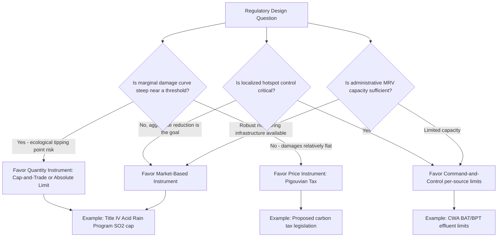

## Command and Control Regulation versus Market-Based Instruments

### Overview

The choice between command-and-control (CAC) regulation and market-based instruments (MBIs) represents the central regulatory-design debate in environmental law and policy. CAC regulation relies on government-specified technology or performance standards backed by enforcement and sanctions; MBIs use price signals, tradable rights, or other economic incentives to induce socially optimal behavior while leaving the specific compliance method to regulated parties. This distinction matters throughout Administrative & Environmental Law because it determines statutory structure, agency discretion, judicial review standards, and the practical cost-effectiveness of achieving a given environmental target.

### Command-and-Control Regulation

**Key Points**

- **Definition**: A regulatory approach in which the government mandates specific pollution limits, technologies, or practices, and enforces compliance through inspections, penalties, and (where authorized) criminal sanctions.
- **Two principal subtypes**:
  - **Technology-based standards**: Require regulated entities to install or use a specified level of pollution-control technology, regardless of the entity's actual emissions outcome relative to ambient conditions. Examples include "Best Available Control Technology" (BACT) under the Clean Air Act's Prevention of Significant Deterioration (PSD) program, and "Best Available Technology" (BAT) / "Best Practicable Technology" (BPT) effluent limitations under the Clean Water Act.
  - **Performance-based (design) standards**: Set a required emissions or discharge limit (e.g., pounds of pollutant per unit of production) without specifying the technology used to achieve it, granting the regulated entity more flexibility in method while still fixing the outcome for each source individually (as opposed to aggregate/tradable outcomes under MBIs).
- **Institutional origin**: CAC was the dominant regulatory paradigm of the "environmental decade" statutes (1970-1980), reflecting both the technical-administrative capacity of early EPA and the political demand (post-Earth Day) for visible, enforceable, and uniform pollution limits rather than diffuse economic incentives whose environmental outcomes were harder for the public to verify.
- **Advantages**:
  - Regulatory and compliance certainty — a source knows precisely what is required.
  - Administrative simplicity for inspection and enforcement (compliance is a binary technology/limit check).
  - Politically legible — visibly "requires" polluters to clean up, which was important to the movement's mandate for accountability discussed in the Earth Day/NEPA origin period.
  - Can directly address localized "hotspot" pollution concerns, since each source is independently constrained (unlike cap-and-trade systems, where trading can theoretically permit localized concentration of emissions even as aggregate emissions fall).
- **Disadvantages**:
  - Cost-inefficiency: CAC imposes the same technology/limit requirement on all sources regardless of each source's differing marginal cost of abatement, meaning the same aggregate emissions reduction could often be achieved at lower total cost if lower-cost abatement sources reduced more and higher-cost sources reduced less.
  - Innovation-dulling: Because compliance with a fixed technology standard satisfies the legal requirement, sources have reduced incentive to develop cheaper or more effective abatement methods beyond the mandated level (sometimes called the "regulatory ratchet" problem, though ratcheting standards over time via periodic BACT/BAT review can partially offset this).
  - Informational burden on the regulator: Agencies must determine, source-by-source or industry-by-industry, what technology is "available" and "achievable," a resource-intensive and litigation-prone process (e.g., extensive litigation over EPA's BACT/MACT determinations under the Clean Air Act).

### Market-Based Instruments

**Key Points**

- **Definition**: Regulatory tools that use price mechanisms or tradable property-like rights to internalize environmental externalities, allowing the market (rather than a uniform government mandate) to determine the least-cost distribution of abatement effort across sources.
- **Principal categories**:
  1. **Pigouvian (corrective) taxes**: A per-unit tax on a pollutant or harmful activity set (in theory) equal to the marginal external cost imposed on society, internalizing the externality into private decision-making. Named for economist Arthur Pigou. U.S. examples include the federal ozone-depleting-chemicals excise tax (under TSCA-related provisions) and various state-level carbon taxes (e.g., no comprehensive federal U.S. carbon tax exists as of the last reliable data, though numerous legislative proposals have been introduced).
  2. **Cap-and-trade (tradable permit) systems**: The government sets an aggregate emissions cap, issues (via auction or free allocation) a corresponding number of tradable allowances, and permits sources to buy/sell allowances, letting the market determine which sources abate and which purchase the right to continue emitting. The canonical U.S. example is the **Acid Rain Program** under Title IV of the 1990 Clean Air Act Amendments, which established a sulfur dioxide (SO₂) cap-and-trade system and is widely cited as substantially reducing compliance costs relative to comparable CAC alternatives while achieving its emissions targets. The Regional Greenhouse Gas Initiative (RGGI, Northeastern U.S. states) and California's Cap-and-Trade Program (under AB 32) are contemporary regional examples targeting greenhouse gases.
  3. **Subsidies and tax incentives**: Positive-incentive MBIs that reduce the cost of environmentally beneficial behavior (e.g., federal tax credits for renewable energy under the Inflation Reduction Act framework, EPA's various grant and revolving-loan programs).
  4. **Deposit-refund systems**: Combine an upfront charge with a refund conditional on a specified environmentally beneficial action (e.g., bottle deposit laws).
  5. **Information-disclosure mechanisms** (sometimes classified separately as a third regulatory category rather than a pure MBI): Mandate public disclosure of environmental performance to leverage market and reputational pressure, e.g., the Toxics Release Inventory (TRI) under the Emergency Planning and Community Right-to-Know Act (EPCRA) of 1986.
- **Advantages**:
  - Cost-effectiveness (static efficiency): Under standard economic theory, a cap-and-trade or tax system achieves a given aggregate abatement target at the lowest possible total cost, because abatement occurs where it is cheapest to abate (sources with low marginal abatement costs reduce more; sources with high marginal costs pay for allowances or taxes instead).
  - Dynamic efficiency: MBIs preserve a continuous financial incentive to innovate and reduce emissions further, since every unit of pollution avoided saves money (in a tax system) or frees up a sellable allowance (in a cap-and-trade system) — unlike CAC, where compliance with a fixed standard removes further financial incentive to improve.
  - Revenue generation: Auctioned allowances or Pigouvian taxes can generate public revenue, which can be used for other public purposes (double-dividend hypothesis) or rebated.
- **Disadvantages**:
  - "Hotspot" risk: Because trading permits redistribution of *where* emissions occur (subject to the aggregate cap), a cap-and-trade system can permit localized pollution concentration even as the aggregate cap is met, raising environmental justice concerns disproportionately affecting historically overburdened communities. [Inference: the empirical magnitude of hotspot effects varies significantly by program design (e.g., presence of local air-quality overlays) and pollutant, and is a subject of ongoing empirical study rather than settled consensus.]
  - Price/quantity uncertainty: A tax fixes price but leaves the resulting quantity of pollution uncertain (regulators cannot precisely predict how much abatement a given tax rate will induce); a cap fixes quantity but leaves the resulting allowance price uncertain, which can create political and market volatility risk (addressed in some programs via price floors/ceilings, i.e., "safety valves").
  - Requires accurate monitoring, reporting, and verification (MRV) infrastructure to ensure emissions are correctly measured and allowances/tax liabilities are accurately assessed — a nontrivial administrative and technical burden, particularly for diffuse or hard-to-monitor pollutants.
  - Political and moral objections: Some critics argue that creating a tradable "right to pollute" is normatively objectionable regardless of efficiency (an argument with ecocentric undertones — treating pollution as a commodity may be seen as inconsistent with recognizing intrinsic environmental value).

### Weitzman's Prices-versus-Quantities Framework

**Key Points**

- Martin Weitzman's seminal 1974 analysis ("Prices vs. Quantities," *Review of Economic Studies*) provides the standard economic framework for choosing between tax-like (price) instruments and cap-like (quantity) instruments under uncertainty about the marginal cost or benefit of abatement.
- **Core result**: When the marginal damage curve from pollution is relatively flat (i.e., damages don't change sharply with small changes in pollution quantity) but the marginal abatement cost curve is steep and uncertain, price instruments (taxes) are generally preferred, because quantity instruments risk large, unpredictable cost swings if the true abatement cost curve differs from the regulator's estimate.
- Conversely, when the marginal damage curve is steep (i.e., pollution beyond a threshold causes sharply escalating harm, as with some ecological tipping points), quantity instruments (caps) are generally preferred, because they guarantee the environmentally critical threshold is not exceeded regardless of cost uncertainty.
- [Inference: this is a normative economic-efficiency framework rather than a description of how U.S. statutes are actually chosen; actual U.S. instrument choice has historically been driven more by political feasibility, administrability, and path dependency than by rigorous application of the Weitzman framework, though the framework is frequently invoked in academic and administrative rulemaking-record debates over instrument choice, e.g., in EPA's own economic analyses of GHG regulatory options.]

### Comparative Table

| Dimension | Command-and-Control | Market-Based Instruments |
| --- | --- | --- |
| Compliance flexibility | Low (fixed technology/limit per source) | High (source chooses least-cost method) |
| Static cost-efficiency | Lower (uniform burden regardless of marginal cost) | Higher (abatement occurs where cheapest) |
| Dynamic innovation incentive | Weak beyond mandated standard | Continuous (further reduction always valuable) |
| Localized pollution ("hotspot") control | Strong (per-source limits) | Weaker (trading can concentrate emissions) |
| Administrative/monitoring burden | Moderate (inspect for technology/limit compliance) | High (requires robust MRV systems) |
| Political legibility | High ("polluters must clean up") | Lower (perceived as abstract/financial) |
| Canonical U.S. example | NAAQS-driven BACT/MACT under CAA; BPT/BAT under CWA | Acid Rain Program (Title IV, CAA 1990) |

### Example: Comparing Instrument Choice for SO₂ Control

Prior to 1990, SO₂ emissions from power plants were regulated primarily through CAC technology mandates (scrubber requirements under New Source Performance Standards). The 1990 Clean Air Act Amendments' Title IV Acid Rain Program replaced this with a national cap-and-trade system: EPA set a declining national SO₂ emissions cap, allocated allowances to utilities (initially largely free, based on historic emissions), and allowed unrestricted interstate trading. Retrospective analyses have found that the program achieved its emissions targets at substantially lower cost than continued reliance on uniform scrubber mandates would have, largely because lower-cost abaters (e.g., utilities able to switch to lower-sulfur coal) over-complied and sold surplus allowances to higher-cost abaters. [Inference: precise cost-savings estimates vary across studies depending on methodology and counterfactual assumptions, though the qualitative conclusion that trading reduced aggregate compliance costs relative to a uniform CAC counterfactual is broadly supported in the environmental economics literature.]

### Hybrid and Modern Approaches

**Key Points**

- Most contemporary environmental statutes use hybrid approaches rather than pure CAC or pure MBI models: e.g., the Clean Air Act combines technology-based standards (NSPS, MACT) with market-based elements (the now-largely-superseded SO₂ program, the NOx Budget Trading Program, and various state-level GHG trading programs operating under CAA authority or state law).
- "Safety valve" mechanisms (price ceilings on allowances) and "price floors" (minimum auction reserve prices) represent hybrid designs intended to capture the efficiency benefits of cap-and-trade while mitigating the price-volatility disadvantage identified in the Weitzman framework.
- Performance standards with tradable credits (e.g., Renewable Portfolio Standards with Renewable Energy Certificates, or Corporate Average Fuel Economy credit trading) represent another hybrid: a CAC-style performance mandate combined with MBI-style tradability to reduce aggregate compliance cost.

### Instrument Choice Decision Diagram

### Distinguishing Facts from Contested Interpretation

- **Well-established**: The statutory text and enactment dates of the Clean Air Act, Clean Water Act, and Title IV Acid Rain Program; Weitzman's 1974 theoretical framework; the basic economic mechanics of taxes versus cap-and-trade are documented and consensus positions within environmental economics.
- **[Inference]**: Claims about the *magnitude* of cost savings from specific real-world trading programs, and claims about the *severity* of hotspot effects in specific cap-and-trade implementations, are empirical estimates that vary by study and are appropriately labeled as inferential rather than settled fact.
- **[Unverified/Contested]**: Normative claims about whether MBIs are ethically appropriate for pollution control (the "right to pollute" objection) reflect value judgments rather than empirical or doctrinal facts, and reasonable scholars disagree.

### Related Topics

- Title IV Acid Rain Program: detailed mechanics of allowance allocation and banking
- Environmental justice critiques of cap-and-trade and "hotspot" litigation
- Pigouvian taxation theory and the double-dividend hypothesis
- Renewable Portfolio Standards and tradable Renewable Energy Certificates (RECs)
- California's AB 32 Cap-and-Trade Program and linkage with Quebec's system
- Regulatory Impact Analysis (RIA) and Executive Order 12866's cost-benefit mandate
- The Coase Theorem and its relationship to tradable permit design