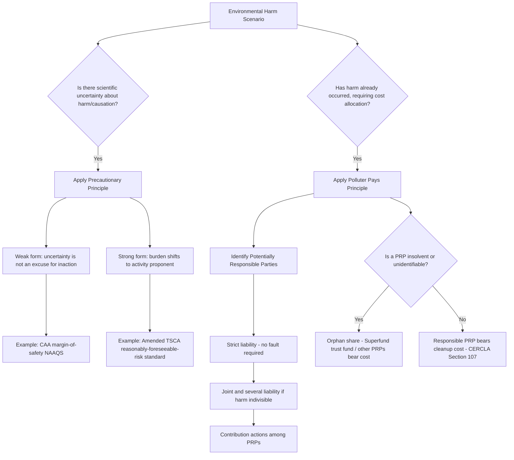

## The Precautionary Principle and the Polluter Pays Principle

### Overview

The precautionary principle and the polluter pays principle are two of the most widely invoked foundational principles in international and domestic environmental law. Both emerged largely from European and international environmental policy frameworks in the 1970s-1990s and have since been incorporated, with varying degrees of legal force, into treaties, national legislation, and administrative practice. They address different problems: the precautionary principle governs decision-making *under scientific uncertainty*, while the polluter pays principle governs the *allocation of costs* for environmental harm and remediation. Understanding both is essential to Administrative & Environmental Law because they inform statutory interpretation, the burden of proof in environmental disputes, and the design of liability and cost-recovery regimes.

### The Precautionary Principle

**Key Points**

**Definition and core formulations**

- General formulation: Where there are threats of serious or irreversible environmental damage, lack of full scientific certainty should not be used as a reason for postponing cost-effective measures to prevent environmental degradation.
- **Rio Declaration Principle 15** (1992 UN Conference on Environment and Development): "In order to protect the environment, the precautionary approach shall be widely applied by States according to their capabilities. Where there are threats of serious or irreversible damage, lack of full scientific certainty shall not be used as a reason for postponing cost-effective measures to prevent environmental degradation." This is the most frequently cited international articulation.
- **Earlier German origin**: The principle traces to the German concept of *Vorsorgeprinzip* ("foresight principle"), developed in German environmental and air-pollution policy in the 1970s, emphasizing proactive risk avoidance rather than reactive harm remediation.
- **Wingspread Statement** (1998, a non-binding U.S. environmental advocacy conference document): Articulated a stronger version — "When an activity raises threats of harm to human health or the environment, precautionary measures should be taken even if some cause and effect relationships are not fully established scientifically," and further proposed shifting the burden of proof to proponents of an activity rather than requiring opponents to prove harm.

**Strong versus weak formulations**

- **Weak/permissive formulation**: Uncertainty does not *bar* regulators from acting; it simply removes scientific uncertainty as a valid *excuse* for inaction. This formulation is largely compatible with conventional cost-benefit and risk-based regulatory approaches (it permits precaution but does not mandate a specific burden shift).
- **Strong formulation**: Uncertainty actively *requires* preventive action, and/or the burden of proving safety shifts to the party proposing the potentially harmful activity (a reversal of the traditional evidentiary default in tort and regulatory law, where the party alleging harm typically bears the burden).
- [Inference: because international instruments like the Rio Declaration use language compatible with either formulation, considerable scholarly and judicial disagreement exists over which formulation particular treaty or statutory language actually embodies; this ambiguity is frequently the crux of litigation and diplomatic dispute over precautionary measures, e.g., in WTO disputes over EU restrictions on hormone-treated beef and genetically modified organisms.]

**Legal manifestations in U.S. and international law**

- The precautionary principle has *no single comprehensive codification* in U.S. federal statutory law, but precaution-consistent structures appear throughout:
  - The Clean Air Act's requirement that National Ambient Air Quality Standards (NAAQS) be set with an "adequate margin of safety" to protect public health (42 U.S.C. § 7409), which does not require proof of actual harm at the margin but builds in a buffer against scientific uncertainty.
  - The Toxic Substances Control Act (TSCA), as amended by the Frank R. Lautenberg Chemical Safety for the 21st Century Act (2016), incorporates a "reasonably foreseeable" risk-based safety standard, permitting EPA to restrict chemicals without requiring the traditional heavy burden of proven harm previously required under earlier TSCA case law (notably relaxing the standard implicated in *Corrosion Proof Fittings v. EPA*, 947 F.2d 1201 (5th Cir. 1991), which had struck down EPA's asbestos ban under the pre-2016 TSCA cost-benefit and least-burdensome-alternative requirements).
  - The Endangered Species Act's "best available science" and jeopardy-avoidance standards operate in a precaution-consistent manner by requiring agencies to avoid actions likely to jeopardize a species even amid scientific uncertainty about the precise causal mechanisms.
  - NEPA's environmental impact statement process, by requiring disclosure and consideration of uncertain or unknown environmental effects before an action proceeds, embodies a *procedural* (rather than substantive) form of precaution.
- **International instruments**: The precautionary principle appears in the Convention on Biological Diversity (1992), the Cartagena Protocol on Biosafety (2000, governing genetically modified organisms), the Montreal Protocol's approach to ozone-depleting substances, and the Paris Agreement's preambular language.
- **EU law**: Article 191(2) of the Treaty on the Functioning of the European Union explicitly names the precautionary principle as a foundational basis for EU environmental policy, giving it comparatively stronger formal legal status in the EU than in U.S. federal law, where it functions more as an interpretive gloss embedded within specific statutory safety margins than as an independently codified cross-cutting principle.

**Critiques**

- Critics (often from a law-and-economics perspective) argue the strong formulation is incoherent or self-defeating because virtually any regulatory action *also* carries its own uncertain risks and opportunity costs (e.g., banning a pesticide may increase reliance on a less-studied and potentially more harmful substitute, or foregone economic activity may itself carry health costs) — a critique associated with scholars such as Cass Sunstein ("precautionary principle paralysis").
- Defenders respond that the principle is best understood as a tool for allocating the burden of scientific uncertainty rather than a categorical rule, and that its proper operation requires comparative risk assessment across the regulatory action and its alternatives (including inaction), not a naive "ban anything uncertain" heuristic.

### The Polluter Pays Principle

**Key Points**

**Definition and origin**

- **Core principle**: The party responsible for producing pollution should bear the costs of managing it to prevent damage to human health and the environment, rather than externalizing those costs onto the public, the government, or future generations.
- **Origin**: First formally articulated by the Organisation for Economic Co-operation and Development (OECD) in a 1972 Council Recommendation, primarily as an *economic efficiency* principle intended to prevent competitive distortion from environmental subsidies (i.e., to prevent states from subsidizing pollution-control costs in ways that would distort international trade), rather than initially as a moral/equity principle.
- **Rio Declaration Principle 16** (1992): "National authorities should endeavour to promote the internalization of environmental costs and the use of economic instruments, taking into account the approach that the polluter should, in principle, bear the cost of pollution, with due regard to the public interest and without distorting international trade and investment." Note the qualifying language ("in principle," "should endeavour") reflecting the principle's aspirational rather than strictly binding character in this instrument.

**Legal manifestations in U.S. law**

- **CERCLA (Comprehensive Environmental Response, Compensation, and Liability Act, 1980, the "Superfund" statute)** is the paradigmatic U.S. embodiment of the polluter pays principle, though it operationalizes the principle through a strict, joint-and-several, and retroactive liability scheme rather than the more market/tax-based mechanisms often associated with the principle internationally:
  - **Strict liability**: A potentially responsible party (PRP) can be held liable for cleanup costs without a showing of negligence or fault (42 U.S.C. § 9607).
  - **Joint and several liability**: Where harm is indivisible among multiple contributing parties, each PRP can be held liable for the *entire* cleanup cost, subject to contribution claims against other PRPs (a doctrine developed largely through case law interpreting CERCLA's silence on the standard, e.g., *United States v. Chem-Dyne Corp.*, 572 F. Supp. 802 (S.D. Ohio 1983), and later refined by the Supreme Court in *Burlington Northern & Santa Fe Railway Co. v. United States*, 556 U.S. 599 (2009), which permitted apportionment where a reasonable basis for dividing harm exists).
  - **Retroactivity**: CERCLA liability can attach to conduct that was lawful at the time it occurred, a feature upheld against constitutional retroactivity challenges in cases such as those addressing the Act's application (courts have generally sustained CERCLA's retroactive liability scheme, though not without significant academic and judicial debate over its fairness).
  - **PRP categories** (42 U.S.C. § 9607(a)): current owners/operators of a facility, owners/operators at the time of disposal, generators who arranged for disposal or treatment, and transporters who selected the disposal site.
- The Oil Pollution Act of 1990 (enacted following the Exxon Valdez spill) similarly embodies polluter-pays cost-internalization through strict liability for oil spill response and damages, subject to statutory liability caps (with exceptions for gross negligence or willful misconduct).
- Effluent and emissions fee structures (where used) and Superfund excise taxes on petroleum and certain chemicals (historically funding the Hazardous Substance Superfund trust fund, reinstated in modified form by the Infrastructure Investment and Jobs Act of 2021) also reflect polluter-pays cost-allocation logic, spreading cleanup costs across an industry sector rather than solely through general tax revenue.

**Distinction from market-based instruments generally**

- The polluter pays principle is a *cost-allocation* norm (who should bear the cost), whereas market-based instruments (Pigouvian taxes, cap-and-trade) are *implementation mechanisms* that can be designed to satisfy or depart from the principle. A cap-and-trade system with fully auctioned (rather than freely allocated) allowances is more consistent with polluter-pays than one with grandfathered free allocation, because auctioning requires polluters to pay for the right to emit rather than receiving it without cost.

**Critiques and limitations**

- **Orphan share problem**: Under CERCLA, when a PRP is insolvent, defunct, or unidentifiable, the "polluter pays" ideal breaks down, and costs may fall on other (potentially less culpable) PRPs, taxpayers via the Superfund trust fund, or remain unremediated.
- **Retroactive fairness critique**: Applying strict, joint-and-several liability to conduct that was legal (or even government-encouraged, e.g., wartime industrial production) at the time it occurred raises fairness objections distinct from ordinary environmental cost-internalization logic. [Inference: courts have generally rejected constitutional challenges to CERCLA retroactivity, but the underlying policy fairness debate remains active in academic literature.]
- **Incomplete internalization**: In practice, "polluter pays" often functions as "polluter pays for cleanup after the fact" rather than as an ex ante pricing mechanism that fully internalizes the marginal social cost of ongoing pollution — a gap that market-based instruments (Pigouvian taxes) are, in theory, better designed to close.

### Comparative Framework

| Dimension | Precautionary Principle | Polluter Pays Principle |
| --- | --- | --- |
| Core question addressed | How to act under scientific uncertainty | Who bears the cost of pollution/remediation |
| Primary international source | Rio Declaration Principle 15 (1992) | OECD 1972 Recommendation; Rio Declaration Principle 16 |
| Paradigmatic U.S. statute | CAA margin-of-safety standards; amended TSCA | CERCLA (Superfund) |
| Legal character in U.S. law | Interpretive gloss within specific statutes; not independently codified | Operationalized via strict/joint-several liability scheme |
| Primary critique | Risk of paralysis / incoherence under strong formulation | Orphan-share and retroactivity fairness problems |
| Relationship to burden of proof | Strong formulation shifts burden to activity proponent | Liability is typically strict (no fault-based burden at all) |

### Example: Applying Both Principles to a Contamination Scenario

Consider a chemical manufacturer whose historical (now-defunct) operations contaminated groundwater with a compound whose long-term health effects remain scientifically contested.

- The **precautionary principle** would counsel that EPA (or a state agency) should not wait for definitive proof of a specific health effect threshold before requiring remediation or setting a protective cleanup standard, particularly if the compound is suspected to be persistent or bioaccumulative — consistent with the "adequate margin of safety" logic embedded in analogous CAA provisions.
- The **polluter pays principle**, operationalized through CERCLA, would assign cleanup cost liability to the current site owner, any prior owner/operator at the time of disposal, and any party that arranged for the chemical's disposal — regardless of whether the original disposal practices were lawful when they occurred, and regardless of whether the manufacturer that caused the contamination is still in business (in which case successor liability or, failing that, the orphan-share/Superfund-trust-fund mechanism would apply).

### Principle Application Flow Diagram

### Distinguishing Facts from Contested Interpretation

- **Well-established**: The текст and dates of the Rio Declaration principles, the OECD's 1972 origin of polluter pays, CERCLA's strict/joint-and-several liability structure, and the holdings of *Burlington Northern* and *Chem-Dyne* are documented.
- **[Inference]**: Whether any specific U.S. statutory provision embodies the "strong" or "weak" formulation of the precautionary principle is frequently a matter of statutory interpretation and judicial construction rather than an settled, self-evident fact — courts and scholars reach different conclusions depending on interpretive methodology.
- **[Unverified/Contested]**: The normative debate over whether the precautionary principle's strong formulation is coherent as a decision rule (the Sunstein "paralysis" critique versus its defenders) is a matter of ongoing philosophical and policy disagreement, not an empirically resolvable question.

### Related Topics

- CERCLA liability scheme in depth: PRP categories, contribution actions, and settlement mechanisms
- The Toxic Substances Control Act's 2016 Lautenberg Amendments and the shift in chemical safety standards
- WTO trade disputes implicating the precautionary principle (EC–Hormones, EC–Biotech)
- Superfund trust fund financing and the reinstated petroleum/chemical excise taxes
- The Oil Pollution Act of 1990 and strict liability for oil spill damages
- Risk assessment methodology and the role of scientific uncertainty in agency rulemaking
- Comparative EU vs. U.S. treatment of the precautionary principle in chemical and biotech regulation