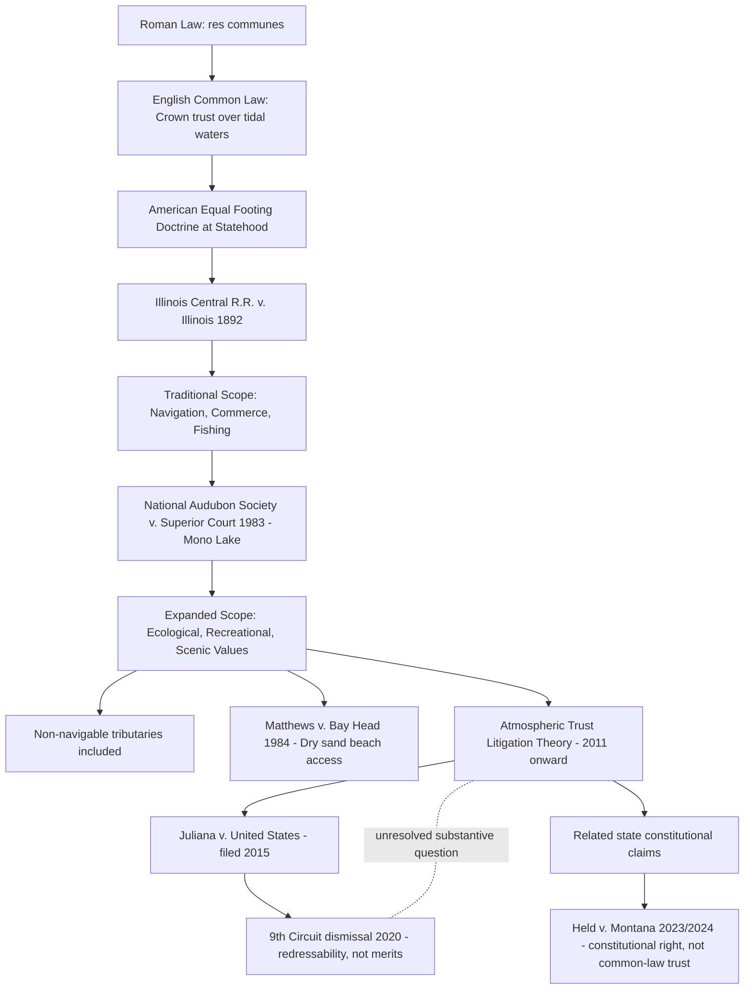

## The Public Trust Doctrine and Its Modern Revival

### Overview

The public trust doctrine holds that certain natural resources — historically navigable waters, submerged lands, and the shores beneath them — are held by the sovereign (the state) in trust for the public, and cannot be alienated or managed in ways that substantially impair the public's use and enjoyment of them. Originating in Roman and English common law and adopted into American law through state sovereignty over navigable waters at statehood, the doctrine has experienced a significant modern expansion and revival, particularly as an argument in climate change litigation and natural resource management disputes. It is foundational to Administrative & Environmental Law because it represents one of the few environmental legal doctrines with roots predating the modern regulatory state, and because its asserted scope has become a central battleground in efforts to use common law (rather than solely statutory) theories to compel governmental environmental action.

### Historical and Doctrinal Origins

**Key Points**

- **Roman law origins**: The doctrine traces conceptually to Justinian's *Institutes*, which classified the air, running water, the sea, and the seashore as *res communes* — things common to all, incapable of private ownership.
- **English common law**: Developed the concept that the Crown held title to tidal and navigable waters and the lands beneath them (the foreshore and submerged lands) in trust for the public's rights of navigation, commerce, and fishing (*jus publicum*), distinct from the Crown's proprietary rights (*jus privatum*).
- **American adoption — the "equal footing doctrine"**: Upon admission to the Union, each state acquires title to the beds of navigable waters within its borders in trust for its citizens, on "equal footing" with the original thirteen states. This principle was substantially developed as a matter of federal constitutional structure while leaving the *content and scope* of the trust obligation itself to be defined by state law.
- **Foundational case — *Illinois Central Railroad Co. v. Illinois*, 146 U.S. 387 (1892)**: The Supreme Court held that the Illinois legislature's attempted grant of virtually the entire Chicago harbor bed to a private railroad company was revocable, because the state could not fully alienate its public trust title to submerged lands in a manner that would abdicate its trust obligation to the public. This case remains the doctrinal cornerstone of the public trust doctrine in American law, though it was decided as a matter of *state* property law (interpreted through federal constitutional equal-footing principles) rather than federal environmental law.

### Traditional Scope of the Doctrine

**Key Points**

- **Historically core protected resources**: Navigable and tidal waters, the submerged lands beneath them, and the traditional trust uses of navigation, commerce, and fishing.
- **Traditional trust uses**: The classic trio of protected public uses is navigation, commerce, and fishing — reflecting the doctrine's historical origin in facilitating waterborne trade and food access rather than ecological or recreational concerns per se.
- **State-by-state variation**: Because the doctrine's specific content is a matter of state common law (subject to the federal equal-footing floor), states have developed the doctrine with significantly different scope. Some states (notably California and New Jersey) have expanded the doctrine considerably beyond its traditional scope; others have hewed closely to the traditional navigation/commerce/fishing trio.

### Modern Expansion of Scope

**Key Points**

**Expansion to non-navigable and recreational uses**

- **National Audubon Society v. Superior Court ("the Mono Lake case")**, 33 Cal. 3d 419 (1983): The California Supreme Court held that the public trust doctrine constrains the state's allocation of water rights even for non-navigable tributary streams feeding a public trust resource (Mono Lake), and that the state has an ongoing duty to consider public trust values (ecological preservation, recreation, scenic beauty) when administering water rights, even after those rights have been granted. This case is the most frequently cited modern expansion of the doctrine and is credited with substantially broadening the doctrine's application beyond its traditional navigation/commerce/fishing scope to include ecological and recreational values.
- Some states have extended trust principles to dry sand beaches (for public recreational access, e.g., *Matthews v. Bay Head Improvement Association*, 95 N.J. 306 (1984), extending New Jersey's public trust doctrine to require private beach clubs to provide reasonable public access), groundwater in some jurisdictions, and even, in a small number of contested cases, to non-water resources.

**Attempted expansion to the atmosphere — "atmospheric trust litigation"**

- Beginning around 2011, a coordinated legal strategy (associated with the nonprofit organization Our Children's Trust) sought to apply public trust doctrine principles to the atmosphere itself, arguing that the atmosphere is a trust resource that state and federal governments have a fiduciary duty to protect from greenhouse gas-driven degradation on behalf of present and future generations (an intergenerational-equity argument closely related to sustainability theory).
- **Federal litigation — *Juliana v. United States***: Filed in 2015, a group of youth plaintiffs argued that the federal government's affirmative promotion of fossil fuel development violated both constitutional due process rights and the public trust doctrine as applied to the atmosphere. The case survived early motions to dismiss at the district court level but was ultimately dismissed by the Ninth Circuit Court of Appeals in 2020 (*Juliana v. United States*, 947 F.3d 1159 (9th Cir. 2020)) on the ground that the plaintiffs' requested remedy (a comprehensive judicially supervised climate remediation plan) was not redressable by an Article III court — a standing/justiciability holding rather than a substantive rejection of the atmospheric trust theory itself. [Inference: because the dismissal rested on redressability rather than a definitive ruling on whether the atmosphere is a public trust resource as a matter of law, the substantive viability of atmospheric trust theory under federal law remains formally unresolved, even though the practical litigation strategy suffered a significant setback.] Subsequent amended complaints and settlement discussions in *Juliana* continued after the 2020 dismissal, with mixed procedural outcomes. [Unverified: the precise current procedural status of *Juliana* and related refiled claims should be verified against current dockets, as youth climate litigation in this vein has continued to evolve across multiple jurisdictions.]
- **State-level atmospheric trust and related youth climate litigation**: Similar theories have been asserted in numerous state courts with varying results; a notable success was *Held v. Montana* (Montana First Judicial District, 2023, affirmed by the Montana Supreme Court in 2024), where plaintiffs succeeded on a claim under Montana's state constitutional right to a "clean and healthful environment" (a distinct but conceptually related theory, since it rests on an express constitutional provision rather than the common-law public trust doctrine per se). [Inference: *Held v. Montana*'s reliance on an express state constitutional environmental rights provision — which not all states have — limits its direct precedential transferability to jurisdictions lacking such a provision, even though it is frequently cited alongside public trust doctrine cases as part of the broader youth climate litigation movement.]

### Public Trust Doctrine versus Related Doctrines

**Key Points**

- **Distinct from environmental rights amendments**: Some state constitutions (e.g., Pennsylvania's Environmental Rights Amendment, Montana's constitutional environmental provision, New York's 2021 "Green Amendment") independently guarantee a right to a clean environment, providing an alternative or complementary basis for litigation distinct from the common-law public trust doctrine.
- **Distinct from the takings doctrine**: A regulation grounded in public trust obligations (e.g., a state denying a permit that would impair public trust uses) has sometimes been challenged as an uncompensated regulatory taking under the Fifth Amendment; courts have generally held that because public trust title was never fully vested in a manner that would have permitted the impairing use in the first place, a public-trust-based denial does not necessarily constitute a taking of a previously existing property right — though this remains a fact-intensive and jurisdiction-specific inquiry.
- **Distinct from statutory environmental review (NEPA)**: The public trust doctrine is a substantive common-law limitation on governmental alienation/management of trust resources, whereas NEPA is a procedural statutory requirement to consider environmental effects before acting; the two can operate in parallel but rest on different legal foundations (common law versus federal statute).

### Comparative Table: Traditional versus Modern Scope

| Dimension | Traditional Doctrine (pre-1970s) | Modern/Expanded Doctrine |
| --- | --- | --- |
| Protected resources | Navigable/tidal waters, submerged lands | Non-navigable tributaries, dry sand beaches, groundwater (some states); attempted extension to atmosphere |
| Protected uses | Navigation, commerce, fishing | Ecological preservation, recreation, scenic values, climate stability (contested) |
| Governing law | State common law (equal-footing constitutional floor) | Primarily state common law; federal atmospheric theory largely unsuccessful on justiciability grounds |
| Leading case | *Illinois Central R.R. v. Illinois* (1892) | *National Audubon Society v. Superior Court* (1983); *Juliana v. United States* (2020, dismissed) |
| Remedy sought | Prevent alienation of trust title | Compel affirmative regulatory/resource-management action |

### Example: Applying the Doctrine to a Modern Water Rights Dispute

Consider a state agency proposing to grant a new water diversion permit from a river that feeds a public trust lake, where the diversion would not affect navigation but would significantly reduce the lake's ecological health and recreational value. Under the traditional (pre-*Mono Lake*) doctrine, because the dispute does not involve navigation, commerce, or fishing on navigable waters directly, the doctrine might not apply at all. Under the *National Audubon* expansion, however, the state agency has an ongoing duty to consider the public trust values at stake (ecological and recreational) even in administering a water rights permit for a non-navigable tributary, and may be required to reconsider or condition previously granted rights if necessary to protect the trust resource — illustrating the doctrine's shift from a static property-alienation limit to an ongoing, dynamic management obligation.

### Doctrinal Evolution Diagram

### Distinguishing Facts from Contested Interpretation

- **Well-established**: The holdings and dates of *Illinois Central R.R. v. Illinois*, *National Audubon Society v. Superior Court*, *Matthews v. Bay Head*, and the *Juliana v. United States* dismissal on redressability grounds are documented judicial facts.
- **[Inference]**: Whether the Ninth Circuit's *Juliana* dismissal leaves the substantive atmospheric trust theory legally viable (as opposed to merely procedurally foreclosed in that specific case) is a matter of ongoing legal-scholarly interpretation rather than a settled point.
- **[Unverified]**: The current procedural posture of *Juliana* and related refiled or amended youth climate claims should be checked against current dockets, as this area of litigation has continued to develop.
- **[Contested]**: Whether the public trust doctrine *should* extend to the atmosphere, groundwater, or other non-traditional resources is a live normative and doctrinal debate among courts and scholars, with significant state-by-state variation in outcomes.

### Related Topics

- The equal footing doctrine and state sovereignty over submerged lands
- Atmospheric trust litigation and the broader youth climate litigation movement (Our Children's Trust cases)
- State constitutional environmental rights provisions (Pennsylvania, Montana, New York Green Amendment)
- *National Audubon Society v. Superior Court* and California water rights administration
- Regulatory takings doctrine as applied to public trust-based permit denials
- Comparative public trust doctrine developments internationally (India, Philippines' *Oposa v. Factoran* intergenerational standing doctrine)
- NEPA's procedural review compared with public trust doctrine's substantive common-law limits