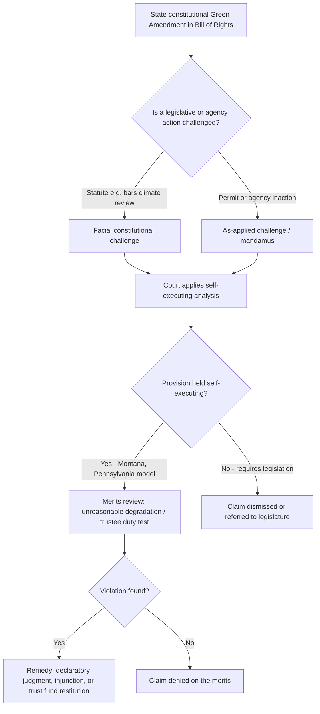

## State Constitutional Environmental Rights and Green Amendments

### Overview and Definition

State constitutional environmental rights provisions — commonly called "Green Amendments" when placed in a state's Bill of Rights or Declaration of Rights — are constitutional text that recognizes a right to a clean, healthy, or healthful environment as a fundamental civil right, analogous in status to free speech, due process, or freedom of religion. The term "Green Amendment" was coined and popularized by environmental attorney Maya van Rossum through the organization Green Amendments For the Generations, which argues that placement in the Bill of Rights (rather than in a policy-directive or "aspirational" section of a constitution) is what makes such a right self-executing — enforceable directly by citizens in court without waiting for implementing legislation.

This distinguishes Green Amendments from the broader, older category of "environmental rights amendments" (ERAs), some of which exist outside the Bill of Rights and function more as statements of policy than judicially enforceable rights.

### Historical Background

**First-generation environmental rights provisions (1970s):**

Several states added environmental language to their constitutions during the environmental-law boom that followed Earth Day 1970 and the enactment of the National Environmental Policy Act (NEPA):

- **Pennsylvania** (1971) — Article I, Section 27, added by referendum, states that "the people have a right to clean air, pure water, and to the preservation of the natural, scenic, historic and esthetic values of the environment," and further makes the state the "trustee" of public natural resources for the benefit of all people, including generations yet to come.
- **Montana** (1972) — Article II, Section 3 and Article IX, Section 1, guarantee "the right to a clean and healthful environment" and impose an affirmative constitutional duty on the state and each person to "maintain and improve" the environment for present and future generations.
- **Illinois** (1970) — Article XI includes a right to a healthful environment, though it has historically been treated by courts as requiring legislative implementation rather than being immediately self-executing in the way Montana's and Pennsylvania's provisions have come to be interpreted.
- **Hawaii, Massachusetts, and Rhode Island** also adopted environmental-rights or public-trust language in this era, though with varying degrees of judicial enforceability.

For decades, these provisions were largely dormant. Courts frequently treated them as symbolic or as requiring a statutory cause of action, and litigants rarely tested their self-executing force directly.

**Second-generation revival (2010s–2020s):**

Two developments reactivated interest in this category of provision:

1. **Pennsylvania's Robinson Township decision (2013)** — The Pennsylvania Supreme Court's plurality opinion in *Robinson Township v. Commonwealth* reinvigorated Article I, Section 27, striking down provisions of a state oil-and-gas law (Act 13) that preempted local zoning control over drilling, holding that the law violated the constitutional environmental rights of affected residents. This was reaffirmed and extended in the Pennsylvania Environmental Defense Foundation (PEDF) line of cases regarding the state's management of oil-and-gas lease revenues as trust assets.
2. **New York's Environmental Rights Amendment (2021)** — On November 2, 2021, New York voters approved (by roughly a 2-to-1 margin) a new Article I, Section 19: "Each person shall have a right to clean air and water, and a healthful environment." New York became the third state (after Montana and Pennsylvania) with an operative Green Amendment placed in its Bill of Rights, and the first state in nearly fifty years to adopt one.

Since 2021, dozens of state legislatures have introduced or advanced Green Amendment proposals, with organized, coordinated advocacy campaigns (notably through Green Amendments For the Generations and the National Caucus of Environmental Legislators, NCEL) tracking and supporting them.

### Current State Landscape (as of September 2026)

**States with operative Green Amendments in their Bill of Rights:**

- Montana (1972)
- Pennsylvania (1971, reactivated judicially in 2013)
- New York (2021)

**States with older, non-Bill-of-Rights or more limited environmental provisions** (varying enforceability and judicial treatment): Hawaii, Illinois, Massachusetts, and Rhode Island are frequently cited in this broader category, though legal commentators disagree on whether all of these meet the strict "Green Amendment" definition, since not all sit in the Bill of Rights or have been treated by courts as self-executing.

**Active or recent 2025–2026 legislative and ballot activity:** [Unverified — status changes rapidly and depends on legislative session outcomes]

- **New York** — In addition to the 2021 amendment already in force, the New York legislature passed a *further* Green Amendment-related constitutional measure (S528) for a second time in the 2026 session, a required step under New York's amendment process (constitutional amendments must pass two separately elected legislatures before going to voters). This measure was slated to appear before New York voters on the November 3, 2026 general election ballot. Because that vote falls after this content was generated, its outcome should be independently verified.
- A substantial number of other states — reporting varies but commonly cited figures range from roughly eight to ten states in a given legislative session — have introduced or held committee hearings on Green Amendment bills, including (in various sessions) Hawaii, New Mexico, Oregon, Kentucky, Maryland, Maine, New Jersey, Washington, West Virginia, California, Vermont, Iowa, and Texas.
- **Florida** has pursued a narrower citizen ballot-initiative approach (the "Right to Clean and Healthy Waters" initiative), limited to water quality due to Florida's single-subject rule for citizen initiatives; an earlier signature drive fell short for the 2024 ballot, with organizers reportedly regrouping for a future cycle. [Unverified — confirm current signature-drive status independently, as citizen initiative campaigns are volatile.]

Given how fast this landscape moves — new introductions, committee votes, and ballot outcomes occur continuously — any specific claim about a state's current status should be verified against a live legislative tracker (e.g., NCEL's Green Amendment tracker) or state legislature bill-status page before being relied upon.

### Anatomy of a Green Amendment: Core Textual Elements

Green Amendment drafting has converged on several recurring structural components, though exact language varies by state:

1. **Rights-holder clause** — identifies who holds the right (e.g., "each person," "the people," sometimes explicitly including future generations).
2. **Substantive right** — the environmental good protected: commonly "clean air," "pure/clean water," a "healthful" or "healthy" environment, and sometimes "a safe climate" or "safe drinking water."
3. **Placement in the Bill of Rights / Declaration of Rights** — this is the definitional element advocates emphasize, since Bill of Rights provisions are generally understood as self-executing, judicially enforceable restraints on government action, not mere policy statements requiring legislative activation.
4. **Public trust / trustee language** (as in Pennsylvania) — designating the state as trustee of natural resources, which supports fiduciary-duty-style claims (e.g., that trust assets like oil-and-gas royalties must be used to benefit the corpus of the trust, not diverted to the general fund).
5. **Intergenerational equity language** (as in Montana and Pennsylvania) — extending the right's beneficiaries to "generations yet to come," which has become central to youth-led climate litigation strategies.
6. **Affirmative governmental duty** (Montana's model) — imposing a duty on the state itself to "maintain and improve" the environment, rather than merely a negative restraint against government infringement.

**Example — comparative text:**

| State | Year | Core Language (paraphrased) | Bill of Rights Placement |
| --- | --- | --- | --- |
| Pennsylvania | 1971 | Right to clean air, pure water, preservation of natural/scenic/historic/esthetic values; state as trustee | Yes (Art. I, § 27) |
| Montana | 1972 | Right to a clean and healthful environment; state and person duty to maintain/improve for present and future generations | Yes (Art. II, § 3) |
| New York | 2021 | Right to clean air and water, and a healthful environment | Yes (Art. I, § 19) |

### Judicial Enforcement and Landmark Litigation

**Pennsylvania — *Robinson Township v. Commonwealth* (2013) and PEDF cases:**

The Pennsylvania Supreme Court applied a three-part framework derived from Article I, Section 27 requiring the state to: (1) refrain from unreasonably degrading protected resources, (2) act as trustee to conserve and maintain those resources for beneficiaries (including future generations), and (3) act affirmatively to protect the environment via legislative and executive action. Subsequent PEDF decisions clarified that revenues from oil-and-gas leasing on state forest and park land are trust principal that must be used to conserve and maintain the corpus of the trust, restricting the legislature's ability to redirect such funds to the general budget.

**Montana — *Held v. State of Montana*:**

Sixteen youth plaintiffs challenged a Montana statute (part of the Montana Environmental Policy Act) that barred state agencies from considering greenhouse gas emissions and climate impacts in environmental reviews, arguing this violated their Article II, Section 3 right to a clean and healthful environment. The trial court ruled for the plaintiffs, holding the challenged provision unconstitutional; Montana's Supreme Court affirmed. This litigation is widely characterized as the first youth-led constitutional climate case in the United States to reach a favorable final judgment on the merits, and it has become the template cited by advocates in other Green Amendment states for how such provisions could be used to challenge climate-blind permitting statutes. [Note: some sources describe a subsequent civil trial phase testing remedies/damages under the Montana provision as ongoing as of early-to-mid 2026 — confirm current docket status independently, as this litigation continues to develop.]

**New York — post-2021 case law:**

Since the 2021 amendment took effect, New York's Environmental Rights Amendment (Article I, Section 19) has generated a growing but still-developing body of trial and intermediate appellate decisions, several still on appeal as of this writing, addressing questions such as: whether the amendment supports a private cause of action for money damages or only equitable relief; what pleading standard applies to allege a constitutional-scale environmental harm (as opposed to an ordinary permitting or nuisance dispute); and whether harms must be geographically or medically particularized to the plaintiff, or whether generalized environmental degradation suffices for standing. Litigation has included challenges brought by residents near waste-management facilities (e.g., landfill-adjacent communities) against state environmental regulators for allegedly failing to prevent conditions said to violate the constitutional right.

**Illinois — comparative caution:**

Illinois's older environmental-rights language (Article XI) has generally been read by Illinois courts as requiring legislative implementation to be enforceable — illustrating the practical stakes of the "self-executing" drafting debate: text that reads similarly to Montana's or Pennsylvania's can produce very different judicial outcomes depending on placement, drafting history, and how courts have already characterized the provision in earlier cases.

### The Self-Executing Debate

A central doctrinal fault line among Green Amendment scholars and litigators is whether a given provision is:

- **Self-executing** — directly enforceable by private plaintiffs in court without any need for the legislature to first enact an implementing statute, functioning as an immediate constraint on government action (Pennsylvania and Montana are the paradigm examples).
- **Non-self-executing / aspirational** — requiring legislative action to create a cause of action, meaning the constitutional text functions more as a directive to future lawmakers than an immediately enforceable individual right (the historical treatment of some 1970s-era provisions, including at times Illinois's).

Advocates argue that placement in the Bill of Rights / Declaration of Rights is the strongest textual signal of self-executing intent, since that section of a constitution is conventionally understood to enumerate rights against government infringement rather than policy goals. Critics and some courts have been more cautious, worried about opening broad, difficult-to-cabin litigation against ordinary permitting and land-use decisions, or about separation-of-powers concerns if courts effectively set environmental policy through constitutional adjudication in the absence of legislative standards.

### Relationship to Federal Environmental Law

State Green Amendments exist against the backdrop of a well-established asymmetry: the U.S. Constitution contains no textual right to a clean environment, and federal courts have consistently declined to recognize such a right under existing constitutional doctrine (most notably in the *Juliana v. United States* line of federal climate-rights litigation, which failed largely on standing and separation-of-powers grounds rather than on the substantive existence of the claimed right). This federal gap is the primary reason advocates have pursued a **state-by-state strategy** rather than relying on federal constitutional litigation, and it also explains ongoing (currently much earlier-stage) advocacy for a *federal* Green Amendment via the Article V amendment process — a goal proponents themselves describe as a longer-term aspiration relative to the state-level campaigns.

Green Amendments interact with, but are legally distinct from, statutory environmental frameworks such as:

- **State "mini-NEPA" statutes** (e.g., New York's State Environmental Quality Review Act, SEQRA) — which impose procedural environmental-review requirements; Green Amendments can be invoked to argue that such statutory review processes fall short of a substantive constitutional floor.
- **Public trust doctrine** — a common-law and sometimes constitutional doctrine holding that certain natural resources (navigable waters, submerged lands) are held by the state in trust for public use; Pennsylvania's Article I, Section 27 explicitly merges Green Amendment rights language with public trust trustee obligations, while other states' public trust doctrines remain purely common-law and unconnected to constitutional text.

### Practical Litigation Framework: Elements of a Green Amendment Claim

A generalized (jurisdiction-specific) litigation framework synthesized from the Pennsylvania and Montana case law typically requires a plaintiff to establish:

1. **Standing** — that the plaintiff is a "person" within the meaning of the provision and has suffered or will imminently suffer a cognizable environmental harm (courts vary on how particularized this must be relative to the general public).
2. **State action or inaction** — identification of a specific statute, regulation, permit decision, or agency failure to act that is alleged to violate the right.
3. **Degradation or unreasonable risk** — a showing that the challenged action causes, permits, or fails to prevent unreasonable degradation of air, water, or the environment generally (Pennsylvania's "unreasonable degradation" standard from *Robinson Township*).
4. **Absence of adequate justification / balancing** — some frameworks (again drawing on Pennsylvania's trustee framework) require courts to assess whether the state adequately balanced developmental and conservation values, or whether it acted purely for revenue or expedience.
5. **Remedy** — the requested relief, which may include declaratory judgment (as in *Held*), injunctive relief against permit issuance or statutory enforcement, or in trust-based claims, restitution/segregation of trust funds (as in the PEDF line).

### Illustrative Diagram: Green Amendment Litigation Pathway

### Example: Simplified Model Amendment Text

A composite illustrative (not adopted, hypothetical) Green Amendment drafted in the style advocated by Green Amendments For the Generations might read:

> "Each person, including generations yet to come, has an inherent and inalienable right to clean air, pure water, a stable climate, and the preservation of the natural, cultural, and esthetic values of the environment. The State shall serve as trustee of the environment and natural resources of the State for the benefit of all the people, and shall conserve and maintain them for present and future generations."

This example illustrates how drafters typically combine the individual-rights clause (New York/Montana style), the intergenerational clause (Montana/Pennsylvania style), and the trustee clause (Pennsylvania style) into a single, maximalist provision — the drafting approach most current advocacy campaigns favor over narrower, single-element language.

### Common Criticisms and Counterarguments

- **Litigation floodgates concern** — opponents (often industry and some state agencies) argue broad, undefined terms like "healthful environment" invite speculative litigation against routine permitting decisions, creating regulatory uncertainty. [Inference — this is a commonly reported industry/legislative objection, not a settled empirical finding; the actual litigation volume in Montana, Pennsylvania, and New York remains a matter of ongoing empirical tracking rather than resolved fact.]
- **Separation of powers** — critics argue that vague constitutional environmental standards effectively delegate substantive environmental policymaking to courts, which are said to lack the technical/administrative capacity of agencies.
- **Vagueness and enforceability** — without clear numeric or technical standards (unlike, e.g., Clean Air Act NAAQS), courts must develop common-law-like tests (e.g., Pennsylvania's three-part *Robinson Township* framework) largely from scratch, leading to years of doctrinal uncertainty before a workable standard emerges.
- **Equity framing** — proponents respond that the amendments are specifically designed to address environmental injustice, since low-income and minority communities have historically borne disproportionate exposure to pollution sources that ordinary permitting and zoning processes have failed to prevent; the "for all the people" language found in many proposed amendments is intended to make this equity goal explicit and judicially cognizable.

### Relevance to Administrative & Environmental Law Practice

Green Amendments intersect directly with core administrative law doctrines covered elsewhere in this course:

- **Standard of review** — courts must decide whether agency environmental permitting decisions get ordinary arbitrary-and-capricious deference or heightened scrutiny when a constitutional right is implicated.
- **Standing doctrine** — Green Amendment cases often test the outer boundaries of state standing doctrine (which can be more permissive than federal Article III standing), particularly around generalized environmental grievances.
- **Rulemaking and permitting** — agencies in Green Amendment states (Pennsylvania DEP, Montana DEQ, New York DEC) have had to build constitutional-compliance review into permitting practice, an added administrative layer beyond ordinary statutory and NEPA-style review.
- **Remedies** — the trust-fund restitution remedy from the Pennsylvania PEDF cases is a distinctive administrative-law remedy not typically available under ordinary statutory environmental review schemes.

**Related Topics**

- Public trust doctrine (common-law and constitutional variants)
- *Robinson Township v. Commonwealth* and the Pennsylvania Environmental Defense Foundation (PEDF) case line
- *Held v. State of Montana* and youth-led constitutional climate litigation
- State "mini-NEPA" statutes (SEQRA, CEQA) and their relationship to constitutional environmental review
- Federal environmental constitutional litigation and its limits (*Juliana v. United States*)
- Standing doctrine in state vs. federal environmental litigation
- Environmental justice and equity framing in state constitutional law
- Self-executing vs. non-self-executing constitutional provisions (general constitutional law doctrine)
- Proposed federal Green Amendment (Article V amendment process)
- Comparative international environmental constitutionalism (e.g., countries with explicit environmental rights)