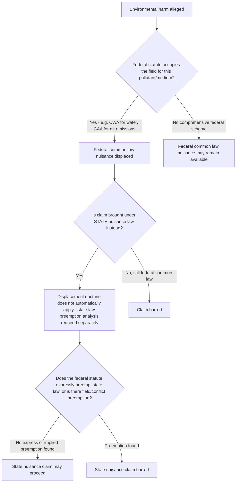

## Public and Private Nuisance Actions for Environmental Harm

### Overview and Doctrinal Placement

Nuisance law is one of the oldest common-law tools for addressing environmental harm, predating nearly all modern environmental statutes. Before the enactment of comprehensive federal regimes like the Clean Air Act (1970/1990), Clean Water Act (1972), and RCRA (1976), nuisance was the primary legal vehicle for redressing pollution, contamination, and other environmental interferences. It remains doctrinally significant today because:

1. It provides a **residual cause of action** where statutory environmental law does not reach a given harm, provides no private right of action, or has been complied with but harm still occurs.
2. It underlies much of modern environmental statutory design (many pollution-control statutes were built to codify or supersede common-law nuisance remedies).
3. It continues to be litigated actively, particularly in climate change tort litigation, oil and gas operations, industrial odor/noise cases, and toxic tort contexts.

Nuisance is fundamentally a *property and land-use* tort, not a pollution-specific one — its application to environmental harm is a matter of extending general principles (interference with use and enjoyment of land, or interference with public rights) to pollution-based fact patterns.

### The Public/Private Distinction

**Private nuisance** is a civil wrong involving a substantial and unreasonable interference with another person's use and enjoyment of land that person possesses. It is inherently tied to a property interest — the plaintiff must have a possessory interest in land affected by the interference.

**Public nuisance** is an unreasonable interference with a right common to the general public — historically encompassing obstructions of public highways and waterways, and expanded over time to include pollution of public air, water, and other environmental resources shared by the community at large. Because it protects a *public* right rather than an individual property interest, standing to sue is restricted: traditionally, only a public official (attorney general, city/county counsel) could bring a public nuisance action, unless a private plaintiff could show a **"special injury"** — harm different in kind (not merely degree) from that suffered by the general public.

**Comparative table:**

| Element | Private Nuisance | Public Nuisance |
| --- | --- | --- |
| Interest protected | Individual's use/enjoyment of land | Right common to the public |
| Plaintiff standing | Possessor of affected land | Government (default); private party only with "special injury" |
| Typical remedy | Damages, injunction | Abatement, injunction, civil penalties; damages only for private plaintiffs with special injury |
| Statute of limitations approach | Often runs from injury or discovery | Sometimes treated as a "continuing" wrong, reviving limitations period |
| Environmental example | Odor/noise from neighboring factory reducing property use | Contamination of a public river or municipal water supply |

### Elements of Private Nuisance

Courts (drawing heavily on the *Restatement (Second) of Torts* §§ 821A–840E) generally require:

1. **Interference** — an invasion of the plaintiff's interest in the use and enjoyment of land. Unlike trespass, private nuisance does not require a physical, tangible intrusion by a person or object onto the land (though it may involve one, e.g., particulate deposition); it can include intangible interferences such as odor, noise, vibration, or light.
2. **Substantiality** — the interference must be more than trivial; courts assess this by reference to an ordinary/normal sensibility standard (would a reasonable person in the community find the interference significant), not the plaintiff's own subjective or unusually sensitive threshold.
3. **Unreasonableness** — courts typically apply a balancing test weighing the gravity of the harm (extent, duration, character of the harm, social value of the plaintiff's use, and suitability to the locality) against the utility of the defendant's conduct (social value of the conduct, suitability to the locality, and impracticability of preventing the harm). Some jurisdictions instead or additionally require that the interference be "unreasonable" in the sense of exceeding what the locality's character would lead residents to expect (the "live and let live" principle).
4. **Causation** — the defendant's conduct must be a legal and factual cause of the interference.
5. **Intent or negligence (fault basis)** — nuisance liability can rest on: (a) intentional conduct (defendant knew or should have known the interference was substantially certain to result), (b) negligent conduct, (c) reckless conduct, or (d) conduct actionable under a strict liability theory (e.g., abnormally dangerous activities, which overlaps with the *Rylands v. Fletcher* line of cases).

### Elements of Public Nuisance

1. **Unreasonable interference with a right common to the general public** — the *Restatement (Second) of Torts* § 821B lists circumstances supporting unreasonableness, including whether the conduct involves a significant interference with public health, safety, peace, comfort, or convenience; whether it is proscribed by statute, ordinance, or regulation; or whether it is of a continuing nature or has produced a permanent/long-lasting effect that the actor knows or has reason to know has a significant effect on the public right.
2. **Standing** — governmental plaintiffs (attorneys general, municipalities) have inherent authority to sue on behalf of the public interest. Private plaintiffs must show **special injury**: harm different in kind, not just degree, from that suffered by the general community (e.g., a riverfront property owner whose well is directly contaminated by a polluter suffers a different kind of injury than the general public's diminished recreational use of the river).
3. **Causation and unreasonableness** — largely parallel to private nuisance analysis, adapted to the public-right context.

### Remedies

- **Damages** — compensatory damages for diminished property value, loss of use and enjoyment, or (in personal injury-adjacent toxic tort contexts) health-related harms; punitive damages may be available where conduct is willful, wanton, or malicious.
- **Injunctive relief** — courts may order abatement (cessation) of the nuisance-causing activity. Courts weigh equitable factors, including the "balancing of the equities" or "comparative injury" doctrine: some jurisdictions decline to enjoin a socially valuable, heavily invested-in operation (e.g., a large industrial facility or mine) where the harm to the plaintiff is comparatively small, instead awarding permanent damages ("nuisance damages" or "servitude" remedy) — the classic illustration being the balancing approach in *Boomer v. Atlantic Cement Co.* (N.Y. 1970), where the court permitted a cement plant's pollution to continue upon payment of permanent damages rather than ordering an injunction that would have shut down a major regional employer.
- **Abatement by self-help** — historically available at common law in limited, narrowly cabined circumstances (e.g., where the nuisance poses an urgent threat and resort to legal process is impractical), though modern courts and jurisdictions substantially restrict self-help abatement given the risk of breach of peace and disproportionate response.
- **Civil penalties / cost recovery** — in public nuisance suits brought by government plaintiffs, remedies may include statutory penalties (where a nuisance-abatement statute independently authorizes them) and recovery of the government's investigation/remediation/enforcement costs.

### Defenses

- **Coming to the nuisance** — the plaintiff moved to the vicinity of an already-existing nuisance-causing activity. Most modern courts treat this as one relevant factor in the reasonableness balancing rather than an absolute bar, particularly to avoid the perverse effect of insulating early polluters from all subsequent liability regardless of intensifying harm or expanding population exposure.
- **Regulatory compliance** — compliance with an environmental permit or statutory emissions limit is generally **not a complete defense** to nuisance liability in most jurisdictions, since permits typically set a regulatory floor rather than adjudicating private property rights or the reasonableness of the interference as between neighbors; however, compliance is often admissible and persuasive evidence bearing on the reasonableness determination, and a minority of jurisdictions or specific statutory regimes give compliance stronger preclusive weight.
- **Statute of limitations / laches** — for continuing nuisances, many jurisdictions apply a "continuing tort" theory, treating each day of continuing interference as a fresh accrual, which can substantially extend the effective limitations period compared to a single discrete injury.
- **Contributory/comparative fault** — where the plaintiff's own conduct contributed to the harm or to heightened sensitivity to it (subject to the "normal sensibility" rule limiting recovery for idiosyncratically sensitive plaintiffs or uses).
- **Right-to-farm and similar statutory immunities** — many states have enacted "right-to-farm" (and analogous industrial-operation protection) statutes that limit nuisance liability against agricultural operations that predate surrounding development and comply with generally accepted practices, reflecting a legislative override of certain common-law nuisance outcomes.

### Nuisance Per Se vs. Nuisance in Fact (Per Accidens)

- **Nuisance per se** — an activity or condition that is a nuisance at all times and under all circumstances, regardless of location or manner of conduct, typically because it is expressly declared a nuisance by statute or ordinance, or is inherently and universally injurious (e.g., certain categories of hazardous waste dumping declared unlawful per se).
- **Nuisance per accidens (in fact)** — an activity that is not inherently wrongful but becomes a nuisance because of its location, manner of operation, or surrounding circumstances (the far more common category in environmental litigation — e.g., a manufacturing facility that is lawful in an industrial zone but becomes a nuisance in a location closer to residences due to specific emissions/odor/noise impacts).

### Relationship to Statutory Environmental Law

**Preservation of common-law remedies.** Most federal environmental statutes contain "savings clauses" preserving state common-law remedies, including nuisance, alongside statutory enforcement mechanisms (e.g., Clean Water Act § 505(e), Clean Air Act § 304(e)). This means a plaintiff frequently is not required to choose exclusively between a statutory citizen suit and a nuisance claim — both can be pursued, subject to preemption limits discussed below.

**Federal common law of nuisance and its displacement.** Before the Clean Water Act's comprehensive point-source permitting scheme (the NPDES program) was enacted, the U.S. Supreme Court in *Illinois v. City of Milwaukee* (1972) ("*Milwaukee I*") recognized a **federal common law of nuisance** allowing states to sue polluters in other states for interstate water pollution. However, in *City of Milwaukee v. Illinois* (1981) ("*Milwaukee II*"), the Court held that the subsequently enacted Clean Water Act's comprehensive regulatory scheme **displaced** the federal common law of nuisance for water pollution, since Congress had "occupied the field" with a detailed statutory and administrative permitting regime. This displacement principle was extended to interstate air pollution nuisance claims in *American Electric Power Co. v. Connecticut* (2011) ("*AEP v. Connecticut*"), where the Supreme Court held that the Clean Air Act and EPA's regulatory authority under it displaced federal common-law nuisance claims seeking to cap greenhouse gas emissions from power plants.

**Preemption of *state* common law is narrower.** Critically, *AEP v. Connecticut* addressed only *federal* common law; the Court left open (and lower courts have since actively litigated) whether *state* nuisance law claims — brought under the law of the state where the emitting source or the harm is located — remain available even for interstate or global pollutants like greenhouse gases. This distinction is the central battleground in modern climate change nuisance litigation (see below).

**Illustrative diagram — federal preemption/displacement logic:**

### Climate Change Nuisance Litigation

A prominent modern application (and stress-test) of nuisance doctrine involves suits by states and municipalities against fossil fuel companies, alleging that the production and marketing of fossil fuels constitutes a public nuisance by contributing to climate change-related harms (sea level rise, extreme weather infrastructure damage, etc.).

**Key doctrinal battles:**

- **Federal vs. state law characterization** — plaintiffs (e.g., cities like New York, Oakland, Baltimore, Honolulu, and states like Rhode Island, Minnesota) have generally sought to frame their claims as *state* law nuisance, product liability, and failure-to-warn claims, explicitly avoiding the *AEP v. Connecticut* federal common-law displacement problem by not asking courts to directly regulate emissions levels, but rather to impose liability for past conduct (production, marketing, alleged disinformation about climate science).
- **Removal to federal court** — defendant energy companies have consistently sought to remove these cases to federal court (where they argue federal common law governs and is displaced/preempted), while plaintiffs seek remand to state court. The U.S. Supreme Court's *BP p.l.c. v. Mayor and City Council of Baltimore* (2021) addressed the scope of appellate review of remand orders (a procedural rather than merits holding), and litigation over the proper forum and applicable law has continued in the circuit courts since.
- **Substantive viability** — some state high courts (e.g., New York, in claims brought by New York City) have dismissed climate nuisance claims on the theory that global greenhouse gas emissions are inherently a matter for federal, not state, common law or regulation, echoing *AEP*'s logic even in a state-law posture; other jurisdictions have allowed similar claims to proceed past motions to dismiss. [Unverified — the doctrinal split across jurisdictions continues to evolve rapidly through ongoing appellate litigation; case-specific status should be confirmed against current dockets.]

This body of litigation illustrates nuisance law's persistent role as a **doctrinal testing ground** for harms that outpace or fall outside existing statutory frameworks — historically true for interstate water pollution before the Clean Water Act, and arguably true today for greenhouse gas emissions given the absence of a comprehensive federal statutory price or cap on carbon.

### Toxic Tort Overlap

Environmental nuisance claims frequently travel alongside (and sometimes are pleaded as alternatives to) other tort theories in contamination cases:

- **Trespass** — where contamination involves physical, tangible entry onto land (e.g., migrating groundwater plumes, particulate deposition), trespass may lie alongside or instead of nuisance; trespass historically required a direct, tangible physical invasion, while nuisance covers a broader range of interference including intangible ones, though many jurisdictions have blurred this line for pollution-migration cases.
- **Negligence** — requires proof of duty, breach, causation, and damages under an ordinary negligence framework, without nuisance's independent "unreasonable interference with land-use" element.
- **Strict liability (abnormally dangerous activities)** — under *Restatement (Second) of Torts* § 520, certain hazardous activities (e.g., disposal of highly toxic waste, use of explosives) may give rise to strict liability regardless of the degree of care exercised, sometimes framed as a strict-liability nuisance theory.

**Practical significance:** Because nuisance (particularly the intentional-conduct branch) does not always require proof of negligence, and because "unreasonableness" is a flexible, fact-intensive balancing standard rather than a fixed regulatory limit, nuisance claims can sometimes succeed where a negligence claim would fail for lack of a clear breached duty, or where a statutory claim is unavailable because the defendant is in compliance with its permit.

### Practical Litigation Considerations for Environmental Nuisance Claims

1. **Choice of theory** — plaintiffs' counsel typically plead nuisance (public and/or private, as applicable), trespass, negligence, and potentially strict liability in the alternative, since each has different elements, standards of proof, and defenses, and jurisdictions vary in how they characterize contamination-migration facts.
2. **Expert evidence** — establishing causation (that the defendant's specific emissions/discharges caused the alleged interference or contamination, as opposed to background or third-party sources) typically requires environmental fate-and-transport modeling, air dispersion modeling, or hydrogeological expert testimony, particularly in cases involving multiple potentially responsible sources.
3. **Class action and mass tort posture** — because nuisance (particularly private nuisance) is inherently tied to individualized property interests, class certification can be contested on predominance/individualized-injury grounds; some jurisdictions allow "public nuisance" theories to proceed on a broader, less individualized basis, which has made public nuisance an attractive vehicle in mass contamination and opioid-style litigation, though its extension beyond traditional land-use and public-rights contexts (e.g., to product liability-style mass litigation) remains legally contested. [Inference — courts remain divided on how far public nuisance theory should extend into product-liability-adjacent contexts; this is an active and unsettled area rather than settled doctrine.]
4. **Remedy selection strategy** — plaintiffs seeking to stop an ongoing activity emphasize injunctive relief and the *Boomer*-style balancing-of-equities factors; plaintiffs primarily seeking compensation for accrued property or health harms may emphasize damages theories instead, particularly where an injunction is unlikely to be granted against a large, economically significant defendant facility.

### Illustrative SVG: Private vs. Public Nuisance Elements Comparison (svg_diagram)

<svg xmlns="http://www.w3.org/2000/svg" viewBox="0 0 900 480">
<rect x="0" y="0" width="900" height="480" fill="#ffffff" />
<text x="450" y="30" text-anchor="middle" font-size="20" font-weight="bold" font-family="sans-serif">Private vs. Public Nuisance (svg_diagram)</text>
<rect x="40" y="60" width="380" height="380" rx="12" fill="#eaf4ea" stroke="#4a7c4a" stroke-width="2" />
<text x="230" y="95" text-anchor="middle" font-size="18" font-weight="bold" font-family="sans-serif" fill="#2f5a2f">Private Nuisance</text>

<text x="60" y="130" font-size="14" font-family="sans-serif" fill="`#1a1a1a`">1. Plaintiff holds possessory</text>

<text x="60" y="148" font-size="14" font-family="sans-serif" fill="`#1a1a1a`"> interest in affected land</text>

<text x="60" y="180" font-size="14" font-family="sans-serif" fill="`#1a1a1a`">2. Substantial interference with</text>

<text x="60" y="198" font-size="14" font-family="sans-serif" fill="`#1a1a1a`"> use and enjoyment</text>

<text x="60" y="230" font-size="14" font-family="sans-serif" fill="`#1a1a1a`">3. Unreasonableness (balancing</text>

<text x="60" y="248" font-size="14" font-family="sans-serif" fill="`#1a1a1a`"> gravity of harm vs. utility</text>

<text x="60" y="266" font-size="14" font-family="sans-serif" fill="`#1a1a1a`"> of conduct)</text>

<text x="60" y="298" font-size="14" font-family="sans-serif" fill="`#1a1a1a`">4. Causation</text>

<text x="60" y="330" font-size="14" font-family="sans-serif" fill="`#1a1a1a`">5. Intentional, negligent,</text>

<text x="60" y="348" font-size="14" font-family="sans-serif" fill="`#1a1a1a`"> reckless, or strict-liability</text>

<text x="60" y="366" font-size="14" font-family="sans-serif" fill="`#1a1a1a`"> conduct basis</text>

<text x="60" y="405" font-size="13" font-family="sans-serif" font-style="italic" fill="`#3a5a3a`">Standing: any possessor of</text>

<text x="60" y="422" font-size="13" font-family="sans-serif" font-style="italic" fill="`#3a5a3a`">affected land</text>

<rect x="480" y="60" width="380" height="380" rx="12" fill="#eaf0f8" stroke="#3a5a8c" stroke-width="2" />
<text x="670" y="95" text-anchor="middle" font-size="18" font-weight="bold" font-family="sans-serif" fill="#243f66">Public Nuisance</text>

<text x="500" y="130" font-size="14" font-family="sans-serif" fill="`#1a1a1a`">1. Interference with a right</text>

<text x="500" y="148" font-size="14" font-family="sans-serif" fill="`#1a1a1a`"> common to the public</text>

<text x="500" y="180" font-size="14" font-family="sans-serif" fill="`#1a1a1a`">2. Unreasonableness under</text>

<text x="500" y="198" font-size="14" font-family="sans-serif" fill="`#1a1a1a`"> Restatement §821B factors</text>

<text x="500" y="230" font-size="14" font-family="sans-serif" fill="`#1a1a1a`">3. Causation</text>

<text x="500" y="262" font-size="14" font-family="sans-serif" fill="`#1a1a1a`">4. Standing:</text>

<text x="500" y="280" font-size="14" font-family="sans-serif" fill="`#1a1a1a`"> - Government: automatic</text>

<text x="500" y="298" font-size="14" font-family="sans-serif" fill="`#1a1a1a`"> - Private party: must show</text>

<text x="500" y="316" font-size="14" font-family="sans-serif" fill="`#1a1a1a`"> "special injury" different</text>

<text x="500" y="334" font-size="14" font-family="sans-serif" fill="`#1a1a1a`"> in KIND from the public</text>

<text x="500" y="405" font-size="13" font-family="sans-serif" font-style="italic" fill="`#2f4c73`">Example: contamination of a</text>

<text x="500" y="422" font-size="13" font-family="sans-serif" font-style="italic" fill="`#2f4c73`">public river or aquifer</text>

</svg>

### Key Cases Referenced

- *Boomer v. Atlantic Cement Co.*, 26 N.Y.2d 219 (1970) — balancing of equities; permanent damages in lieu of injunction
- *Illinois v. City of Milwaukee*, 406 U.S. 91 (1972) — recognition of federal common law nuisance for interstate water pollution
- *City of Milwaukee v. Illinois*, 451 U.S. 304 (1981) — Clean Water Act displaces federal common law nuisance for water pollution
- *American Electric Power Co. v. Connecticut*, 564 U.S. 410 (2011) — Clean Air Act displaces federal common law nuisance for greenhouse gas emissions
- *BP p.l.c. v. Mayor and City Council of Baltimore*, 593 U.S. 230 (2021) — scope of appellate review in climate nuisance remand disputes
- *Robinson Township v. Commonwealth*, 623 Pa. 564 (2013) — related constitutional (Green Amendment) framework, illustrating overlap between constitutional environmental rights and nuisance-style balancing tests

**Related Topics**

- Public trust doctrine and its overlap with public nuisance
- Trespass by pollution migration (groundwater plumes, particulate deposition)
- Strict liability for abnormally dangerous activities (*Rylands v. Fletcher* and Restatement § 520)
- Federal preemption and displacement doctrine in environmental law
- Climate change tort litigation (public nuisance, failure to warn, product liability theories)
- Citizen suit provisions and their relationship to common-law remedies (CWA § 505, CAA § 304)
- Right-to-farm statutes and other legislative nuisance immunities
- Toxic tort litigation and causation/expert evidence standards
- State constitutional environmental rights (Green Amendments) as an alternative or complementary theory
- Remedies in environmental litigation: injunctions vs. damages vs. abatement orders