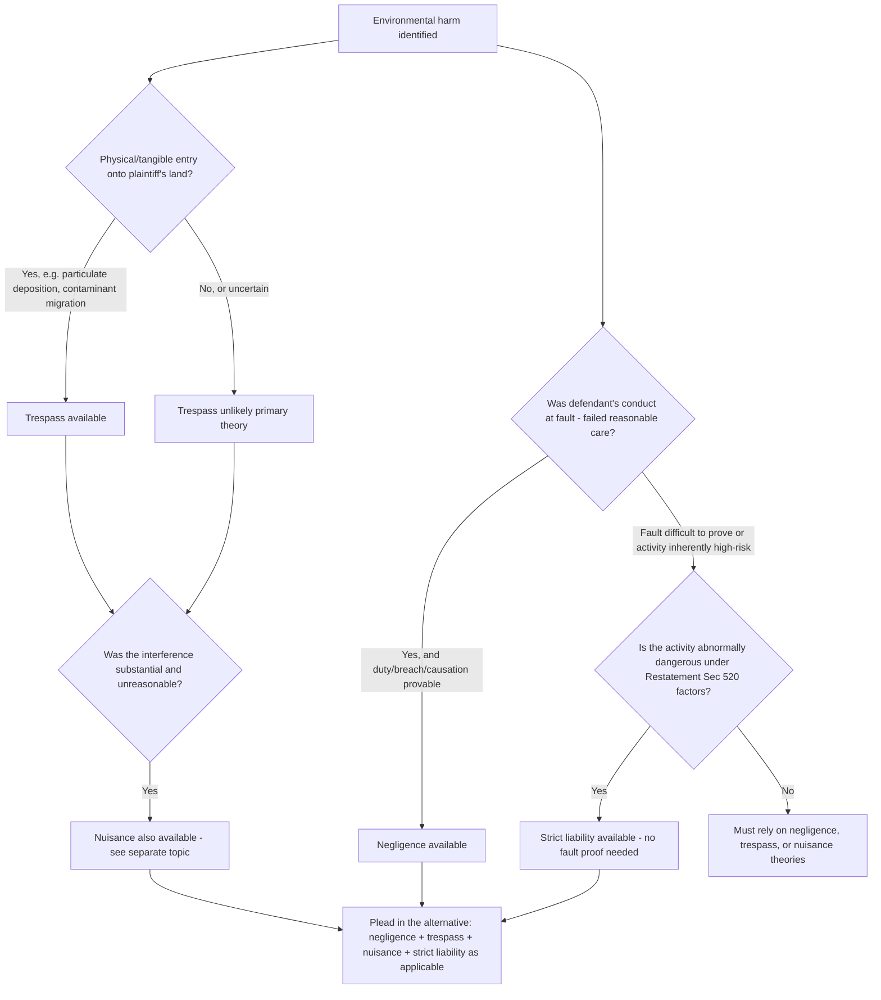

## Trespass, Negligence, and Strict Liability Theories

### Overview and Doctrinal Placement

Alongside nuisance, three additional common-law tort theories form the core toolkit for redressing environmental harm outside (or in conjunction with) statutory frameworks: **trespass**, **negligence**, and **strict liability**. Each imposes a different fault standard and protects a different interest, and environmental plaintiffs frequently plead all three (plus nuisance) in the alternative, since fact patterns involving contamination, spills, or hazardous releases often satisfy more than one theory, while courts in a given jurisdiction may recognize one theory more readily than another for a specific type of harm.

**Comparative summary:**

| Theory | Protected Interest | Fault Standard | Physical Invasion Required? | Typical Environmental Fact Pattern |
| --- | --- | --- | --- | --- |
| Trespass | Exclusive possession of land | Intent to enter (or cause entry) — not intent to harm | Yes, traditionally tangible | Migrating contaminant plume, dust/particulate deposition |
| Negligence | General duty of reasonable care | Failure to exercise reasonable care (breach) | No | Spill from inadequate tank maintenance, failure to follow industry practice |
| Strict liability | Protection regardless of fault, for abnormally dangerous activity | None (liability without fault) | No | Blasting, hazardous waste disposal, pipeline ruptures |

### Trespass

**Elements:**

1. **Possessory interest** — plaintiff must possess (not necessarily own) the land at the time of the intrusion.
2. **Physical invasion** — traditionally required a tangible object or substance to enter the land. Courts have extended this to include invisible or microscopic particulate matter (smoke, dust, chemical particulates, fluorides) where the intrusion is provable by scientific measurement, most influentially in *Martin v. Reynolds Metals Co.*, 342 P.2d 790 (Or. 1959), which held that windborne fluoride compounds settling on plaintiff's land constituted trespass despite their invisibility to the naked eye.
3. **Intent** — the defendant need only intend the act that results in entry (e.g., operating the facility that emits the particulate), not intend the resulting harm or even know that entry onto the specific plaintiff's land would occur; this is a materially lower intent threshold than intentional nuisance, which typically requires the defendant to know or have reason to know the interference is substantially certain to result.
4. **Interference with exclusive possession** — unlike nuisance, trespass does not require substantiality or unreasonableness as separate elements; a trespass to land is actionable even for nominal damages upon proof of an unauthorized physical entry, though in practice environmental trespass claims are litigated for their compensatory value.

**Trespass vs. nuisance distinction (environmental context):** The historical dividing line — tangible invasion (trespass) vs. intangible interference (nuisance) — has blurred substantially in pollution cases, since courts increasingly recognize that particulate deposition, groundwater contamination, and even some forms of noise or vibration can satisfy either theory depending on characterization. Many jurisdictions now allow trespass and nuisance claims to proceed concurrently on the same facts, treating them as alternative, non-exclusive theories rather than mutually exclusive categories. **Practical consequence:** trespass can offer procedural advantages over nuisance in some jurisdictions — for example, some courts apply a **continuing trespass doctrine** analogous to continuing nuisance, restarting the statute of limitations for each day contamination remains on the land, and some jurisdictions have historically permitted trespass claims to succeed with less demanding proof of "unreasonableness" than nuisance requires.

**Defenses to environmental trespass:**

- **Consent** — express or implied permission to enter (e.g., an easement or license), though scope-of-consent disputes are common where a defendant's activity exceeds the bounds of a granted easement.
- **Statute of limitations** — subject to the continuing trespass doctrine discussed above, which can substantially extend the effective limitations window for ongoing contamination.
- **De minimis intrusion** — some jurisdictions decline to recognize trespass liability for genuinely negligible, non-measurable intrusions, though this is in tension with trespass's traditional "any unauthorized entry is actionable" rule and is more commonly addressed through damages limitations than as an outright bar.

### Negligence

**Elements:**

1. **Duty** — a legal obligation to conform to a reasonable standard of care. In environmental contexts, duty is often established by industry custom, statutory/regulatory standards (which can set the standard of care even where the statute provides no private right of action), or general foreseeability principles.
2. **Breach** — failure to meet the applicable standard of care. Courts assess breach against what a reasonable operator in the defendant's position and industry would have done, frequently drawing on regulatory compliance (or non-compliance) as evidence, expert testimony on industry practice, and internal company records/protocols.
3. **Causation** — both:
   - **Cause-in-fact ("but-for" causation)** — the harm would not have occurred but for the defendant's breach; and
   - **Proximate cause** — the harm was a foreseeable consequence of the breach, not the product of a superseding, unforeseeable intervening cause.
4. **Damages** — actual, provable harm (property damage, remediation costs, diminution in value, and in toxic tort contexts, personal injury or increased risk of future illness, subject to jurisdiction-specific rules on recoverability of "fear of future illness" or medical monitoring damages).

**Negligence per se.** Many environmental negligence claims invoke the **negligence per se** doctrine: where a defendant violates a statute or regulation designed to protect a class of persons that includes the plaintiff, from the type of harm that occurred, the violation itself establishes breach (sometimes conclusively, sometimes as a rebuttable presumption, depending on the jurisdiction), without the need for separate expert testimony on the reasonable standard of care. This makes environmental regulatory violations (e.g., exceeding a permitted discharge limit, failing a required inspection) doctrinally powerful even where the underlying statute provides no private cause of action, because the regulation can still supply the standard of care in a common-law negligence claim.

**Special environmental causation challenges:**

- **Multiple/indeterminate defendants** — where contamination could have originated from several potentially responsible parties (e.g., an industrial area with multiple historical dischargers), plaintiffs may face significant difficulty proving which defendant's discharge caused the specific contamination at issue. Some jurisdictions have adapted doctrines such as **market share liability** (originating in pharmaceutical toxic tort law, e.g., DES litigation) or joint-and-several liability theories to address indeterminate-defendant problems, though application to environmental contamination cases (as opposed to product liability) remains more limited and jurisdiction-specific. [Inference — courts have been notably more reluctant to extend market-share-style liability outside the product liability context in which it originated; this remains a contested extension rather than settled doctrine.]
- **Latency and toxic tort causation** — in cases involving long-latency diseases (e.g., cancers linked to chemical exposure), plaintiffs must establish both **general causation** (the substance is capable of causing this type of harm in humans generally, typically through epidemiological and toxicological expert evidence) and **specific causation** (the substance actually caused this particular plaintiff's condition), a two-step framework that has generated substantial case law on the admissibility of expert scientific testimony (governed in federal court by the *Daubert* standard under Federal Rule of Evidence 702, and by analogous state-law standards, e.g., *Frye* in some states).

**Comparative/contributory fault:** Most jurisdictions apply comparative fault principles, reducing (rather than barring) a plaintiff's recovery based on their own percentage of fault, though a minority of jurisdictions retain contributory negligence as a complete bar.

### Strict Liability

**Doctrinal origin.** Strict liability in the environmental context traces to the English case *Rylands v. Fletcher*, L.R. 3 H.L. 330 (1868), which held that a defendant who brings onto their land something likely to cause harm if it escapes, and it does escape, is liable for the resulting damage regardless of fault or negligence — a doctrine developed specifically in response to a reservoir failure that flooded a neighboring mine.

**Modern American formulation — Restatement (Second) of Torts §§ 519–520 ("abnormally dangerous activities"):** Rather than a rigid categorical rule, American courts generally apply a multi-factor balancing test to determine whether an activity is "abnormally dangerous" and therefore subject to strict liability:

1. Existence of a high degree of risk of harm to person, land, or chattels of others;
2. Likelihood that the resulting harm will be great;
3. Inability to eliminate the risk by the exercise of reasonable care;
4. Extent to which the activity is not a matter of common usage;
5. Inappropriateness of the activity to the place where it is carried on; and
6. Extent to which the activity's value to the community is outweighed by its dangerous attributes.

No single factor is dispositive; courts weigh them holistically, and an activity found abnormally dangerous in one locality (e.g., blasting in a residential area) may not be so classified in another (e.g., blasting in a remote industrial or mining district), reflecting factor 5's locality sensitivity.

**Commonly recognized abnormally dangerous activities in environmental litigation:**

- Blasting and use of explosives
- Storage and transport of highly toxic chemicals in bulk
- Disposal of hazardous or toxic waste (particularly in a manner presenting an unusual risk of migration, such as unlined lagoons or improperly sited landfills)
- Operation of oil and gas wells in certain contexts (jurisdiction-dependent; some courts have declined to treat conventional oil and gas drilling as abnormally dangerous given its "common usage" in oil-producing regions, while hydraulic fracturing has been litigated as a potential candidate for strict liability treatment in some jurisdictions, with mixed results) [Unverified — treatment varies significantly by state and remains an active area of litigation rather than settled doctrine.]
- Pipeline transport of hazardous substances, in some jurisdictions

**What strict liability does NOT require:** Unlike negligence, a plaintiff need not prove the defendant failed to exercise reasonable care — even a defendant who took every conceivable precaution remains liable if harm results from an abnormally dangerous activity, because the doctrine rests on the policy judgment that those who engage in unusually risky activities for their own benefit should bear the costs of resulting harm as a cost of doing business, rather than shifting that risk to an innocent neighboring landowner.

**Limitations on strict liability:**

- **Scope of the risk** — liability is generally limited to the type of harm that made the activity abnormally dangerous in the first place (e.g., a strict liability blasting claim covers vibration/concussion damage, not an unrelated harm coincidentally occurring near the blasting site).
- **Assumption of risk** — a plaintiff who knowingly and voluntarily encounters the specific risk that makes the activity abnormally dangerous may have recovery barred or reduced in some jurisdictions.
- **Statutory abrogation or codification** — some environmental statutes displace or codify strict liability standards for specific contexts (e.g., CERCLA's strict liability scheme for hazardous substance releases, discussed below, effectively supersedes the need to prove common-law abnormally-dangerous-activity strict liability for federal Superfund cost-recovery purposes, though state common-law strict liability claims may still be pursued in parallel for damages not covered by CERCLA).

### Statutory Overlay: CERCLA Strict Liability as a Comparison Point

Although CERCLA (the Comprehensive Environmental Response, Compensation, and Liability Act, 1980) is a federal statute rather than common law, its liability structure is instructive because it **codifies a strict, joint-and-several liability scheme** for hazardous substance releases, deliberately built to avoid the causation and fault-proof difficulties that plague common-law negligence and even common-law strict liability claims:

- Liability under CERCLA § 107 attaches to potentially responsible parties (PRPs) — current owners/operators, owners/operators at the time of disposal, generators who arranged for disposal, and transporters who selected the disposal site — **without regard to fault or intent**, and generally without a need to prove which specific defendant's waste caused which specific contamination, given the joint-and-several liability default (subject to the *Burlington Northern* divisibility exception permitting apportionment where harm is reasonably capable of being divided among defendants).
- This statutory scheme illustrates how legislators, aware of the practical proof difficulties inherent in common-law negligence and even common-law strict liability (indeterminate defendants, latency, causation complexity), engineered around those difficulties through broader statutory liability rules — a useful comparison for understanding *why* common-law tort theories, despite their doctrinal richness, are often supplemented rather than replaced by targeted statutory liability regimes in the hazardous waste context specifically.

### Illustrative Diagram: Selecting a Tort Theory for Environmental Harm

### Practical Litigation Considerations

1. **Alternative pleading strategy** — because trespass, negligence, strict liability, and nuisance protect overlapping but distinct interests and carry different proof burdens, environmental plaintiffs' counsel routinely plead all potentially applicable theories in the alternative in a single complaint, preserving the strongest theory for trial while avoiding premature narrowing of the case.
2. **Discovery focus differs by theory** — negligence claims drive discovery toward the defendant's internal safety practices, maintenance records, and regulatory compliance history (to establish breach); strict liability claims shift discovery focus toward characterizing the activity itself (frequency, locality, industry commonality) rather than the defendant's specific conduct; trespass claims focus discovery on establishing the physical fact and extent of the intrusion (soil/groundwater sampling, air dispersion modeling).
3. **Insurance and risk allocation implications** — strict liability exposure (given its fault-independent nature) significantly shapes environmental liability insurance markets and contractual risk allocation (indemnification clauses, environmental liability transfer agreements) in industries engaged in recognized abnormally dangerous activities.
4. **Interaction with regulatory permits** — as with nuisance, regulatory permit compliance is generally not a complete defense to negligence (though it is strong evidence of reasonable care) and is entirely irrelevant to strict liability (since strict liability does not turn on the reasonableness of conduct at all).

### Key Cases Referenced

- *Rylands v. Fletcher*, L.R. 3 H.L. 330 (1868) — foundational strict liability doctrine for escaping dangerous substances
- *Martin v. Reynolds Metals Co.*, 342 P.2d 790 (Or. 1959) — trespass extended to invisible particulate deposition (fluoride compounds)
- Restatement (Second) of Torts §§ 519–520 — modern American "abnormally dangerous activities" strict liability framework
- *Burlington Northern & Santa Fe Railway Co. v. United States*, 556 U.S. 599 (2009) — divisibility/apportionment exception to CERCLA joint-and-several liability

**Related Topics**

- Public and private nuisance actions for environmental harm (closely related tort framework)
- CERCLA liability structure and potentially responsible party (PRP) categories
- Toxic tort causation standards: general vs. specific causation, *Daubert* admissibility
- Medical monitoring damages and fear-of-future-illness claims
- Market share liability and indeterminate-defendant doctrines
- Environmental insurance and risk allocation in contaminated-site transactions
- Statutes of limitation and the discovery rule in latent environmental harm cases
- Comparative negligence and joint-and-several liability apportionment
- State constitutional environmental rights (Green Amendments) as an alternative theory
- Regulatory compliance as evidence (not defense) in common-law environmental tort claims