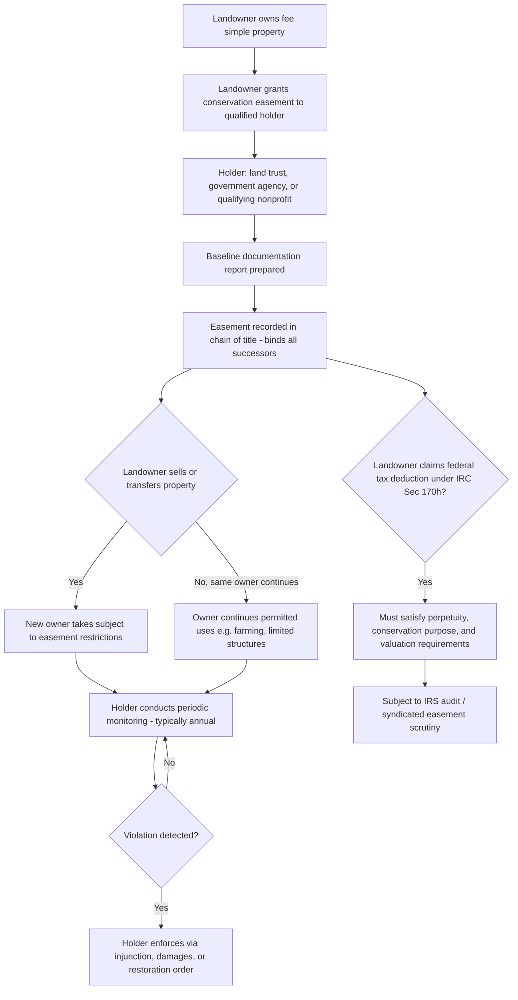

## Property Law Tools: Easements, Servitudes, and Conservation Restrictions

### Overview and Doctrinal Placement

Beyond tort remedies (nuisance, trespass, negligence, strict liability) that address harm *after* it occurs, property law offers a distinct set of tools for **preventing** environmental harm or **preserving** environmental values proactively, by creating durable, transferable interests in land that run with title regardless of who owns the property in the future. These tools — easements, real covenants, equitable servitudes, and conservation restrictions/easements — form the private-law infrastructure underlying most modern land conservation, mitigation banking, and long-term environmental protection strategies that operate independently of (though often in coordination with) zoning and statutory regulation.

Unlike nuisance or trespass, which are backward-looking remedies for a completed harm, these tools are fundamentally **forward-looking and voluntary** (with important exceptions, such as government-imposed conservation easements as mitigation conditions) — they are created by agreement (grant, deed, or dedication) and are designed to bind not just the original parties but their successors in title in perpetuity or for a defined term.

### Servitudes: The Umbrella Category

"Servitude" is the modern, unifying doctrinal term (adopted by the *Restatement (Third) of Property: Servitudes*, 2000) that consolidates what were historically treated as separate common-law categories — easements, real covenants, and equitable servitudes — into a single conceptual framework governed by largely unified rules for creation, transfer, and termination. Understanding the historical categories remains important because many jurisdictions have not fully adopted the Restatement (Third) framework and continue to apply the older, more technical distinctions.

**Core servitude taxonomy:**

| Type | Historical Category | Enforceable By | Runs With Land? | Typical Environmental Use |
| --- | --- | --- | --- | --- |
| Easement | Property interest (non-possessory) | Injunction, damages | Yes, if appurtenant and properly created | Access, utility, conservation easements |
| Real covenant | Contract enforced at law | Damages (historically) | Yes, if "touch and concern" + privity satisfied | Restrictive land-use covenants in subdivisions |
| Equitable servitude | Contract enforced in equity | Injunction | Yes, with notice, regardless of privity | Restrictive covenants where legal privity is lacking |
| Conservation easement/restriction | Statutory hybrid (modern) | Injunction, damages, statutory enforcement | Yes, by statute, often in perpetuity | Land trust and government conservation deals |

### Easements

**Definition.** A non-possessory interest in land that grants the holder a right to use another's land (the "servient estate") for a specific purpose, without transferring possession or title.

**Types relevant to environmental protection:**

- **Affirmative easements** — grant the holder the right to *do* something on the servient land (e.g., a right of access for habitat monitoring, or a right to maintain a stream buffer).
- **Negative easements** — restrict the servient owner from doing something they would otherwise be entitled to do (e.g., a right to prevent the servient owner from developing, clearing, or altering the land in specified ways). Conservation easements are, structurally, a specialized and statutorily expanded form of negative easement — historically, common law recognized only a narrow, closed list of negative easements (light, air, support, and flow of an artificial stream), and conservation easements needed enabling legislation precisely because they did not fit within this traditional closed category.
- **Appurtenant vs. in gross:**
  - **Appurtenant easements** benefit a specific parcel of land (the "dominant estate") and automatically transfer with that parcel regardless of who owns it.
  - **Easements in gross** benefit a specific person or entity rather than a parcel of land. Conservation easements are typically easements in gross held by a land trust, conservation organization, or government agency, which required specific enabling legislation (discussed below) because easements in gross were historically disfavored and difficult to make transferable and durable at common law.

**Creation.** Easements may be created by:

1. **Express grant or reservation** — the most common method for conservation easements, via a written deed satisfying the Statute of Frauds.
2. **Implication** — arising from prior use, necessity, or the subdivision of previously unified land (rarely relevant to conservation easements specifically, but foundational to general easement doctrine).
3. **Prescription** — analogous to adverse possession, through open, notorious, continuous, and adverse use for the statutory period (not applicable to negative/conservation easements, which cannot be acquired by prescription since there is no adverse "use" to observe when the right is to prevent development).
4. **Estoppel** — where a landowner's conduct induces reasonable reliance by another party in using the land in a particular way.

**Termination.** Easements may terminate by: release, merger (dominant and servient estates coming under common ownership), abandonment, the expiration of a stated term, prescription (adverse use inconsistent with the easement), or condemnation. Conservation easements, however, are typically structured (and statutorily protected, see below) to resist ordinary termination doctrines, particularly abandonment and merger, precisely to preserve the "perpetuity" that public conservation policy and tax-incentive rules require.

### Real Covenants and Equitable Servitudes

**Real covenants** are promises respecting the use of land that, at common law, could be enforced by successors-in-title through an action for **damages**, provided several technical requirements were met:

1. **Intent** that the covenant run with the land (bind successors);
2. **"Touch and concern"** the land — the covenant must relate to the use, value, or enjoyment of the land itself, not be a purely personal obligation;
3. **Horizontal privity** between the original covenanting parties (a simultaneous interest relationship, such as grantor-grantee, at the time the covenant was created) — historically required for the burden to run, though modern law and the Restatement (Third) approach have relaxed or eliminated this requirement in many jurisdictions; and
4. **Vertical privity** between each original party and their successor (generally satisfied by any transfer of the full estate).

**Equitable servitudes** developed as a more flexible alternative, enforceable by **injunction** in courts of equity, requiring only:

1. Intent that the restriction bind successors;
2. Touch and concern; and
3. **Notice** to the burdened successor (actual, record, or inquiry notice) — rather than the more technical privity requirements of real covenants at law.

**Environmental relevance:** These older doctrinal categories underlie many restrictive covenants used in conservation subdivisions, planned unit developments with open-space set-asides, and pre-statutory conservation arrangements. However, their technical requirements (especially privity and the "touch and concern" test's uncertain application to purely environmental/aesthetic restrictions with no obvious economic benefit to a dominant estate) created significant uncertainty for early conservation practitioners, which is the direct historical reason **conservation easement enabling statutes** were adopted nationwide beginning in the 1980s.

### Conservation Easements and Restrictions: The Modern Statutory Hybrid

**Why statutory enabling legislation was necessary.** Conservation easements do not fit comfortably within traditional common-law categories for several reasons: (1) they are frequently held **in gross** by a nonprofit or government entity with no adjoining "dominant estate," which common law disfavored for negative easements; (2) they are intended to bind successors **in perpetuity**, in tension with common-law hostility to unreasonable restraints on alienation and the rule against unlimited-duration burdens on land; and (3) their benefit is often diffuse, public, or aesthetic/ecological rather than tied to the economic use of an adjoining parcel, straining the "touch and concern" requirement.

**The Uniform Conservation Easement Act (UCEA, 1981).** Promulgated by the Uniform Law Commission, the UCEA (or state-specific analogs) has been adopted in some form by most U.S. states. It resolves the common-law obstacles by statute, generally providing that a conservation easement:

- Is valid even though it is **in gross** (no benefited parcel required);
- Is valid even though it is **negative** and does not fit historical negative-easement categories;
- Is valid even though it lacks **privity** between the parties;
- Is valid even though its benefit is **not appurtenant to particular land** and may be held by a qualifying government body or charitable/conservation organization; and
- Is enforceable in perpetuity (subject to state-specific limits on perpetual restrictions and, in some states, "changed circumstances" or cy pres-style modification/termination doctrines).

**Definition (typical statutory formulation).** A conservation easement is a nonpossessory interest of a holder (a governmental body or qualified charitable/nonprofit conservation organization) in real property imposing limitations or affirmative obligations, the purposes of which include retaining or protecting natural, scenic, or open-space values; assuring availability of land for agricultural, forest, recreational, or open-space use; protecting natural resources; maintaining or enhancing air or water quality; or preserving historical, architectural, archaeological, or cultural aspects of real property.

**Federal tax law overlay — Internal Revenue Code § 170(h).** Conservation easements are the vehicle for one of the most significant federal tax incentives in environmental/land-use law: a landowner who donates a "qualified conservation contribution" (a perpetual conservation restriction granted to a qualified organization exclusively for conservation purposes) may claim a federal income tax charitable deduction for the value of the easement (generally, the difference between the property's fair market value before and after the restriction). This has made conservation easements the dominant tool of private land trusts nationwide (e.g., entities accredited through the Land Trust Alliance's Land Trust Accreditation Commission) and has also generated substantial IRS scrutiny and litigation over **easement valuation** (particularly in "syndicated conservation easement" transactions that the IRS and Congress have identified as abusive tax shelters in many cases), the required "conservation purpose" test, the perpetuity requirement, and technical deed-drafting compliance (e.g., proper handling of mortgage subordination, extinguishment/proceeds clauses, and baseline documentation reports).

**Key statutory/regulatory conservation-purpose categories under § 170(h):**

1. Preservation of land for outdoor recreation or education by/for the general public;
2. Protection of a relatively natural habitat of fish, wildlife, plants, or similar ecosystem;
3. Preservation of open space (including farmland/forest land) pursuant to a clearly delineated federal, state, or local governmental conservation policy, or for scenic enjoyment, yielding a significant public benefit; and
4. Preservation of a historically important land area or certified historic structure.

### Comparison: Conservation Easement vs. Fee Simple Acquisition

| Factor | Conservation Easement | Fee Simple Acquisition (outright purchase) |
| --- | --- | --- |
| Cost | Lower (buys only development rights, not full title) | Higher (full property value) |
| Ownership/management burden | Remains with private landowner | Shifts to acquiring entity (land trust, agency) |
| Public access | Typically none required unless negotiated | Depends on acquiring entity's policy |
| Tax revenue to local government | Property remains on tax rolls (often at reduced assessed value) | Removed from tax rolls if acquired by government/nonprofit |
| Flexibility | Tailored restriction; landowner retains permitted uses (e.g., continued farming) | Acquiring entity has full control |
| Monitoring burden | Ongoing (holder must monitor compliance, typically annually) in perpetuity | Direct control reduces (but doesn't eliminate) monitoring need |

### Mitigation Banking and Regulatory Uses of Conservation Restrictions

Conservation easements are also the core legal instrument underlying **wetland and species mitigation banking** and **in-lieu fee programs** used to satisfy regulatory permitting requirements under statutes such as the Clean Water Act § 404 (wetlands) and the Endangered Species Act § 7/10 (habitat conservation plans and safe harbor agreements):

- A mitigation bank sponsor establishes, restores, or enhances habitat and permanently protects it via a recorded conservation easement (typically held by a government agency or approved third party), generating mitigation "credits" that can be sold to permittees who must offset unavoidable environmental impacts elsewhere as a condition of a federal or state permit.
- The **permanence** of the conservation easement is legally central to the regulatory acceptability of this offset: agencies (the Army Corps of Engineers, U.S. Fish & Wildlife Service, and state counterparts) generally require the protected land be encumbered in perpetuity precisely because the regulatory logic of mitigation banking depends on a durable, enforceable trade-off for the permitted impact.

### Enforcement, Amendment, and Termination Challenges

**Enforcement.** Conservation easement holders (land trusts, agencies) bear an affirmative, ongoing duty to monitor compliance (commonly through annual site visits documented against a "baseline documentation report" prepared at the time of easement creation) and to enforce violations, which may include unauthorized construction, unpermitted timber harvesting, or subdivision inconsistent with the easement's terms. Enforcement failures by underfunded or under-resourced land trusts are a recognized practical weakness of the conservation easement model. [Inference — this is a widely discussed structural concern in land trust practice and scholarship, not a claim about any specific organization's performance.]

**Amendment.** Because conservation easements are meant to be perpetual, amendment raises tension between adaptive management flexibility and the perpetuity/public-benefit rationale underlying the original tax deduction or regulatory approval. Land Trust Alliance guidance and IRS scrutiny generally require that amendments not diminish the conservation values protected, not confer private benefit inconsistent with the organization's charitable purpose, and be consistent with the easement's original conservation purpose.

**Termination and the "changed circumstances" doctrine.** Some jurisdictions permit judicial termination or modification of a conservation easement under doctrines analogous to the equitable **changed circumstances** doctrine used for other servitudes (where enforcement of the original purpose has become impossible or the surrounding conditions have changed so substantially that the restriction no longer serves its intended conservation purpose), sometimes coupled with a **cy pres**-style requirement that any proceeds from extinguishment (e.g., condemnation proceeds, or proceeds from a negotiated release) be dedicated to conservation purposes consistent with the original easement, in proportion to the easement's share of the property's value at the time of termination — a requirement directly imported from federal tax regulations under § 170(h).

### Illustrative Diagram: Conservation Easement Creation and Life Cycle

### Practical Drafting and Transactional Considerations

1. **Baseline documentation report** — an essential evidentiary record (photographs, maps, ecological surveys) memorializing the property's condition at the time of easement creation, critical for both future enforcement (establishing what has changed) and IRS substantiation of the claimed conservation values.
2. **Reserved rights** — careful drafting of which uses the landowner retains (continued agriculture, limited additional structures, personal recreational use) is essential to balance landowner flexibility against the conservation purposes required for tax and regulatory validity; overly permissive reserved rights can jeopardize both the charitable deduction and the mitigation-credit value of the easement.
3. **Mortgage subordination** — lenders holding a prior mortgage on the property generally must subordinate their interest to the conservation easement, since a foreclosure by a non-subordinated lender could extinguish the easement — a critical, frequently litigated technical requirement for tax-deductible easements.
4. **Extinguishment and proceeds clauses** — deeds must specify how proceeds are allocated if the easement is later extinguished (e.g., through condemnation), typically requiring the holder to receive a share proportional to the easement's value at the time of extinguishment, dedicated to similar conservation purposes.
5. **Perpetuity and enforceability review** — practitioners must confirm the state's enabling statute (UCEA-based or otherwise) supports true perpetual enforceability without triggering the Rule Against Perpetuities or unreasonable-restraint-on-alienation doctrines that could otherwise invalidate a purportedly perpetual restriction.

### Key Authorities Referenced

- Uniform Conservation Easement Act (1981), Uniform Law Commission
- Restatement (Third) of Property: Servitudes (2000)
- Internal Revenue Code § 170(h) — qualified conservation contributions
- Treasury Regulation § 1.170A-14 — detailed conservation-purpose and perpetuity requirements
- Clean Water Act § 404 — wetland mitigation banking regulatory context
- Endangered Species Act §§ 7, 10 — habitat conservation plans and conservation banking

**Related Topics**

- Wetland mitigation banking and Clean Water Act § 404 permitting
- Habitat conservation plans and Endangered Species Act § 10 safe harbor agreements
- Federal tax incentives for land conservation and syndicated conservation easement abuse litigation
- Zoning and land-use regulation as a complementary (public-law) conservation tool
- Public trust doctrine and its relationship to private conservation instruments
- Land trust governance, accreditation, and enforcement capacity
- Rule Against Perpetuities and restraints on alienation in modern property law
- Eminent domain and just compensation when conservation easements are condemned
- Agricultural and forest land preservation programs (differential/use-value taxation)
- State constitutional environmental rights (Green Amendments) as a complementary public-law framework