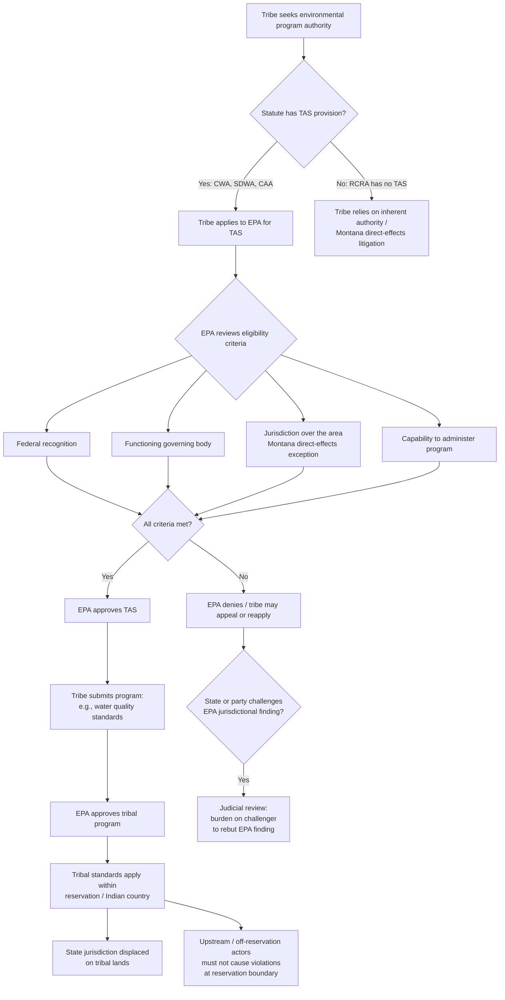

## Tribal Environmental Regulatory Authority and Treatment as a State Provisions

### Overview

Tribal environmental regulatory authority refers to the inherent and delegated power of federally recognized Indian tribes to regulate environmental quality within their territorial jurisdiction. "Treatment as a State" (TAS), also called "Treatment in the Same Manner as a State" (TAS/TIME), is the statutory mechanism by which Congress authorized the U.S. Environmental Protection Agency (EPA) to treat qualifying tribes functionally as states for purposes of implementing federal environmental programs — including primacy over permitting, standard-setting, and enforcement on tribal lands.

This topic sits at the intersection of three legal fields: federal Indian law (tribal sovereignty doctrine), constitutional law (the scope of Congress's plenary power over Indian affairs), and environmental law (the cooperative federalism structures built into the Clean Air Act, Clean Water Act, and Safe Drinking Water Act).

### Doctrinal Foundations: Tribal Sovereignty and Its Limits

#### Inherent Sovereignty

Indian tribes are not creatures of state or federal constitutions. They possess **inherent sovereignty** that predates the United States and is only diminished by (a) express congressional action, (b) treaty cession, or (c) implicit divestiture by virtue of their dependent status. This is the foundational premise of *Worcester v. Georgia*, 31 U.S. 515 (1832), which described tribes as "distinct, independent political communities."

#### The Montana Framework

The modern baseline for tribal regulatory jurisdiction over **non-members** (including non-Indian fee landowners) within reservation boundaries comes from *Montana v. United States*, 450 U.S. 544 (1981). Montana held that tribes generally lack civil regulatory authority over non-members on non-Indian fee land, subject to two exceptions:

1. **Consensual relationships exception** — a tribe may regulate the activities of non-members who enter consensual relationships with the tribe or its members, through commercial dealing, contracts, leases, or other arrangements.
2. **Direct effects exception** — a tribe may regulate non-member conduct on fee land within the reservation when that conduct threatens or has a direct effect on the political integrity, economic security, or health and welfare of the tribe.

Environmental regulation is one of the primary contexts where the second *Montana* exception has been litigated, since pollution and resource degradation are paradigmatic examples of conduct with reservation-wide "direct effects." Courts and EPA rulemakings have repeatedly relied on the direct-effects exception to justify tribal environmental jurisdiction over fee lands within reservations.

#### Checkerboard Jurisdiction

A recurring practical complication is "checkerboarding" — reservations where land status alternates between tribal trust land, individual allotments, and non-Indian fee land as a result of the General Allotment Act (Dawes Act) era. This patchwork undermines administrable, geographically uniform environmental regulation and is a major reason Congress and EPA developed statutory workarounds (TAS) rather than relying solely on case-by-case *Montana* litigation.

### The "Treatment as a State" Statutory Mechanism

#### Origins and Rationale

Rather than forcing each tribe to litigate *Montana* jurisdiction on a case-by-case, pollutant-by-pollutant basis, Congress amended the major federal environmental statutes beginning in the late 1980s to let EPA affirmatively delegate program authority to tribes — the same delegation mechanism used for states — while treating tribal territorial jurisdiction as a predicate finding rather than something each tribe must independently prove in court.

#### Statutory TAS Provisions

**Clean Water Act (CWA) § 518, 33 U.S.C. § 1377** (added 1987): Authorizes EPA to treat tribes as states for purposes including water quality standards (§ 303), certification (§ 401), NPDES permitting (§ 402), and nonpoint source management (§ 319).

**Safe Drinking Water Act (SDWA) § 1451, 42 U.S.C. § 300j-11** (added 1986): Authorizes TAS for Underground Injection Control (UIC) programs and public water system supervision.

**Clean Air Act (CAA) § 301(d), 42 U.S.C. § 7601(d)** (added 1990): Authorizes TAS for purposes of administering CAA programs, including setting ambient air quality standards and permitting under Title V.

**Comprehensive Environmental Response, Compensation, and Liability Act (CERCLA) § 126**, 42 U.S.C. § 9626: Provides more limited TAS treatment, mainly for consultation and notification rights rather than full program primacy.

**Resource Conservation and Recovery Act (RCRA)**: Notably, RCRA **does not** contain a TAS provision. EPA has instead relied on inherent tribal authority and cooperative agreements, and courts have generally upheld tribal RCRA-type regulation under the *Montana* direct-effects exception rather than a delegated-authority theory. [Inference] This statutory gap is frequently tested because it illustrates that TAS is not uniform across environmental statutes.

#### Statutory Eligibility Criteria (Common Elements)

Across the CWA, SDWA, and CAA, EPA regulations generally require a tribe applying for TAS to demonstrate:

1. **Federal recognition** — the tribe is recognized by the Secretary of the Interior as eligible for the special programs and services provided by the United States to Indians because of their status as Indians (per the Federally Recognized Indian Tribe List Act of 1994 and the BIA's published list).
2. **Governing body carrying out substantial governmental duties and powers** — the tribe has a functioning government exercising substantial governmental functions (courts, taxation, land-use regulation, law enforcement, etc.).
3. **Jurisdiction** — the tribe has jurisdiction over the area for which it seeks to be treated as a state, typically satisfied for reservation trust lands and often extended to reservation fee lands under the *Montana* direct-effects rationale.
4. **Capability** — the tribe is reasonably expected to be capable of administering the specific environmental program consistent with the statute's terms and applicable EPA regulations.

#### EPA's 1994 "Indian Tribes: Air Quality Planning and Management Rule" and TAS Streamlining

EPA promulgated the "Tribal Authority Rule" (TAR) under the CAA in 1998, codified at 40 C.F.R. Part 49, which streamlined the TAS application process and clarified that EPA — not the tribe — bears the burden of demonstrating that a tribe lacks jurisdiction, reversing the default presumption in the tribe's favor for reservation lands. [Inference — regulatory posture; verify current codification and any post-1998 amendments, since EPA periodically revises Part 49].

#### Simplification for Water Quality Standards

In 2016, EPA finalized a rule allowing tribes to seek TAS **and** submit water quality standards simultaneously, and clarified that tribes need not separately demonstrate jurisdiction over non-member fee lands within reservation boundaries for CWA purposes, treating the entire reservation as tribal jurisdiction for water quality regulation absent a specific finding otherwise. This reflects EPA's policy judgment, later contested in litigation (see below), that reservation-wide jurisdiction is appropriate for water quality given the interconnected nature of water resources.

### Key Case Law

#### *Washington Department of Ecology v. EPA*, 752 F.3d 1152 (9th Cir. 2014)

Upheld EPA's approval of the Suquamish Tribe's water quality standards for the entire Port Madison Reservation, including non-Indian fee lands, rejecting the state's challenge that the tribe lacked jurisdiction over fee lands. The Ninth Circuit deferred to EPA's reasoned application of the *Montana* direct-effects exception to water pollution, reasoning that water pollution — unlike some other regulated conduct — is inherently likely to have "serious and substantial" effects on the tribe given the interconnectedness of a single water body.

#### *City of Albuquerque v. Browner*, 97 F.3d 415 (10th Cir. 1996)

Upheld EPA's approval of the Isleta Pueblo's TAS application and water quality standards under the CWA, even though the Pueblo's stricter standards imposed compliance costs on the City of Albuquerque's upstream wastewater discharges. The court held that TAS tribes may set water quality standards more stringent than federal or state standards, and that upstream dischargers must comply even absent independent tribal jurisdiction over the upstream source, because the tribe is regulating water quality *at the point it enters tribal land*, not extraterritorially regulating the discharger's conduct.

#### *Montana v. EPA*, 137 F.3d 1135 (9th Cir. 1998)

Upheld EPA's TAS approval for the Confederated Salish and Kootenai Tribes under the CWA, applying the *Montana v. United States* direct-effects framework and finding that EPA reasonably determined the tribe had regulatory jurisdiction over the entire reservation, including fee lands, for water quality purposes.

#### *Arizona Public Service Co. v. EPA*, 211 F.3d 1280 (D.C. Cir. 2000)

Upheld EPA's Tribal Authority Rule (TAR) under the CAA against a challenge by industry and states arguing the rule improperly presumed tribal jurisdiction over non-member fee lands. The D.C. Circuit held EPA's approach — treating tribal jurisdiction over reservations as the general rule subject to rebuttal — was a permissible interpretation given tribes' inherent authority to regulate activities threatening tribal health and welfare.

#### *Oklahoma Department of Environmental Quality v. EPA*, 740 F.3d 185 (D.C. Cir. 2014)

Addressed the aftermath of *Carcieri v. Salazar*, 555 U.S. 379 (2009) (which held the Secretary of the Interior's authority to take land into trust under the Indian Reorganization Act applies only to tribes "under federal jurisdiction" in 1934) and *McGirt v. Oklahoma*, 591 U.S. 894 (2020) (holding that the Muscogee (Creek) Nation's reservation was never disestablished for purposes of the Major Crimes Act) — both of which have downstream implications for which lands qualify as "Indian country" subject to tribal TAS jurisdiction, particularly in Oklahoma. [Inference — *McGirt*'s specific reach into environmental regulatory jurisdiction, as opposed to criminal jurisdiction, remains an actively litigated and evolving area; treat post-2020 developments as requiring current verification.]

### Interaction with State Authority

#### Displacement of State Jurisdiction on Trust Land

Once EPA approves a tribe for TAS and the tribe's program (e.g., water quality standards) is approved, that tribal program — not the state's — generally governs environmental quality on the relevant tribal lands, even though the tribe is physically located within a state's exterior boundaries. This displaces the ordinary assumption that states have plenary regulatory authority within their borders.

#### Boundary and Downstream Effects Disputes

Because water and air do not respect jurisdictional boundaries, TAS-driven regulation frequently produces disputes over:

- **Upstream/downstream conflicts** — a tribe's stringent water quality standard can effectively regulate upstream non-tribal dischargers (as in *Albuquerque v. Browner*).
- **Airshed conflicts** — CAA TAS designations can affect state implementation plan (SIP) obligations for areas surrounding reservations, particularly regarding attainment/nonattainment classifications.
- **Checkerboard enforcement** — overlapping or contested jurisdiction on fee lands within reservation boundaries, especially post-*McGirt* in states with disputed reservation boundaries.

#### No General Federal Preemption of State Law Off-Reservation

TAS authority is jurisdictionally bounded to "areas within the reservation" (or otherwise within "Indian country" as defined at 18 U.S.C. § 1151). It does not extend tribal regulatory authority to off-reservation, non-Indian-owned land, even if environmentally connected to the reservation, absent a specific and separate jurisdictional basis.

### Comparative Note: This Is a U.S.-Specific Doctrinal Structure

**[Unverified relative to any jurisdiction other than the United States]** TAS and *Montana*-based tribal environmental jurisdiction are specific to U.S. federal Indian law and the cooperative-federalism design of U.S. environmental statutes. Analogous concepts in other legal systems (e.g., Indigenous or ancestral domain environmental governance under the Philippines' Indigenous Peoples' Rights Act, IPRA, R.A. 8371) are **not** governed by the same statutory or case-law framework described here and should not be conflated with TAS absent a separate, dedicated treatment.

### Illustrative Example

A hypothetical tribe, the "Redfeather Nation," occupies a reservation with checkerboarded land status: 60% tribal trust land, 25% individual Indian allotments, and 15% non-Indian fee land, through which a river runs before exiting the reservation and flowing through an adjacent state.

1. Redfeather Nation applies for TAS under CWA § 518, demonstrating federal recognition, a functioning tribal environmental agency, and jurisdiction over the reservation (relying on the *Montana* direct-effects exception given the river's reservation-wide ecological significance).
2. EPA approves TAS and subsequently approves Redfeather's water quality standards, which are stricter than the adjoining state's standards for dissolved oxygen and temperature.
3. A non-Indian rancher owning fee land within the reservation boundary discharges agricultural runoff into the river. Even though the rancher is a non-member on fee land, Redfeather's water quality standard applies to the water at that point under the *Montana* direct-effects rationale as applied in the water quality context.
4. An industrial facility located upstream, outside the reservation entirely, in the adjoining state, must ensure its NPDES-permitted discharge does not cause the river to violate Redfeather's water quality standards once it crosses into the reservation, per the reasoning in *City of Albuquerque v. Browner* — even though Redfeather has no jurisdiction over the facility itself.
5. If the state disputes Redfeather's jurisdiction over the fee-land portions, it may challenge EPA's TAS approval in federal court, but bears the burden of rebutting EPA's jurisdictional determination under the TAR/Ninth Circuit framework.

### Diagram: TAS Approval and Jurisdictional Logic (svg_diagram)

### Key Points

- Tribal environmental authority rests on **inherent sovereignty**, constrained for non-members on fee land by the *Montana* framework and its two exceptions (consensual relationships; direct effects).
- **TAS is a statutory delegation mechanism**, not identical to inherent authority — it exists under CWA, SDWA, and CAA, but notably **not** under RCRA.
- EPA eligibility criteria are consistent across statutes: federal recognition, functioning government, jurisdiction, and capability.
- Courts have generally deferred to EPA's application of the *Montana* direct-effects exception in the environmental context, particularly for water quality (*Albuquerque v. Browner*, *Washington Dept. of Ecology v. EPA*).
- TAS-approved tribal standards can bind non-tribal upstream or non-member actors through pollution's physical effects, without those actors being independently subject to tribal regulatory jurisdiction.
- Post-*McGirt* boundary questions add ongoing uncertainty to which lands qualify as Indian country for TAS purposes in some states. [Inference — evolving area; verify current status before relying on this for jurisdiction-specific analysis.]

### Related Topics

- *Montana v. United States* and the two exceptions to tribal civil jurisdiction over non-members
- EPA's Tribal Authority Rule (40 C.F.R. Part 49) and CAA Title V tribal implementation plans
- CERCLA § 126 tribal consultation rights versus full TAS primacy
- *McGirt v. Oklahoma* and its downstream effects on environmental jurisdiction in Oklahoma
- Federal trust responsibility doctrine as applied to environmental resource management
- Nonpoint source pollution management on tribal lands under CWA § 319
- Comparative Indigenous environmental governance frameworks outside the U.S. (e.g., Philippines' IPRA/NCIP ancestral domain framework) as a distinct, non-analogous doctrinal system