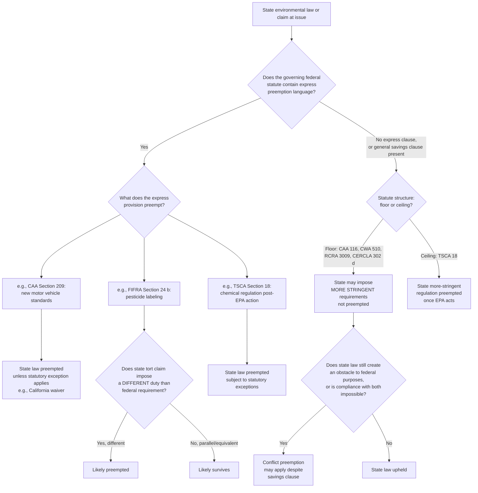

## Preemption Doctrines Across Environmental Statutes

### Overview

Preemption doctrine governs when federal environmental law displaces, limits, or forecloses state and local regulatory authority. Because most major U.S. environmental statutes are built on a cooperative-federalism model — federal floors with delegated state implementation — preemption analysis in this field is unusually statute-specific: the same constitutional preemption categories (express, field, and conflict preemption) apply, but each statute's savings clauses, floor/ceiling structure, and delegation provisions produce different practical outcomes.

### Constitutional Foundations

#### Supremacy Clause

Preemption derives from the Supremacy Clause, U.S. Const. art. VI, cl. 2, which makes federal law "the supreme Law of the Land" and voids conflicting state law. Congressional intent to preempt is the touchstone of the analysis.

#### Categories of Preemption

1. **Express preemption** — Congress states in statutory text that state law is displaced (e.g., specific provisions in the Clean Air Act mobile source program).
2. **Field preemption** — federal regulation is so pervasive, or the federal interest so dominant, that it is inferred Congress left no room for state regulation in that field.
3. **Conflict preemption**, with two sub-forms:
   - **Impossibility preemption** — compliance with both federal and state law is physically impossible.
   - **Obstacle preemption** — state law stands as an obstacle to the accomplishment of Congress's full purposes and objectives (from *Hines v. Davidowitz*, 312 U.S. 52 (1941)).

#### The Presumption Against Preemption

Courts generally apply a presumption against preemption in fields of traditional state regulation, articulated in *Rice v. Santa Fe Elevator Corp.*, 331 U.S. 218 (1947): "the historic police powers of the States were not to be superseded by the Federal Act unless that was the clear and manifest purpose of Congress." Environmental protection, public health, and land use are traditionally recognized as core state police power domains, which pulls preemption analysis toward a narrower reading absent clear congressional intent — a background principle that shapes interpretation of every statute discussed below.

### Distinct Statutory Structures: Floors vs. Ceilings

Environmental statutes vary along a critical axis: whether they set a **regulatory floor** (states may be stricter) or a **regulatory ceiling** (states may not be stricter). This structural choice is the single most important variable in any preemption analysis under a given statute.

### Clean Air Act (CAA)

#### General Savings Clause — a Floor

CAA § 116, 42 U.S.C. § 7416, generally preserves state authority to adopt and enforce emission standards **more stringent** than federal standards, establishing the CAA's general posture as a floor, not a ceiling, for most stationary source regulation.

#### Express Preemption — Mobile Sources

The major exception is **new motor vehicle emission standards**. CAA § 209(a), 42 U.S.C. § 7543(a), expressly preempts states from adopting or enforcing their own emission standards for new motor vehicles, reflecting Congress's judgment that a national vehicle market requires uniform standards rather than a patchwork.

**California waiver mechanism**: CAA § 209(b) creates a unique exception allowing California — and only California, due to its pre-1966 regulatory history — to seek an EPA waiver to adopt its own, generally more stringent, vehicle emission standards. Under § 177, 42 U.S.C. § 7507, other states may then adopt California's standards (not their own independent standards) if they meet specified conditions, producing the so-called "Section 177 states" phenomenon.

**[Unverified — active regulatory volatility]** The scope and durability of California's waiver authority, particularly for greenhouse gas and zero-emission-vehicle standards, has been the subject of repeated EPA reversals and litigation across different presidential administrations. Any claim about the current status of a specific California waiver (e.g., the Advanced Clean Cars II waiver) requires verification against current EPA action and pending litigation, as this is a rapidly shifting area.

#### Field Preemption — Aircraft Emissions

Courts have found broader field preemption in some CAA mobile-source contexts, particularly aircraft emissions, given the pervasiveness of the federal/FAA regulatory scheme.

#### Obstacle Preemption in CAA Litigation

Beyond express text, courts have applied conflict/obstacle preemption analysis to state common-law tort claims (e.g., nuisance) targeting greenhouse gas emissions, most notably in *American Electric Power Co. v. Connecticut*, 564 U.S. 410 (2011), which held that the CAA displaces federal common law nuisance claims for interstate greenhouse gas emissions from power plants, because the Act's delegation of authority to EPA leaves no gap for federal courts to fill with common law. Note this is **displacement** of federal common law rather than preemption of state law in the traditional sense; the Court explicitly left open whether state law claims survive, an issue subsequently litigated in the climate-nuisance cases discussed below.

### Clean Water Act (CWA)

#### Savings Clause — a Floor

CWA § 510, 33 U.S.C. § 1370, expressly preserves state authority to adopt or enforce requirements **more stringent** than federal standards, mirroring the CAA's floor structure for most water quality regulation.

#### Field Preemption of Interstate Water Pollution Common Law

*International Paper Co. v. Ouellette*, 479 U.S. 481 (1987), held that the CWA preempts a source state's common-law nuisance liability to the extent it would impose requirements more stringent than the source state's own CWA permit, when the affected party is in a **downstream** state. The Court held that an affected state may apply its **own** law against an in-state source, and a source is subject to the **source state's** law (via its NPDES permit) even for interstate discharge effects — but a downstream state cannot use its own stricter law to reach an out-of-state discharger. This creates an unusual choice-of-law rule embedded within CWA preemption doctrine.

#### NPDES Permit Shield

The NPDES permit shield doctrine, grounded in CWA § 402(k), 33 U.S.C. § 1342(k), provides that compliance with a validly issued NPDES permit constitutes compliance with the Act for enforcement purposes, which has downstream implications for whether state common-law claims premised on permitted discharges can proceed — courts differ on the shield's exact preemptive reach over state tort claims. [Inference — courts are split; treat any categorical claim about permit-shield preemption of state tort law as requiring case-specific verification.]

### Resource Conservation and Recovery Act (RCRA)

#### Savings Clause — a Floor

RCRA § 3009, 42 U.S.C. § 6929, permits states to impose requirements more stringent than federal RCRA requirements, again establishing a floor.

#### Hazardous Waste Definitional Preemption Disputes

Preemption disputes under RCRA more often center on whether a state's more stringent regulation of a substance as "hazardous waste" conflicts with EPA's exclusive listing/characteristic determinations, rather than on express statutory preemption.

### CERCLA (Superfund)

#### Limited Preemption, Broad Savings Clause

CERCLA § 302(d), 42 U.S.C. § 9652(d), preserves state authority to impose additional liability or requirements with respect to releases of hazardous substances within the state, again reflecting a floor model.

#### Statute of Limitations Preemption

CERCLA § 309, 42 U.S.C. § 9658, expressly preempts state statutes of limitations for personal injury and property damage claims arising from hazardous substance releases, replacing them with a federally discovery-based commencement date, illustrating a narrow but genuine express preemption provision within an otherwise savings-clause-heavy statute.

### Toxic Substances Control Act (TSCA)

#### A Ceiling for Certain Chemicals — a Structural Outlier

TSCA is the clearest **ceiling** example among the major statutes discussed here. As amended by the 2016 Frank R. Lautenberg Chemical Safety for the 21st Century Act, TSCA § 18, 15 U.S.C. § 2617, expressly preempts state regulation of a chemical substance once EPA has made certain safety determinations or initiated/completed a risk evaluation for that chemical under specified conditions, subject to exceptions (e.g., state laws in effect before a specified date, and case-by-case EPA waivers). This is a significant structural departure from the CAA/CWA/RCRA/CERCLA floor model and is frequently tested precisely because students default to assuming all environmental statutes are floors.

### Federal Insecticide, Fungicide, and Rodenticide Act (FIFRA)

#### Express Preemption of Labeling — Ceiling Element

*Bates v. Dow AgroSciences LLC*, 544 U.S. 431 (2005): FIFRA § 24(b), 7 U.S.C. § 136v(b), expressly preempts state **labeling and packaging** requirements for pesticides that are "in addition to or different from" federal requirements, but the Court held this does not preempt all state tort claims — only those that would impose a labeling requirement different from FIFRA's federal label. Claims that parallel FIFRA's own requirements (e.g., a state-law claim that the federally approved label failed to warn adequately, where success would not require a *different* label) may survive. This illustrates the distinction between **express preemption of positive law** (state statutes/regulations) and the separate question of **state tort law preemption**, which frequently turns on whether the tort duty is "equivalent to" or "different from" the federal requirement — a recurring analytical structure across environmental preemption generally (compare the parallel analysis under the Federal Cigarette Labeling Act discussed in tort/products liability contexts).

### Nuclear Regulation: Atomic Energy Act

#### Field Preemption of Safety Regulation

*Pacific Gas & Electric Co. v. State Energy Resources Conservation & Development Commission*, 461 U.S. 190 (1983): The Atomic Energy Act field-preempts state regulation of the **radiological safety aspects** of nuclear power plant construction and operation, reserving that field exclusively to the Nuclear Regulatory Commission. However, states retain traditional authority over **economic** aspects of power generation (e.g., need determinations, rate-making), because that authority is not preempted merely because a state's economic justification references safety concerns, so long as the state's asserted rationale is economic rather than a disguised safety regulation.

### Dormant Commerce Clause as a Related (but Distinct) Doctrine

Though technically separate from Supremacy Clause preemption, the dormant Commerce Clause frequently arises alongside preemption analysis in environmental cases because both doctrines police the boundary of state regulatory authority. *Philadelphia v. New Jersey*, 437 U.S. 617 (1978), and subsequent waste-transport cases illustrate that state laws discriminating against interstate commerce in waste face separate dormant Commerce Clause scrutiny independent of any statutory preemption analysis. Students should keep this doctrinally distinct from Supremacy Clause preemption even though both often appear in the same case.

### Climate Change Litigation and the Evolving Preemption Frontier

**[Unverified — actively litigated, verify current status]** A significant and unsettled area involves whether state-law tort claims against fossil fuel companies (public nuisance, failure to warn, etc.) for climate change harms are preempted by the CAA following *AEP v. Connecticut*'s displacement of federal common law. The Supreme Court in *City of New York v. Chevron Corp.* and related certiorari denials/GVRs, and circuit-level decisions (e.g., in the *Honolulu*, *Boulder*, and *Baltimore* litigation), have produced a fragmented landscape on this question. Any exam-relevant claim about the current state of this litigation should be independently verified given how quickly it is moving.

### Illustrative Example: Multi-Statute Preemption Analysis

A state enacts a law requiring (1) automobile manufacturers to meet a state-specific tailpipe CO2 standard, (2) an industrial facility's water discharge permit to meet a stricter numeric limit than its NPDES permit, and (3) a specific pesticide to carry an additional state-mandated warning label.

1. **Automobile CO2 standard**: Likely preempted under CAA § 209(a) as a state new-motor-vehicle emission standard, unless the state is California with an EPA waiver under § 209(b), or another state validly opting into California's standard under § 177.
2. **Stricter NPDES discharge limit**: Not preempted — affirmatively authorized by the CWA § 510 savings clause, since CWA is a floor statute for in-state dischargers regulated by the state's own permit program.
3. **Additional pesticide warning label**: Likely preempted under FIFRA § 24(b) as analyzed in *Bates*, because it imposes a labeling requirement "in addition to or different from" the federal label — unless the state can characterize the requirement as merely paralleling an existing federal duty rather than creating a new one.

### Diagram: Preemption Analysis Decision Structure (svg_diagram)

### Key Points

- The single most important preliminary question for any environmental preemption problem is whether the statute is a **floor** (CAA, CWA, RCRA, CERCLA — states may exceed federal standards) or a **ceiling** (TSCA post-2016 amendments, and FIFRA labeling — states may not).
- CAA mobile source regulation is a major express-preemption carve-out within an otherwise floor-structured statute, with a unique California-waiver/Section 177 opt-in mechanism.
- *Ouellette* creates a distinctive interstate choice-of-law rule under the CWA: source-state law governs, even for interstate discharge effects, and downstream states cannot apply their own stricter law extraterritorially.
- *Bates v. Dow AgroSciences* established the "equivalent duty" test that recurs across environmental preemption analysis of state tort claims: a state-law duty that parallels the federal requirement generally survives, while one that diverges from it is preempted.
- The Atomic Energy Act's field preemption of nuclear safety regulation, while permitting continued state economic regulation, is a useful illustration of how field preemption can coexist with preserved state authority over an adjacent, non-preempted regulatory domain.
- Climate tort preemption is a live, unsettled area — treat any specific claim about current doctrinal status as needing verification. [Unverified]

### Related Topics

- The California waiver mechanism under CAA § 209(b) and the "Section 177 states"
- *AEP v. Connecticut* and the displacement of federal common law nuisance claims
- State climate tort litigation (public nuisance, consumer protection) and CAA preemption arguments
- Dormant Commerce Clause limits on state environmental regulation (waste transport, energy)
- TSCA's 2016 Lautenberg Act amendments and the shift from a floor to a partial ceiling model
- *Bates v. Dow AgroSciences* and the "equivalent/parallel duty" framework for tort preemption
- Cooperative federalism structures generally, including TAS provisions and SIP/state program delegation mechanisms