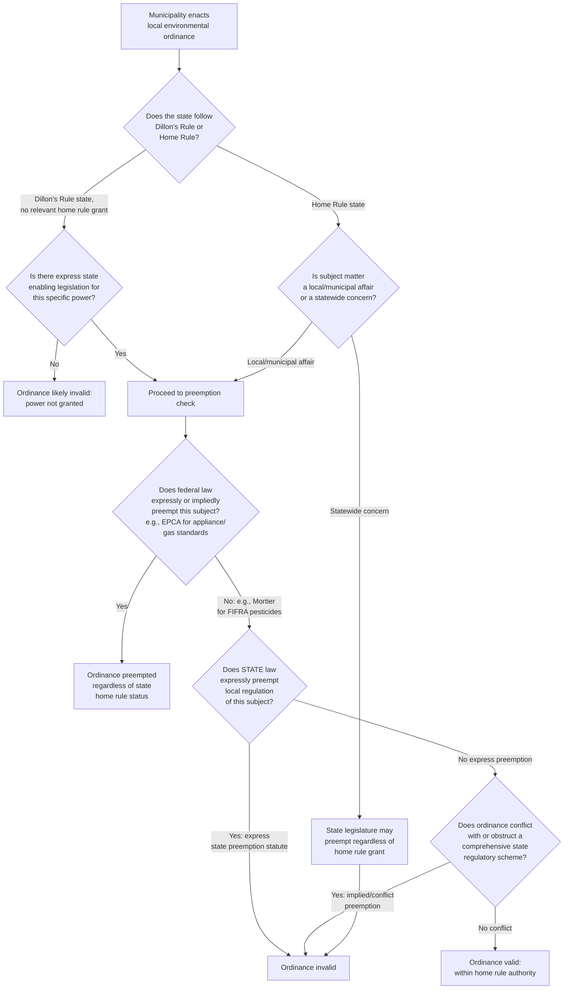

## Local and Municipal Environmental Authority Under Home Rule

### Overview

Home rule is the body of state constitutional and statutory doctrine that determines whether, and to what extent, local governments (municipalities, counties, towns) possess independent authority to legislate — including environmental regulation — without specific enabling legislation from the state for each exercise of power. Because local governments are creatures of state law rather than sovereigns in their own right, their environmental regulatory authority exists entirely within a framework defined by state constitutions, home rule statutes, and state preemption of local ordinances. This is the third tier of the cooperative federalism structure: federal statutes delegate to states, and states in turn decide how much authority to delegate to (or withhold from) their political subdivisions.

### Foundational Doctrine: Dillon's Rule vs. Home Rule

#### Dillon's Rule — the Default Absent Home Rule

*Dillon's Rule*, from Judge John Dillon's treatise and *Merriam v. Moody's Executors*, 25 Iowa 163 (1868), holds that municipal corporations possess only those powers **expressly granted** by the state, those **necessarily or fairly implied** in or incident to expressly granted powers, and those **essential** to the declared objects of the corporation — with any fair, reasonable doubt as to the existence of a power resolved **against** the municipality. Under a pure Dillon's Rule regime, a municipality wishing to regulate, for example, plastic bags or pesticide use must point to specific state enabling legislation authorizing that regulation.

#### Home Rule — Reversing the Presumption

Home rule doctrines, found in most state constitutions and enabling statutes, reverse or soften this presumption by granting municipalities some baseline of autonomous legislative authority over local affairs without requiring specific state authorization for each ordinance. Home rule is not uniform across states; it exists on a spectrum and takes different structural forms.

#### Structural Variants of Home Rule

1. **Imperio (constitutional) home rule** — the state constitution itself grants municipalities broad authority over "municipal affairs" or "local affairs," sometimes with an explicit reservation of exclusive local authority that even the state legislature cannot override for genuinely local matters (e.g., California's Article XI, § 5, and similar "imperio" models).
2. **Legislative home rule** — the state legislature grants home rule powers by statute, which the legislature can in principle amend or revoke, making this form more vulnerable to unilateral state preemption than constitutional home rule.
3. **Structural vs. functional home rule**:
   - **Structural home rule** concerns a municipality's authority to organize its own government (charter, form of government, internal structure).
   - **Functional home rule** concerns a municipality's authority to legislate on substantive policy matters (zoning, environmental regulation, business regulation) — this is the branch most relevant to environmental ordinances.

#### The "State Concern" / "Municipal Affairs" Line-Drawing Problem

Even robust home rule grants typically distinguish between matters of exclusively **local** or **municipal** concern (where home rule authority is strongest, sometimes immune even from state legislative override) and matters of **statewide concern** (where the state legislature retains authority to preempt local action even under home rule). Environmental regulation is frequently contested terrain precisely because pollution, natural resource use, and land use have both plainly local dimensions (a municipality's own air and water quality, local zoning) and plainly statewide or interstate dimensions (transboundary pollution, statewide economic uniformity concerns), making courts' state-concern characterization outcome-determinative and doctrinally unstable across jurisdictions. [Inference — state-concern tests vary significantly by state; any specific state's test requires jurisdiction-specific verification rather than reliance on a generalized national rule.]

### Local Environmental Regulation: Common Subject Areas

#### Land Use and Zoning

Zoning is the paradigm case of well-established local police power, generally upheld under *Village of Euclid v. Ambler Realty Co.*, 272 U.S. 365 (1926), as a legitimate exercise of municipal police power. Environmental zoning tools include setback requirements from wetlands or waterways, tree preservation ordinances, impervious surface limits, and overlay districts for environmentally sensitive areas.

#### Local Climate and Energy Ordinances

A significant modern category includes municipal building electrification/natural gas hookup bans, building energy performance standards, and local renewable energy mandates. These ordinances sit at the sharpest edge of home rule/preemption conflict because they frequently intersect with express federal preemption (e.g., the Energy Policy and Conservation Act's preemption of local appliance efficiency standards) as well as state preemption enacted specifically in response to such local ordinances.

**[Unverified — rapidly evolving litigation]** The Ninth Circuit's *California Restaurant Association v. City of Berkeley* litigation addressed whether the federal Energy Policy and Conservation Act (EPCA) preempts a municipal ordinance banning natural gas piping in new buildings; given the pace of both litigation and legislative responses (including state laws expressly preempting local gas-ban ordinances), the current status of this specific line of authority should be verified before being relied upon for a specific jurisdiction or date.

#### Local Pesticide and Chemical Regulation

*Wisconsin Public Intervenor v. Mortier*, 501 U.S. 597 (1991): The Supreme Court held that FIFRA does not federally preempt local pesticide regulation, because FIFRA's structure and legislative history did not evince a clear congressional intent to preempt local government (as distinct from state government) authority over pesticide use. This decision is frequently cited as establishing that the absence of federal preemption does not, by itself, answer whether a locality has affirmative authority to regulate — that is a separate home rule/state law question, since some states subsequently enacted express state preemption of local pesticide ordinances in response to *Mortier*.

#### Local Water and Wastewater Regulation

Municipalities commonly operate as CWA § 402 NPDES permittees for municipal separate storm sewer systems (MS4s) and publicly owned treatment works (POTWs), and adopt local ordinances (illicit discharge detection, stormwater utility fees, industrial pretreatment programs) that implement or exceed federal/state requirements — generally on firm ground given the CWA's floor structure discussed in the preemption analysis above.

#### Local Solid Waste and Plastics Regulation

Local plastic bag bans, polystyrene foam bans, and similar ordinances are common but have become a significant preemption battleground, with a substantial number of states enacting statutes that expressly preempt local regulation of plastic bags or containers, reflecting industry-driven state-level preemption campaigns. [Inference — the specific list of states with such preemption statutes changes as legislatures act; treat any specific state-by-state count as requiring current verification.]

#### Local Fracking and Oil/Gas Regulation

Local bans or restrictions on hydraulic fracturing have produced significant home rule litigation, since oil and gas regulation is often characterized by state legislatures and courts as a matter of statewide concern warranting state preemption of local control, notwithstanding home rule grants. *Robinson Township v. Commonwealth*, 83 A.3d 901 (Pa. 2013), is a notable example in which the Pennsylvania Supreme Court struck down state statutory provisions preempting local zoning control over oil and gas operations, relying in part on Pennsylvania's constitutional Environmental Rights Amendment (Pa. Const. art. I, § 27) — illustrating how state constitutional environmental rights provisions can interact with and reinforce home rule authority.

### The Preemption Analysis Applied to Local Government

#### Express State Preemption

State legislatures frequently respond to local environmental ordinances — particularly plastic bans, gas bans, and fracking restrictions — with express statutory preemption, sometimes called "ripper" or "punisher" preemption when it includes fines, loss of funding, or personal liability for local officials who enact preempted ordinances. [Inference — terminology and specific enforcement mechanisms vary by state; verify current statutory language for any specific jurisdiction.]

#### Implied/Conflict Preemption

Even without express preemption, state courts apply conflict preemption analysis analogous to federal Supremacy Clause doctrine: a local ordinance may be invalidated if it is irreconcilable with state law, or if it stands as an obstacle to a comprehensive state regulatory scheme (field preemption by implication), using state-law variants of the same "occupying the field" and "conflicts with" tests discussed in federal preemption doctrine.

#### The "Floor" Presumption in State Environmental Statutes

Many state environmental statutes, mirroring the federal floor model, contain provisions permitting local governments to enact requirements more stringent than state minimums, unless the statute contains specific language to the contrary — but this is a state-by-state statutory question, not a uniform national default, and the trend in several states in recent years has been toward narrowing or eliminating such local floor authority for specific subject areas (energy, plastics, pesticides) through amendment. [Inference — do not assume a stringency-floor default without checking the specific state statute at issue.]

### Illustrative Example: Multi-Layer Home Rule Analysis

A home rule municipality in a state with legislative (statutory, not constitutional) home rule enacts an ordinance banning single-use plastic bags and separately bans new natural gas hookups in newly constructed buildings.

1. **Plastic bag ban**: Check whether the state has an express preemption statute covering local regulation of "auxiliary containers" or similar — a substantial number of states have enacted such preemption in the last decade. If no express state preemption exists, the ordinance likely falls within the municipality's home rule authority over local solid waste management, a traditionally local function.
2. **Gas hookup ban**: Requires layered analysis — first, whether federal EPCA preemption applies (a live, jurisdiction-and-circuit-dependent question); second, whether the state has separately enacted its own express preemption of local gas bans (many states have, often in direct legislative response to the trend of municipalities adopting such bans); and third, if neither federal nor express state preemption applies, whether the ordinance survives home rule/state-concern analysis under the state's own constitutional or statutory home rule framework.

### Diagram: Home Rule Environmental Authority Analysis (svg_diagram)

### Key Points

- Dillon's Rule (power exists only if expressly granted, narrowly construed) and Home Rule (municipality has autonomous authority over local affairs absent state limitation) are opposite starting presumptions, and identifying which regime a state follows is the necessary first step in any local environmental authority problem.
- Home rule is not binary — distinguish constitutional/imperio home rule (stronger, harder for the legislature to override) from legislative home rule (weaker, freely revocable by statute), and structural from functional home rule.
- The "local affair" vs. "statewide concern" characterization is frequently outcome-determinative and state-specific; do not assume a uniform national test.
- *Wisconsin Public Intervenor v. Mortier* establishes that the absence of federal preemption (there, under FIFRA) does not itself confer local authority — home rule/state law authority must be established independently.
- State-level preemption of local environmental ordinances (plastics, gas bans, fracking, pesticides) is an active and rapidly shifting legislative trend; any specific state's current preemption status requires verification rather than assumption. [Unverified as to any specific, current state list.]
- State constitutional environmental rights provisions (e.g., Pennsylvania's Environmental Rights Amendment in *Robinson Township*) can interact with and reinforce home rule authority against state preemption attempts.

### Related Topics

- *Wisconsin Public Intervenor v. Mortier* and FIFRA's non-preemption of local pesticide regulation
- State constitutional "Green Amendments" / environmental rights provisions and their interaction with local authority
- Federal Energy Policy and Conservation Act (EPCA) preemption of local appliance and building energy ordinances
- Zoning and land-use regulation as the paradigm case of local environmental police power
- State "ripper" or "punisher" preemption statutes penalizing local officials for enacting preempted ordinances
- Municipal NPDES permittee status (MS4s, POTWs) as a distinct, federally grounded source of local environmental authority
- Comparative note: local government units (LGUs) under the Philippine Local Government Code (R.A. 7160) as a structurally different, civil-law delegation model — relevant given prior civic-software work on LGU contexts, but doctrinally distinct from U.S. home rule and not addressed in this entry