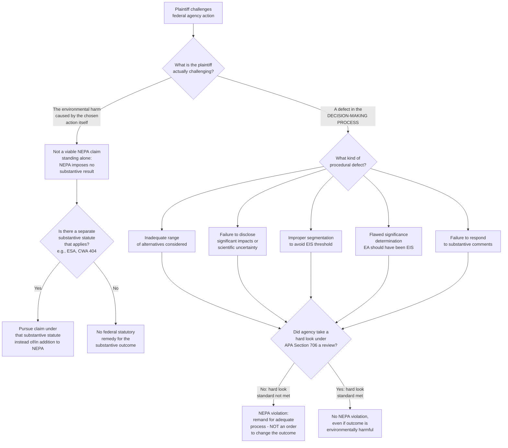

## NEPA's Procedural Mandate Versus Substantive Environmental Outcomes

### Overview

The National Environmental Policy Act (NEPA), 42 U.S.C. §§ 4321–4370m, is the foundational U.S. environmental statute requiring federal agencies to consider environmental consequences before undertaking major actions. The single most tested doctrinal point about NEPA is that it is **purely procedural**: NEPA compels agencies to take a "hard look" at environmental consequences through a defined analytical process, but it does not require agencies to reach any particular substantive result, and does not itself prohibit an agency from choosing an environmentally harmful course of action so long as the required process was followed. Understanding this procedural/substantive distinction is essential to correctly analyzing any NEPA compliance or litigation problem.

### Statutory Text and Structure

#### Section 101 — Substantive-Sounding Policy Declaration

NEPA § 101, 42 U.S.C. § 4331, declares a broad national environmental policy, stating that it is the "continuing policy of the Federal Government" to use all practicable means to create and maintain conditions under which humans and nature can exist in productive harmony, and enumerates aspirational goals (safe, healthful, productive surroundings; preservation of important historic, cultural, and natural aspects of national heritage; wide sharing of resources; etc.).

#### Section 102 — The Procedural Engine

NEPA § 102(2)(C), 42 U.S.C. § 4332(2)(C), is the operative procedural provision: it requires federal agencies to prepare a detailed statement — the Environmental Impact Statement (EIS) — for "major Federal actions significantly affecting the quality of the human environment," addressing the environmental impact of the proposed action, unavoidable adverse environmental effects, alternatives to the proposed action, the relationship between local short-term uses and long-term productivity, and irreversible/irretrievable commitments of resources.

#### The Structural Tension

Section 101's sweeping substantive-sounding language and § 102's procedural command created decades of litigation over whether NEPA imposes any enforceable substantive obligation on agencies to actually protect the environment, or whether its force is limited entirely to ensuring a proper decision-making process.

### The Supreme Court's Resolution: NEPA Is Procedural Only

#### *Strycker's Bay Neighborhood Council v. Karlen*, 444 U.S. 223 (1980)

A per curiam decision holding that once an agency has adequately considered environmental consequences, NEPA places no further constraint on the agency's discretion to weigh environmental costs against other values and select the action it prefers — courts may not second-guess the substantive wisdom of an agency's decision as long as the required procedural analysis occurred.

#### *Vermont Yankee Nuclear Power Corp. v. Natural Resources Defense Council*, 435 U.S. 519 (1978)

Held that NEPA's procedural requirements are the maximum procedural requirements courts may impose on agencies; courts may not fashion additional procedural devices (beyond those Congress and the implementing regulations specify) in the name of more searching NEPA review. This reinforced NEPA's character as a procedural statute whose demands are exhausted once the mandated process is completed.

#### *Robertson v. Methow Valley Citizens Council*, 490 U.S. 332 (1989)

The Court's most direct and frequently cited statement of the procedural/substantive distinction: NEPA does not mandate particular results, but simply prescribes the necessary process for agencies to follow — it ensures that the agency, in reaching its decision, will have available and will carefully consider detailed information concerning significant environmental impacts, and it guarantees that the relevant information will be made available to the larger audience that may also play a role in the decision-making process and the implementation of that decision. Crucially, *Methow Valley* also held that NEPA does not require agencies to adopt a fully developed mitigation plan before proceeding — discussion of mitigation is required, but its adequacy is not judged by whether it guarantees actual environmental protection.

#### *Department of Transportation v. Public Citizen*, 541 U.S. 752 (2004)

Reaffirmed that NEPA "merely prohibits uninformed — rather than unwise — agency action," and applied a causation-based limiting principle: an agency need not consider environmental effects of a decision it lacks legal authority to prevent (there, cross-border trucking safety effects the agency had no discretion to avoid under a separate statutory mandate), because NEPA review is tied to the scope of the agency's own decision-making authority.

### Practical Consequence: The "Hard Look" Standard of Review

#### What Courts Actually Review

Because NEPA imposes no substantive result, judicial review of NEPA compliance under the Administrative Procedure Act (APA), 5 U.S.C. § 706(2)(A), asks only whether the agency took a "hard look" at environmental consequences — i.e., whether the process was procedurally adequate, not whether the agency's ultimate decision was environmentally optimal or even reasonable from an environmental-protection standpoint. This is the operational meaning of "NEPA is procedural" in litigation practice.

#### What a Hard Look Requires

- Reasonably thorough discussion of significant environmental consequences.
- Consideration of a reasonable range of alternatives, including the no-action alternative.
- Disclosure of scientific uncertainty and reasonably foreseeable adverse effects.
- A rationally supported explanation connecting the analysis to the agency's ultimate decision.

#### What a Hard Look Does Not Require

- Selection of the environmentally superior alternative.
- Adoption of specific mitigation measures, or any mitigation at all, beyond disclosure and consideration (*Methow Valley*).
- Resolution of every scientific uncertainty before proceeding.
- Agreement with commenting agencies or the public regarding the wisdom of the action.

### Levels of NEPA Review (Procedural Architecture)

#### Categorical Exclusions (CEs)

Categories of actions an agency has predetermined, through rulemaking, do not individually or cumulatively have a significant effect on the human environment, and therefore require no further NEPA documentation absent "extraordinary circumstances."

#### Environmental Assessment (EA)

A concise public document that briefly analyzes whether a proposed action's effects are significant. An EA concludes in either a **Finding of No Significant Impact (FONSI)** — ending the NEPA process — or a determination that a full EIS is required.

#### Environmental Impact Statement (EIS)

The full procedural document required by § 102(2)(C) when an action is a "major Federal action significantly affecting the quality of the human environment," including a draft EIS (subject to public/agency comment), a final EIS responding to comments, and — following agency decision — a Record of Decision (ROD) explaining the agency's chosen course of action and how environmental factors were considered.

### The Role of the Council on Environmental Quality (CEQ) Regulations

CEQ regulations, historically codified at 40 C.F.R. Parts 1500–1508, implement NEPA's procedural requirements government-wide, defining terms like "significantly," "cumulative impact," and "major Federal action," and structuring the EA/EIS process.

**[Unverified — active regulatory flux]** CEQ's regulatory authority itself, and the current content of these regulations, has been the subject of significant recent litigation and rulemaking activity, including questions about whether CEQ has statutory authority to issue binding NEPA regulations at all, and substantial revisions to the definitions of "major Federal action" and "effects" across different administrations (notably 2020 and subsequent rulemakings, and amendments made via the Fiscal Responsibility Act of 2023, which added new NEPA provisions at 42 U.S.C. §§ 4336 et seq.). Any specific claim about current CEQ regulatory text, page/word limits for EISs, or statutory deadlines should be verified against the current Code of Federal Regulations and statutory text rather than assumed from pre-2020 practice.

### The Central Doctrinal Payoff: Why "Procedural Only" Matters

#### No Injunction Merely Because the Project Harms the Environment

Because NEPA is procedural, a plaintiff cannot obtain relief by showing only that a federal action will cause significant environmental harm. The plaintiff must show a **procedural defect** — an inadequate EIS, an unlawfully narrow range of alternatives, a flawed significance determination, improper segmentation of a larger project to avoid EIS thresholds, or similar process failures. An agency that fully and adequately discloses that its chosen action will cause substantial environmental damage, and proceeds anyway for economic or other reasons, has not violated NEPA.

#### The Remedy Is Redo the Process, Not Reach a Different Outcome

When a court finds a NEPA violation, the standard remedy is to vacate the agency action and remand for the agency to conduct adequate NEPA review — not to order the agency to choose a specific, more protective outcome. An agency can, after curing the procedural defect, lawfully reach the identical substantive decision it made before, provided the process is now adequate.

#### Contrast with Substantive Environmental Statutes

This distinguishes NEPA sharply from substantive statutes like the Endangered Species Act (which prohibits jeopardizing listed species regardless of process) or the Clean Water Act (which sets enforceable numeric/technology-based standards). NEPA problems frequently test whether a student can distinguish a viable NEPA claim (process failure) from a claim that is actually substantive in character and therefore not cognizable under NEPA alone (even if it might be viable under a different statute).

### Illustrative Example

A federal agency proposes to permit a large infrastructure project. It prepares an EIS considering three alternatives (proposed action, a scaled-down alternative, and no-action), discloses that the project will destroy significant wetland habitat and increase regional greenhouse gas emissions, receives extensive adverse public comment on climate impacts, and ultimately selects the original proposed action despite acknowledging it is the most environmentally damaging of the three alternatives considered.

1. **Not a NEPA violation on these facts alone**: The agency considered a reasonable range of alternatives, disclosed significant adverse effects, and responded to comments. Selecting the environmentally worst alternative, after adequate disclosure and consideration, is a substantive policy choice NEPA does not prohibit (*Strycker's Bay*, *Methow Valley*).
2. **A viable NEPA claim would instead require**, for example: showing the range of alternatives considered was unreasonably narrow (e.g., omitting an obvious, feasible alternative), showing the EIS's greenhouse gas analysis used a methodology inconsistent with agency practice or ignored reasonably foreseeable cumulative effects, or showing the agency improperly segmented the project into smaller pieces to avoid a full EIS threshold.
3. **A non-NEPA avenue** for challenging the substantive outcome (destruction of wetlands, emissions) would require invoking a different, substantive statute — e.g., CWA § 404 wetlands permitting requirements, or the Endangered Species Act if a listed species is affected — since NEPA itself provides no freestanding substantive check on this outcome.

### Diagram: NEPA Procedural vs. Substantive Claim Analysis (svg_diagram)

### Key Points

- NEPA is a **procedural** statute: it compels a defined analytical process (disclosure, alternatives analysis, public participation) but mandates no particular substantive environmental outcome.
- *Strycker's Bay*, *Vermont Yankee*, *Methow Valley*, and *Public Citizen* collectively establish and reinforce this procedural-only character across different doctrinal angles (agency discretion, judicial procedural innovation, mitigation adequacy, and causation/scope of review, respectively).
- Judicial review of NEPA compliance applies the APA's "hard look" standard — reviewing whether the process was adequate, not whether the outcome was environmentally sound.
- The standard NEPA remedy is remand for adequate process, not a substantive mandate to choose a different, more protective outcome.
- A NEPA claim must be framed as a **process defect** (alternatives, disclosure, segmentation, significance determination) — a claim that is really about the wisdom of the outcome belongs, if anywhere, under a separate substantive environmental statute.
- CEQ's implementing regulations and the 2023 Fiscal Responsibility Act amendments have been subject to significant, ongoing revision; verify current regulatory text before relying on specific procedural deadlines or definitions. [Unverified as to current regulatory status.]

### Next Steps

- Categorical Exclusions, Environmental Assessments, and the FONSI/EIS threshold determination
- The "hard look" doctrine and APA § 706(a) arbitrary-and-capricious review as applied to NEPA
- Cumulative impacts analysis and improper project segmentation
- NEPA's alternatives requirement and the "rule of reason" for defining a reasonable range
- The 2023 Fiscal Responsibility Act NEPA amendments (42 U.S.C. §§ 4336 et seq.) and page/timeline requirements
- Programmatic EISs and tiering
- Comparison with substantive environmental review regimes (ESA § 7 consultation, CWA § 404 permitting) as contrasting non-procedural models