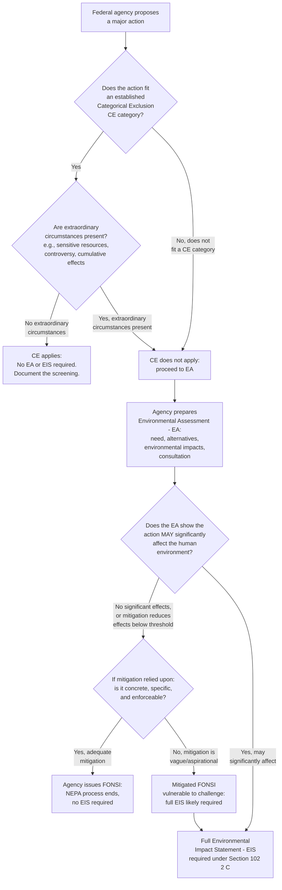

## Environmental Assessments, Findings of No Significant Impact, and Categorical Exclusions

### Overview

Environmental Assessments (EAs), Findings of No Significant Impact (FONSIs), and Categorical Exclusions (CEs) are the three procedural mechanisms that make up the tiered structure of NEPA review below the full Environmental Impact Statement (EIS). Together they determine, for the vast majority of federal actions, whether a full EIS is required at all — in practice, the great majority of federal actions subject to NEPA are resolved through CEs or EA/FONSIs rather than through full EISs, making this tiered screening structure the operational core of day-to-day NEPA compliance.

### The Three-Tier NEPA Screening Structure

#### Tier 1: Categorical Exclusions (CEs)

A category of actions that a federal agency has determined, through its own NEPA implementing procedures (developed via notice-and-comment rulemaking or CEQ-approved agency procedures), normally do not individually or cumulatively have a significant effect on the human environment, and which therefore require **no** EA or EIS, absent extraordinary circumstances.

#### Tier 2: Environmental Assessment (EA) and Finding of No Significant Impact (FONSI)

For actions that do not qualify for a CE and whose significance is not otherwise clear, the agency prepares an EA — a concise document analyzing whether the action's effects will be significant. If the EA supports a conclusion of no significant impact, the agency issues a FONSI, and the NEPA process ends without a full EIS.

#### Tier 3: Environmental Impact Statement (EIS)

If the EA reveals that the action may significantly affect the human environment (or if the agency determines at the outset that an EIS is required), the agency prepares the full EIS under NEPA § 102(2)(C).

### Categorical Exclusions in Detail

#### Legal Basis

CEs are not defined by NEPA's statutory text itself but by CEQ's implementing regulations, which direct each federal agency to establish, through its own procedures, categories of actions that do not individually or cumulatively have a significant effect on the human environment.

#### Agency-Specific CE Lists

Each federal agency maintains its own list of CEs tailored to the types of actions it typically undertakes — for example, routine facility maintenance, small grants, certain categorical land management activities, or minor permit modifications — established through the agency's own NEPA implementing procedures, which themselves went through notice-and-comment rulemaking.

#### Extraordinary Circumstances Exception

Even where an action facially fits within an established CE category, the agency must still consider whether "extraordinary circumstances" are present that could cause the action to have a significant effect notwithstanding the categorical determination — for example, proximity to a sensitive resource (wetlands, floodplains, historic properties, critical habitat), controversial impacts, or unique cumulative effects when combined with other nearby actions. An agency's failure to conduct or adequately document this extraordinary-circumstances screening is a common basis for a successful NEPA procedural challenge to reliance on a CE.

#### Litigation Over CE Applicability

Because CE determinations are agency conclusions that no further NEPA review is needed, they are reviewed under the APA's arbitrary-and-capricious standard, focusing on whether the agency reasonably explained why the action fits the claimed category and why no extraordinary circumstances apply — courts do not evaluate whether the action's environmental effects are, in the court's own view, insignificant, but whether the agency's categorical determination and its extraordinary-circumstances analysis were reasoned.

### Environmental Assessments in Detail

#### Purpose and Function

An EA serves a **screening** function: it is meant to provide sufficient evidence and analysis for determining whether to prepare an EIS or a FONSI, and to aid an agency's compliance with NEPA when no EIS is necessary, and to facilitate preparation of an EIS when one is necessary.

#### Required Contents

An EA typically includes: the need for the proposal, alternatives (including, where relevant, the no-action alternative), the environmental impacts of the proposed action and alternatives, and a listing of agencies and persons consulted. EAs are meant to be **concise** public documents — historically limited to substantially fewer pages than a full EIS — reflecting their screening function rather than the comprehensive disclosure function of an EIS.

#### Determining "Significance"

Whether an action's effects are "significant" — the pivotal question an EA must answer — has traditionally been evaluated by reference to both **context** (the setting in which the effects occur — society as a whole, the affected region, the affected interests, and the locality) and **intensity** (the severity of the impact, considering factors such as impacts on public health/safety, unique geographic characteristics, controversy over effects, uncertain or unique/unknown risks, precedent for future actions, cumulative impacts, effects on historic/cultural resources, and effects on endangered species or their habitat). **[Unverified — regulatory text in flux]** The precise regulatory list and structure of significance factors has been the subject of amendment across different CEQ rulemakings; verify the current 40 C.F.R. § 1501-series text (or successor provisions) rather than relying on the historic "context and intensity" formulation without confirming it remains current.

#### Mitigated FONSIs

An agency may rely on mitigation measures identified during the EA process to support a finding of no significant impact — a "mitigated FONSI" — where the mitigation reduces otherwise-significant effects below the significance threshold. This practice has generated litigation over whether the mitigation relied upon is sufficiently certain, enforceable, and specific to actually support the no-significant-impact conclusion (courts have generally required that mitigation supporting a FONSI be more than vague or aspirational commitments).

#### Public Involvement in the EA Process

Unlike an EIS, which has statutorily/regulatorily mandated public comment periods on a draft document, EA public involvement requirements are comparatively lighter-touch and more discretionary, though agencies commonly make EAs available for public comment as a matter of practice or specific agency procedure, and some agency-specific statutes impose additional public notice requirements.

### The Finding of No Significant Impact (FONSI)

#### Function

A FONSI is a concise public document in which an agency, based on the supporting EA, explains its determination that the proposed action will not have a significant effect on the human environment and therefore an EIS is not required. The FONSI itself (rather than the EA) is often the operative document that ends the NEPA process for a given action, and it must be supported by, and consistent with, the underlying EA's analysis.

#### Judicial Review of a FONSI

Courts review a FONSI under the "hard look" / arbitrary-and-capricious standard: was the significance determination reasoned, did the agency consider the relevant significance factors, and — if a mitigated FONSI — was the relied-upon mitigation sufficiently concrete and enforceable to support the no-significant-impact conclusion. This is squarely a procedural-adequacy inquiry, consistent with NEPA's overall procedural character — the reviewing court does not ask whether the action is, in fact, environmentally benign, but whether the agency's process for reaching that conclusion was adequate.

### The Decision Point: EA/FONSI vs. Full EIS

#### When an EIS Becomes Required

If the EA's analysis reveals that the action **may** significantly affect the human environment — a comparatively low threshold, since "may" does not require certainty — the agency must proceed to prepare a full EIS rather than issuing a FONSI. This "may significantly affect" trigger, rather than a "will significantly affect" or "more likely than not" standard, is a frequently tested point, since it means agencies must escalate to a full EIS even where significant effects are merely a reasonably possible, rather than probable, outcome.

#### Improper Reliance on Mitigation to Avoid Full EIS ("Mitigated FONSI" Litigation)

A recurring litigation pattern involves plaintiffs arguing that an agency improperly used speculative or unenforceable mitigation commitments to artificially reduce a facially significant impact below the threshold requiring a full EIS, effectively using the EA/FONSI process to avoid the more rigorous EIS process for an action that should have received it.

#### Segmentation and Cumulative Effects

A related and frequently tested problem is improper **segmentation** — an agency's division of a larger project into smaller components, each individually assessed via a separate CE or EA, in a manner that avoids ever triggering full EIS review for the project's true cumulative scope and effects. Courts scrutinize whether components are so interdependent or interconnected that they constitute, in substance, a single action that should have been evaluated together.

### Illustrative Example

A federal agency proposes to approve three related actions: (1) routine maintenance dredging of an existing navigation channel, (2) a small grant program for local water quality monitoring, and (3) approval of a new industrial wastewater discharge facility near a wetland complex adjacent to the same channel.

1. **Routine maintenance dredging**: Likely qualifies for an agency CE covering routine maintenance of existing facilities, assuming no extraordinary circumstances (e.g., presence of an endangered species in the channel, or unusually controversial local opposition) are present. The agency must still document its extraordinary-circumstances screening, not merely assert the CE applies.
2. **Small grant program**: Likely qualifies for a CE covering funding/grant actions with no direct physical environmental effects, a common category across many agencies' CE lists.
3. **New industrial discharge facility near wetlands**: Requires at minimum an EA; given proximity to wetlands (a factor bearing on both context and intensity of potential effects, and potentially an "extraordinary circumstance" if a CE were otherwise considered), the agency must carefully analyze significance. If the EA reveals only minor effects after adequately supported, concrete, enforceable mitigation (e.g., a buffer zone, specific discharge limits beyond otherwise-applicable requirements), a mitigated FONSI may be appropriate — but if effects remain potentially significant even after mitigation, or if the mitigation relied upon is vague, a full EIS is required.
4. **Segmentation concern**: If the agency evaluates the discharge facility in isolation from the maintenance dredging and grant program despite their functional connection to managing the same waterway, a plaintiff might argue the actions are impermissibly segmented to avoid a cumulative-effects EIS — the agency should consider whether cumulative or connected-action analysis is warranted.

### Diagram: NEPA Tiered Screening Process (svg_diagram)

### Key Points

- The three-tier structure — CE, EA/FONSI, EIS — screens the large majority of federal actions away from full EIS review, making this tiered process the practical center of gravity of NEPA compliance.
- CEs require both (a) fitting an established categorical description in the agency's own NEPA procedures and (b) an affirmative extraordinary-circumstances screening; skipping the second step is a common, successfully litigated procedural defect.
- An EA's core function is to answer whether an action **may** significantly affect the environment — a comparatively low trigger threshold for escalation to a full EIS, not a "more likely than not" standard.
- A FONSI must be supported by the underlying EA's analysis, and a "mitigated FONSI" is only defensible where the relied-upon mitigation is concrete and enforceable, not merely aspirational.
- Judicial review of CE reliance and FONSI issuance applies the same "hard look"/arbitrary-and-capricious procedural standard as EIS review, consistent with NEPA's overall procedural (not substantive) character.
- Improper segmentation of an interconnected project into separately screened components to avoid triggering full EIS review is a distinct, frequently tested procedural defect theory.
- CEQ's specific regulatory text defining significance factors and EA/EIS procedural requirements has been subject to recent amendment; verify current 40 C.F.R. citations before relying on specific factor lists or page/format requirements. [Unverified as to current regulatory text.]

### Related Topics

- The "hard look" doctrine and arbitrary-and-capricious review under APA § 706(a)
- Improper segmentation and cumulative/connected-actions analysis
- Mitigated FONSIs and the enforceability requirement for relied-upon mitigation
- Agency-specific NEPA implementing procedures and CE rulemaking
- The full Environmental Impact Statement process: draft EIS, final EIS, and Record of Decision
- CEQ regulatory authority and the 2023 Fiscal Responsibility Act NEPA amendments
- NEPA's procedural-only character and its implications for available judicial remedies