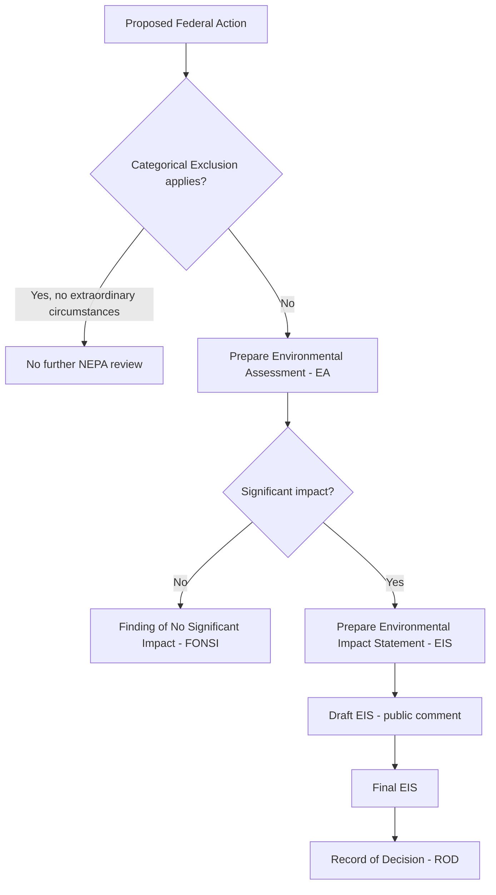

## Environmental Impact Statements and the Hard Look Doctrine

### Overview

The Environmental Impact Statement (EIS) is the centerpiece procedural mechanism of the National Environmental Policy Act (NEPA), 42 U.S.C. § 4321 et seq., and the "hard look doctrine" is the judicially developed standard courts use to review agency compliance with NEPA's procedural mandates. NEPA itself imposes no substantive outcome requirements — it does not compel agencies to choose the most environmentally protective alternative — but it does require agencies to take a "hard look" at environmental consequences before acting. This distinction between procedural and substantive review is the foundation for nearly all EIS litigation.

### Statutory Basis

**Key Points**

- NEPA § 102(2)(C), 42 U.S.C. § 4332(2)(C), requires an EIS for "major Federal actions significantly affecting the quality of the human environment."
- The statute mandates a "detailed statement" addressing:
  1. The environmental impact of the proposed action
  2. Any adverse environmental effects which cannot be avoided
  3. Alternatives to the proposed action
  4. The relationship between local short-term uses and long-term productivity
  5. Any irreversible and irretrievable commitments of resources
- Implementing regulations are promulgated by the Council on Environmental Quality (CEQ) at 40 C.F.R. §§ 1500–1508 (as amended, including the 2020 and 2022/2024 revisions), and individual agencies supplement these with their own NEPA procedures.

### Triggering an EIS: The Threshold Determination

An agency must determine whether an action is a "major Federal action" that "significantly affects" the environment. This threshold inquiry proceeds through a tiered process:

- **Categorical Exclusions (CEs):** Categories of actions an agency has determined, by rule, do not individually or cumulatively have a significant environmental effect (40 C.F.R. § 1501.4). No EA or EIS is required absent "extraordinary circumstances."
- **Environmental Assessment (EA):** A concise document to determine whether an EIS is required (40 C.F.R. § 1501.5). If impacts are not significant, the agency issues a **Finding of No Significant Impact (FONSI)**.
- **Significance factors** historically assessed under the pre-2020 CEQ framework (context and intensity, 40 C.F.R. § 1508.27 (1978)) included:
  - Degree of controversy
  - Degree of uncertainty or unique/unknown risks
  - Precedent for future actions
  - Cumulative impacts
  - Proximity to historic/cultural resources, wetlands, endangered species habitat
  - Degree to which effects on the human environment are likely to be highly controversial

[Unverified] The 2020 CEQ regulations removed the standalone "context and intensity" list and the express directive to consider "connected," "cumulative," and "similar" actions in scoping; litigation and subsequent rulemakings have partially restored cumulative-effects language, so practitioners should verify the current regulatory text in effect for the jurisdiction and action date at issue.

### Structure and Required Content of an EIS

**Key Points**

A complete EIS under 40 C.F.R. Part 1502 typically contains:

1. **Cover sheet and summary**
2. **Purpose and Need** (40 C.F.R. § 1502.13) — defines the objectives the proposal is intended to serve; this section is frequently litigated because a narrowly drawn purpose and need can foreclose a broader range of alternatives
3. **Alternatives, Including the Proposed Action** (40 C.F.R. § 1502.14) — the "heart of the environmental impact statement"; must:
   - Rigorously explore and objectively evaluate all reasonable alternatives
   - Devote substantial treatment to each alternative considered in detail
   - Include the **no-action alternative**
   - Identify the agency's preferred alternative (if one exists)
4. **Affected Environment** (40 C.F.R. § 1502.15) — baseline description of the environment to be affected
5. **Environmental Consequences** (40 C.F.R. § 1502.16) — analysis of direct, indirect, and cumulative effects, including:
   - Direct effects and their significance
   - Indirect effects and their significance
   - Possible conflicts with land use plans
   - Energy requirements and conservation potential
   - Natural or depletable resource requirements
   - Urban quality, historic and cultural resources
   - Means to mitigate adverse environmental impacts
6. **List of Preparers**
7. **Appendices**

### The Hard Look Doctrine

**Key Points**

- Origin: The phrase traces to *Scenic Hudson Preservation Conference v. FPC*, 354 F.2d 608 (2d Cir. 1965) (pre-NEPA, under the Federal Power Act), later imported into NEPA jurisprudence.
- Doctrinal core in *Kleppe v. Sierra Club*, 427 U.S. 390 (1976): the role of the courts is to ensure the agency has taken a "hard look" at environmental consequences, not to substitute judicial judgment for agency judgment on the merits.
- *Vermont Yankee Nuclear Power Corp. v. NRDC*, 435 U.S. 519 (1978): reversed lower court attempts to impose additional procedural requirements beyond those in NEPA and the APA; courts cannot mandate specific procedural devices not required by statute or regulation. This case constrains how far "hard look" review may go in second-guessing agency process design.
- *Robertson v. Methow Valley Citizens Council*, 490 U.S. 332 (1989): NEPA is purely procedural — it does not mandate substantively "green" outcomes, but does require agencies to consider mitigation measures in detail, even though it does not require a fully developed mitigation plan.
- *Baltimore Gas & Electric Co. v. NRDC*, 462 U.S. 87 (1983): where an agency's decision involves technical or scientific matters within its area of expertise, courts owe substantial deference — "at the frontiers of science" deference — while still requiring the agency to have genuinely engaged with the evidence.
- *Marsh v. Oregon Natural Resources Council*, 490 U.S. 360 (1989): established that an agency's decision not to supplement an EIS with new information is reviewed under the arbitrary and capricious standard, applying a "rule of reason."
- *Department of Transportation v. Public Citizen*, 541 U.S. 752 (2004): an agency need not analyze environmental effects of actions it lacks legal authority to prevent — ties the "hard look" inquiry to the scope of the agency's own discretion.

### Standard of Review

**Key Points**

- Review is conducted under APA § 706(2)(A), 5 U.S.C. § 706(2)(A) — the "arbitrary, capricious, an abuse of discretion, or otherwise not in accordance with law" standard.
- The hard look doctrine operationalizes this standard for NEPA cases: a court asks whether the agency
  1. Considered the relevant factors
  2. Examined the relevant data
  3. Articulated a satisfactory explanation for its action, including a rational connection between the facts found and the choice made (citing *Motor Vehicle Mfrs. Ass'n v. State Farm Mutual*, 463 U.S. 29 (1983))
- Courts do **not** ask whether the agency reached the "right" or "best" environmental outcome — only whether the agency's process was adequately reasoned and supported.
- Deference is especially strong for:
  - Scientific and technical determinations within agency expertise
  - Choice of methodology (e.g., choice of modeling approach, significance thresholds)
  - Scope of alternatives, so long as a reasonable range was considered

### Common Litigation Flashpoints

**Example**

| Issue | Doctrinal Question | Leading Case(s) |
| --- | --- | --- |
| Range of alternatives | Were all "reasonable" alternatives considered, and was the purpose/need statement drawn too narrowly to exclude viable options? | *Citizens Against Burlington v. Busey*, 938 F.2d 190 (D.C. Cir. 1991) |
| Cumulative impacts | Did the agency adequately assess effects when aggregated with other past, present, and reasonably foreseeable future actions? | *Kleppe v. Sierra Club*, 427 U.S. 390 (1976) |
| Segmentation ("piecemealing") | Did the agency improperly break a larger project into smaller segments to avoid triggering full EIS review or understate cumulative effects? | *Thomas v. Peterson*, 753 F.2d 754 (9th Cir. 1985) |
| Supplementation | Does new information or a changed circumstance require a Supplemental EIS (SEIS)? | *Marsh v. Oregon Natural Resources Council*, 490 U.S. 360 (1989) |
| Climate change / GHG emissions | Must an EIS quantify greenhouse gas emissions and their significance, including indirect/downstream emissions? | *WildEarth Guardians v. Zinke*, 368 F. Supp. 3d 41 (D.D.C. 2019); *Sabal Trail* line of D.C. Cir. cases |
| Scope of causation | Must the agency analyze effects of actions outside its regulatory control? | *Department of Transportation v. Public Citizen*, 541 U.S. 752 (2004) |
| Remedy | Should a deficient EIS result in vacatur/injunction or remand without vacatur? | *Winter v. NRDC*, 555 U.S. 7 (2008) (injunctive relief standard) |

### Mitigation and the Hard Look

**Key Points**

- *Robertson v. Methow Valley* clarified that NEPA requires a **discussion** of mitigation measures sufficiently detailed to demonstrate that environmental consequences have been fairly evaluated — but does not require adoption of a fully worked-out mitigation plan or that mitigation measures actually be implemented.
- Agencies frequently rely on **mitigated FONSIs**, where proposed mitigation reduces effects below the significance threshold, avoiding a full EIS. Courts scrutinize whether such mitigation commitments are sufficiently certain and enforceable to support that determination.

### Recent Developments (2020–2025 Regulatory Revisions)

[Unverified — verify current status before relying in practice] CEQ regulations have undergone multiple revisions in recent years:

- The 2020 "Update to the Regulations Implementing the Procedural Provisions of NEPA" narrowed definitions of "effects" (collapsing direct/indirect/cumulative into a unified "effects" concept) and tightened page/time limits for EISs.
- Subsequent rulemakings (Phase 1 and Phase 2 revisions, roughly 2022–2024) restored elements of the prior cumulative effects framework and addressed environmental justice and climate change considerations.
- The Fiscal Responsibility Act of 2023 codified certain NEPA page limits (150 pages for standard EIS, 300 for actions of "extraordinary complexity") and timelines (two years) directly into the statute at 42 U.S.C. § 4336a.
- Given the pace of change, always confirm the version of 40 C.F.R. Part 1500 series in effect on the date the agency action was taken, since courts generally apply the regulations in force at the time of agency decision-making.

### Illustrative Analytical Framework (Hard Look Checklist)

**Example**

When evaluating whether an EIS survives hard look review, a practitioner typically checks:

1. Did the agency identify and disclose all reasonably foreseeable significant impacts (direct, indirect, cumulative)?
2. Did the agency consider a reasonable range of alternatives, including a genuine no-action alternative?
3. Is the purpose and need statement so narrowly framed that it predetermines the outcome?
4. Did the agency respond meaningfully to substantive public comments during the draft EIS comment period?
5. Was the scientific/technical methodology reasonable and adequately explained, even if not the only possible approach?
6. If new information arose after the Final EIS, did the agency adequately assess whether supplementation was required?
7. Is there a rational connection between the evidence in the record and the agency's ultimate conclusion (Record of Decision)?

### Diagram: Hard Look Review Logic (svg_diagram)

<svg xmlns="http://www.w3.org/2000/svg" viewBox="0 0 760 400">
<text x="380" y="30" text-anchor="middle" font-size="18" font-weight="bold" fill="#1a1a1a">Hard Look Doctrine — Judicial Review Logic (svg_diagram)</text>
<rect x="30" y="60" width="220" height="60" rx="8" fill="#e8f0fe" stroke="#3b5bdb" stroke-width="1.5" />
<text x="140" y="85" text-anchor="middle" font-size="13" fill="#1a1a1a">Agency prepares</text>
<text x="140" y="103" text-anchor="middle" font-size="13" fill="#1a1a1a">EIS / ROD</text>
<rect x="30" y="170" width="220" height="70" rx="8" fill="#fff4e6" stroke="#e8590c" stroke-width="1.5" />
<text x="140" y="195" text-anchor="middle" font-size="13" fill="#1a1a1a">Petitioner challenges</text>
<text x="140" y="213" text-anchor="middle" font-size="13" fill="#1a1a1a">adequacy under</text>
<text x="140" y="231" text-anchor="middle" font-size="13" fill="#1a1a1a">APA § 706(2)(A)</text>
<rect x="290" y="115" width="240" height="170" rx="8" fill="#ebfbee" stroke="#2f9e44" stroke-width="1.5" />
<text x="410" y="140" text-anchor="middle" font-size="14" font-weight="bold" fill="#1a1a1a">Court asks:</text>
<text x="410" y="163" text-anchor="middle" font-size="12" fill="#1a1a1a">1. Relevant factors considered?</text>
<text x="410" y="184" text-anchor="middle" font-size="12" fill="#1a1a1a">2. Relevant data examined?</text>
<text x="410" y="205" text-anchor="middle" font-size="12" fill="#1a1a1a">3. Rational explanation given</text>
<text x="410" y="223" text-anchor="middle" font-size="12" fill="#1a1a1a"> connecting facts to choice?</text>
<text x="410" y="247" text-anchor="middle" font-size="11" font-style="italic" fill="#495057">(NOT: was outcome "best"?)</text>
<rect x="580" y="60" width="160" height="60" rx="8" fill="#f8f0fc" stroke="#9c36b5" stroke-width="1.5" />
<text x="660" y="85" text-anchor="middle" font-size="13" fill="#1a1a1a">Hard look</text>
<text x="660" y="103" text-anchor="middle" font-size="13" fill="#1a1a1a">satisfied</text>
<rect x="580" y="230" width="160" height="60" rx="8" fill="#fff0f0" stroke="#e03131" stroke-width="1.5" />
<text x="660" y="255" text-anchor="middle" font-size="13" fill="#1a1a1a">Arbitrary &amp;</text>
<text x="660" y="273" text-anchor="middle" font-size="13" fill="#1a1a1a">capricious</text>
<rect x="290" y="320" width="240" height="60" rx="8" fill="#fff9db" stroke="#f08c00" stroke-width="1.5" />
<text x="410" y="345" text-anchor="middle" font-size="13" fill="#1a1a1a">Remedy: remand,</text>
<text x="410" y="363" text-anchor="middle" font-size="13" fill="#1a1a1a">vacatur, or injunction</text>
<line x1="140" y1="120" x2="140" y2="168" stroke="#495057" stroke-width="1.5" marker-end="url(#arrow)" />
<line x1="250" y1="200" x2="288" y2="200" stroke="#495057" stroke-width="1.5" marker-end="url(#arrow)" />
<line x1="530" y1="170" x2="578" y2="105" stroke="#2f9e44" stroke-width="1.5" marker-end="url(#arrow)" />
<line x1="530" y1="230" x2="578" y2="260" stroke="#e03131" stroke-width="1.5" marker-end="url(#arrow)" />
<line x1="660" y1="290" x2="530" y2="345" stroke="#f08c00" stroke-width="1.5" marker-end="url(#arrow)" />
</svg>

### Practical Drafting and Litigation Considerations

**Key Points**

- Agencies should build a robust administrative record: technical studies, public comment responses, and expert reasoning are the primary evidence a reviewing court examines.
- Counsel challenging an EIS should focus on process failures (missing analysis, unexplained methodology shifts, unaddressed significant comments) rather than disagreement with substantive conclusions, since courts will not reweigh the merits.
- Agencies defending an EIS should ensure the record affirmatively shows engagement with contrary evidence and expert comments, since silence on a significant issue is a common basis for a finding of arbitrary and capricious action.
- [Inference] Because standards and page/timing limits have been in flux due to recent statutory codification (42 U.S.C. § 4336a) and CEQ rule revisions, litigants should independently verify which regulatory text applies to the specific agency action date at issue, as courts generally apply the version in effect when the agency acted.

### Conclusion

The EIS is NEPA's central disclosure and deliberation tool, and the hard look doctrine is the judicial mechanism ensuring agencies genuinely grapple with environmental consequences without courts second-guessing the ultimate policy choice. The doctrine sits at the intersection of the APA's arbitrary-and-capricious standard and NEPA's disclosure-focused, procedural (not substantive) mandate — courts police the *process* of decision-making, not its *outcome*.

**Related Topics**

- Categorical exclusions and extraordinary circumstances
- Environmental Assessments (EAs) and Findings of No Significant Impact (FONSIs)
- Cumulative impacts analysis and segmentation/piecemealing doctrine
- Supplemental EIS triggers (*Marsh v. Oregon Natural Resources Council*)
- Purpose and need statements and their effect on alternatives analysis
- NEPA and climate change / greenhouse gas emissions analysis
- Environmental justice considerations in NEPA review
- Programmatic EISs and tiering
- Standing and ripeness in NEPA litigation
- Remedies: vacatur vs. remand without vacatur in APA/NEPA cases
- State "mini-NEPA" statutes (e.g., CEQA, SEQRA) and comparative analysis