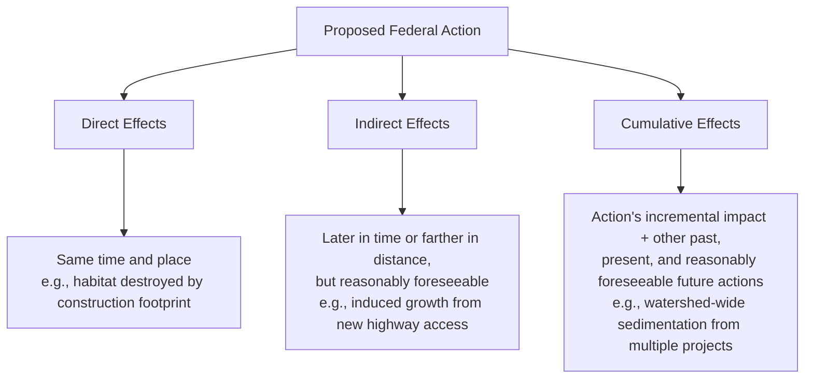

## Scope of Review: Direct, Indirect, and Cumulative Effects

### Overview

NEPA's implementing framework historically required agencies to distinguish among three categories of environmental effects — direct, indirect, and cumulative — when preparing an Environmental Assessment (EA) or Environmental Impact Statement (EIS). This taxonomy determines how broadly an agency must cast its analytical net, and disputes over the proper scope of effects analysis are among the most heavily litigated NEPA issues. The categories originated in the 1978 CEQ regulations, were substantially altered by the 2020 CEQ rule (which collapsed them into a unified "effects" definition), and have been partially revisited in subsequent rulemakings — making this an area where the applicable regulatory text depends heavily on the date of agency action.

### Statutory and Regulatory Basis

**Key Points**

- NEPA § 102(2)(C), 42 U.S.C. § 4332(2)(C), requires disclosure of the "environmental impact of the proposed action" without itself defining effect categories.
- The original 1978 CEQ regulations, 40 C.F.R. § 1508.8 (1978), defined "effects" and "impacts" as synonymous and expressly divided them into:
  - **Direct effects** — "caused by the action and occur at the same time and place"
  - **Indirect effects** — "caused by the action and are later in time or farther removed in distance, but are still reasonably foreseeable"
- Cumulative impact was separately defined at 40 C.F.R. § 1508.7 (1978): "the impact on the environment which results from the incremental impact of the action when added to other past, present, and reasonably foreseeable future actions."
- The 2020 CEQ rule replaced this tripartite structure with a single definition of "effects or impacts" at 40 C.F.R. § 1508.1(g), requiring a "reasonably close causal relationship" to the proposed action — language drawn from *Public Citizen*'s proximate-cause framing — and eliminated the separate "cumulative impact" definition.
- [Unverified] Subsequent CEQ rulemakings (2022 Phase 1 and 2024 Phase 2 revisions) restored language directing agencies to consider effects that are "reasonably foreseeable," including cumulative effects, but practitioners must verify the specific regulatory text in force on the date of the agency action at issue, since courts apply the rule in effect when the agency acted.

### The Three Categories Defined

**Direct Effects**

- Immediate, proximate consequences of the action itself.
- Example: grading and vegetation clearing at a construction site; noise from operating machinery; air emissions from a facility's stack during operation.

**Indirect Effects**

- Effects that are causally connected to the action but attenuated in time or geography, provided they remain "reasonably foreseeable" (not speculative).
- Classic categories include:
  - **Growth-inducing effects** — e.g., a new highway interchange spurring residential or commercial development in previously undeveloped areas (40 C.F.R. § 1508.8(b) (1978))
  - **Effects on population and land use patterns**
  - **Related effects on air, water, and ecosystems** stemming from induced development
- Leading case: *City of Davis v. Coleman*, 521 F.2d 661 (9th Cir. 1975) — an EIS for a highway interchange had to consider the reasonably foreseeable industrial development the interchange would induce.

**Cumulative Effects**

- The incremental effect of the action when added to other past, present, and reasonably foreseeable future actions, "regardless of what agency (Federal or non-Federal) or person undertakes such other actions" (40 C.F.R. § 1508.7 (1978)).
- Rationale: an individually insignificant action can produce cumulatively significant effects when combined with other actions in the same watershed, airshed, or region.
- Leading case: *Kleppe v. Sierra Club*, 427 U.S. 390 (1976) — established that agencies must assess cumulative effects of related actions but retain discretion over how to define the geographic and programmatic scope of that assessment; a single comprehensive EIS is not always required for multiple related coal-related actions if impacts are not cumulatively significant when meaningfully analyzed.

### Causation and the "Reasonably Foreseeable" Limiting Principle

**Key Points**

- Indirect and cumulative effects analysis is not boundless — it is cabined by:
  1. **Reasonable foreseeability**: speculative or remote effects need not be analyzed in detail.
  2. **Proximate causation**: *Department of Transportation v. Public Citizen*, 541 U.S. 752 (2004) — where an agency lacks legal authority to prevent an effect (there, cross-border trucking safety effects that FMCSA could not regulate given a presidential exemption decision outside its control), NEPA does not require analysis of that effect, because NEPA does not "expand the scope of an agency's ability to act" and the causal chain was too attenuated from the agency's discretionary authority.
  3. **Agency's own discretion**: the scope of required analysis tracks the scope of the agency's decision-making authority over the action.
- *Metropolitan Edison Co. v. People Against Nuclear Energy (PANE)*, 460 U.S. 766 (1983) — NEPA requires a "reasonably close causal relationship" analogous to proximate cause in tort law; psychological effects of a perceived risk (fear following the Three Mile Island accident) were too attenuated from the physical environmental change to require NEPA analysis.
- These cases collectively establish that NEPA's effects analysis, while broad, is not unlimited — courts use causation principles borrowed from tort law to police the outer boundary of what agencies must consider.

### Cumulative Effects: Analytical Framework

**Example**

A cumulative effects analysis typically requires:

1. **Defining the geographic scope** — e.g., a watershed, airshed, ecoregion, or administrative boundary appropriate to the resource affected (different resources may require different geographic scopes within the same EIS)
2. **Defining the temporal scope** — how far back (past actions) and forward (reasonably foreseeable future actions) the analysis extends
3. **Identifying other actions** — past, present, and reasonably foreseeable future actions by any actor (federal, state, local, private) that affect the same resource
4. **Establishing baseline conditions** — the current state of the resource, reflecting the effects of past actions
5. **Assessing incremental contribution** — how the proposed action's effects combine with the effects of other identified actions
6. **Determining significance of the aggregate effect** — even where the proposed action's individual contribution is small

| Step | Common Litigation Failure Point |
| --- | --- |
| Geographic scope | Scope drawn too narrowly to exclude relevant related actions |
| Identification of other actions | Omission of reasonably foreseeable future projects (e.g., pending permit applications) |
| Baseline | Use of a "hypothetical" baseline that assumes full compliance with other legal requirements, masking existing degraded conditions |
| Significance determination | Conclusory statement that cumulative effects are "not significant" without supporting data or methodology |

### The Segmentation ("Piecemealing") Problem

**Key Points**

- Segmentation occurs when an agency divides a larger project into smaller components, each analyzed separately, to avoid a comprehensive assessment of cumulative or connected effects — potentially avoiding EIS-level review altogether or understating significance.
- The 1978 regulations addressed this through the "connected actions," "cumulative actions," and "similar actions" tests for scoping a single EIS (40 C.F.R. § 1508.25 (1978)):
  - **Connected actions**: automatically trigger, are interdependent parts of a larger action, or cannot proceed without prior/simultaneous action.
  - **Cumulative actions**: when viewed with other proposed actions, have cumulatively significant impacts and should be discussed in the same document.
  - **Similar actions**: share common timing or geography such that their environmental consequences are best evaluated together.
- Leading case: *Thomas v. Peterson*, 753 F.2d 754 (9th Cir. 1985) — a Forest Service road and subsequent timber sales were "connected actions" requiring joint NEPA analysis because the road was built specifically to permit the timber sales; segmenting the two improperly avoided assessing their combined effects.
- [Unverified] The continued regulatory force of the express "connected/cumulative/similar actions" test depends on which version of the CEQ regulations applies to the action; the 2020 rule removed 40 C.F.R. § 1508.25 in its prior form, so the doctrinal test may now derive more directly from case law and the "reasonably close causal relationship" standard rather than the specific regulatory taxonomy — confirm current text before relying on it for a specific action date.

### Interaction with the Hard Look Doctrine

**Key Points**

- Scope-of-effects disputes are typically litigated as hard look challenges: did the agency identify all reasonably foreseeable direct, indirect, and cumulative effects, and did it articulate a reasoned basis for the geographic/temporal boundaries it drew?
- Courts apply the arbitrary-and-capricious standard (APA § 706(2)(A)) to an agency's scoping decisions, generally deferring to the agency's technical judgment about which effects are reasonably foreseeable, so long as the agency's reasoning is disclosed and supported by the record.
- A conclusory assertion that cumulative effects are insignificant, without supporting analysis, is a frequent basis for a court finding a NEPA violation (e.g., cases applying the reasoning of *Kleppe* and its progeny in the courts of appeals).

### Diagram: Scope of Effects Analysis Boundaries (svg_diagram)

<svg xmlns="http://www.w3.org/2000/svg" viewBox="0 0 760 420">
<text x="380" y="28" text-anchor="middle" font-size="17" font-weight="bold" fill="#1a1a1a">Scope of Effects Analysis (svg_diagram)</text>
<circle cx="380" cy="230" r="70" fill="#e8f0fe" stroke="#3b5bdb" stroke-width="2" />
<text x="380" y="220" text-anchor="middle" font-size="13" font-weight="bold" fill="#1a1a1a">Direct</text>
<text x="380" y="238" text-anchor="middle" font-size="11" fill="#1a1a1a">Same time</text>
<text x="380" y="253" text-anchor="middle" font-size="11" fill="#1a1a1a">and place</text>
<circle cx="250" cy="150" r="110" fill="none" stroke="#2f9e44" stroke-width="2" stroke-dasharray="6,4" />
<text x="130" y="90" text-anchor="middle" font-size="13" font-weight="bold" fill="#2f9e44">Indirect</text>
<text x="130" y="108" text-anchor="middle" font-size="11" fill="#1a1a1a">Later in time /</text>
<text x="130" y="123" text-anchor="middle" font-size="11" fill="#1a1a1a">farther in distance</text>
<text x="130" y="138" text-anchor="middle" font-size="11" fill="#1a1a1a">but foreseeable</text>
<ellipse cx="380" cy="230" rx="330" ry="170" fill="none" stroke="#e8590c" stroke-width="2" stroke-dasharray="10,6" />
<text x="640" y="75" text-anchor="middle" font-size="13" font-weight="bold" fill="#e8590c">Cumulative</text>
<text x="640" y="93" text-anchor="middle" font-size="11" fill="#1a1a1a">This action + other</text>
<text x="640" y="108" text-anchor="middle" font-size="11" fill="#1a1a1a">past/present/future</text>
<text x="640" y="123" text-anchor="middle" font-size="11" fill="#1a1a1a">actions (any actor)</text>

<text x="380" y="400" text-anchor="middle" font-size="12" font-style="italic" fill="`#495057`">Outer limit: "reasonably close causal relationship" (proximate cause) — Public Citizen; PANE</text>

</svg>

### Practice Pointers

**Key Points**

- When challenging an EIS/EA, examine whether the agency's geographic and temporal scoping decisions are independently justified in the record, rather than asserted without explanation.
- When defending an EIS/EA, ensure the administrative record contains an explicit methodology for identifying "reasonably foreseeable future actions" (e.g., reliance on permit databases, planning documents, or interagency consultation).
- [Inference] Because the definitional structure for "effects" has changed across CEQ rule revisions since 2020, litigants and drafters should identify the precise regulatory definition governing the agency action's timeline, since the applicable test (three-part 1978 taxonomy vs. unified "reasonably close causal relationship" standard) can materially affect litigation strategy and record requirements.

### Conclusion

The direct/indirect/cumulative effects framework structures how far an agency's NEPA analysis must reach — from immediate physical disturbance, through foreseeable secondary consequences like induced growth, to the aggregate effect of an action combined with the broader universe of past, present, and reasonably foreseeable actions. Courts bound this inquiry with causation principles borrowed from tort law (proximate cause, reasonable foreseeability) and review agency scoping decisions under the deferential arbitrary-and-capricious/hard look standard, focusing on whether the agency's boundaries were reasoned and disclosed rather than substantively "correct."

**Related Topics**

- Environmental impact statements and the hard look doctrine
- Segmentation/piecemealing and the connected-actions test
- Climate change and greenhouse gas emissions as indirect/cumulative effects
- Programmatic EISs and tiering for cumulative regional impacts
- Baseline conditions and the "no action" alternative
- CEQ regulatory history: 1978, 2020, and 2022/2024 rule revisions
- Proximate cause principles in administrative law (*Public Citizen*, *PANE*)
- Environmental justice and cumulative burden analysis