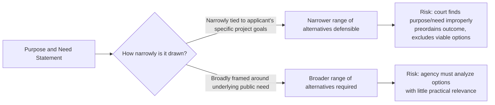

## Alternatives Analysis and the Range of Alternatives Requirement

### Overview

The alternatives analysis is widely regarded as the "heart" of the environmental impact statement — the section of an EIS most directly tied to NEPA's purpose of ensuring informed, deliberate agency decision-making before an irreversible commitment of resources. Unlike other EIS sections that describe and disclose effects of the chosen course of action, the alternatives section forces the agency to demonstrate that it genuinely considered a reasonable spectrum of ways to meet its objectives, including the option of not acting at all.

### Statutory and Regulatory Basis

**Key Points**

- NEPA § 102(2)(C)(iii), 42 U.S.C. § 4332(2)(C)(iii), requires the EIS to address "alternatives to the proposed action."
- NEPA § 102(2)(E), 42 U.S.C. § 4332(2)(E), separately requires agencies to "study, develop, and describe appropriate alternatives to recommended courses of action in any proposal which involves unresolved conflicts concerning alternative uses of available resources" — this provision applies even outside the EIS context (e.g., in EAs) and is a distinct, freestanding NEPA obligation.
- 40 C.F.R. § 1502.14 (1978 regulations, largely retained in substance through subsequent revisions) designates the alternatives section as the EIS's core and requires agencies to:
  - Rigorously explore and objectively evaluate all reasonable alternatives
  - Briefly discuss the reasons for eliminating alternatives that were not analyzed in detail
  - Devote substantial treatment to each alternative considered in detail, including the proposed action, so reviewers may evaluate their comparative merits
  - Include the **no-action alternative**
  - Identify the agency's preferred alternative, if one exists, in the draft EIS (unless prohibited by law)
  - Include appropriate mitigation measures not already part of the proposed action

### The "Rule of Reason" and Range of Alternatives

**Key Points**

- Agencies are not required to consider every conceivable alternative; the range of alternatives is bounded by a **"rule of reason"** tied to the statement of purpose and need.
- Leading case: *Citizens Against Burlington v. Busey*, 938 F.2d 190 (D.C. Cir. 1991) (Thomas, J.) — upheld the FAA's narrow range of alternatives for airport expansion because the purpose and need (expanding a hub airport's capacity for a specific carrier's operations) reasonably constrained which alternatives were viable; agencies may give substantial weight to the goals articulated by the project's private or public sponsor, provided the purpose and need statement is not defined so narrowly as to preordain only one outcome.
- The range of alternatives must be **broad enough to permit a reasoned choice**, but need not include options that would not accomplish the underlying purpose and need or that are infeasible (technically, economically, or legally).
- Courts distinguish between:
  - **Reasonable alternatives** — must be rigorously explored and evaluated in detail
  - **Alternatives eliminated from detailed study** — may be discussed briefly, with reasons given for elimination (e.g., infeasibility, failure to meet purpose and need, or substantially similar effects to an alternative already studied in detail)

### The Purpose and Need Statement as a Gatekeeper

**Example**

The purpose and need statement (40 C.F.R. § 1502.13) is the primary lever controlling the range of alternatives:

- Where an agency defines purpose and need so narrowly that only the proposed action (or a functionally identical alternative) can satisfy it, courts have found NEPA violations because the alternatives analysis becomes a foregone conclusion rather than a genuine comparison.
- Where the applicant is a private party (e.g., in a permitting context), courts generally permit agencies to give substantial deference to the applicant's statement of goals, provided the agency does not simply adopt the applicant's narrowest self-interested framing without independent evaluation (*Citizens Against Burlington*; see also circuit-specific variations in how much deference is appropriate).

### Categories of Alternatives Commonly Analyzed

**Key Points**

| Alternative Type | Description | Example |
| --- | --- | --- |
| No-action alternative | Baseline against which all other alternatives are measured; mandatory under 40 C.F.R. § 1502.14(d) | Continuing current land management practices without the proposed project |
| Proposed action | The agency's or applicant's preferred course of action as submitted | Construction of a new highway alignment |
| Alternative sites/locations | Different geographic siting of the same general action | Alternative pipeline routes avoiding sensitive wetlands |
| Alternative designs/scales | Different scope, size, or configuration of the same action | Reduced-capacity version of a proposed dam or facility |
| Alternative means | Different technological or operational approaches to the same underlying need | Demand-management/transit alternatives instead of new highway capacity |
| Mitigated alternatives | The proposed action combined with mitigation measures sufficient to reduce impacts | Project redesign incorporating buffer zones for sensitive habitat |

### The No-Action Alternative

**Key Points**

- Mandatory in every EIS regardless of whether the agency believes it is a realistic outcome; serves as the analytical baseline for comparing environmental consequences of other alternatives.
- Two conceptual approaches, depending on context:
  1. **No change from current management direction** (for ongoing programs or plans)
  2. **No project/no build** (for discrete proposed actions)
- Even where an agency is legally required to act (e.g., statutory mandate), the no-action alternative must still be analyzed to establish the comparative baseline, per CEQ guidance.

### Alternatives Outside the Agency's Jurisdiction

**Key Points**

- Agencies are generally not required to analyze in detail alternatives that fall outside their statutory authority to implement, though the outer boundary of this principle is contested.
- *Department of Transportation v. Public Citizen*, 541 U.S. 752 (2004) — reinforced that the scope of alternatives (and effects) analysis tracks the agency's own legal authority and discretion; an agency need not evaluate alternatives it has no power to adopt.
- Some circuits have required consideration of alternatives requiring action by another agency or level of government where those alternatives are reasonably related to accomplishing the underlying purpose, creating circuit-level variation in how strictly this jurisdictional limit is applied. [Unverified — confirm current circuit split status for the specific jurisdiction at issue.]

### Interaction with the Hard Look Doctrine

**Key Points**

- Alternatives challenges are reviewed under the same arbitrary-and-capricious/hard look framework as other EIS adequacy challenges (APA § 706(2)(A); *Motor Vehicle Mfrs. Ass'n v. State Farm*, 463 U.S. 29 (1983)).
- Courts examine whether:
  1. The purpose and need statement was reasonably, not artificially, drawn
  2. The agency considered a reasonable range of alternatives capable of achieving that purpose and need
  3. Alternatives eliminated from detailed study were given adequate (if brief) explanation
  4. The comparative analysis of alternatives considered in detail was substantively comparable (i.e., not superficial treatment of non-preferred alternatives designed to make the preferred alternative look best)
- A common successful challenge theory: the agency's "detailed" alternatives were not genuinely distinct, or the non-preferred alternatives were analyzed in a comparatively cursory fashion — undermining the comparative function the section is meant to serve.

### Alternatives Analysis in Practice: Illustrative Table

**Example**

| Step | Agency Action | Common Failure Point |
| --- | --- | --- |
| 1. Define purpose and need | Articulate underlying objectives independent of the applicant's specific proposal design | Adopting applicant's narrow project description verbatim as "purpose and need" |
| 2. Screen alternatives | Apply screening criteria (feasibility, ability to meet purpose/need, environmental performance) | Screening criteria applied inconsistently or post hoc to eliminate disfavored options |
| 3. Analyze alternatives in detail | Substantial, comparable treatment of each alternative carried forward | Disproportionate detail/favorable framing for preferred alternative |
| 4. Document eliminated alternatives | Brief explanation for alternatives not carried forward | Conclusory dismissal without supporting analysis |
| 5. Identify preferred alternative | Disclose preferred alternative in draft EIS (where applicable) | Premature commitment to preferred alternative before completing objective analysis |

### Diagram: Alternatives Screening Funnel (svg_diagram)

<svg xmlns="http://www.w3.org/2000/svg" viewBox="0 0 700 380">
<text x="350" y="28" text-anchor="middle" font-size="17" font-weight="bold" fill="#1a1a1a">Alternatives Screening Funnel (svg_diagram)</text>
<polygon points="80,60 620,60 520,140 180,140" fill="#e8f0fe" stroke="#3b5bdb" stroke-width="1.5" />
<text x="350" y="105" text-anchor="middle" font-size="13" fill="#1a1a1a">Full universe of conceivable alternatives</text>
<polygon points="180,150 520,150 440,220 260,220" fill="#d0e8ff" stroke="#3b5bdb" stroke-width="1.5" />
<text x="350" y="190" text-anchor="middle" font-size="12" fill="#1a1a1a">Screened for feasibility &amp; purpose/need</text>
<polygon points="260,230 440,230 400,290 300,290" fill="#b8dcff" stroke="#3b5bdb" stroke-width="1.5" />
<text x="350" y="265" text-anchor="middle" font-size="11" fill="#1a1a1a">Reasonable alternatives</text>
<rect x="290" y="300" width="120" height="50" rx="6" fill="#2f9e44" />
<text x="350" y="322" text-anchor="middle" font-size="12" fill="#ffffff" font-weight="bold">Analyzed in</text>
<text x="350" y="339" text-anchor="middle" font-size="12" fill="#ffffff" font-weight="bold">detail (+ no-action)</text>

<text x="640" y="105" font-size="11" fill="`#495057`">Eliminated</text>

<text x="640" y="120" font-size="11" fill="`#495057`">(brief expl.)</text>

<line x1="560" y1="100" x2="620" y2="100" stroke="`#e03131`" stroke-width="1.5" marker-end="url(#arrow2)" />

</svg>

### Practice Pointers

**Key Points**

- Drafting agencies should independently articulate the purpose and need rather than adopting an applicant's framing wholesale, and should document the screening criteria applied to eliminate alternatives.
- Litigators challenging an EIS should examine (1) whether the purpose and need statement is artificially narrow, and (2) whether the "detailed" alternatives are meaningfully distinguishable from one another or from the proposed action.
- [Inference] Because deference to purpose and need framing varies somewhat across circuits, and because CEQ regulatory language on alternatives has been subject to revision since 2020, the specific procedural requirements applicable to a given EIS should be confirmed against the regulatory text and controlling circuit precedent in effect at the time of the agency's action.

### Conclusion

The alternatives analysis operationalizes NEPA's core informational purpose: forcing an agency to demonstrate, through comparative disclosure, that it seriously considered different ways to achieve its objectives — including doing nothing — before committing resources. The "rule of reason," anchored to a properly drawn purpose and need statement, defines how wide that range must be, and courts police this boundary under the same deferential hard look standard applied to the rest of the EIS, focusing on the integrity of the agency's process rather than the substantive wisdom of its ultimate choice.

**Related Topics**

- Purpose and need statements and their gatekeeping function
- Environmental impact statements and the hard look doctrine
- No-action alternative baseline methodology
- Mitigation measures and mitigated FONSIs
- Segmentation/piecemealing and connected actions
- Programmatic EISs, tiering, and alternatives at different decision levels
- Circuit variation in deference to applicant-defined purpose and need