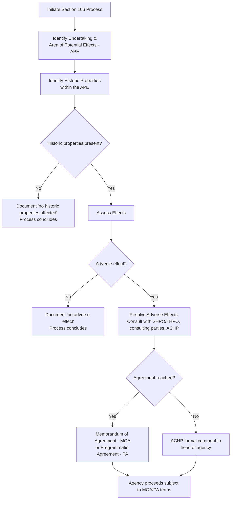

## Historic and Cultural Resource Review Under Section 106 of the National Historic Preservation Act

### Overview

Section 106 of the National Historic Preservation Act (NHPA), 54 U.S.C. § 306108 (formerly codified at 16 U.S.C. § 470f), is a procedural mandate distinct from but frequently coordinated with NEPA review. It requires federal agencies to consider the effects of their undertakings on historic properties and to afford the Advisory Council on Historic Preservation (ACHP) a reasonable opportunity to comment before the agency approves the expenditure of federal funds or issues a license or permit. Like NEPA, Section 106 is a "stop, look, and listen" procedural requirement — it does not mandate a particular substantive outcome or preservation result, but does require a defined consultation process to run its course.

### Statutory and Regulatory Basis

**Key Points**

- Section 106, 54 U.S.C. § 306108: requires the head of any federal agency having direct or indirect jurisdiction over a proposed federal or federally assisted undertaking to take into account the effect of the undertaking on any historic property, and afford the ACHP a reasonable opportunity to comment.
- Implementing regulations: 36 C.F.R. Part 800 ("Protection of Historic Properties"), promulgated by the ACHP.
- Key statutory/regulatory definitions:
  - **Undertaking**: a project, activity, or program funded, permitted, licensed, or otherwise approved by a federal agency (36 C.F.R. § 800.16(y)).
  - **Historic property**: any prehistoric or historic district, site, building, structure, or object included in, or eligible for inclusion in, the **National Register of Historic Places** (NRHP), including properties of traditional religious and cultural importance to an Indian tribe or Native Hawaiian organization (36 C.F.R. § 800.16(l)).
  - **Effect**: alteration to the characteristics of a historic property qualifying it for inclusion in the National Register (36 C.F.R. § 800.16(i)).
  - **Adverse effect**: an effect that may diminish the integrity of a historic property's location, design, setting, materials, workmanship, feeling, or association (36 C.F.R. § 800.5(a)(1)).

### The Section 106 Process

**Step 1: Initiate the Process (36 C.F.R. § 800.3)**

- Agency determines whether the proposed action is an "undertaking" and whether it has the potential to affect historic properties.
- Agency identifies consulting parties, including the relevant **State Historic Preservation Officer (SHPO)** or **Tribal Historic Preservation Officer (THPO)**, and, where applicable, Indian tribes and Native Hawaiian organizations attaching religious and cultural significance to properties that may be affected.

**Step 2: Identify Historic Properties (36 C.F.R. § 800.4)**

- Define the **Area of Potential Effects (APE)**: the geographic area within which an undertaking may directly or indirectly cause alterations to the character or use of historic properties.
- Conduct a reasonable and good-faith effort to identify historic properties within the APE, including archival research, field surveys, and consultation with SHPO/THPO, tribes, and other knowledgeable parties.
- Apply the **National Register eligibility criteria** (36 C.F.R. § 60.4) to determine whether identified properties are eligible even if not formally listed.

**Step 3: Assess Effects (36 C.F.R. § 800.5)**

- Apply the criteria of adverse effect: does the undertaking alter, directly or indirectly, characteristics that qualify a property for the National Register?
- Examples of adverse effects (36 C.F.R. § 800.5(a)(2)):
  - Physical destruction, damage, or alteration
  - Removal from its historic location
  - Change of character of the property's use or physical features within its setting
  - Introduction of visual, atmospheric, or audible elements out of character with the property
  - Neglect resulting in deterioration
  - Transfer/sale/lease out of federal ownership without adequate protections

**Step 4: Resolve Adverse Effects (36 C.F.R. § 800.6)**

- Agency consults with SHPO/THPO and other consulting parties to develop measures to avoid, minimize, or mitigate adverse effects.
- Outcomes typically documented in a **Memorandum of Agreement (MOA)** (project-specific) or **Programmatic Agreement (PA)** (for complex, multi-stage, or recurring undertakings).
- If consultation fails to produce agreement, the ACHP may provide formal comments to the head of the agency, who must take the comments into account, but is not bound to follow them (54 U.S.C. § 306108's comment requirement is procedural, not a veto).

### Coordination with NEPA

**Key Points**

- 36 C.F.R. § 800.8 authorizes agencies to coordinate Section 106 compliance with the NEPA process, allowing a single combined review rather than duplicative parallel processes.
- Common integration approaches:
  - Incorporating Section 106 identification and effects findings into the EIS/EA's cultural resources section
  - Substituting the NEPA public comment process for a portion of Section 106 public involvement requirements, where procedures are followed correctly
  - Executing a Programmatic Agreement concurrently with issuance of the Record of Decision (ROD)
- Despite coordination, Section 106 and NEPA remain **legally independent obligations** — satisfying NEPA does not automatically satisfy Section 106, and vice versa; an agency must separately ensure ACHP has been afforded a "reasonable opportunity to comment" under the Section 106 regulations.

### Standard of Review and Key Case Law

**Key Points**

- Section 106 claims are reviewed under the APA's arbitrary-and-capricious standard, analogous to NEPA hard look review — courts examine whether the agency followed the required consultation steps and reasonably identified/assessed effects on historic properties, not whether it reached the "correct" preservation outcome.
- Leading cases:
  - ***Ill. Commerce Comm'n v. ICC***, 848 F.2d 1246 (D.C. Cir. 1988) — procedural (not substantive) nature of Section 106 confirmed; agency must complete the process but is not required to preserve the property.
  - ***Muckleshoot Indian Tribe v. U.S. Forest Service***, 177 F.3d 800 (9th Cir. 1999) — inadequate identification effort and failure to meaningfully consult with a tribe regarding properties of religious/cultural significance found to violate Section 106.
  - ***Te-Moak Tribe of W. Shoshone v. U.S. Dep't of Interior***, 608 F.3d 592 (9th Cir. 2010) — phased identification approaches permissible where agency commits to completing identification before undertaking proceeds.
  - ***Narragansett Indian Tribe v. Warwick Sewer Auth.***, 334 F.3d 161 (1st Cir. 2003) — illustrates the reach of Section 106 to tribal cultural/religious sites, including burial grounds, and the importance of tribal consultation timing.

### Consulting Parties and Tribal Consultation

**Key Points**

- Consulting parties under 36 C.F.R. § 800.2(c) include SHPO/THPO, Indian tribes and Native Hawaiian organizations, local governments, applicants for federal assistance/permits, and other individuals/organizations with a demonstrated interest in the undertaking.
- Tribal consultation is a distinct, heightened obligation:
  - Applies regardless of the location of historic properties of religious and cultural significance (which may lie outside a tribe's reservation or current land base)
  - Requires consultation "as early as possible in the planning process," recognizing tribal sovereignty and government-to-government relationships
  - Executive Order 13007 (Indian Sacred Sites) and related tribal consultation policies reinforce these obligations, operating alongside but distinct from Section 106 itself
- [Unverified] The precise scope of tribal consultation obligations has continued to evolve through agency guidance and executive actions in recent years; practitioners should verify current agency-specific tribal consultation policies and any recent amendments to 36 C.F.R. Part 800 tribal provisions.

### Programmatic Agreements (PAs)

**Example**

PAs are commonly used where:

- The effects of an undertaking cannot be fully determined prior to approval (e.g., phased development, corridor-based utility/pipeline projects)
- A program involves multiple undertakings over time (e.g., recurring maintenance activities)
- Effects are similar and repetitive, warranting a standardized treatment approach

A typical PA includes:

1. Description of the program/undertaking and its phases
2. Roles and responsibilities of signatories (agency, SHPO/THPO, ACHP if participating)
3. Standard treatment measures for anticipated effects (e.g., standard mitigation for ground disturbance in previously unsurveyed areas)
4. Procedures for addressing unanticipated discoveries (human remains, archaeological finds) during implementation
5. Monitoring, reporting, and dispute resolution provisions
6. Amendment and termination provisions

### Comparison: Section 106 vs. NEPA

| Feature | Section 106 (NHPA) | NEPA |
| --- | --- | --- |
| Trigger | "Undertaking" with potential to affect historic properties | "Major federal action" significantly affecting the human environment |
| Scope | Historic/cultural/archaeological resources only | All environmental effects (broad) |
| Key document | MOA / Programmatic Agreement | EIS / EA |
| Consulting body | ACHP, SHPO/THPO, tribes, consulting parties | Public at large, cooperating/commenting agencies |
| Outcome requirement | Consultation to resolve adverse effects; ACHP comment if unresolved | Disclosure and hard look; no substantive mandate |
| Substantive mandate? | No — procedural only | No — procedural only |

### Diagram: Section 106 / NEPA Coordination (svg_diagram)

<svg xmlns="http://www.w3.org/2000/svg" viewBox="0 0 740 320">
<text x="370" y="28" text-anchor="middle" font-size="17" font-weight="bold" fill="#1a1a1a">Section 106 / NEPA Coordination (svg_diagram)</text>
<rect x="40" y="60" width="280" height="200" rx="10" fill="#e8f0fe" stroke="#3b5bdb" stroke-width="1.5" />
<text x="180" y="85" text-anchor="middle" font-size="14" font-weight="bold" fill="#1a1a1a">NEPA Process</text>
<text x="180" y="110" text-anchor="middle" font-size="11" fill="#1a1a1a">Scoping</text>
<text x="180" y="130" text-anchor="middle" font-size="11" fill="#1a1a1a">Draft EIS / EA</text>
<text x="180" y="150" text-anchor="middle" font-size="11" fill="#1a1a1a">Public comment</text>
<text x="180" y="170" text-anchor="middle" font-size="11" fill="#1a1a1a">Final EIS</text>
<text x="180" y="190" text-anchor="middle" font-size="11" fill="#1a1a1a">Record of Decision</text>
<rect x="420" y="60" width="280" height="200" rx="10" fill="#fff4e6" stroke="#e8590c" stroke-width="1.5" />
<text x="560" y="85" text-anchor="middle" font-size="14" font-weight="bold" fill="#1a1a1a">Section 106 Process</text>
<text x="560" y="110" text-anchor="middle" font-size="11" fill="#1a1a1a">Define APE</text>
<text x="560" y="130" text-anchor="middle" font-size="11" fill="#1a1a1a">Identify historic properties</text>
<text x="560" y="150" text-anchor="middle" font-size="11" fill="#1a1a1a">Assess adverse effects</text>
<text x="560" y="170" text-anchor="middle" font-size="11" fill="#1a1a1a">Consult SHPO/THPO/tribes</text>
<text x="560" y="190" text-anchor="middle" font-size="11" fill="#1a1a1a">MOA / PA execution</text>
<rect x="290" y="130" width="160" height="60" rx="8" fill="#ebfbee" stroke="#2f9e44" stroke-width="2" />
<text x="370" y="155" text-anchor="middle" font-size="11" fill="#1a1a1a">36 C.F.R. § 800.8</text>
<text x="370" y="172" text-anchor="middle" font-size="11" fill="#1a1a1a">Combined review</text>
<line x1="320" y1="150" x2="288" y2="150" stroke="#495057" stroke-width="1.5" marker-end="url(#a3)" />
<line x1="420" y1="150" x2="452" y2="150" stroke="#495057" stroke-width="1.5" marker-end="url(#a3)" />

<text x="370" y="290" text-anchor="middle" font-size="11" font-style="italic" fill="`#495057`">Each remains independently required even when coordinated</text>

</svg>

### Practice Pointers

**Key Points**

- Confirm APE boundaries are defined based on actual potential effects (direct and indirect, including visual/auditory), not simply the project construction footprint — an undersized APE is a common basis for challenge.
- Document good-faith identification efforts thoroughly (survey methodology, consulted sources, tribal outreach records) since inadequate identification effort is a frequent litigation vulnerability (*Muckleshoot*).
- Where phased identification is used, ensure the record reflects a clear commitment to complete identification and effects assessment before the undertaking is allowed to proceed in areas not yet surveyed.
- [Inference] Because Section 106 compliance is fact- and process-intensive, and because coordination procedures under 36 C.F.R. § 800.8 involve overlapping but legally distinct requirements from NEPA, agencies should maintain separate, clearly documented compliance trails for each statute even when using a combined review process, to withstand independent challenges under either authority.

### Conclusion

Section 106 imposes a distinct, tribal-consultation-intensive procedural requirement to identify and consider effects on historic and cultural resources, running parallel to and often coordinated with NEPA review but remaining independently enforceable. Like NEPA's hard look doctrine, Section 106 review does not mandate preservation outcomes — it mandates a genuine, documented consultation process, with the ACHP's role as a check ensuring that historic preservation concerns are meaningfully considered, even though the agency retains ultimate decision-making authority.

**Related Topics**

- Environmental impact statements and the hard look doctrine
- Scope of review: direct, indirect, and cumulative effects
- Tribal consultation and government-to-government obligations
- Programmatic Agreements and phased identification approaches
- Coordination of NEPA with other environmental review statutes (ESA Section 7, CWA Section 404)
- National Register of Historic Places eligibility criteria
- Advisory Council on Historic Preservation's role and formal comment process
- Unanticipated discoveries and human remains protocols (NAGPRA intersection)