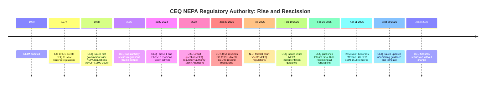
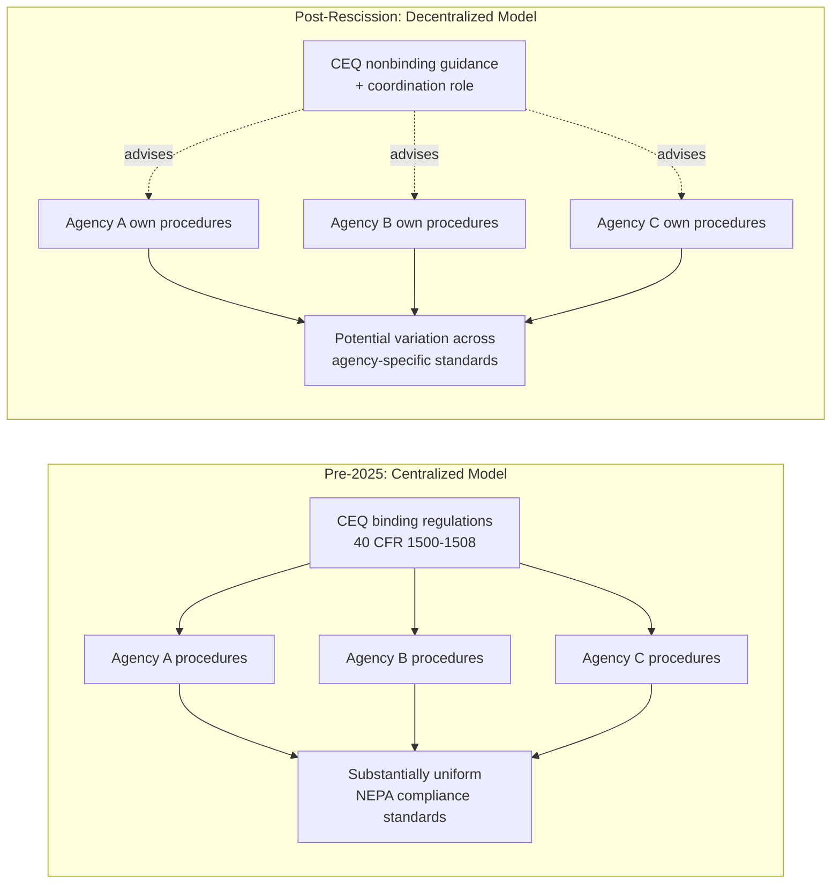

## CEQ's Historical Coordinating Role and the 2025 Rescission of Government-Wide NEPA Regulations

### Overview

For nearly five decades, the Council on Environmental Quality (CEQ) served as the central coordinating body for NEPA implementation across the federal government, issuing binding, government-wide regulations at 40 C.F.R. Parts 1500–1508 that every federal agency was required to follow. This architecture was fundamentally dismantled beginning in 2025: a combination of D.C. Circuit precedent questioning CEQ's rulemaking authority, a North Dakota federal district court decision vacating CEQ's regulations, and Executive Order 14154 led CEQ to rescind its NEPA regulations in their entirety, shifting NEPA implementation to a decentralized, agency-by-agency model coordinated through nonbinding CEQ guidance rather than binding regulation.

### CEQ's Historical Role and Authority

**Key Points**

- CEQ was established by NEPA itself, 42 U.S.C. § 4342, as an advisory body within the Executive Office of the President, tasked with assisting and advising the President on environmental matters, including NEPA implementation.
- NEPA's text instructs federal agencies to "identify and develop methods and procedures, in consultation with CEQ," to implement NEPA — NEPA does not expressly direct CEQ to issue regulations that agencies would be required to follow. [Congress.gov](https://www.congress.gov/crs-product/IF12960)
- Despite this textual ambiguity, over the course of nearly five decades, CEQ maintained—and agencies and courts routinely applied—government-wide regulations implementing NEPA. [Congress.gov](https://www.congress.gov/crs-product/IF12960)
- The source of CEQ's regulatory authority was traced not to NEPA's text but to **Executive Order 11991** (1977), issued by President Carter, which directed the agency to issue NEPA regulations and required other federal agencies to comply with CEQ's regulations. [Pillsbury Winthrop Shaw Pittman](https://www.pillsburylaw.com/en/news-and-insights/ceq-rescission-nepa-implementing-regulations.html)
- CEQ issued its foundational regulations in 1978 pursuant to that Executive Order, and subsequently revised them multiple times, including substantial rewrites in 2020 and again in 2024.

### The Legal Challenge to CEQ's Authority

**Key Points**

- In 2024, the **D.C. Circuit** held, in litigation involving the *Marin Audubon* line of cases, that CEQ lacked authority to issue binding regulations in the first place, because that authority rested on an executive order rather than a statutory delegation from Congress.
- The Court found that the CEQ improperly attempted to derive its NEPA rulemaking authority from an executive order rather than the law itself, reasoning that an executive order "is not 'law' within the meaning of the Constitution." [Saul Ewing LLP](https://www.saul.com/insights/alert/three-things-you-should-know-about-council-environmental-qualitys-removal-its)
- In February 2025, a **North Dakota federal district court** independently vacated the CEQ's Biden-era NEPA regulations, finding that the CEQ lacked statutory authority to promulgate NEPA regulations in the first place. [Saul Ewing LLP](https://www.saul.com/insights/alert/three-things-you-should-know-about-council-environmental-qualitys-removal-its)
- These decisions converged with executive branch action: on **January 20, 2025** (his first day in office), President Trump issued **Executive Order 14154** ("Unleashing American Energy"), which directed CEQ to consider rescission of the 2024 amendments to the NEPA regulations, issue nonbinding NEPA guidance to agencies and form a NEPA taskforce to coordinate revision of each federal agency's NEPA implementing regulations. The order also formally rescinded EO 11991, removing the original source of CEQ's claimed regulatory authority. [Holland & Knight](https://www.hklaw.com/en/insights/publications/2025/10/permitting-reform-in-action-ceq-updates-roadmap-for-agency)

### Timeline of the Rescission

- On Feb. 19, 2025, the Council on Environmental Quality issued an interim final rule and corresponding memorandum indicating intent to rescind prior NEPA regulations. [Holland & Knight](https://www.hklaw.com/en/insights/publications/2025/02/seismic-changes-in-federal-environmental-reviews-ceq-rescinds)
- On February 25, 2025, CEQ published an interim final rule rescinding its NEPA regulations and opening a 30-day public comment period before finalizing the rescission. [Congress.gov](https://www.congress.gov/crs-product/IF12960)
- CEQ asserted that, under the Administrative Procedure Act, notice-and-comment rulemaking was not required for this action for several reasons, although it did provide a comment period and received over 100,000 comments. [Congress.gov](https://www.congress.gov/crs-product/IF12960)
- The effective date for the rescission is April 11, 2025. [Congress.gov](https://www.congress.gov/crs-product/IF12960)
- Beginning on April 11, 2025, the NEPA implementing regulations codified at 40 C.F.R. parts 1500-1508 were removed from the Federal Register and are no longer in effect. [National Agricultural Law Center](https://nationalaglawcenter.org/ceq-rescinds-all-nepa-implementing-regulations/)
- On **January 8, 2026**, CEQ finalized the rescission: the White House Council on Environmental Quality published a final rule adopting—without change—its February 25, 2025, interim final rule (IFR) rescinding all iterations of CEQ's National Environmental Policy Act (NEPA) implementing regulations from the Code of Federal Regulations. [Pillsbury Winthrop Shaw Pittman](https://www.pillsburylaw.com/en/news-and-insights/ceq-rescission-nepa-implementing-regulations.html)
- The final rule primarily (1) responds to comments submitted on the IFR and (2) reaffirms CEQ's position that, following the rescission of Executive Order 11991 (1977), CEQ lacks authority to maintain binding, government-wide NEPA regulations applicable to other federal agencies. [Pillsbury Winthrop Shaw Pittman](https://www.pillsburylaw.com/en/news-and-insights/ceq-rescission-nepa-implementing-regulations.html)

### Role of Seven County Infrastructure Coalition v. Eagle County

**Key Points**

- CEQ situated its rescission decision partly in the context of the Supreme Court's decision in ***Seven County Infrastructure Coalition v. Eagle County***, 145 S. Ct. 1497 (2025) — a case concerning whether NEPA requires an agency to evaluate environmental impacts beyond the proximate effects of the action over which the agency has regulatory authority. [Holland & Knight](https://www.hklaw.com/en/insights/publications/2025/02/seismic-changes-in-federal-environmental-reviews-ceq-rescinds)
- CEQ characterized the post-*Seven County* landscape as one in which "all three branches of government at the highest possible levels—Congress, the President, and the Supreme Court—have called for, authorized, and directed NEPA reform." [Pillsbury Winthrop Shaw Pittman](https://www.pillsburylaw.com/en/news-and-insights/ceq-rescission-nepa-implementing-regulations.html)
- CEQ's September 2025 guidance drew directly on *Seven County*, instructing agencies that they only have to consider the "proposed action at hand" when determining the scope of a project, explaining that "an agency is not required by NEPA to analyze environmental effects from other projects separate in time, or separate in place, or that fall outside of the agency's regulatory authority, or that would have to be initiated by a third party." [Harvard](https://eelp.law.harvard.edu/tracker/ceq-finalized-phase-2-rule-implementing-national-environmental-policy-act/)
- This significantly narrows the indirect/cumulative effects doctrine as previously understood (see the direct/indirect/cumulative effects framework), reinforcing a proximate-cause-based limitation on agency analytical scope.

### What Replaces the CEQ Regulations

**Key Points**

- Rescission of CEQ's regulations did **not** eliminate agencies' individual NEPA compliance obligations, since agencies maintain procedures that govern their implementation of NEPA, and CEQ's rescission did not effectuate the revision or rescission of any agency's NEPA implementing procedures. [Federal Register](https://www.federalregister.gov/documents/2026/01/08/2026-00178/removal-of-national-environmental-policy-act-implementing-regulations)
- For the foreseeable future, NEPA will be implemented according to the policies and procedures established by federal agencies, and many agencies already have such procedures in place. [National Agricultural Law Center](https://nationalaglawcenter.org/ceq-rescinds-all-nepa-implementing-regulations/)
- On February 19, 2025, CEQ's Chief of Staff issued a **Memorandum for Heads of Federal Departments and Agencies**, which instructed federal agencies to revise or establish their NEPA implementing procedures within 12 months to expedite permitting approvals and align with NEPA's 2023 amendments, directing agencies to consult with CEQ during this process. [Congress.gov](https://www.congress.gov/crs-product/IF12960)
- On **September 29, 2025**, CEQ issued updated, nonbinding guidance: CEQ issued new, nonbinding guidance to assist federal agencies with implementation of NEPA, which supersedes and replaces CEQ's prior NEPA guidance, and released updated NEPA implementation guidance and an associated agency implementing procedures template. [Holland & Knight](https://www.hklaw.com/en/insights/publications/2025/10/permitting-reform-in-action-ceq-updates-roadmap-for-agency)[Harvard](https://eelp.law.harvard.edu/tracker/ceq-finalized-phase-2-rule-implementing-national-environmental-policy-act/)
- CEQ's ongoing role is now limited to **nonbinding guidance and interagency coordination** rather than binding rulemaking: EO 14154 directed CEQ to consider rescission of the 2024 Amendments, issue nonbinding guidance to agencies and form a NEPA task force to coordinate revisions of each federal agency's NEPA implementing regulations. [Holland & Knight](https://www.hklaw.com/en/insights/publications/2025/02/seismic-changes-in-federal-environmental-reviews-ceq-rescinds)
- CEQ set a deadline for agencies to complete this transition: guidance directs federal agencies to revise their NEPA procedures by February 19, 2026, with a particular focus on revisions that will expedite permitting approvals and foster simplified NEPA reviews. [Saul Ewing LLP](https://www.saul.com/insights/alert/three-things-you-should-know-about-council-environmental-qualitys-removal-its)

### Structural Shift: Before and After

### Practical and Litigation Consequences

**Key Points**

- **Loss of a uniform baseline**: Because CEQ's regulations formerly supplied a common definitional and procedural framework (e.g., "significantly," "major federal action," effects categories, alternatives requirements), rescission creates the possibility of divergent standards across agencies as each revises its own implementing procedures.
- The removal of the CEQ's overarching regulations may lead to inconsistencies among agency-specific NEPA regulations. In the interim, CEQ has encouraged federal agencies to follow existing procedures while transitioning to updated agency-specific rules. [Saul Ewing LLP](https://www.saul.com/insights/alert/three-things-you-should-know-about-council-environmental-qualitys-removal-its)[Saul Ewing LLP](https://www.saul.com/insights/alert/three-things-you-should-know-about-council-environmental-qualitys-removal-its)
- **Statutory text remains controlling**: The rescission does not repeal NEPA itself, including the 2023 Fiscal Responsibility Act amendments (42 U.S.C. § 4336 et seq.), which independently codify page limits, timelines, and certain procedural requirements directly in statute — these obligations continue to bind agencies regardless of CEQ's regulatory status.
- **Litigation posture shift**: Practitioners can no longer cite 40 C.F.R. Parts 1500–1508 as binding authority for actions occurring after April 11, 2025; instead, the relevant source of procedural obligation becomes (1) NEPA's statutory text, (2) the specific agency's own NEPA implementing procedures, and (3) case law interpreting NEPA directly (including *Seven County*, *Kleppe*, *Vermont Yankee*, and other Supreme Court precedent).
- **Ongoing consultation function**: CEQ's coordination role — reviewing agency procedures, issuing templates, and facilitating consistency — continues, but as a matter of interagency guidance and comity rather than binding legal compulsion. CEQ's guidance carries persuasive, not mandatory, weight in court.
- [Inference] Because agencies were directed to complete their own procedural revisions by February 19, 2026, and because this rescission and its downstream effects are recent and continuing to develop, the specific implementing procedures applicable to any given federal action should be verified directly against the relevant agency's current NEPA regulations rather than assumed from the historical CEQ framework.

### Comparison: Regulatory Landscape Before and After Rescission

| Feature | Pre-2025 (CEQ Regulations in Force) | Post-Rescission (Current) |
| --- | --- | --- |
| Governing regulations | 40 C.F.R. Parts 1500–1508 (binding, government-wide) | Rescinded; agency-specific procedures govern |
| Source of CEQ authority | EO 11991 (1977) | Rescinded by EO 14154; CEQ authority now limited to advisory/coordinating role |
| Uniformity across agencies | High — common definitions and procedures | Variable — dependent on each agency's revised procedures |
| CEQ's role | Binding rulemaker | Nonbinding guidance issuer and interagency coordinator |
| Key definitional source | CEQ regulations (e.g., "effects," "significantly") | Agency procedures + NEPA statutory text + case law (esp. *Seven County*) |
| Effective date of change | — | April 11, 2025 (IFR); finalized January 8, 2026 |

### Conclusion

The 2025–2026 rescission marks the most significant structural change to NEPA implementation since the statute's enactment in 1970, ending CEQ's nearly fifty-year role as the government-wide regulatory authority and returning primary implementing responsibility to individual federal agencies. The shift was driven by a convergence of judicial skepticism about CEQ's statutory authority, executive branch deregulatory priorities under EO 14154, and the Supreme Court's *Seven County* decision narrowing NEPA's analytical scope — collectively signaling a move toward decentralized, agency-specific, and more permitting-efficiency-oriented NEPA compliance, with CEQ's continuing role limited to nonbinding guidance and coordination rather than binding rule.

**Related Topics**

- Seven County Infrastructure Coalition v. Eagle County and proximate-cause limits on NEPA scope
- Agency-specific NEPA implementing procedures (post-rescission compliance)
- Fiscal Responsibility Act of 2023 statutory codification of NEPA requirements (42 U.S.C. § 4336a)
- Scope of review: direct, indirect, and cumulative effects (post-*Seven County* narrowing)
- Executive Order authority and the *Marin Audubon* D.C. Circuit line of cases
- Environmental impact statements and the hard look doctrine (post-rescission standard of review)
- Administrative Procedure Act rulemaking requirements and interim final rules
- Permitting reform and NEPA litigation risk in a decentralized regulatory landscape