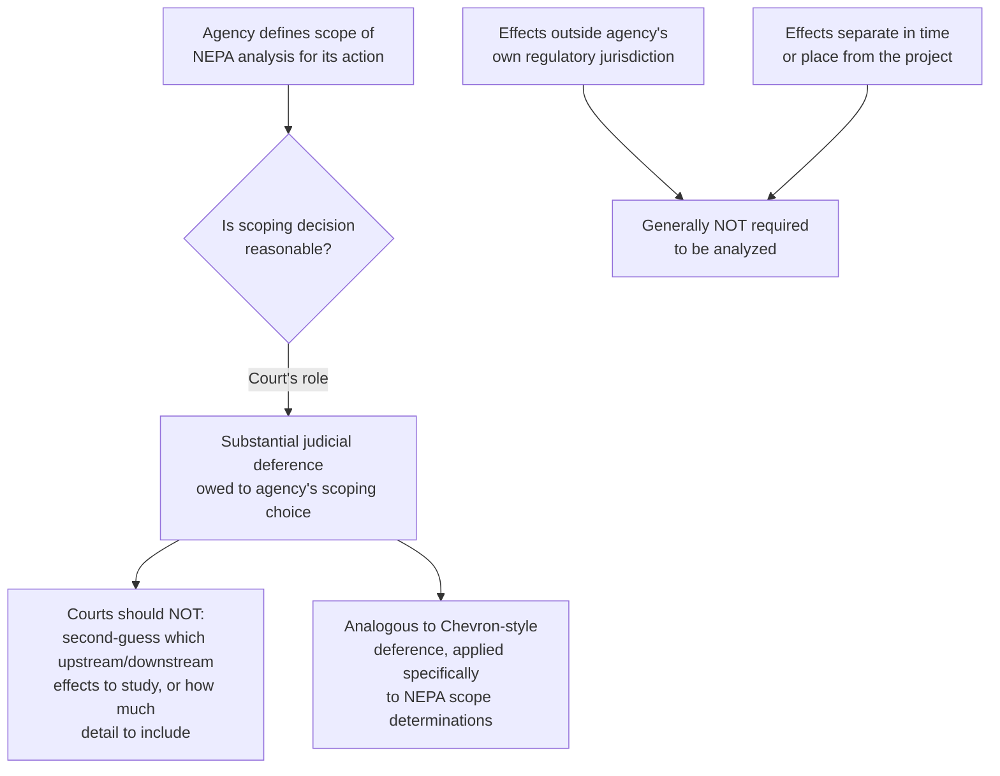

## Seven County Infrastructure Coalition v. Eagle County and Deference to Agency Scoping Decisions

### Overview

*Seven County Infrastructure Coalition v. Eagle County, Colorado*, 605 U.S. 168 (2025), is the first major NEPA case decided by the Supreme Court in roughly two decades, and it fundamentally reoriented how courts review the scope of an agency's environmental analysis. Decided May 29, 2025, the case addressed whether NEPA requires an agency to study the indirect environmental impacts of activities it does not itself regulate, and it produced a sweeping statement about the level of judicial deference owed to agencies in defining the scope of their own NEPA review — deference the Court held the D.C. Circuit had failed to apply.

### Case Background and Procedural History

**Key Points**

- The case arose from a decision by the **Surface Transportation Board (STB)** approving an 87-mile segment of railway in the Uinta Basin, Utah, designed to connect an isolated waxy crude oil production region to the national rail network, ultimately facilitating transport to Gulf Coast refineries.
- Eagle County, Colorado, and environmental groups challenged the STB's EIS, arguing it failed to address all reasonably foreseeable environmental harms, including:
  - "Upstream" effects from increased crude oil drilling in the Uinta Basin
  - "Downstream" effects from increased oil refining along the Gulf Coast
  - Increased rail accident frequency and wildfire risk along the rail line beyond the STB's immediate jurisdiction
  - Impacts on water resources along the Colorado River
- The **D.C. Circuit** agreed with the challengers, holding that the Board's environmental review was insufficient under NEPA and vacating the STB's EIS, ordering a new environmental review.
- The Supreme Court granted certiorari (argued December 10, 2024) to resolve whether NEPA requires an agency to study environmental impacts beyond the proximate effects of the action over which the agency has regulatory authority.

### The Holding

**Key Points**

- The Court's holding: **the D.C. Circuit failed to afford the Surface Transportation Board the substantial judicial deference required in NEPA cases and incorrectly interpreted NEPA to require consideration of indirect environmental effects** of upstream and downstream projects that are separate in time or place from the Uinta Basin Railway.
- The bottom-line judgment was **unanimous (8-0)** — reversing the D.C. Circuit and reinstating the STB's approval — though the Court's reasoning was not unanimous.
- **Majority opinion**: Justice Kavanaugh, joined by Chief Justice Roberts and Justices Thomas, Alito, and Barrett.
- **Concurrence in the judgment**: Justice Sotomayor, joined by Justices Kagan and Jackson, agreed with the outcome but criticized the majority for "unnecessarily grounding its analysis largely in matters of policy" rather than resting on narrower statutory grounds.
- The Court held that, in approving the railway line, the STB had no obligation under NEPA to consider the potential impacts from crude oil production "upstream" of the railroad line or refining "downstream" of it, because those effects stemmed from separate projects outside the STB's own regulatory jurisdiction.

### The Deference Framework Articulated

**Key Points**

- The Court repeatedly characterized NEPA cases as a category warranting **deference to the agency**, framing the question of which effects to study and how much detail to provide as matters substantially left to agency judgment, reviewed only for reasonableness — not de novo by the reviewing court.
- [Unverified — subject to ongoing scholarly debate] Some commentary (e.g., Harvard Law Review analysis) suggests the Court's deference language may reach more broadly than just the specific "which indirect effects count" question actually presented, potentially extending to other statutory interpretations of NEPA generally — the full doctrinal reach of this deference framework remains to be worked out in subsequent lower-court applications.
- The Court reaffirmed and extended the logic of ***Department of Transportation v. Public Citizen***, 541 U.S. 752 (2004): agencies need not study impacts that they lack statutory authority to prevent, and do not have to consider effects from other projects outside the agency's regulatory authority or in a separate time and place.
- The Court emphasized that NEPA should function as a **"modest procedural requirement"** rather than, in the language echoed by commentators, "a blunt and haphazard tool employed by project opponents" to slow or halt infrastructure projects — reflecting the Court's broader concern about NEPA litigation being used to delay projects rather than to inform genuine agency decision-making.

### Limits of the Holding

**Key Points**

- The Court did not adopt an absolute rule excluding all geographically or temporally separated effects. It expressly preserved that **"the environmental effects of the project at issue" may still "fall within NEPA even if those effects might extend outside the geographical territory of the project or might materialize later in time."**
- The critical distinction the Court drew is not distance or timing per se, but whether the effect is caused by the *project under review* versus caused by a **separate project** undertaken by a different actor under different regulatory authority.
- This preserves room for indirect effects analysis (see the direct/indirect/cumulative effects framework) where the causal chain runs through the agency's own action, while foreclosing analysis of effects from independently-operating third-party projects the agency does not regulate.

### Practical Effect: Narrowing the Scope of Required Analysis

**Example**

| Pre-*Seven County* (D.C. Circuit approach) | Post-*Seven County* (Supreme Court approach) |
| --- | --- |
| Agency required to analyze reasonably foreseeable effects of related upstream/downstream activities, even outside its own jurisdiction | Agency generally not required to analyze effects of projects separate in time, place, or jurisdiction — even if causally linked |
| Court independently assessed adequacy of the agency's scope determination | Court gives substantial deference to the agency's own reasonable scoping judgment |
| Broader, more searching hard look on scope questions | Narrower review — courts focus on reasonableness of agency's scope choice, not substituting judgment |
| Cumulative/indirect effects doctrine (*Kleppe*) applied expansively | Cumulative/indirect effects doctrine constrained by proximate cause and jurisdictional boundaries |

### Post-Decision Application in Lower Courts

**Key Points**

- In the year following the decision, courts have applied *Seven County* to limit the scope of judicial review and give more deference to the government in NEPA cases, repeatedly emphasizing a deferential standard of review and declining to require analysis of effects from projects that are beyond an agency's jurisdiction or are separate in time and place.
- Following *Seven County*, litigants bringing NEPA challenges now face higher hurdles, particularly with respect to consideration of upstream and downstream effects when the agency lacks regulatory authority over those activities, coupled with the Supreme Court's clear direction for deference to agencies in the NEPA review context.
- [Inference] Because courts have only had roughly a year to apply the decision, and because NEPA reviews initiated under the new framework take time to complete and then be challenged, the full doctrinal contours of *Seven County*'s deference rule — including its interaction with the separately evolving CEQ regulatory rescission (see related topic) — are still developing and should be monitored through current case law rather than treated as fully settled.

### Interaction with the CEQ Regulatory Rescission

**Key Points**

- *Seven County* was decided against the backdrop of, and directly cited by, CEQ's 2025 rescission of its government-wide NEPA regulations: CEQ situated its rescission partly in the wake of *Seven County*, framing it as one of several signals that "all three branches of government" have called for NEPA reform.
- CEQ's September 2025 updated guidance drew directly on the decision, instructing agencies that they only have to consider the "proposed action at hand" when scoping a project, and that "an agency is not required by NEPA to analyze environmental effects from other projects separate in time, or separate in place, or that fall outside of the agency's regulatory authority, or that would have to be initiated by a third party" — language taken essentially verbatim from the Court's reasoning.
- Together, *Seven County* and the CEQ rescission mark a coordinated judicial and executive branch narrowing of NEPA's practical reach: the judiciary constraining the scope of required analysis and the appropriate standard of review, while the executive branch simultaneously dismantles the binding regulatory framework that had previously operationalized a broader view of that scope.

### Diagram: Seven County's Reallocation of Scoping Authority (svg_diagram)

<svg xmlns="http://www.w3.org/2000/svg" viewBox="0 0 740 360">
<text x="370" y="28" text-anchor="middle" font-size="17" font-weight="bold" fill="#1a1a1a">Seven County: Reallocating Scoping Authority (svg_diagram)</text>
<rect x="40" y="60" width="300" height="240" rx="10" fill="#fff0f0" stroke="#e03131" stroke-width="1.5" />
<text x="190" y="88" text-anchor="middle" font-size="14" font-weight="bold" fill="#1a1a1a">Pre-2025 (D.C. Cir.)</text>
<text x="190" y="115" text-anchor="middle" font-size="11" fill="#1a1a1a">Court independently assesses</text>
<text x="190" y="132" text-anchor="middle" font-size="11" fill="#1a1a1a">whether agency's scope of</text>
<text x="190" y="149" text-anchor="middle" font-size="11" fill="#1a1a1a">analysis was adequate</text>
<text x="190" y="180" text-anchor="middle" font-size="11" fill="#1a1a1a">Broad reading of</text>
<text x="190" y="197" text-anchor="middle" font-size="11" fill="#1a1a1a">"reasonably foreseeable"</text>
<text x="190" y="228" text-anchor="middle" font-size="11" fill="#1a1a1a">Upstream/downstream</text>
<text x="190" y="245" text-anchor="middle" font-size="11" fill="#1a1a1a">3rd-party effects often</text>
<text x="190" y="262" text-anchor="middle" font-size="11" fill="#1a1a1a">required to be analyzed</text>
<rect x="400" y="60" width="300" height="240" rx="10" fill="#ebfbee" stroke="#2f9e44" stroke-width="1.5" />
<text x="550" y="88" text-anchor="middle" font-size="14" font-weight="bold" fill="#1a1a1a">Post-Seven County (2025)</text>
<text x="550" y="115" text-anchor="middle" font-size="11" fill="#1a1a1a">Substantial deference to</text>
<text x="550" y="132" text-anchor="middle" font-size="11" fill="#1a1a1a">agency's own reasonable</text>
<text x="550" y="149" text-anchor="middle" font-size="11" fill="#1a1a1a">scoping determination</text>
<text x="550" y="180" text-anchor="middle" font-size="11" fill="#1a1a1a">Proximate-cause limitation</text>
<text x="550" y="197" text-anchor="middle" font-size="11" fill="#1a1a1a">(Public Citizen extended)</text>
<text x="550" y="228" text-anchor="middle" font-size="11" fill="#1a1a1a">3rd-party/separate-project</text>
<text x="550" y="245" text-anchor="middle" font-size="11" fill="#1a1a1a">effects generally excluded</text>
<text x="550" y="262" text-anchor="middle" font-size="11" fill="#1a1a1a">from required analysis</text>
<line x1="340" y1="180" x2="398" y2="180" stroke="#495057" stroke-width="2" marker-end="url(#a4)" />
<text x="370" y="170" text-anchor="middle" font-size="10" fill="#495057">8-0</text>
</svg>

### Practice Pointers

**Key Points**

- When defending an EIS, agencies and applicants should now emphasize the boundaries of the agency's own regulatory jurisdiction as an affirmative basis for excluding upstream/downstream effects analysis, citing *Seven County* alongside *Public Citizen*.
- When challenging an EIS, litigants should focus scope-of-analysis arguments on effects genuinely caused by the project under review itself (even if geographically or temporally attenuated), rather than effects attributable to legally separate third-party projects — the latter category now faces a substantially higher bar post-*Seven County*.
- Litigators should anticipate that courts will apply a markedly more deferential standard to agency scoping decisions generally, not just to the specific upstream/downstream fact pattern presented in the case, given the breadth of the Court's language regarding deference in "NEPA cases" as a category.
- [Inference] Because the full scope of the deference framework announced in *Seven County* remains actively contested in scholarly commentary and is still being worked out through lower court applications, and because it intersects with the ongoing, still-developing CEQ regulatory rescission, practitioners should track recent circuit-level decisions applying *Seven County* to the specific type of agency action and effects category at issue in their matter.

### Conclusion

*Seven County* represents the most significant Supreme Court statement on NEPA's scope in two decades, reorienting judicial review away from independent assessment of an agency's environmental analysis and toward substantial deference to the agency's own reasonable determination of what effects to study. By reaffirming and extending *Public Citizen*'s jurisdictional limitation and explicitly instructing courts to defer to agencies in "NEPA cases," the decision — issued unanimously as to result though divided in reasoning — substantially raises the bar for challengers seeking to compel analysis of upstream, downstream, or third-party effects outside an agency's own regulatory authority, while leaving intact NEPA's requirement that agencies analyze the reasonably foreseeable effects of the project actually before them.

**Related Topics**

- Scope of review: direct, indirect, and cumulative effects
- CEQ's historical coordinating role and the 2025 rescission of government-wide NEPA regulations
- Department of Transportation v. Public Citizen and proximate cause in NEPA
- Environmental impact statements and the hard look doctrine
- Standard of review under APA § 706(2)(A) post-*Seven County*
- Agency-specific NEPA implementing procedures and jurisdictional scoping
- NEPA and climate change/greenhouse gas emissions analysis after *Seven County*
- Segmentation/piecemealing doctrine in light of the proximate-cause limitation