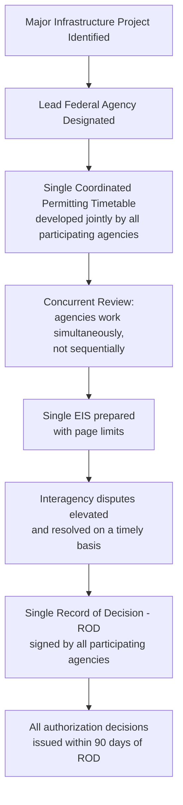
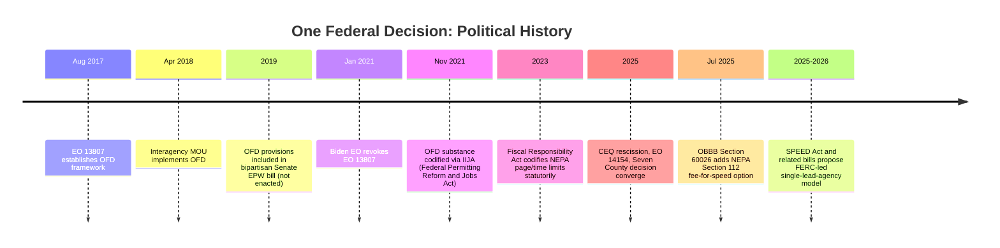

## Permitting Reform Proposals and One Federal Decision Coordination Models

### Overview

"One Federal Decision" (OFD) refers to a coordination framework designed to consolidate multi-agency environmental review and permitting for major infrastructure projects into a single, synchronized process — a single schedule, a single EIS, and a single Record of Decision — rather than sequential, duplicative agency-by-agency reviews. Originating as a 2017 executive initiative, OFD has evolved into a bipartisan template that recurs across subsequent permitting reform efforts, including statutory codification in 2021 infrastructure legislation and the current wave of post-*Seven County*/post-CEQ-rescission reform proposals moving through Congress and federal agencies in 2025–2026.

### Origins: Executive Order 13807 and the OFD Framework

**Key Points**

- President Trump signed **Executive Order 13807** ("Establishing Discipline and Accountability in the Environmental Review and Permitting Process for Infrastructure Projects") in August 2017, intended to speed up environmental reviews for major infrastructure projects by mandating additional coordination and planning among federal agencies.
- The EO defined a **"major infrastructure project"** as one for which multiple federal agency authorizations are required, the lead agency has determined it will prepare an EIS under NEPA, and the project sponsor has demonstrated the reasonable availability of funds sufficient to complete the project.
- On April 9, 2018, the heads of a dozen federal agencies executed a **Memorandum of Understanding (MOU)** implementing EO 13807, accompanied by OMB-CEQ guidance.
- The MOU applied to infrastructure projects only where the lead agency determined the project sponsor had demonstrated "reasonable availability" of construction funds, with the burden of that demonstration placed on the project sponsor.

### Core Elements of the OFD Model

**Key Points**

The framework required that agencies:

1. **Coordinate from the outset** using a joint schedule rather than developing separate timelines
2. **Empower a lead agency** to enforce the schedule across all participating agencies
3. **Work concurrently**, not in sequence — eliminating the practice of agencies "waiting in turn" for other agencies to complete their review before beginning their own
4. **Generate a single, readable review document** subject to page limits
5. **Produce a timely final decision** within 90 days of completing the review document
6. Aim for a **two-year goal** for completing the overall review and authorization process for EISs initiated after August 15, 2017

### Rationale and Empirical Motivation

**Key Points**

- The framework responded to documented, severe permitting delays: the median environmental review completion time for a complex highway project exceeded seven years according to a 2014 GAO report, and the review/permitting process for one North Carolina bridge replacement project took more than 20 years.
- Given that permit reviews can involve up to 30 statutes and as many as a dozen federal departments and agencies, proponents characterized OFD's core innovations — joint scheduling, concurrent (not sequential) review, and a single decision document — as largely common-sense process fixes to a structurally fragmented review system rather than substantive weakening of environmental standards.
- Estimates suggested OFD-style coordination could shorten permit review processes from as much as ten years down to two years in some cases, though such estimates are necessarily project- and context-dependent.

### Political History: Rescission, Statutory Codification, and Revival

**Key Points**

- OFD has enjoyed **bipartisan support** across administrations despite originating in a Trump-era executive order.
- The order remained in effect until it was **revoked by President Biden** via executive order on his first day in office (January 20, 2021).
- However, the substance of the OFD approach was **separately codified in the Infrastructure Investment and Jobs Act (IIJA)**, via the bipartisan Federal Permitting Reform and Jobs Act (authored by Senators Portman, Sinema, and Manchin), demonstrating that the coordination model outlived the specific executive order that first implemented it.
- In 2019, OFD-style provisions were included by the Senate Committee on Environment and Public Works in a proposed transportation bill that, while not enacted, was approved unanimously in committee by both parties — further evidence of the model's cross-partisan durability.

### Current Generation of Reform (2025–2026): Statutory and Regulatory Layers

**Key Points**

The current wave of permitting reform operates across several simultaneous tracks:

1. **CEQ regulatory rescission** (see related topic): removal of binding government-wide NEPA regulations, shifting coordination to agency-specific procedures and nonbinding CEQ guidance (see *CEQ's historical coordinating role and the 2025 rescission*).
2. **Judicial narrowing**: *Seven County Infrastructure Coalition v. Eagle County*, 605 U.S. 168 (2025), requiring substantial deference to agency scoping decisions and limiting required analysis of upstream/downstream third-party effects (see related topic).
3. **Statutory fee-for-speed mechanism**: Section 60026 of the **One Big Beautiful Bill Act (OBBB)**, Pub. L. 119-21 (July 5, 2025), enacted a new **Section 112 to NEPA**, which permits a project sponsor to pay a fee, set by CEQ on a project-specific basis, to receive shortened NEPA review periods. If the project sponsor pays the CEQ-determined amount, review periods are cut in half — from two years to one year for an EIS and from one year to 180 days for an EA (codified at 42 U.S.C. §§ 4336, 4336e).
4. **Agency-specific procedural consolidation**: Agencies have moved to replace CEQ's former uniform framework with their own department-wide rules. For example, USDA finalized a rule that consolidated seven agency-specific NEPA regulations into a single, department-wide framework, reducing the overall volume of regulations by 66 percent, with USDA reporting it has been able to reduce environmental review timelines by up to 80% under interim implementation of that consolidated approach.
5. **Cross-agency synchronization**: On June 30, 2025, major permitting agencies across the Executive Branch updated their respective NEPA implementing procedures, with CEQ continuing to coordinate consistency across agencies pursuant to its statutory consultation role under NEPA § 102(2)(B), 42 U.S.C. § 4332(2)(B), even without binding regulatory authority.
6. **Agency-specific rulemakings responding to the new landscape**: for example, the Surface Transportation Board has proposed to clarify, update, and streamline its own environmental regulations implementing NEPA in light of CEQ's rescission, the 2023 and 2025 NEPA amendments, and recent Supreme Court precedent including *Seven County*.

### Pending Legislative Proposals: The SPEED Act and Single-Lead-Agency Models

**Key Points**

- The House's bipartisan **Simplifying Permitting for Efficient and Effective Deployment (SPEED) Act** and related Senate proposals (e.g., S. 4944) represent a further evolution of the OFD coordination concept, with some proposals moving toward a **single statutory lead agency model** for specific infrastructure categories.
- For example, one proposal for natural gas infrastructure would have the **Federal Energy Regulatory Commission (FERC)** operate as the sole lead agency, with authority to establish binding schedules, coordinate participating agencies, and drive concurrent environmental and authorization reviews — federal and state agencies would be required to meet defined deadlines, with most authorizations issued on compressed timelines following completion of review.
- Motivations cited for these proposals extend beyond traditional infrastructure concerns to include rising demand from data centers, artificial intelligence infrastructure, domestic manufacturing, LNG exports, and broader electric grid reliability needs, reflecting increasingly interdependent natural gas and electricity systems.
- [Unverified] As of this writing, the SPEED Act and related single-lead-agency proposals remain pending legislative proposals rather than enacted law; their final form, if enacted, may differ materially from current drafts, and practitioners should verify current legislative status before relying on specific provisions.

### Comparative Table: Coordination Models Across Eras

| Feature | OFD (EO 13807, 2017) | IIJA Codification (2021) | 2025–2026 Reform Wave |
| --- | --- | --- | --- |
| Legal basis | Executive Order + interagency MOU | Statute (Federal Permitting Reform and Jobs Act) | CEQ rescission + agency rules + OBBB § 112 + pending legislation |
| Lead agency model | Single lead agency per project | Single lead agency per project | Proposals for sector-specific statutory lead agency (e.g., FERC for gas) |
| Schedule | Joint Permitting Timetable, 2-year goal | Similar coordinated schedule requirements | CEQ fee-based expedited timelines (1 year EIS / 180 days EA if fee paid) |
| Document | Single EIS, page-limited | Single EIS | Agency-specific consolidated procedures; statutory page/time limits (FRA 2023) |
| Decision | Single ROD, 90-day post-review decision | Single ROD | Varies by agency-specific procedure |
| Durability | Revoked by subsequent administration | Statutory — survives administration change | Mixed: some statutory (OBBB, FRA), some regulatory/guidance (reversible) |

### Persistent Tensions in Coordination-Model Reform

**Key Points**

- **Speed vs. rigor trade-off**: proponents argue coordination models reduce duplicative, sequential delay without necessarily reducing substantive environmental analysis; critics contend compressed timelines and reduced page limits risk superficial treatment of genuine environmental concerns, potentially undermining the hard look doctrine's functional requirements.
- **Durability of executive/regulatory action vs. statute**: history demonstrates that coordination frameworks created by executive order (OFD in 2017) are readily reversible by a subsequent administration, while framework elements codified by statute (IIJA in 2021, OBBB § 112 in 2025, FRA page/time limits in 2023) persist across administrations — a key consideration for practitioners assessing the durability of current 2025–2026 reforms.
- **Fragmentation risk post-CEQ-rescission**: because current coordination now depends on agency-specific procedures rather than uniform binding CEQ regulations, achieving OFD-style single-decision coordination across multiple agencies may require more active, voluntary interagency cooperation (MOUs, joint procedures) than was previously compelled by a single regulatory source.
- [Inference] Because permitting reform in this period is proceeding simultaneously through executive guidance, agency rulemaking, statutory amendment, and pending legislation, the operative coordination requirements for any specific project should be verified against the current procedures of each involved lead and cooperating agency, rather than assumed from the general OFD template, since implementation details vary significantly by agency and project type.

### Diagram: Layers of Current Permitting Reform (svg_diagram)

<svg xmlns="http://www.w3.org/2000/svg" viewBox="0 0 740 380">
<text x="370" y="26" text-anchor="middle" font-size="16" font-weight="bold" fill="#1a1a1a">Layers of 2025-2026 Permitting Reform (svg_diagram)</text>
<rect x="60" y="50" width="620" height="60" rx="8" fill="#e8f0fe" stroke="#3b5bdb" stroke-width="1.5" />
<text x="370" y="75" text-anchor="middle" font-size="12" font-weight="bold" fill="#1a1a1a">Judicial: Seven County (2025)</text>
<text x="370" y="95" text-anchor="middle" font-size="11" fill="#1a1a1a">Deference to agency scoping; proximate-cause limits</text>
<rect x="60" y="120" width="620" height="60" rx="8" fill="#fff4e6" stroke="#e8590c" stroke-width="1.5" />
<text x="370" y="145" text-anchor="middle" font-size="12" font-weight="bold" fill="#1a1a1a">Regulatory: CEQ Rescission (2025-2026)</text>
<text x="370" y="165" text-anchor="middle" font-size="11" fill="#1a1a1a">40 CFR 1500-1508 removed; agency-specific procedures govern</text>
<rect x="60" y="190" width="620" height="60" rx="8" fill="#ebfbee" stroke="#2f9e44" stroke-width="1.5" />
<text x="370" y="215" text-anchor="middle" font-size="12" font-weight="bold" fill="#1a1a1a">Statutory: FRA (2023) + OBBB Sec. 112 (2025)</text>
<text x="370" y="235" text-anchor="middle" font-size="11" fill="#1a1a1a">Page/time limits; fee-for-expedited-review option</text>
<rect x="60" y="260" width="620" height="60" rx="8" fill="#f8f0fc" stroke="#9c36b5" stroke-width="1.5" />
<text x="370" y="285" text-anchor="middle" font-size="12" font-weight="bold" fill="#1a1a1a">Coordination Model: One Federal Decision legacy</text>
<text x="370" y="305" text-anchor="middle" font-size="11" fill="#1a1a1a">Single schedule / lead agency / concurrent review (ongoing template)</text>
<rect x="60" y="330" width="620" height="40" rx="8" fill="#fff9db" stroke="#f08c00" stroke-width="1.5" />
<text x="370" y="355" text-anchor="middle" font-size="11" fill="#1a1a1a">Pending: SPEED Act / single statutory lead agency proposals (not yet enacted)</text>
</svg>

### Practice Pointers

**Key Points**

- When advising project sponsors on multi-agency federal actions, identify the lead agency early and confirm whether that agency has adopted updated NEPA implementing procedures consistent with the post-rescission landscape, since procedures now vary meaningfully by agency.
- Evaluate whether the OBBB Section 112 fee-based expedited review option is available and cost-effective for time-sensitive projects, recognizing that CEQ sets the fee on a project-specific basis and coordination with government agencies before opting in is expected.
- For projects involving multiple authorizing agencies, seek an interagency coordination agreement or MOU modeled on the OFD framework's core elements (joint schedule, concurrent review, single decision document) even though such coordination is no longer centrally mandated by binding CEQ regulation.
- [Inference] Given the currently pending status of legislation such as the SPEED Act and related single-lead-agency proposals, and the pace of ongoing agency-specific rule finalization (e.g., USDA's April 2026 final rule, STB's March 2026 proposed rule), practitioners should treat this area as actively developing and confirm the current status of any specific proposal or agency rule before advising on its applicability to a given project.

### Conclusion

One Federal Decision represents a durable, bipartisan template for multi-agency permitting coordination — joint scheduling, concurrent (not sequential) review, a single EIS, and a single Record of Decision — that has survived multiple political reversals precisely because its core logic (reducing duplicative process rather than substantive standards) has attracted cross-partisan support. The current 2025–2026 reform period layers this coordination template atop simultaneous judicial narrowing (*Seven County*), regulatory deregulation (the CEQ rescission), and new statutory mechanisms (FRA page/time limits, OBBB's fee-for-speed provision), while pending legislation like the SPEED Act pushes toward even more centralized, single-statutory-lead-agency models for specific infrastructure sectors — creating a permitting landscape that is faster and more coordinated in design, but also more fragmented in its legal foundations than the pre-2025 uniform CEQ regulatory regime.

**Related Topics**

- CEQ's historical coordinating role and the 2025 rescission of government-wide NEPA regulations
- Seven County Infrastructure Coalition v. Eagle County and deference to agency scoping decisions
- Fiscal Responsibility Act of 2023 statutory NEPA page and time limits
- OBBB Section 112 fee-based expedited NEPA review
- Agency-specific NEPA implementing procedures (post-rescission compliance)
- SPEED Act and single-lead-agency permitting models
- Federal Permitting Improvement Steering Council and the Permitting Council's role
- Interagency MOUs and coordination agreements in multi-authorization projects