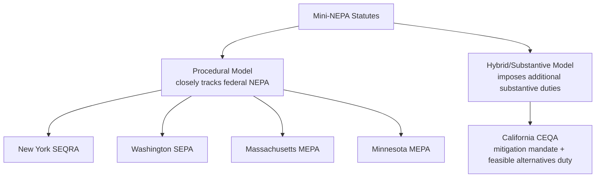

## State Mini-NEPA Statutes and Environmental Review at the State Level

### Overview

"Mini-NEPA" is the common shorthand for state environmental review statutes modeled on, and generally more protective or more procedurally rigorous than, the federal National Environmental Policy Act. Roughly half of U.S. states have enacted some form of mini-NEPA, requiring state (and often local) agencies to prepare environmental review documents analogous to a federal EIS or EA before approving state or local government actions. These statutes operate independently of federal NEPA — they can apply to purely state and local actions with no federal nexus at all — and, especially following the 2025 CEQ rescission of binding federal NEPA regulations, they represent an increasingly significant and comparatively stable body of environmental review law.

### Rationale and General Structure

**Key Points**

- Mini-NEPA statutes fill the gap left by federal NEPA's narrow trigger: NEPA applies only to "major federal actions," so a state or local project involving no federal funding, permitting, or land does not trigger federal review at all, regardless of its environmental significance.
- Structurally, most mini-NEPA statutes mirror federal NEPA's basic architecture:
  - A threshold determination of whether the action is subject to review (often based on the level of state/local government discretion or funding involvement)
  - A tiered document structure roughly analogous to categorical exclusions, EAs, and EISs
  - A public comment and disclosure process
  - Emphasis on alternatives analysis and disclosure of environmental consequences
  - Primarily *procedural* character — most, though not all, mini-NEPAs do not mandate a particular substantive outcome
- Critically, several state mini-NEPAs diverge from federal NEPA in significant, sometimes substantive, ways — most notably California's CEQA, which imposes affirmative substantive obligations in certain circumstances that federal NEPA does not.

### Leading Examples

**California Environmental Quality Act (CEQA)** — Cal. Pub. Res. Code § 21000 et seq.

- Widely regarded as the most stringent and most heavily litigated state environmental review statute in the country.
- Requires lead agencies to prepare an **Initial Study** to determine whether a project may have a significant effect on the environment.
- Document tiers roughly parallel to federal NEPA:
  - **Categorical Exemption** (analogous to a categorical exclusion)
  - **Negative Declaration** or **Mitigated Negative Declaration** (analogous to a FONSI, the latter with mitigation)
  - **Environmental Impact Report (EIR)** (analogous to an EIS)
- Key CEQA-specific features that go beyond federal NEPA:
  - A **substantive mandate**: CEQA generally requires agencies to adopt feasible mitigation measures or feasible alternatives that would substantially lessen significant environmental effects, unless specific economic, legal, social, technological, or other considerations make mitigation or alternatives infeasible — this is a substantive obligation, not merely a disclosure requirement.
  - A broader and more frequently litigated "fair argument" standard for triggering full EIR review (if substantial evidence supports a fair argument that a project may have a significant effect, an EIR is generally required, even if other evidence supports a contrary conclusion).
  - Extensive litigation volume — CEQA lawsuits are a defining feature of California land use and infrastructure practice.

**New York State Environmental Quality Review Act (SEQRA)** — N.Y. Envtl. Conserv. Law § 8-0101 et seq.

- Applies broadly to state and local government actions, including many private development projects requiring discretionary government approval.
- Uses an **Environmental Assessment Form (EAF)** to make a threshold significance determination, leading to either a **negative declaration** or a requirement to prepare a **Draft/Final Environmental Impact Statement (DEIS/FEIS)**.
- Designates a **lead agency** among multiple involved agencies, coordinating review much like federal NEPA's lead-agency concept.
- Primarily procedural, though SEQRA findings must demonstrate that adverse environmental effects have been minimized or avoided to the maximum extent practicable, consistent with social, economic, and other essential considerations — a "hard look plus mitigation findings" standard.

**Washington State Environmental Policy Act (SEPA)** — Wash. Rev. Code ch. 43.21C

- Closely modeled on federal NEPA, requiring an **environmental checklist**, and where warranted, a **Determination of Significance (DS)** leading to an EIS, or a **Determination of Nonsignificance (DNS)**.
- Notable for its integration with Washington's Growth Management Act and local land use planning processes.

**Other notable mini-NEPAs**: Massachusetts (MEPA), Minnesota (MEPA), Hawaii (HEPA), Connecticut, New Jersey (limited/sectoral), Montana (MEPA), and others — approximately half of all states have some form of comprehensive or sectoral environmental review statute. [Unverified — exact current count and scope vary by source and by recent legislative amendments; verify current statutory status for the specific state at issue.]

### Comparative Framework: Federal NEPA vs. Representative Mini-NEPAs

| Feature | Federal NEPA (post-2025 rescission) | CEQA (California) | SEQRA (New York) | SEPA (Washington) |
| --- | --- | --- | --- | --- |
| Trigger | "Major federal action" | Discretionary government approval of a "project" | State/local agency action, including many private projects | Government action with probable significant environmental impact |
| Substantive mandate? | No (procedural only) | Yes — feasible mitigation/alternatives generally required | Findings must show impacts minimized "to the maximum extent practicable" | Generally procedural |
| Central document | EIS | EIR | EIS (state form) | EIS |
| Governing regulatory source | Agency-specific procedures (post-CEQ rescission) | CEQA Guidelines, 14 C.C.R. § 15000 et seq. | SEQRA regulations, 6 N.Y.C.R.R. Part 617 | WAC ch. 197-11 |
| Litigation volume | Moderate–high, evolving post-*Seven County* | Very high | High | Moderate |
| Applies to private projects? | Only where federal nexus exists | Yes, when discretionary government approval required | Yes, when discretionary approval required | Yes, when discretionary approval required |

### Interaction with Federal NEPA on Mixed-Funding Projects

**Key Points**

- Many projects involve both federal and state/local approvals (e.g., a state highway project using federal transportation funding), triggering **both** federal NEPA and the relevant state mini-NEPA simultaneously.
- Some states have adopted **joint or combined review procedures** to reduce duplication, allowing a single environmental document to satisfy both federal and state requirements where the analytical content substantially overlaps (conceptually similar to the federal-federal coordination achieved through "One Federal Decision" — see related topic — but operating across the federal-state boundary instead).
- Even where combined review is used, the two legal regimes remain **independently enforceable**: a project that survives a federal NEPA challenge is not thereby immunized from a mini-NEPA challenge, and vice versa — this mirrors the same "independently required" dynamic seen in the NEPA/Section 106 relationship (see related topic).
- Following the 2025 federal CEQ rescission and the narrowing effect of *Seven County Infrastructure Coalition v. Eagle County* (see related topic) on federal NEPA's scope, some practitioners and commentators note that mini-NEPA statutes — particularly CEQA and SEQRA, which retain their own independently codified scope and substantive requirements — may take on comparatively greater practical significance for environmental review in states with robust mini-NEPA regimes, since they are unaffected by changes to the federal regulatory framework. [Inference] This is a reasonable inference from the independence of state statutory schemes from federal regulatory change, but the practical magnitude of any such shift will vary significantly by state and project type and should not be assumed without state-specific analysis.

### Standard of Judicial Review Under Mini-NEPAs

**Key Points**

- Most mini-NEPAs are reviewed under a standard analogous to federal APA arbitrary-and-capricious review, though the precise formulation varies by state (e.g., CEQA's "substantial evidence" and "fair argument" standards operate somewhat differently from strict arbitrary-and-capricious review).
- State courts generally apply their own version of a "hard look" requirement, assessing whether the responsible agency reasonably identified and disclosed environmental impacts and reasonably considered alternatives and mitigation — but state courts are not bound by federal NEPA case law and may develop divergent doctrine.
- CEQA in particular has generated an unusually dense body of state appellate case law addressing issues such as baseline selection, segmentation ("piecemealing," analogous to the federal doctrine discussed under *Thomas v. Peterson*), and the adequacy of mitigation measures — practitioners in California should treat CEQA case law as a largely autonomous body of doctrine rather than assuming federal NEPA precedent controls by analogy.

### Diagram: Mini-NEPA Trigger and Document Flow (Generic Model) (svg_diagram)

<svg xmlns="http://www.w3.org/2000/svg" viewBox="0 0 740 360">
<text x="370" y="26" text-anchor="middle" font-size="16" font-weight="bold" fill="#1a1a1a">Generic State Mini-NEPA Review Flow (svg_diagram)</text>
<rect x="40" y="55" width="220" height="55" rx="8" fill="#e8f0fe" stroke="#3b5bdb" stroke-width="1.5" />
<text x="150" y="78" text-anchor="middle" font-size="12" fill="#1a1a1a">Proposed state/local</text>
<text x="150" y="95" text-anchor="middle" font-size="12" fill="#1a1a1a">discretionary action</text>
<rect x="290" y="55" width="220" height="55" rx="8" fill="#fff4e6" stroke="#e8590c" stroke-width="1.5" />
<text x="400" y="78" text-anchor="middle" font-size="12" fill="#1a1a1a">Initial threshold review</text>
<text x="400" y="95" text-anchor="middle" font-size="12" fill="#1a1a1a">(checklist / initial study / EAF)</text>
<rect x="540" y="20" width="160" height="50" rx="8" fill="#ebfbee" stroke="#2f9e44" stroke-width="1.5" />
<text x="620" y="42" text-anchor="middle" font-size="11" fill="#1a1a1a">Exempt / no</text>
<text x="620" y="58" text-anchor="middle" font-size="11" fill="#1a1a1a">significant effect</text>
<rect x="540" y="90" width="160" height="50" rx="8" fill="#fff9db" stroke="#f08c00" stroke-width="1.5" />
<text x="620" y="112" text-anchor="middle" font-size="11" fill="#1a1a1a">Potentially significant —</text>
<text x="620" y="128" text-anchor="middle" font-size="11" fill="#1a1a1a">full EIS/EIR required</text>
<line x1="260" y1="82" x2="288" y2="82" stroke="#495057" stroke-width="1.5" marker-end="url(#a5)" />
<line x1="510" y1="65" x2="538" y2="45" stroke="#495057" stroke-width="1.5" marker-end="url(#a5)" />
<line x1="510" y1="95" x2="538" y2="110" stroke="#495057" stroke-width="1.5" marker-end="url(#a5)" />
<rect x="540" y="170" width="160" height="60" rx="8" fill="#f8f0fc" stroke="#9c36b5" stroke-width="1.5" />
<text x="620" y="192" text-anchor="middle" font-size="11" fill="#1a1a1a">Alternatives &amp;</text>
<text x="620" y="208" text-anchor="middle" font-size="11" fill="#1a1a1a">mitigation analysis</text>
<line x1="620" y1="140" x2="620" y2="168" stroke="#495057" stroke-width="1.5" marker-end="url(#a5)" />
<rect x="540" y="250" width="160" height="60" rx="8" fill="#e8f0fe" stroke="#3b5bdb" stroke-width="1.5" />
<text x="620" y="272" text-anchor="middle" font-size="11" fill="#1a1a1a">Findings &amp; decision</text>
<text x="620" y="288" text-anchor="middle" font-size="11" fill="#1a1a1a">(substantive mandate</text>
<text x="620" y="302" text-anchor="middle" font-size="10" fill="#1a1a1a">varies by state, e.g. CEQA)</text>
<line x1="620" y1="230" x2="620" y2="248" stroke="#495057" stroke-width="1.5" marker-end="url(#a5)" />
</svg>

### Practice Pointers

**Key Points**

- Because mini-NEPA statutes vary significantly in scope, trigger thresholds, and (critically) whether they impose substantive mitigation/alternatives mandates, always confirm the specific state statute and implementing regulations applicable to the jurisdiction and project type at issue — do not assume federal NEPA doctrine transfers directly.
- For projects with both federal and state/local approval requirements, identify early whether the relevant jurisdiction offers a combined or joint review process, and confirm that satisfying one regime's requirements does not automatically satisfy the other.
- In CEQA jurisdictions particularly, budget for materially higher litigation risk and more document-intensive review than under federal NEPA alone, given CEQA's substantive mitigation mandate and its "fair argument" standard for triggering full EIR review.
- [Inference] Given the ongoing changes to the federal NEPA regulatory and judicial landscape (CEQ rescission, *Seven County*), and the general independence of state mini-NEPA regimes from those federal changes, practitioners should expect state-level environmental review to play a comparatively larger and more stable role in overall project environmental review risk assessment going forward, though this should be confirmed against the specific state and project circumstances rather than assumed as a general rule.

### Conclusion

State mini-NEPA statutes extend environmental review obligations to state and local government actions outside federal NEPA's reach, generally tracking federal NEPA's procedural architecture — threshold review, tiered documentation, disclosure, and alternatives analysis — while in some states (most notably California under CEQA) layering on additional substantive mandates that federal NEPA does not impose. Because these statutes are legally independent of federal law, they remain largely unaffected by recent federal-level developments such as the CEQ regulatory rescission and the *Seven County* decision, making mini-NEPA compliance an increasingly important and comparatively autonomous component of environmental review practice, particularly for projects without a significant federal nexus.

**Related Topics**

- Environmental impact statements and the hard look doctrine
- Scope of review: direct, indirect, and cumulative effects
- CEQ's historical coordinating role and the 2025 rescission of government-wide NEPA regulations
- Seven County Infrastructure Coalition v. Eagle County and deference to agency scoping decisions
- CEQA's substantive mitigation mandate and "fair argument" standard
- SEQRA lead agency coordination and findings requirements
- Combined federal-state environmental review procedures
- Segmentation/piecemealing doctrine at the state level