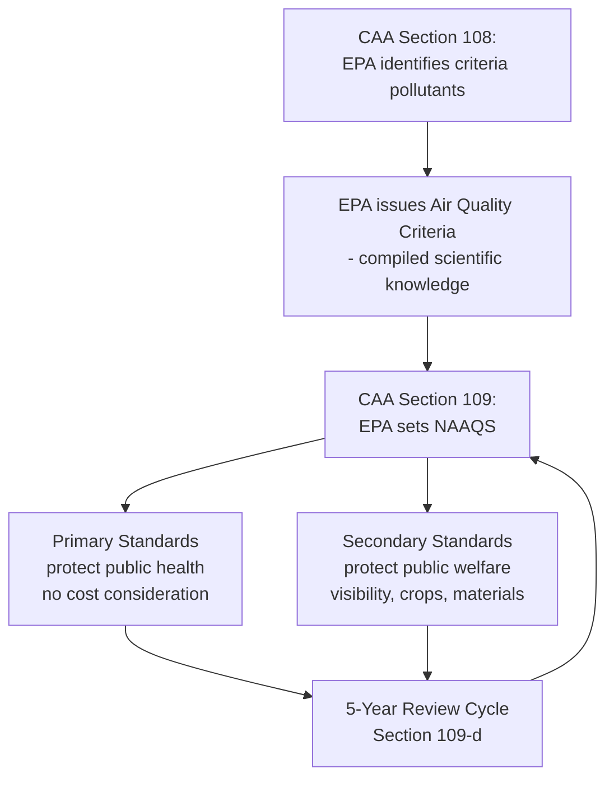

## National Ambient Air Quality Standards and the Criteria Pollutants

### Overview

The National Ambient Air Quality Standards (NAAQS) program is the foundational regulatory structure of the Clean Air Act (CAA), establishing nationwide, health- and welfare-based concentration limits for a defined set of pervasive, widely distributed air pollutants known as "criteria pollutants." EPA sets these standards; states then bear primary implementation responsibility through State Implementation Plans (SIPs). The NAAQS program embodies a distinctive cooperative federalism structure: EPA establishes uniform national standards divorced from cost considerations, while states retain substantial discretion in choosing the regulatory mechanisms to achieve them.

### Statutory Basis

**Key Points**

- CAA § 108, 42 U.S.C. § 7408, requires EPA to identify air pollutants that (1) may reasonably be anticipated to endanger public health or welfare, and (2) result from numerous or diverse mobile or stationary sources, and to issue "air quality criteria" — compilations of the latest scientific knowledge on the pollutant's effects.
- CAA § 109, 42 U.S.C. § 7409, requires EPA to promulgate two tiers of NAAQS for each criteria pollutant:
  - **Primary standards**: set at a level "requisite to protect the public health" with an "adequate margin of safety," including protection for sensitive populations (e.g., asthmatics, children, the elderly).
  - **Secondary standards**: set at a level "requisite to protect the public welfare," addressing effects such as visibility impairment, damage to crops, vegetation, and buildings.
- § 109(d) requires EPA to review the criteria and standards **at five-year intervals** and revise as appropriate — a recurring statutory obligation that drives periodic NAAQS rulemakings.
- Primary NAAQS must be set **without regard to cost of achievement** — this cost-blindness was confirmed by the Supreme Court in ***Whitman v. American Trucking Associations***, 531 U.S. 457 (2001), which held that CAA § 109(b)(1) unambiguously bars EPA from considering implementation costs in setting NAAQS, and separately rejected a nondelegation challenge to § 109's "requisite to protect the public health" standard.

### The Six Criteria Pollutants

**Key Points**

EPA currently regulates six criteria pollutants under the NAAQS program:

| Pollutant | Primary Health Concern | Key Sources |
| --- | --- | --- |
| **Ozone (O₃)** | Respiratory irritation, aggravation of asthma; formed via photochemical reaction, not directly emitted | Vehicle exhaust, industrial emissions, solvents (precursors: NOx, VOCs) |
| **Particulate Matter (PM)** | Cardiovascular and respiratory disease, premature mortality; regulated as PM$_{2.5}$ (fine) and PM$_{10}$ (coarse) | Combustion (vehicles, power plants, wildfires), dust, industrial processes |
| **Carbon Monoxide (CO)** | Reduces oxygen delivery to organs and tissues; acute toxicity at high concentrations | Vehicle exhaust, combustion sources |
| **Sulfur Dioxide (SO₂)** | Respiratory effects, contributes to acid deposition | Fossil fuel combustion (especially coal), industrial processes |
| **Nitrogen Dioxide (NO₂)** | Respiratory inflammation, contributes to ozone and particulate formation | Vehicle exhaust, combustion sources |
| **Lead (Pb)** | Neurological damage, especially in children; developmental effects | Historically leaded gasoline (phased out); currently smelters, metal processing, aviation fuel |

### Standard-Setting Process and Scientific Review

**Key Points**

- EPA's standard-setting process relies heavily on the **Clean Air Scientific Advisory Committee (CASAC)**, an independent panel of scientists established under CAA § 109(d)(2) that reviews EPA's scientific assessments and provides recommendations on appropriate standard levels.
- The process typically involves:
  1. **Integrated Science Assessment (ISA)** — comprehensive review of current health/welfare effects literature
  2. **Risk and Exposure Assessment (REA)** — quantitative modeling of population exposure and associated health risks at varying standard levels
  3. **Policy Assessment (PA)** — EPA staff synthesis connecting the science to policy options
  4. **CASAC review and recommendations**
  5. **Proposed rule** and public comment
  6. **Final rule**
- EPA's discretion in translating scientific uncertainty into a specific numeric standard has been repeatedly litigated; courts generally afford substantial deference to EPA's scientific judgments under the arbitrary-and-capricious standard, so long as EPA adequately explains its reasoning and responds to significant comments (see *Lead Industries Ass'n v. EPA*, 647 F.2d 1130 (D.C. Cir. 1980), an early and influential case establishing broad EPA discretion to set standards with an adequate margin of safety even amid scientific uncertainty).

### Attainment and Nonattainment Designations

**Key Points**

- After a NAAQS is promulgated or revised, EPA designates every area of the country as:
  - **Attainment** — meets the NAAQS for that pollutant
  - **Nonattainment** — does not meet the NAAQS
  - **Unclassifiable** — insufficient data to classify
- Nonattainment designations trigger heightened regulatory obligations under CAA Part D, including more stringent SIP planning requirements, emissions offsets for new/modified major sources, and (for ozone and some other pollutants) graduated nonattainment classification levels (e.g., marginal, moderate, serious, severe, extreme for ozone) with correspondingly more demanding control requirements and longer or shorter attainment deadlines.
- **Prevention of Significant Deterioration (PSD)** program (CAA Part C) applies in attainment/unclassifiable areas, requiring major new or modified sources to install Best Available Control Technology (BACT) and preventing erosion of air quality that already meets the NAAQS, even though the area is not in violation.

### State Implementation Plans (SIPs)

**Key Points**

- CAA § 110, 42 U.S.C. § 7410, requires each state to develop a **State Implementation Plan** demonstrating how the state will attain and maintain the NAAQS within its borders.
- SIP requirements generally include:
  - Enforceable emission limitations and control measures
  - Air quality monitoring network
  - Modeling demonstrating attainment by the applicable deadline
  - Provisions for interstate transport of pollution (addressing the "Good Neighbor Provision," CAA § 110(a)(2)(D))
  - New Source Review (NSR) permitting programs
- EPA reviews SIPs for adequacy; if a state fails to submit an adequate SIP, EPA may impose a **Federal Implementation Plan (FIP)** or apply sanctions (e.g., highway funding restrictions, offset ratio increases).
- This SIP/FIP structure is the core cooperative federalism mechanism of the CAA: EPA sets the national health-based target (the NAAQS), while states retain primary responsibility for and flexibility in choosing the specific control measures to reach it.

### The "Good Neighbor Provision" and Interstate Transport

**Key Points**

- CAA § 110(a)(2)(D)(i)(I) requires SIPs to contain adequate provisions prohibiting emissions that will contribute significantly to nonattainment, or interfere with maintenance, of the NAAQS in *another* state.
- This provision has generated substantial litigation given the interstate nature of ozone and particulate pollution transport, including EPA's various interstate transport rules (e.g., the Cross-State Air Pollution Rule and successor rules) designed to allocate emission reduction obligations among upwind states affecting downwind nonattainment.
- [Unverified] The regulatory posture and litigation status of specific interstate transport rules (including any "Good Neighbor Plan" iterations) has continued to evolve through ongoing rulemaking and litigation; practitioners should verify the current rule in effect for the relevant state and pollutant.

### Judicial Review Framework

**Key Points**

- NAAQS-setting decisions are reviewed under CAA § 307(d)(9), 42 U.S.C. § 7607(d)(9), incorporating an arbitrary-and-capricious standard similar to, but with some procedural distinctions from, standard APA review (including a more developed rulemaking record requirement).
- *Whitman v. American Trucking Ass'ns*, 531 U.S. 457 (2001) remains the cornerstone case: it foreclosed cost consideration in primary NAAQS-setting and rejected a facial nondelegation challenge, holding that § 109(b)(1)'s "requisite to protect the public health" standard, combined with the "adequate margin of safety" requirement, supplies an intelligible principle sufficient to guide EPA's discretion.
- Courts generally show substantial deference to EPA on the underlying scientific and technical judgments involved in setting the specific numeric standard level, so long as EPA's process and reasoning are adequately documented and responsive to CASAC recommendations and significant public comments.

### Diagram: NAAQS Implementation Architecture (svg_diagram)

<svg xmlns="http://www.w3.org/2000/svg" viewBox="0 0 760 380">
<text x="380" y="26" text-anchor="middle" font-size="16" font-weight="bold" fill="#1a1a1a">NAAQS Implementation Architecture (svg_diagram)</text>
<rect x="280" y="50" width="200" height="55" rx="8" fill="#e8f0fe" stroke="#3b5bdb" stroke-width="1.5" />
<text x="380" y="73" text-anchor="middle" font-size="12" fill="#1a1a1a">EPA sets NAAQS</text>
<text x="380" y="90" text-anchor="middle" font-size="12" fill="#1a1a1a">(6 criteria pollutants)</text>
<rect x="80" y="140" width="220" height="55" rx="8" fill="#ebfbee" stroke="#2f9e44" stroke-width="1.5" />
<text x="190" y="163" text-anchor="middle" font-size="12" fill="#1a1a1a">Attainment designation</text>
<text x="190" y="180" text-anchor="middle" font-size="12" fill="#1a1a1a">PSD program (Part C)</text>
<rect x="460" y="140" width="220" height="55" rx="8" fill="#fff0f0" stroke="#e03131" stroke-width="1.5" />
<text x="570" y="163" text-anchor="middle" font-size="12" fill="#1a1a1a">Nonattainment designation</text>
<text x="570" y="180" text-anchor="middle" font-size="12" fill="#1a1a1a">Part D requirements</text>
<rect x="240" y="230" width="280" height="55" rx="8" fill="#fff4e6" stroke="#e8590c" stroke-width="1.5" />
<text x="380" y="253" text-anchor="middle" font-size="12" fill="#1a1a1a">State Implementation Plan (SIP)</text>
<text x="380" y="270" text-anchor="middle" font-size="12" fill="#1a1a1a">Section 110</text>
<rect x="240" y="310" width="280" height="55" rx="8" fill="#f8f0fc" stroke="#9c36b5" stroke-width="1.5" />
<text x="380" y="333" text-anchor="middle" font-size="12" fill="#1a1a1a">EPA review; FIP if</text>
<text x="380" y="350" text-anchor="middle" font-size="12" fill="#1a1a1a">SIP inadequate</text>
<line x1="380" y1="105" x2="190" y2="138" stroke="#495057" stroke-width="1.5" marker-end="url(#a6)" />
<line x1="380" y1="105" x2="570" y2="138" stroke="#495057" stroke-width="1.5" marker-end="url(#a6)" />
<line x1="190" y1="195" x2="330" y2="228" stroke="#495057" stroke-width="1.5" marker-end="url(#a6)" />
<line x1="570" y1="195" x2="430" y2="228" stroke="#495057" stroke-width="1.5" marker-end="url(#a6)" />
<line x1="380" y1="285" x2="380" y2="308" stroke="#495057" stroke-width="1.5" marker-end="url(#a6)" />
</svg>

### Practice Pointers

**Key Points**

- When advising a source on permitting requirements, first determine the attainment status of the relevant pollutant(s) in the specific county/region, since this drives whether PSD or nonattainment New Source Review applies — these programs have materially different technology and offset requirements.
- Track EPA's five-year review cycle for each criteria pollutant, since a revised (typically more stringent) NAAQS can shift previously attainment areas into nonattainment status, triggering new SIP obligations and permitting consequences even without any change in a specific source's emissions.
- For multi-state or regionally significant sources, evaluate potential Good Neighbor Provision exposure, since interstate transport obligations can impose additional control requirements independent of the source's own local attainment status.
- [Inference] Because interstate transport rulemaking and litigation, as well as periodic NAAQS revisions, are recurring and evolving areas of CAA practice, confirm the current NAAQS levels, designation status, and applicable interstate transport rule for the specific pollutant, location, and timeframe at issue rather than relying on a static understanding of the program.

### Conclusion

The NAAQS program is the constitutional and structural backbone of the Clean Air Act's ambient air quality framework: EPA sets uniform, health-based, cost-blind national standards for six pervasive criteria pollutants, while states implement those standards through SIPs tailored to local conditions and source mixes. The program's cooperative federalism design — combined with recurring five-year scientific review cycles and robust judicial deference to EPA's technical judgments under *Whitman* — makes NAAQS-setting and SIP compliance a continuously evolving area requiring close attention to current designations, standard levels, and interstate transport obligations.

**Related Topics**

- State Implementation Plans and the SIP approval/disapproval process
- Prevention of Significant Deterioration (PSD) and Best Available Control Technology (BACT)
- Nonattainment New Source Review and emissions offsets
- The Good Neighbor Provision and interstate transport rules
- Whitman v. American Trucking Associations and the nondelegation doctrine
- New Source Performance Standards under CAA Section 111
- National Emission Standards for Hazardous Air Pollutants (NESHAPs)
- Clean Air Act citizen suits and judicial review under Section 307