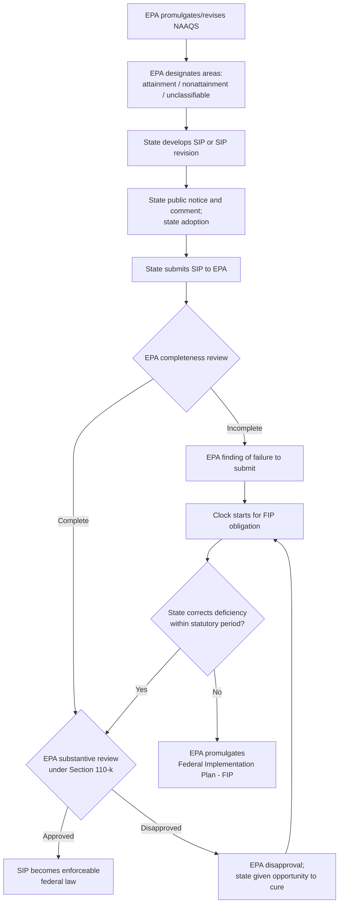

## State Implementation Plans and Federal Implementation Plans

### Overview

The State Implementation Plan (SIP) is the primary regulatory instrument through which the Clean Air Act's cooperative federalism structure operates: EPA sets the national ambient air quality standards (NAAQS), and each state develops its own enforceable plan demonstrating how it will attain and maintain those standards within its borders. When a state fails to submit an adequate SIP — or fails to submit one at all — EPA may step in with a Federal Implementation Plan (FIP), imposing federally-drafted control requirements directly. The SIP/FIP relationship is the central mechanism balancing state regulatory flexibility against the federal government's backstop authority to ensure NAAQS compliance nationwide.

### Statutory Basis

**Key Points**

- CAA § 110, 42 U.S.C. § 7410, is the core SIP provision, requiring each state to adopt and submit to EPA a plan providing for implementation, maintenance, and enforcement of each NAAQS in every air quality control region within the state.
- § 110(a)(2) enumerates required SIP elements, including:
  - Enforceable emission limitations and control measures
  - Air quality monitoring and modeling systems
  - Adequate personnel, funding, and authority to implement the plan
  - A permitting program for the construction and modification of stationary sources (New Source Review)
  - Provisions addressing interstate pollution transport (the "Good Neighbor Provision," § 110(a)(2)(D))
  - Contingency measures and emergency episode provisions
  - Assurance of adequate resources for local agencies where implementation is delegated
- § 110(k) governs EPA's review and action on SIP submissions: EPA must determine completeness, then approve, disapprove, or conditionally approve the SIP (or a SIP revision) within statutorily specified timeframes.
- § 110(c) authorizes EPA to promulgate a **Federal Implementation Plan** if a state fails to submit a required SIP, submits an incomplete SIP, or EPA disapproves the SIP in whole or in part, and the state fails to correct the deficiency.

### SIP Development and Approval Process

**Key Points**

- SIPs are developed at the state level, typically by the state environmental agency, and must go through state-level public notice and comment before formal adoption and submission to EPA.
- EPA's review is bifurcated: a **completeness determination** (procedural, based on specified minimum criteria) followed by **substantive review** on the merits (whether the SIP actually satisfies § 110(a)(2) and demonstrates attainment).
- Once approved, a SIP provision becomes **federally enforceable law** — enforceable not only by EPA but through CAA citizen suit provisions (§ 304) by any person, and its requirements are generally more stringent or at least as stringent as federal minimum requirements (states may adopt more stringent measures than federally required, but generally may not adopt less stringent ones for federally regulated pollutants).

### SIP Calls and Revision Requirements

**Key Points**

- EPA may issue a **"SIP call"** under § 110(k)(5) when it determines an existing, previously approved SIP is substantially inadequate to attain or maintain the relevant NAAQS, to mitigate interstate transport, or to comply with the Act's requirements — this differs from an initial disapproval because it applies to a SIP that was once approved but has become deficient (e.g., due to a revised, more stringent NAAQS, new scientific information, or changed emissions patterns).
- A SIP call triggers a statutory deadline (generally up to 18 months, though timeframes can vary by context) for the state to submit a corrective SIP revision; failure to do so can again trigger FIP authority.
- SIP calls have been a significant vehicle for addressing interstate ozone and particulate transport (e.g., the "NOx SIP Call" addressing regional ozone transport in the eastern United States).

### Federal Implementation Plans (FIPs)

**Key Points**

- A FIP is EPA's regulatory instrument for filling a SIP gap: EPA drafts and directly imposes the emission control requirements a state was supposed to adopt itself.
- Circumstances triggering FIP authority under § 110(c)(1):
  1. The state fails to submit a required SIP or SIP revision
  2. EPA determines a submitted SIP is incomplete
  3. EPA disapproves the SIP in whole or in part, and the state fails to correct the deficiency within the time period EPA specifies
- FIPs are generally regarded as a **backstop mechanism**, not the preferred outcome — the CAA's cooperative federalism design contemplates state-led implementation, and FIPs are politically and administratively disfavored by both EPA and states, since they displace state regulatory choice with federally-drafted requirements, often on an expedited timeline.
- Once promulgated, a FIP has the **same legal force as an approved SIP** and remains in effect until the state submits, and EPA approves, an adequate SIP revision to replace it (§ 110(c)(1) contemplates FIP withdrawal upon subsequent SIP approval).
- FIPs are more common in specific recurring contexts: interstate transport ("Good Neighbor") obligations where states have failed to adequately address upwind contributions to downwind nonattainment, and certain tribal areas where no approved Tribal Implementation Plan (TIP) exists (EPA retains FIP-like authority for Indian country under CAA Tribal Authority Rule provisions).

### Comparison: SIP vs. FIP

| Feature | State Implementation Plan (SIP) | Federal Implementation Plan (FIP) |
| --- | --- | --- |
| Drafted by | State environmental agency | EPA |
| Trigger | Statutory obligation under every state | State's failure/inadequate SIP submission, or uncured disapproval |
| Public process | State notice-and-comment, then federal notice-and-comment on approval | Federal notice-and-comment rulemaking |
| Flexibility | Substantial state discretion in choosing control measures | EPA-selected control measures, often less tailored to local conditions |
| Duration | Ongoing, subject to revision/SIP calls | Remains in effect until superseded by an approved SIP |
| Political posture | Preferred, default mechanism | Backstop; generally disfavored by states and EPA alike |
| Legal enforceability | Federal law once approved | Federal law upon promulgation |

### Sanctions for SIP Deficiencies

**Key Points**

- Beyond FIP imposition, CAA § 179 authorizes additional **sanctions** where a state fails to submit a required SIP, submits an incomplete SIP, or EPA disapproves a SIP submission (particularly in the nonattainment planning context):
  - **Highway funding sanctions**: restriction of federal highway funding apportioned to the state under Title 23 of the U.S. Code
  - **Offset sanctions**: increased emission offset ratios required for new or modified major stationary sources in nonattainment areas (e.g., raising the offset ratio from 1:1 to 2:1), making it more difficult and costly to permit new sources
- Sanctions generally apply on a graduated timeline following an EPA finding of SIP deficiency, providing states an additional incentive (beyond the threat of a FIP) to cure deficiencies promptly.

### Judicial Review of SIP/FIP Actions

**Key Points**

- EPA's approval, disapproval, or FIP promulgation actions are reviewed under CAA § 307(b) and § 307(d), generally in the U.S. Court of Appeals for the D.C. Circuit (for nationally applicable actions) or the relevant regional circuit (for locally or regionally applicable actions).
- Courts apply arbitrary-and-capricious review to EPA's SIP approval/disapproval determinations, assessing whether EPA reasonably evaluated the SIP against § 110(a)(2)'s substantive requirements and the relevant NAAQS attainment demonstration.
- A distinct and frequently litigated issue is **EPA's authority to disapprove a SIP based on policy disagreement versus a SIP's failure to meet the Act's substantive requirements** — courts have generally required EPA to root disapproval in the statutory criteria rather than broader policy preferences, since § 110 affords states substantial discretion in selecting the specific control measures used to meet NAAQS targets (as opposed to dictating particular measures).
- Good Neighbor Provision FIPs (addressing interstate transport) have been a particularly active area of recent litigation, including stays and vacaturs of EPA's Good Neighbor Plan by various courts pending full merits review. [Unverified — the litigation status of specific interstate transport FIPs continues to evolve; verify current status for the relevant states and timeframe.]

### Diagram: SIP/FIP Cooperative Federalism Structure (svg_diagram)

<svg xmlns="http://www.w3.org/2000/svg" viewBox="0 0 740 340">
<text x="370" y="26" text-anchor="middle" font-size="16" font-weight="bold" fill="#1a1a1a">SIP / FIP Cooperative Federalism Structure (svg_diagram)</text>
<rect x="60" y="55" width="280" height="220" rx="10" fill="#e8f0fe" stroke="#3b5bdb" stroke-width="1.5" />
<text x="200" y="82" text-anchor="middle" font-size="13" font-weight="bold" fill="#1a1a1a">Default Track: SIP</text>
<text x="200" y="110" text-anchor="middle" font-size="11" fill="#1a1a1a">State selects control measures</text>
<text x="200" y="130" text-anchor="middle" font-size="11" fill="#1a1a1a">State notice-and-comment</text>
<text x="200" y="150" text-anchor="middle" font-size="11" fill="#1a1a1a">State submits to EPA</text>
<text x="200" y="170" text-anchor="middle" font-size="11" fill="#1a1a1a">EPA completeness + merits review</text>
<text x="200" y="190" text-anchor="middle" font-size="11" fill="#1a1a1a">EPA approval</text>
<text x="200" y="220" text-anchor="middle" font-size="12" font-weight="bold" fill="#2f9e44">Preferred outcome:</text>
<text x="200" y="238" text-anchor="middle" font-size="12" font-weight="bold" fill="#2f9e44">state-tailored plan</text>
<rect x="400" y="55" width="280" height="220" rx="10" fill="#fff0f0" stroke="#e03131" stroke-width="1.5" />
<text x="540" y="82" text-anchor="middle" font-size="13" font-weight="bold" fill="#1a1a1a">Backstop Track: FIP</text>
<text x="540" y="110" text-anchor="middle" font-size="11" fill="#1a1a1a">No SIP / incomplete SIP /</text>
<text x="540" y="127" text-anchor="middle" font-size="11" fill="#1a1a1a">uncured disapproval</text>
<text x="540" y="150" text-anchor="middle" font-size="11" fill="#1a1a1a">EPA drafts control measures</text>
<text x="540" y="170" text-anchor="middle" font-size="11" fill="#1a1a1a">Federal notice-and-comment</text>
<text x="540" y="190" text-anchor="middle" font-size="11" fill="#1a1a1a">EPA promulgates FIP directly</text>
<text x="540" y="220" text-anchor="middle" font-size="12" font-weight="bold" fill="#e03131">Disfavored outcome:</text>
<text x="540" y="238" text-anchor="middle" font-size="12" font-weight="bold" fill="#e03131">federally-imposed plan</text>
<line x1="340" y1="165" x2="398" y2="165" stroke="#495057" stroke-width="2" marker-end="url(#a7)" />
<text x="370" y="155" text-anchor="middle" font-size="10" fill="#495057">failure/</text>
<text x="370" y="180" text-anchor="middle" font-size="10" fill="#495057">uncured</text>
</svg>

### Practice Pointers

**Key Points**

- When evaluating a source's compliance obligations, confirm whether the applicable requirement derives from an EPA-approved SIP provision, a FIP, or a state-only requirement not yet submitted to or approved by EPA — enforceability and available remedies (including citizen suit availability) differ depending on federal approval status.
- Track SIP call deadlines closely for affected states/sources, since a SIP call can trigger new, more stringent obligations even absent any change in a source's own emissions, driven by regional NAAQS attainment or interstate transport concerns.
- For clients in states with a history of SIP disapproval or FIP imposition (particularly regarding interstate transport), monitor ongoing litigation closely, since stays or vacaturs of FIPs can materially and quickly change applicable compliance obligations.
- [Inference] Because FIP and SIP-call litigation, particularly involving interstate transport obligations, has been an active and evolving area, and because CAA implementation more broadly intersects with the general trend toward permitting reform and regulatory streamlining discussed elsewhere in current environmental law practice, confirm the current status of the specific SIP, SIP call, or FIP at issue before advising on compliance obligations.

### Conclusion

The SIP/FIP structure operationalizes the Clean Air Act's cooperative federalism model: states retain primary responsibility and substantial discretion to design implementation strategies suited to local conditions and source mixes, while EPA's FIP authority under § 110(c) ensures a federal backstop when states fail to act or fail to cure identified deficiencies. Though FIPs carry the same legal force as approved SIPs once promulgated, they remain a disfavored, comparatively blunt instrument compared to state-tailored planning — reinforcing the CAA's structural preference for state-led implementation of federally-set health-based air quality standards.

**Related Topics**

- National Ambient Air Quality Standards and the criteria pollutants
- The Good Neighbor Provision and interstate transport SIP calls
- Nonattainment New Source Review and emissions offset sanctions
- Prevention of Significant Deterioration and state PSD permitting programs
- Tribal Implementation Plans and EPA's Tribal Authority Rule
- CAA Section 307 judicial review and venue for SIP/FIP challenges
- CAA citizen suit enforcement of approved SIP provisions
- Cooperative federalism models across environmental statutes (CWA NPDES delegation)