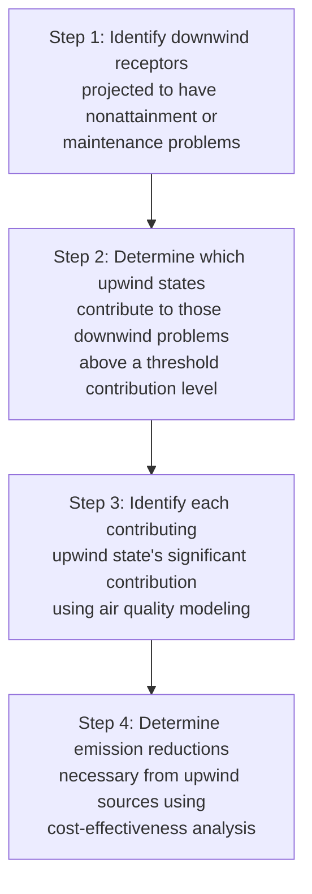
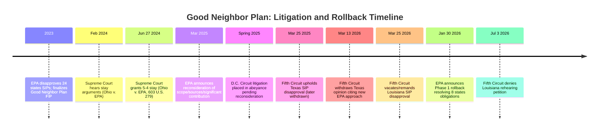

## Interstate Transport and the Good Neighbor Provision

### Overview

Air pollution does not respect state boundaries: emissions from an upwind state's power plants and industrial sources can travel hundreds of miles and materially contribute to ozone and particulate nonattainment in downwind states, even where the downwind state has adopted stringent controls of its own. The Clean Air Act's "Good Neighbor Provision" addresses this structural externality by requiring upwind states to prevent their emissions from significantly contributing to nonattainment or interfering with maintenance of the NAAQS elsewhere. Implementation of this provision — culminating most recently in EPA's 2023 "Good Neighbor Plan" — has become one of the most heavily and consequentially litigated areas of Clean Air Act law, including a major 2024 Supreme Court stay and an ongoing EPA reconsideration process still unfolding as of 2026.

### Statutory Basis

**Key Points**

- CAA § 110(a)(2)(D)(i)(I), 42 U.S.C. § 7410(a)(2)(D)(i)(I) — the Good Neighbor Provision — requires each state's SIP to contain adequate provisions prohibiting emissions that will (I) contribute significantly to nonattainment, or interfere with maintenance, of the NAAQS in any other state, and (II) address interference with other states' PSD or visibility protection programs.
- This provision operates as a mandatory SIP element: every state, whether itself in attainment or nonattainment, must address its potential contribution to air quality problems in *other* states as part of its own SIP.
- If a state fails to submit an adequate SIP addressing interstate transport, EPA may disapprove the transport-related SIP element and, ultimately, promulgate a Federal Implementation Plan (FIP) addressing interstate transport directly (see *State implementation plans and federal implementation plans*).

### EPA's Four-Step Interstate Transport Framework

**Key Points**

- EPA has long applied a **"four-step interstate transport framework"** to implement the Good Neighbor Provision:
  1. Identify downwind air quality receptors with nonattainment or maintenance problems
  2. Determine which upwind states contribute to those problems above a defined threshold
  3. Quantify each contributing state's "significant contribution" via air quality modeling
  4. Determine the emission reductions required from upwind sources, generally using cost-effectiveness thresholds to identify the specific control measures required
- This framework has been applied across multiple rulemakings addressing different NAAQS (notably various ozone standard iterations), including the **Cross-State Air Pollution Rule (CSAPR)** and its successors, and most recently the **2023 Good Neighbor Plan**.

### The 2023 Good Neighbor Plan and Its Litigation History

**Key Points**

- In 2023, EPA denied the SIPs of two dozen upwind states as inadequate to address interstate transport under the 2015 ozone NAAQS, and finalized the **Good Neighbor Plan** as a FIP applicable to those states, imposing emission reduction requirements primarily on power plants and certain industrial sources.
- Multiple states, trade associations, and individual companies challenged the Good Neighbor Plan in the D.C. Circuit.
- ***Ohio v. EPA***, 603 U.S. 279 (2024): the Supreme Court, in a **5-4 decision** decided June 27, 2024, granted a stay of the Good Neighbor Plan's enforcement against the applicant states/parties pending completion of D.C. Circuit review and any subsequent certiorari petition.
  - The majority's core holding was procedural: EPA's rule was not "reasonably explained" because the agency failed to adequately respond to comments questioning whether the required emission reductions remained cost-effective and appropriate once several states were removed from the rule's coverage (due to separate successful SIP challenges), changing the number of participating states from the agency's original modeling assumptions.
  - Notably, the majority did **not** conclude that EPA's actions were substantively unreasonable on the merits — the stay turned on the adequacy of EPA's explanation, not a determination that the underlying emission control requirements were themselves improper.
  - **Justice Barrett dissented**, joined by Justices Sotomayor, Kagan, and Jackson, arguing the states were unlikely to succeed on the merits and criticizing the majority for identifying an error that the dissent contended the Court itself — not commenters — had first articulated. The dissent also emphasized the public health harms of the stay, noting it would leave large swaths of upwind states free to continue significantly contributing to downwind ozone problems during the litigation.
- Following the stay, EPA took administrative action to stay the Good Neighbor Plan in its entirety across all 23 originally covered states, and two other federal courts separately vacated EPA's SIP disapprovals for Kentucky and Mississippi.

### Post-Stay Developments: Reconsideration and Rollback (2025–2026)

**Key Points**

- On March 12, 2025, EPA Administrator Lee Zeldin announced the agency would undertake reconsideration of the Good Neighbor Plan, following a declaration EPA filed with the D.C. Circuit on March 10, 2025 indicating it would reconsider the scope of covered states, the scope of covered sources, and the definition of "significant contribution" underlying the rule.
- Since spring 2025, litigation over the Good Neighbor Plan and the associated 2023 SIP disapprovals has been held in **abeyance** pending the outcome of EPA's reconsideration process.
- EPA characterized this reconsideration as an exercise in **"cooperative federalism,"** framing the original Biden-era Good Neighbor Plan and associated SIP disapprovals as having treated state partners unfairly, despite states having used EPA-supported modeling and thresholds to argue they were not interfering with downwind attainment.
- On **January 30, 2026**, EPA announced **"Phase 1"** of its plan to roll back the Good Neighbor Plan, proposing actions that would fully resolve eight states' interstate transport obligations under the 2015 ozone standard — representing a substantial, formal step toward dismantling or significantly narrowing the 2023 rule rather than merely maintaining the litigation stay.
- [Unverified] Given that this rollback process was only in its early "Phase 1" stage as of early 2026 and litigation remains in abeyance, the ultimate scope and content of any replacement or narrowed interstate transport framework remains unsettled; practitioners should confirm the current status of both the EPA rulemaking and the underlying D.C. Circuit litigation for the specific states and sources at issue.

### Related SIP Disapproval Litigation: Texas and Louisiana

**Key Points**

- Separate from the Good Neighbor Plan FIP litigation, individual states have separately challenged EPA's disapproval of their Good-Neighbor-related SIP submissions.
- ***State of Texas v. EPA***, No. 23-60069 (5th Cir.): the Fifth Circuit initially upheld the Biden EPA's disapproval of Texas's SIP (March 25, 2025 opinion), but subsequently **withdrew that opinion on March 13, 2026**, citing EPA's new cross-state air pollution rule approach, which changed how the agency reviews SIPs — the court held that because EPA had not settled on its evaluation methodology, the prior disapproval could not stand as originally reasoned.
- **Louisiana** separately sought similar relief: after the Fifth Circuit's favorable March 25, 2026 decision vacating and remanding EPA's disapproval of Louisiana's SIP (following the Texas precedent), Louisiana filed a petition for panel rehearing or rehearing en banc on other grounds; the Fifth Circuit denied that petition on **July 3, 2026**.
- These parallel SIP-specific cases illustrate that Good Neighbor litigation is proceeding on multiple simultaneous tracks — the FIP-focused D.C. Circuit litigation (in abeyance) and state-specific SIP disapproval challenges in regional circuits (actively being resolved, generally favorably to challenging states as EPA's own reconsideration undermines the basis for the original disapprovals).

### Timeline

### Practice Pointers

**Key Points**

- Because Good Neighbor Plan litigation remains in abeyance and EPA's rollback/reconsideration process is still unfolding, advise clients in affected upwind states that current compliance obligations may differ significantly from the originally promulgated 2023 rule — confirm current status directly against EPA's most recent reconsideration announcements and the relevant circuit's docket.
- For clients in downwind states concerned about continued interstate contribution during the reconsideration period, note that the practical effect of the stay and subsequent administrative actions has been to suspend enforcement of the original Good Neighbor Plan requirements, meaning affected upwind sources are not currently subject to the 2023 rule's emission limits pending further agency and judicial action.
- Distinguish between the FIP-based Good Neighbor Plan litigation (D.C. Circuit, in abeyance) and individual state SIP disapproval litigation (regional circuits, actively being resolved) when assessing a specific state's current interstate transport obligations, since these tracks may resolve on different timelines and with different outcomes.
- [Inference] Given the active, evolving, multi-track nature of this litigation and rulemaking area as of 2026, and EPA's stated intent to substantially narrow or replace the Good Neighbor Plan, practitioners should treat any specific numeric interstate transport obligation as provisional and verify current status before advising a client on compliance planning or litigation strategy.

### Conclusion

The Good Neighbor Provision addresses one of the Clean Air Act's core structural challenges — the fact that upwind states' emissions can undermine downwind states' attainment efforts regardless of the downwind state's own regulatory diligence — through a four-step interstate transport framework requiring upwind states to control emissions contributing significantly to downwind nonattainment. The 2023 Good Neighbor Plan's trajectory since then — a 5-4 Supreme Court stay grounded in inadequate agency explanation rather than substantive unreasonableness, followed by EPA's own 2025–2026 reconsideration and partial rollback, alongside parallel and evolving state-specific SIP litigation — illustrates how procedural vulnerabilities in agency rulemaking, shifting political administrations, and multi-track litigation can combine to substantially delay or reshape a major Clean Air Act program's practical implementation, leaving affected states and sources navigating a currently unsettled compliance landscape.

**Related Topics**

- State implementation plans and federal implementation plans
- Nonattainment area classifications and attainment planning
- National Ambient Air Quality Standards and the criteria pollutants
- Ohio v. EPA and the Supreme Court's emergency/shadow docket stay standard
- Cross-State Air Pollution Rule (CSAPR) history and predecessor transport rules
- Cooperative federalism rhetoric in current EPA rulemaking posture
- CEQ's historical coordinating role and the 2025 rescission of government-wide NEPA regulations (comparative deregulatory trend)
- Judicial review venue and abeyance practice in multi-circuit CAA litigation