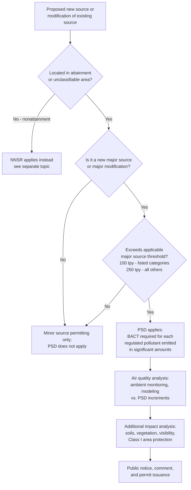

## New Source Review and Prevention of Significant Deterioration Permitting

### Overview

New Source Review (NSR) is the Clean Air Act's preconstruction permitting program, requiring new stationary sources and major modifications to existing sources to obtain a permit and install specified pollution controls before construction begins. NSR bifurcates based on an area's attainment status: **Prevention of Significant Deterioration (PSD)** governs sources in attainment or unclassifiable areas, while **Nonattainment New Source Review (NNSR)** governs sources in nonattainment areas (covered separately — see *Nonattainment area classifications and attainment planning*). PSD, the focus of this entry, is designed to protect air quality that already meets the NAAQS from significant degradation, even though the area is not in violation of any standard.

### Statutory and Regulatory Basis

**Key Points**

- CAA Part C, §§ 160–169, 42 U.S.C. §§ 7470–7479, establishes the PSD program.
- § 165, 42 U.S.C. § 7475, sets the core preconstruction permit requirements for major emitting facilities in attainment/unclassifiable areas.
- § 169(1), 42 U.S.C. § 7479(1), defines "major emitting facility" and lists 28 specifically enumerated source categories subject to a lower 100 tons per year (tpy) threshold; all other source categories are subject to a 250 tpy threshold.
- Implementing regulations are found primarily at 40 C.F.R. § 52.21 (the federal PSD program, applicable directly in states without an EPA-approved state PSD program) and in approved state PSD regulations incorporated into SIPs.
- PSD's statutory purposes, as articulated in § 160, include protecting public health and welfare from adverse effects of air pollution notwithstanding attainment of NAAQS, preserving air quality in national parks and wilderness areas, and ensuring economic growth occurs in a manner consistent with preservation of clean air resources.

### PSD Applicability Analysis

**Key Points**

- **New major source**: a source that is new construction and whose potential to emit exceeds the applicable major source threshold (100 or 250 tpy) for any regulated NSR pollutant.
- **Major modification**: a physical change or change in the method of operation at an existing major source that results in a **significant emissions increase** and a **significant net emissions increase** of a regulated NSR pollutant — this two-part test (both prongs must be satisfied) has been a major source of PSD litigation, particularly regarding "routine maintenance, repair, and replacement" exclusions and the calculation methodology for projected emissions increases.
- **Significant emissions increase thresholds** are pollutant-specific (e.g., 40 tpy for NOx and SO2, 25 tpy for PM, 100 tpy for CO), set forth in EPA's PSD regulations, and distinct from the major source thresholds themselves.
- **Netting**: sources may offset a proposed emissions increase against contemporaneous decreases at the same facility to avoid triggering "major modification" status — a significant compliance planning tool, subject to detailed regulatory requirements regarding what decreases may be counted and over what time period.

### Best Available Control Technology (BACT)

**Key Points**

- § 169(3) defines BACT as an emission limitation based on the maximum degree of reduction achievable for each regulated pollutant, taking into account energy, environmental, and economic impacts and other costs, determined by the permitting authority on a **case-by-case basis**.
- BACT determinations follow the **"top-down" methodology** established in EPA guidance:
  1. Identify all available control technologies for the pollutant and source type
  2. Eliminate technically infeasible options
  3. Rank remaining options by control effectiveness
  4. Evaluate the most effective option first, considering energy, environmental, and economic impacts; if the top option is rejected, evaluate the next most effective option, and so on
  5. Select BACT, documenting the basis for elimination of any more stringent options considered
- Because BACT is source-specific and cost-inclusive (unlike NNSR's LAER, which does not consider cost), BACT determinations vary significantly across similar sources depending on site-specific factors, and are frequently a focal point of permit litigation and public comment.
- BACT applies to each pollutant subject to regulation under the CAA that the source would emit in significant amounts, not merely NAAQS criteria pollutants — this can include greenhouse gases, where applicability thresholds and case law have evolved considerably (see *Utility Air Regulatory Group v. EPA*, 573 U.S. 302 (2014), narrowing but not eliminating PSD's application to GHG-emitting sources).

### PSD Increments and Air Quality Analysis

**Key Points**

- Separate from BACT, PSD imposes **air quality increments** — maximum allowable increases in ambient pollutant concentrations above a baseline concentration, designed to ensure that even permitted new sources do not collectively erode air quality below levels needed to protect health and welfare margins.
- PSD Increments exist for SO2, NOx, and PM, and are further differentiated by **Class designation**:
  - **Class I areas**: national parks, wilderness areas, and other areas warranting the most stringent protection (smallest allowable increments) — includes mandatory federal Class I areas designated by statute
  - **Class II areas**: default classification for most of the country, allowing moderate increases consistent with typical well-controlled growth
  - **Class III areas**: areas states may redesignate to allow the largest increases, reflecting a deliberate state policy choice to permit more industrial development (rarely used in practice)
- Applicants must demonstrate, generally through **air quality modeling**, that the proposed source's emissions, combined with existing consumption of available increment, will not cause or contribute to a violation of the applicable increment or the NAAQS itself.
- **Additional impacts analysis** requirements address impacts on soils, vegetation, visibility (particularly for sources affecting Class I area visibility), and growth-related secondary impacts.

### PSD Permit Process

**Key Points**

1. **Pre-application consultation** with the permitting authority (state agency with an approved PSD program, or EPA Regional Office where no approved program exists)
2. **BACT analysis** submission using the top-down methodology
3. **Air quality analysis**, including modeling demonstrating compliance with NAAQS and applicable PSD increments
4. **Additional impacts analysis** (soils, vegetation, visibility, growth)
5. **Draft permit and public comment period**, including opportunity for public hearing
6. **Final permit issuance**, subject to administrative appeal (e.g., before EPA's Environmental Appeals Board for EPA-issued permits) and judicial review

### PSD vs. NNSR: Comparative Summary

| Feature | PSD (this entry) | NNSR |
| --- | --- | --- |
| Applicable areas | Attainment / unclassifiable | Nonattainment |
| Control technology standard | BACT (cost-inclusive, case-by-case) | LAER (no cost consideration, more stringent) |
| Emissions offsets required | No | Yes, generally >1:1 ratio |
| Air quality analysis | Increment consumption + NAAQS compliance | Attainment demonstration consistency |
| Purpose | Prevent degradation of clean air | Achieve/accelerate attainment |
| Major source threshold | Fixed (100/250 tpy) | Decreases with nonattainment classification severity (e.g., ozone) |

### Key Litigation Themes

**Key Points**

- **"Routine maintenance, repair, and replacement" (RMRR) exclusion**: whether a physical or operational change at an existing source qualifies as routine (and thus exempt from major modification triggering) has generated extensive litigation, particularly involving power plant equipment replacement projects — see the long-running *United States v. Duke Energy Corp.* / related utility enforcement litigation addressing this issue.
- **Projected emissions increase calculation methodology**: disputes over whether to use actual-to-projected-actual or actual-to-potential comparison methodologies, and how to account for demand growth exclusions, have shaped major modification applicability determinations.
- **Greenhouse gas applicability**: following *Massachusetts v. EPA*, 549 U.S. 497 (2007) (establishing EPA's authority/duty to regulate GHGs as air pollutants under the CAA generally) and *Utility Air Regulatory Group v. EPA*, 573 U.S. 302 (2014) (narrowing the scope of sources subject to PSD permitting solely because of GHG emissions, while preserving BACT requirements for GHGs at sources that are "anyway sources" independently subject to PSD for other pollutants), GHG treatment within PSD permitting remains a distinct and still-evolving doctrinal area.
- **BACT cost-effectiveness disputes**: because BACT explicitly incorporates cost considerations, permit challenges frequently center on whether the permitting authority's economic impact analysis reasonably justified rejecting a more stringent, more expensive control option.

### Diagram: PSD Permitting Decision Structure (svg_diagram)

<svg xmlns="http://www.w3.org/2000/svg" viewBox="0 0 760 340">
<text x="380" y="26" text-anchor="middle" font-size="16" font-weight="bold" fill="#1a1a1a">PSD Permitting Decision Structure (svg_diagram)</text>
<rect x="40" y="55" width="220" height="240" rx="10" fill="#e8f0fe" stroke="#3b5bdb" stroke-width="1.5" />
<text x="150" y="80" text-anchor="middle" font-size="13" font-weight="bold" fill="#1a1a1a">Applicability</text>
<text x="150" y="105" text-anchor="middle" font-size="11" fill="#1a1a1a">New major source or</text>
<text x="150" y="122" text-anchor="middle" font-size="11" fill="#1a1a1a">major modification</text>
<text x="150" y="145" text-anchor="middle" font-size="11" fill="#1a1a1a">100/250 tpy threshold</text>
<text x="150" y="168" text-anchor="middle" font-size="11" fill="#1a1a1a">Significant emissions</text>
<text x="150" y="185" text-anchor="middle" font-size="11" fill="#1a1a1a">increase + net increase</text>
<text x="150" y="220" text-anchor="middle" font-size="10" fill="#495057">(netting may avoid</text>
<text x="150" y="235" text-anchor="middle" font-size="10" fill="#495057">triggering PSD)</text>
<rect x="290" y="55" width="220" height="240" rx="10" fill="#fff4e6" stroke="#e8590c" stroke-width="1.5" />
<text x="400" y="80" text-anchor="middle" font-size="13" font-weight="bold" fill="#1a1a1a">Technology Review</text>
<text x="400" y="105" text-anchor="middle" font-size="11" fill="#1a1a1a">BACT top-down</text>
<text x="400" y="122" text-anchor="middle" font-size="11" fill="#1a1a1a">methodology</text>
<text x="400" y="150" text-anchor="middle" font-size="11" fill="#1a1a1a">Cost/energy/environmental</text>
<text x="400" y="167" text-anchor="middle" font-size="11" fill="#1a1a1a">impacts considered</text>
<text x="400" y="195" text-anchor="middle" font-size="11" fill="#1a1a1a">Per-pollutant, case-by-case</text>
<rect x="540" y="55" width="180" height="240" rx="10" fill="#ebfbee" stroke="#2f9e44" stroke-width="1.5" />
<text x="630" y="80" text-anchor="middle" font-size="13" font-weight="bold" fill="#1a1a1a">Air Quality Review</text>
<text x="630" y="105" text-anchor="middle" font-size="11" fill="#1a1a1a">PSD increments</text>
<text x="630" y="122" text-anchor="middle" font-size="11" fill="#1a1a1a">(Class I/II/III)</text>
<text x="630" y="150" text-anchor="middle" font-size="11" fill="#1a1a1a">NAAQS compliance</text>
<text x="630" y="167" text-anchor="middle" font-size="11" fill="#1a1a1a">modeling</text>
<text x="630" y="195" text-anchor="middle" font-size="11" fill="#1a1a1a">Additional impacts:</text>
<text x="630" y="212" text-anchor="middle" font-size="11" fill="#1a1a1a">soils, vegetation,</text>
<text x="630" y="229" text-anchor="middle" font-size="11" fill="#1a1a1a">visibility</text>
</svg>

### Practice Pointers

**Key Points**

- Before beginning detailed BACT or modeling work, confirm the project's applicability status carefully — properly characterizing whether a change constitutes a "major modification" (including RMRR exclusion analysis and available netting) can determine whether PSD applies at all, often with major cost and schedule implications.
- For projects near Class I areas (national parks, wilderness areas), anticipate heightened visibility and additional-impacts scrutiny, potentially including Federal Land Manager consultation, and build additional permitting timeline accordingly.
- Document BACT cost-effectiveness analysis thoroughly and transparently, since BACT rejection of more stringent options is a frequent basis for third-party permit challenges.
- For sources with any GHG-triggering nexus, confirm current applicability rules post-*UARG*, since GHG PSD applicability turns on whether the source is independently an "anyway source" for other pollutants, not GHG emissions alone.
- [Inference] Because PSD applicability thresholds, BACT guidance documents, and GHG-related applicability rules have been subject to periodic revision and ongoing litigation, and because the broader regulatory and permitting-reform environment is currently in flux (see CEQ rescission and One Federal Decision topics), confirm current thresholds, guidance, and case law applicable to the specific source category, pollutant, and jurisdiction before finalizing a PSD applicability or BACT determination.

### Conclusion

PSD permitting operationalizes the Clean Air Act's preventive, forward-looking commitment to protecting already-acceptable air quality from erosion as new sources and expansions are built, using a source-specific, cost-inclusive BACT standard paired with area-wide air quality increments calibrated to the sensitivity of the affected location (particularly Class I areas). Its complexity — spanning intricate applicability tests, a case-by-case technology-selection methodology, and an evolving treatment of greenhouse gases — makes PSD one of the most technically and legally demanding compliance obligations in Clean Air Act practice, requiring careful upfront applicability analysis to avoid triggering costly and time-consuming permitting requirements unnecessarily.

**Related Topics**

- Nonattainment area classifications and attainment planning (NNSR/LAER comparison)
- National Ambient Air Quality Standards and the criteria pollutants
- State implementation plans and federal implementation plans
- Utility Air Regulatory Group v. EPA and greenhouse gas PSD applicability
- Routine maintenance, repair, and replacement exclusion litigation
- BACT top-down methodology and cost-effectiveness analysis
- Class I area visibility protection and Federal Land Manager consultation
- Title V operating permit program and its relationship to PSD