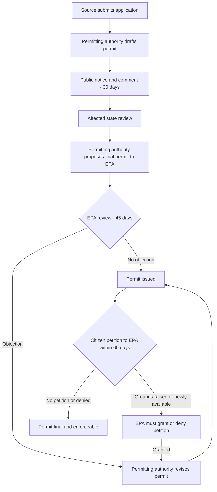

## Title V Operating Permits

### Statutory Basis and Purpose

Title V of the Clean Air Act (CAA), 42 U.S.C. §§ 7661–7661f, added by the 1990 Amendments, establishes an operating permit program modeled on the NPDES permit system under the Clean Water Act. Title V does not itself impose new substantive air quality control requirements; instead, it consolidates all applicable CAA requirements for a facility (NSPS, NESHAP, PSD/NNSR limits, SIP-based emission limits, monitoring, and recordkeeping obligations) into a single, federally enforceable document. Its core purposes are to:

- Improve compliance through enhanced monitoring, recordkeeping, and reporting.
- Provide a single point of reference identifying every requirement applicable to a source.
- Facilitate enforcement by EPA, states, and citizens by making obligations explicit and traceable.

### Implementing Regulations

EPA's implementing regulations appear at 40 C.F.R. Part 70 (State Operating Permit Programs) and 40 C.F.R. Part 71 (Federal Operating Permit Program, applied where a state lacks an approved program or fails to adequately administer one). States must submit Part 70 programs to EPA for approval; nearly all states now administer approved programs.

### Sources Subject to Title V

**Key Points**

- **Major sources**: Facilities with potential to emit (PTE) ≥ 100 tons/year of any criteria pollutant (lower thresholds of 10/25 tpy apply in nonattainment areas depending on pollutant and classification), or ≥ 10 tpy of any single hazardous air pollutant (HAP), or ≥ 25 tpy of any combination of HAPs.
- **Affected sources** under the Acid Rain Program (Title IV).
- **Solid waste incineration units** subject to CAA § 129 standards.
- Any other source designated by EPA regulation, including certain synthetic minor sources in specific state programs.
- States may (but are not required to) exempt certain area sources or non-major sources from Title V unless a source is subject to NSPS, NESHAP, or is a Title IV source.

### Permit Application Process

1. **Timely application**: Source must submit a complete application within 12 months of becoming subject to the program (or upon startup for new sources), using state-prescribed forms.
2. **Completeness determination**: Permitting authority reviews for administrative completeness within 60 days (Part 70) or 60 days (Part 71).
3. **Compliance plan and certification**: Application must include a compliance plan and a responsible official's certification of accuracy.
4. **Public participation**: Draft permit subject to public notice and comment (minimum 30 days).
5. **Affected state review**: States within 50 miles of the source, or otherwise affected, receive notice and opportunity to comment.
6. **EPA review**: EPA has 45 days to object to a proposed permit; if EPA does not object, any person may petition EPA within 60 days after the 45-day period to object, citing grounds not raisable during the initial comment period were unavailable.
7. **Issuance**: Permitting authority issues, denies, or modifies; permits are typically valid for a fixed term not to exceed 5 years.

### Application Shield

Submitting a timely and complete application before the deadline creates an "application shield" under 40 C.F.R. § 70.7(b), protecting the source from being deemed in violation of the requirement to have a permit while the application is pending, even if agency review extends past the statutory deadline.

### Core Permit Content Requirements

- **Emission limitations and standards**, including those necessary to assure compliance with all applicable requirements at the time of permit issuance.
- **Monitoring, recordkeeping, and reporting (MRR)** sufficient to demonstrate compliance; this includes periodic monitoring where an underlying requirement lacks sufficient monitoring (the "gap-filling" function of Title V).
- **Compliance certification**: Annual certification of compliance status, submitted by a responsible official, with deviations reported.
- **Permit shield** (optional, at state discretion): Compliance with the permit is deemed compliance with applicable requirements specifically identified in the permit, provided the permit accurately reflects all applicable requirements.
- **Alternative operating scenarios**, if requested and authorized.
- **General/case-by-case conditions**: severability clause, inspection/entry rights, emergency provisions, and provisions addressing enforceability.

### Permit Modifications

| Modification Type | Trigger | Public Notice | Typical Timeline |
| --- | --- | --- | --- |
| Administrative amendment | Correcting typos, name/address changes, more frequent monitoring | No | Expedited |
| Minor permit modification | Changes not requiring new/relaxed applicable requirement, not a Title I modification, PTE change < significance thresholds | Limited | Up to 90 days for EPA/affected state review; source may implement after 7 days in some cases |
| Significant permit modification | Relaxation of monitoring, changes affecting emission limits significantly, or not qualifying as minor | Yes, full process | Similar to initial permit issuance |
| Reopening for cause | New applicable requirement, permit contains material mistake, or additional requirements become applicable | Yes | Initiated by permitting authority or EPA |

### Renewal

Title V permits must be renewed at intervals not exceeding 5 years, following essentially the same procedure as initial issuance, including public notice, affected state review, and EPA review/objection opportunity.

### Federal Enforceability and Citizen Suits

Because Title V permits consolidate applicable requirements, permit terms are federally enforceable. Deviations from permit conditions can trigger:

- EPA enforcement under CAA § 113.
- State enforcement under the approved program.
- Citizen suits under CAA § 304, since the permit itself becomes an enforceable document independent of the underlying SIP or federal rule citation.

### EPA Objection and Petition Process (Illustrative Diagram)

**Example**

A coal-fired power plant subject to NSPS Subpart Da, PSD limits from prior construction permitting, and Acid Rain Program allowances would have all three sets of requirements — along with associated monitoring under 40 C.F.R. Part 75 (CEMS) — compiled into a single Title V permit. The plant's Title V permit would not create new numerical limits but would specify which underlying rule each limit derives from, the monitoring method used to demonstrate compliance (e.g., continuous emissions monitoring for SO2 and NOx), and reporting deadlines (e.g., semiannual monitoring reports, annual compliance certification).

### Relationship to SIP and NSR Programs (svg_diagram)

<svg xmlns="http://www.w3.org/2000/svg" viewBox="0 0 760 320">
\<style\>
.box { fill: #eef3f8; stroke: #34506b; stroke-width: 1.5; }
.title { font-family: Arial, sans-serif; font-size: 13px; fill: #1a2b3a; font-weight: bold; }
.label { font-family: Arial, sans-serif; font-size: 11px; fill: #1a2b3a; }
.arrow { stroke: #34506b; stroke-width: 1.5; marker-end: url(#arrowhead); fill: none; }
\</style\>
<text x="20" y="24" class="title">Title V Operating Permits: Consolidation Function (svg_diagram)</text>
<rect x="30" y="50" width="150" height="60" class="box" />
<text x="40" y="75" class="label">SIP Emission Limits</text>
<text x="40" y="92" class="label">(state-specific)</text>
<rect x="210" y="50" width="150" height="60" class="box" />
<text x="220" y="75" class="label">NSPS (40 CFR 60)</text>
<text x="220" y="92" class="label">federal, source-category</text>
<rect x="390" y="50" width="150" height="60" class="box" />
<text x="400" y="75" class="label">NESHAP (40 CFR 61/63)</text>
<text x="400" y="92" class="label">HAP standards</text>
<rect x="570" y="50" width="160" height="60" class="box" />
<text x="580" y="75" class="label">PSD / NNSR Permit</text>
<text x="580" y="92" class="label">construction limits</text>
<rect x="270" y="190" width="220" height="70" class="box" fill="#dfeee0" />
<text x="290" y="215" class="title">Title V Operating Permit</text>
<text x="290" y="235" class="label">Single consolidated,</text>
<text x="290" y="250" class="label">federally enforceable document</text>
<path d="M105,110 L360,190" class="arrow" />
<path d="M285,110 L370,190" class="arrow" />
<path d="M465,110 L420,190" class="arrow" />
<path d="M650,110 L440,190" class="arrow" />

<text x="270" y="300" class="label">Note: Title V does not create new substantive limits; it compiles existing ones.</text>

</svg>

### Common Compliance Pitfalls

- Treating the permit shield as automatic when the state program does not include one, or when the permit application omitted an applicable requirement (no shield for undisclosed requirements).
- Missing the 12-month application deadline, forfeiting the application shield.
- Failing to update the permit through a significant modification when a physical or operational change triggers a new applicable requirement.
- Inadequate periodic monitoring language, leading to EPA objection or citizen petition (a frequent basis for EPA's mandatory objection under CAA § 505(b)).

### Distinction from Title I Preconstruction Permits

[Inference] Students sometimes conflate Title V with PSD/NNSR preconstruction permitting; the two are legally distinct even though a single facility often holds both:

- **PSD/NNSR (Title I)**: Pre-construction; establishes new or modified emission limits (e.g., BACT/LAER) before a physical change occurs.
- **Title V**: Operating permit; compiles and monitors compliance with limits already established elsewhere (including those set via PSD/NNSR), and does not itself set BACT/LAER.

**Related Topics**

- New Source Review (PSD and Nonattainment NSR) permitting procedures
- National Ambient Air Quality Standards (NAAQS) and criteria pollutants
- State Implementation Plans (SIP development, approval, and SIP calls)
- New Source Performance Standards (NSPS) under CAA § 111
- National Emission Standards for Hazardous Air Pollutants (NESHAP) under CAA § 112
- Title IV Acid Rain Program and allowance trading
- Citizen suit enforcement under CAA § 304
- Permit shield doctrine and case law (e.g., *Sierra Club v. EPA* on periodic monitoring)