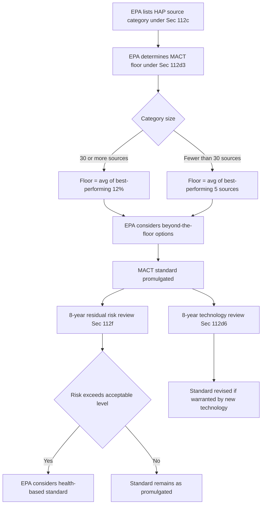

## Hazardous Air Pollutants and Maximum Achievable Control Technology Standards

### Statutory Basis

Section 112 of the Clean Air Act, 42 U.S.C. § 7412, governs hazardous air pollutants (HAPs), also called air toxics. The 1990 Amendments fundamentally restructured § 112, replacing the pre-1990 health-based, pollutant-by-pollutant approach (which had produced only a handful of standards in nearly 20 years) with a technology-based, source-category approach requiring Maximum Achievable Control Technology (MACT).

### The Statutory List of HAPs

Section 112(b) originally listed 189 HAPs (now 187 after delistings/additions), including substances such as benzene, mercury compounds, vinyl chloride, and asbestos. EPA may add or delete substances through rulemaking upon a showing that a pollutant meets or fails to meet the § 112(b)(3) listing criteria (adverse health or environmental effects).

### Source Categories and Listing

**Key Points**

- EPA must publish and periodically revise a list of "source categories" and "subcategories" that emit one or more HAPs, under § 112(c).
- **Major source**: Potential to emit ≥ 10 tpy of any single HAP or ≥ 25 tpy of any combination of HAPs.
- **Area source**: Any stationary source that is not major (i.e., below the 10/25 tpy thresholds).
- EPA must list both major and certain area source categories, though area sources may be regulated using generally available control technology (GACT) rather than full MACT in appropriate cases (§ 112(d)(5)).

### MACT Standard-Setting Methodology

Section 112(d) requires EPA to establish emission standards for each listed source category, following a two-tier structure:

1. **MACT Floor** (mandatory minimum stringency, § 112(d)(3)):
   - For **existing sources** in categories with ≥ 30 sources: no less stringent than the average emission limitation achieved by the best-performing 12% of existing sources (for which the Administrator has emissions information).
   - For **existing sources** in categories with < 30 sources: no less stringent than the average emission limitation achieved by the best-performing 5 sources.
   - For **new sources**: no less stringent than the emission control achieved in practice by the best-controlled similar source.
2. **Beyond-the-Floor Standards**: EPA may, but is not required to, set standards more stringent than the floor after considering cost, non-air-quality health and environmental impacts, and energy requirements.

$$\text{MACT Floor (existing, } n \geq 30\text{)} = \text{avg. emission limitation of best-performing } 0.12n \text{ sources}$$

### Risk-Based Backstop: Residual Risk Review

Under § 112(f), EPA must conduct a residual risk assessment within 8 years after promulgating a technology-based MACT standard, to determine whether the standard sufficiently protects public health with an ample margin of safety, particularly for carcinogens. If the MACT standard leaves a lifetime excess cancer risk to the most exposed individual exceeding 1-in-1-million, EPA must consider promulgating a health-based residual risk standard, though EPA retains substantial discretion regarding how it weighs costs at this stage.

### Technology Review

Independent of residual risk review, § 112(d)(6) requires EPA to review and revise MACT standards, as necessary, at least every 8 years, accounting for developments in practices, processes, and control technologies. In practice, EPA typically conducts the residual risk and technology reviews ("RTR") together.

### GACT for Area Sources

For area source categories, § 112(d)(5) permits EPA to promulgate standards based on generally available control technology or management practices, a less stringent alternative to full MACT, reflecting the lower per-source emissions and administrative burden concerns associated with area sources.

### Case-by-Case MACT Determinations (§ 112(j))

If EPA fails to promulgate a MACT standard for a listed source category within the statutory deadline, permitting authorities must make case-by-case MACT determinations for major sources in that category as part of the Title V permitting process, applying the same floor methodology on a source-specific basis.

### One-Time Alternative: Early Reduction Program

Section 112(i)(5) allowed sources that achieved a 90% reduction in HAP emissions (95% for particulate HAPs) before promulgation of the otherwise-applicable MACT standard to receive a 6-year compliance extension in lieu of that standard — a program now largely of historical relevance since most MACT standards have long since been promulgated.

### MACT Standard-Setting Process (Illustrative Diagram)

### Compliance and Monitoring Obligations

MACT-regulated sources are typically subject to:

- **Notification requirements**: Initial notification of applicability, notification of compliance status.
- **Performance testing**: Source testing to demonstrate compliance with numerical emission limits.
- **Continuous monitoring**: Continuous emissions monitoring systems (CEMS) or continuous opacity monitoring systems (COMS) where specified.
- **Startup, shutdown, and malfunction (SSM) provisions**: Following *Sierra Club v. EPA* (D.C. Cir. 2008), blanket SSM exemptions from otherwise-applicable emission standards have been found unlawful; standards generally must apply continuously, including during startup/shutdown/malfunction, though work-practice standards may be tailored to those periods.
- **Title V integration**: MACT emission limits and monitoring requirements are incorporated into the source's Title V operating permit.

### Example

A synthetic organic chemical manufacturing facility classified as a major HAP source (potential to emit benzene and other HAPs above the 10/25 tpy thresholds) would be subject to the Synthetic Organic Chemical Manufacturing Industry (SOCMI) MACT standard (40 C.F.R. Part 63, Subpart F/G/H/I, the "Hazardous Organic NESHAP" or HON). The facility would need to install leak detection and repair (LDAR) programs for equipment components, closed-vent systems and control devices for process vents, and wastewater controls, with compliance demonstrated through periodic monitoring and incorporated into its Title V permit.

### MACT vs. Residual Risk vs. Technology Review (Comparison Table)

| Mechanism | Statutory Section | Trigger | Basis | Frequency |
| --- | --- | --- | --- | --- |
| Initial MACT standard | § 112(d) | Source category listed | Technology-based (floor + beyond-floor) | One-time (upon listing) |
| Residual risk review | § 112(f) | 8 years after MACT promulgation | Health-based (ample margin of safety) | Once, 8 years post-MACT |
| Technology review | § 112(d)(6) | Periodic | Technology-based (new developments) | At least every 8 years |
| Case-by-case MACT | § 112(j) | EPA misses deadline | Technology-based (same floor methodology) | Source-specific, via Title V |

### Litigation and Interpretive Issues

[Inference] Several recurring interpretive disputes characterize MACT litigation and are commonly emphasized in coursework:

- **"Once in, always in" policy**: Whether a source that reduces emissions below major source thresholds after MACT applicability attaches can reclassify as an area source and escape MACT; EPA's 2020 policy shift (permitting reclassification at any time upon reducing PTE below thresholds) reversed the prior "once in, always in" position and has been subject to legal challenge.
- **Cost consideration at the floor stage**: Whether and how EPA may consider cost in setting MACT floors (as opposed to beyond-the-floor standards), given the statute's more permissive treatment of cost for beyond-the-floor determinations.
- **Averaging, banking, and trading within a facility**: The extent to which sources may use emissions averaging across process units to meet an aggregate MACT limit rather than per-unit compliance.

**Related Topics**

- Title V operating permits and MACT permit incorporation
- New Source Performance Standards (NSPS) under CAA § 111
- Residual risk methodology and acceptable risk determinations
- Startup, Shutdown, and Malfunction (SSM) provisions post-*Sierra Club v. EPA*
- Area source GACT standards and the "once in, always in" reclassification policy
- Leak Detection and Repair (LDAR) programs for fugitive HAP emissions
- Section 112(r) Risk Management Program for accidental releases