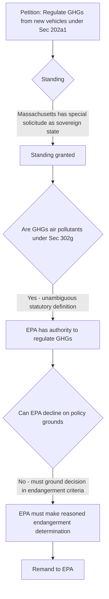

## Massachusetts v. EPA and Greenhouse Gases as Regulable Air Pollutants

### Case Citation and Posture

*Massachusetts v. EPA*, 549 U.S. 497 (2007), is a U.S. Supreme Court decision resolving a petition for review of EPA's 2003 denial of a rulemaking petition that had asked EPA to regulate greenhouse gas (GHG) emissions from new motor vehicles under CAA § 202(a)(1). Twelve states (led by Massachusetts), several cities, and environmental organizations petitioned for review after EPA denied the underlying petition on both jurisdictional and discretionary grounds.

### Procedural History

1. **1999**: A coalition of organizations petitioned EPA to regulate GHG emissions (CO2, CH4, N2O, HFCs) from new motor vehicles under CAA § 202(a)(1).
2. **2003**: EPA denied the petition, concluding (a) the CAA does not authorize regulation of GHGs for climate change purposes, and (b) even if it had authority, EPA would decline to exercise it at that time due to scientific uncertainty and policy concerns.
3. **D.C. Circuit**: A divided panel denied review, upholding EPA's denial.
4. **Supreme Court**: Certiorari granted; decided 5-4, with Justice Stevens writing for the majority.

### Threshold Issue: Standing

**Key Points**

- EPA and intervenors argued petitioners lacked Article III standing.
- The Court found Massachusetts had standing based on its status as a state possessing a "special solicitude" in the standing analysis, given its quasi-sovereign interests in its coastal territory.
- Massachusetts demonstrated injury (loss of coastal land from rising sea levels attributable in part to climate change), causation (traceable to GHG emissions including from U.S. motor vehicles), and redressability (regulation could slow the pace of sea level rise, even if not eliminate it).
- The Court applied a relaxed redressability standard, holding that a partial remedy (incremental reduction in a global problem) suffices for standing purposes.

### Merits Issue 1: Are Greenhouse Gases "Air Pollutants" Under the CAA?

The Court addressed whether CO2 and other GHGs fall within the CAA's broad definition of "air pollutant" under § 302(g), which defines the term as:

> Any air pollution agent or combination of such agents, including any physical, chemical...substance or matter which is emitted into or otherwise enters the ambient air.

The Court held this definition is unambiguously broad enough to encompass any airborne compound of the sort described, including GHGs, rejecting EPA's argument that Congress could not have intended to include GHGs given the CAA's structure and legislative history predating widespread climate concern.

### Merits Issue 2: EPA's Discretion to Decline Regulation

The Court also rejected EPA's alternative rationale — that even if it had authority, it could decline to regulate for policy reasons (scientific uncertainty, potential conflict with other administration climate initiatives, foreign policy considerations). The Court held that:

- EPA's authority to decline regulation under § 202(a)(1) is constrained by the statutory language, which requires the Administrator to make an endangerment finding based on the statutory criteria.
- EPA may avoid regulation only if it determines that GHGs do not contribute to climate change, or if it provides a reasoned explanation for why it cannot or will not exercise its discretion to determine whether they do.
- Policy considerations untethered to the statutory endangerment/contribution standard are not a permissible basis for declining to act.

### Holding Summary

### Consequences: The Endangerment Finding

On remand, EPA was required to determine, under the statutory framework of § 202(a)(1), whether GHG emissions from new motor vehicles "cause or contribute to air pollution which may reasonably be anticipated to endanger public health or welfare." This led directly to:

- **2009 Endangerment and Cause or Contribute Findings**: EPA formally found that (1) elevated atmospheric concentrations of six well-mixed GHGs (CO2, CH4, N2O, HFCs, PFCs, SF6) endanger public health and welfare of current and future generations, and (2) combined emissions of these GHGs from new motor vehicles and engines contribute to that atmospheric concentration.
- The endangerment finding is a scientific/technical predicate finding, not itself a regulation, but it triggered EPA's mandatory duty under § 202(a)(1) to promulgate GHG emission standards for new motor vehicles.
- **2010 and subsequent light-duty vehicle GHG/CAFE standards**: EPA (jointly with NHTSA under the Energy Policy and Conservation Act) issued coordinated GHG and fuel economy standards for light-duty vehicles, and later for heavy-duty vehicles.

### Downstream Regulatory Effects Beyond Mobile Sources

Because the CAA's PSD and Title V programs incorporate "any air pollutant subject to regulation under the Act," EPA's mobile-source GHG regulations triggered questions about whether stationary sources emitting GHGs above major source thresholds would also require PSD/Title V permitting for GHGs — addressed in EPA's subsequent "Tailoring Rule" and later litigated in *Utility Air Regulatory Group v. EPA*, 573 U.S. 302 (2014), which held that stationary sources cannot be classified as major sources based on GHG emissions alone, but that sources already major for other pollutants (anyway subject to PSD) may still need to apply BACT for GHGs ("anyway sources").

### Table: Key Holdings and Their Doctrinal Significance

| Issue | Holding | Doctrinal Significance |
| --- | --- | --- |
| Standing | States receive "special solicitude"; relaxed redressability for incremental harm reduction | Expanded state standing in environmental/climate cases |
| Statutory definition of "air pollutant" | GHGs fall within § 302(g)'s broad definition | Textualist reading extends CAA to substances not contemplated by original drafters |
| Agency discretion to decline rulemaking | Constrained by statutory endangerment criteria; cannot rest on non-statutory policy factors | Limits *Chevron*-style discretion where statute provides an intelligible standard for action |

### Subsequent Developments and Limits

[Inference] Later cases have narrowed or clarified aspects of the regulatory architecture that followed *Massachusetts v. EPA*, though the core holding on GHGs as "air pollutants" has not been overturned:

- *Utility Air Regulatory Group v. EPA* (2014): Limited GHG-based PSD/Title V triggering, as noted above.
- *West Virginia v. EPA*, 597 U.S. 697 (2022): Applying the major questions doctrine, the Court held that EPA's Clean Power Plan approach to regulating GHGs from existing power plants under § 111(d) (through generation-shifting rather than source-specific controls) exceeded EPA's authority absent clear congressional authorization — constraining the scope of permissible regulatory mechanisms without disturbing *Massachusetts v. EPA*'s core statutory interpretation holding.

**Example**

Following the 2009 endangerment finding, EPA's first GHG standards for light-duty vehicles (model years 2012–2016) required manufacturers to meet a fleet-average CO2 emissions target (a declining $g/mile$ standard), harmonized with NHTSA's corporate average fuel economy (CAFE) standards under a coordinated National Program, illustrating the direct regulatory chain from the *Massachusetts v. EPA* holding through the endangerment finding to enforceable emission standards.

**Related Topics**

- CAA § 202(a)(1) new motor vehicle emission standards
- EPA's 2009 Endangerment and Cause-or-Contribute Findings
- *Utility Air Regulatory Group v. EPA* and the PSD/Title V "anyway sources" doctrine
- *West Virginia v. EPA* and the major questions doctrine
- CAFE standards and NHTSA-EPA coordinated rulemaking
- Section 111(d) existing source performance standards for GHGs
- State standing doctrine in environmental litigation