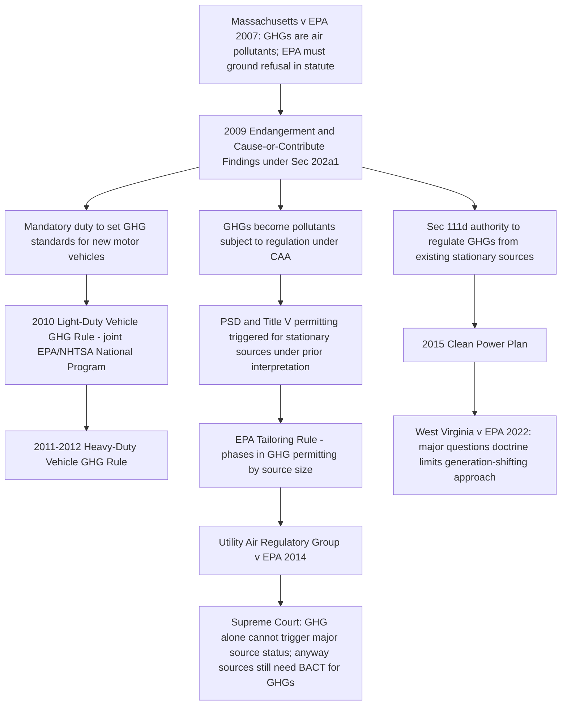

## The 2009 Endangerment Finding and Its Regulatory Chain of Consequences

### Statutory Trigger and Legal Predicate

The 2009 Endangerment Finding was EPA's direct response to the Supreme Court's remand in *Massachusetts v. EPA*, 549 U.S. 497 (2007), which held that greenhouse gases (GHGs) are "air pollutants" under CAA § 302(g) and that EPA must ground any decision not to regulate motor vehicle GHG emissions in the statutory endangerment framework of § 202(a)(1). Section 202(a)(1) requires the Administrator to prescribe standards for any air pollutant from new motor vehicles that, in the Administrator's judgment, "cause[s], or contribute[s] to, air pollution which may reasonably be anticipated to endanger public health or welfare."

### The Two Findings

Published December 15, 2009 (74 Fed. Reg. 66496), EPA issued two distinct findings under § 202(a)(1):

1. **Endangerment Finding**: The current and projected atmospheric concentrations of six well-mixed greenhouse gases — carbon dioxide (CO2), methane (CH4), nitrous oxide (N2O), hydrofluorocarbons (HFCs), perfluorocarbons (PFCs), and sulfur hexafluoride (SF6) — taken in combination, endanger the public health and welfare of current and future generations.
2. **Cause or Contribute Finding**: Combined emissions of these well-mixed GHGs from new motor vehicles and new motor vehicle engines contribute to the atmospheric concentrations of these gases, and hence to the threat of climate change.

**Key Points**

- The finding is a scientific/technical determination, not itself an emission standard; it has no direct compliance obligations on regulated parties.
- It functions as a statutory predicate that, once made, triggers a nondiscretionary duty for EPA to promulgate motor vehicle GHG standards.
- The finding relied heavily on assessments from the IPCC, the U.S. Global Change Research Program, and the National Research Council, synthesized in EPA's Technical Support Document.

### Basis of the Finding

EPA's endangerment analysis addressed:

- **Attribution**: Evidence that observed increases in atmospheric GHG concentrations are largely attributable to anthropogenic sources.
- **Public health effects**: Increased likelihood of heat-related mortality, worsened air quality (e.g., ground-level ozone formation sensitivity to temperature), and altered disease vector patterns.
- **Public welfare effects**: Impacts on agriculture, forestry, water resources, sea level rise, coastal infrastructure, and ecosystems.
- EPA applied a weight-of-evidence approach rather than a single bright-line risk threshold, consistent with its historical approach to NAAQS-related endangerment findings under § 108/109.

### Litigation Challenging the Finding

The finding was challenged in *Coalition for Responsible Regulation v. EPA*, 684 F.3d 102 (D.C. Cir. 2012), consolidated with related petitions. The D.C. Circuit upheld the finding, holding that:

- EPA's reliance on major scientific assessments (rather than solely primary research) was permissible and consistent with the deferential standard of review for scientific determinations within the agency's technical expertise.
- The endangerment finding was not arbitrary and capricious; petitioners' arguments regarding uncertainty in climate science did not undermine the reasonableness of EPA's weight-of-evidence approach.
- EPA was not required to conduct a separate cost-benefit analysis at the endangerment-finding stage under § 202(a)(1), since the statute's endangerment/contribution test is the exclusive criterion at that step.

The Supreme Court denied certiorari on the endangerment finding itself, leaving it intact, while granting certiorari on the separate question of stationary-source GHG permitting addressed in *Utility Air Regulatory Group v. EPA*.

### The Regulatory Chain of Consequences

### Consequence 1: Mobile Source Standards

The most direct consequence was EPA's mandatory obligation to issue GHG emission standards for motor vehicles:

- **2010**: EPA and NHTSA jointly finalized the first coordinated GHG/CAFE standards for light-duty vehicles (model years 2012–2016), setting a declining fleet-average $g/mile$ CO2 target harmonized with fuel economy standards.
- **2012**: Standards extended through model year 2025.
- **Heavy-duty vehicles**: Separate GHG and fuel efficiency standards issued for trucks, buses, and other heavy-duty vehicles beginning with the 2011 rule.

### Consequence 2: Stationary Source Permitting (PSD/Title V)

Because the CAA's PSD program applies to "any air pollutant subject to regulation under this Act," EPA's motor vehicle GHG standards (once effective) arguably triggered PSD and Title V applicability for stationary sources emitting GHGs above the CAA's statutory major-source thresholds (100/250 tpy). Applying those thresholds literally to GHGs (emitted in much larger mass quantities than traditional criteria pollutants) would have swept in millions of previously unregulated small sources (e.g., large commercial buildings, farms).

- **Tailoring Rule (2010)**: EPA administratively raised the applicability thresholds for GHG-triggered PSD/Title V permitting to 100,000/75,000 tpy CO2-equivalent, to avoid this "absurd result," phasing in permitting requirements.
- **Utility Air Regulatory Group v. EPA, 573 U.S. 302 (2014)**: The Supreme Court held that EPA could not treat GHGs as triggering major source status on their own (invalidating the Tailoring Rule's threshold-setting rationale for that purpose), but upheld EPA's authority to require BACT for GHG emissions at sources that are "anyway" major sources due to conventional pollutants — the so-called "anyway sources" doctrine.

### Consequence 3: Existing Source Regulation Under § 111(d)

The endangerment finding also provided the predicate for EPA to regulate GHG emissions from existing stationary sources (e.g., power plants) under CAA § 111(d), which allows regulation of existing sources in categories already regulated for new sources under § 111(b):

- **2015 Clean Power Plan**: Proposed a "best system of emission reduction" for existing power plants incorporating generation-shifting (from coal to natural gas and renewables) across the grid, not just source-specific controls.
- **West Virginia v. EPA, 597 U.S. 697 (2022)**: Applying the major questions doctrine, the Court held that this generation-shifting approach required clear congressional authorization that EPA lacked, without disturbing the underlying endangerment finding or EPA's basic authority to regulate GHGs under § 111(d) through source-specific measures.

### Table: Endangerment Finding's Downstream Effects by Program

| CAA Program | Pre-Finding Status | Post-Finding Effect | Key Limiting Case |
| --- | --- | --- | --- |
| § 202(a)(1) mobile sources | No GHG standards | Mandatory GHG standards for new vehicles | — |
| PSD/Title V (stationary, new/modified) | GHGs not regulated | GHG BACT required for "anyway sources" only | *UARG v. EPA* (2014) |
| § 111(d) existing stationary sources | No GHG authority exercised | Authority confirmed, but scope of "best system" constrained | *West Virginia v. EPA* (2022) |
| § 111(b) new stationary sources | No GHG NSPS | New source GHG performance standards promulgated for power plants | — |

### Ongoing Legal Status

[Unverified] As of EPA's training-data-era posture, the endangerment finding itself has remained legally intact following *Coalition for Responsible Regulation*, though it has periodically been the subject of reconsideration petitions and political attention across administrations; any reconsideration or rescission proceeding would itself be subject to APA arbitrary-and-capricious review and would need to grapple with the existing scientific record and *Massachusetts v. EPA*'s underlying statutory holding.

**Example**

A petition to reconsider or rescind the endangerment finding would need to develop a contrary scientific record sufficient to survive judicial review under the same "arbitrary and capricious" / substantial evidence framework applied in *Coalition for Responsible Regulation* — EPA could not simply reverse the finding on policy preference alone without addressing the accumulated scientific record the original finding relied upon, given *State Farm*-style reasoned decision-making requirements applicable to agency reversals of prior factual findings.

**Related Topics**

- *Massachusetts v. EPA* and the recognition of GHGs as regulable air pollutants
- *Utility Air Regulatory Group v. EPA* and the "anyway sources" doctrine
- *West Virginia v. EPA* and the major questions doctrine
- Section 111(b)/(d) new and existing source performance standards
- CAFE standards and joint EPA-NHTSA rulemaking
- PSD/Title V Tailoring Rule and GHG permitting thresholds
- Arbitrary-and-capricious review of agency reversals (*Motor Vehicle Mfrs. Ass'n v. State Farm*)