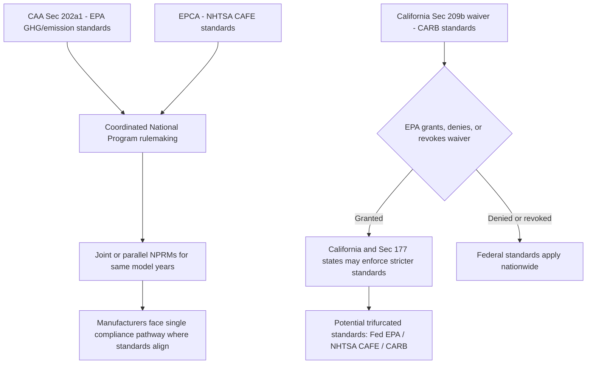

## Vehicle Emissions Standards and Coordination with Fuel Economy Regulation

### Dual Statutory Framework

Federal regulation of motor vehicle emissions and fuel efficiency rests on two parallel statutes administered by two different agencies:

- **Clean Air Act § 202(a)(1)**, 42 U.S.C. § 7521(a)(1) — administered by EPA, authorizing (and, per *Massachusetts v. EPA*, in some circumstances requiring) emission standards for new motor vehicles and engines, including criteria pollutants, air toxics, and (post-2009 Endangerment Finding) greenhouse gases (GHGs).
- **Energy Policy and Conservation Act (EPCA)**, 49 U.S.C. §§ 32901 et seq. — administered by the Department of Transportation through the National Highway Traffic Safety Administration (NHTSA), authorizing Corporate Average Fuel Economy (CAFE) standards.

Because CO2 emissions and fuel consumption are physically and mathematically linked (burning a gallon of gasoline produces a fixed, calculable mass of CO2), EPA's GHG tailpipe standards and NHTSA's CAFE standards function as two regulatory levers pulling on essentially the same underlying vehicle technology, which has driven both agencies toward harmonized joint rulemakings since 2010.

$$\text{CO}_2 \text{ (grams/mile)} \approx \frac{8887 \text{ g CO}_2/\text{gallon}}{\text{fuel economy (mpg)}}$$

### California's Special Authority Under § 209

**Key Points**

- CAA § 209(a) generally preempts states from adopting or enforcing their own motor vehicle emission standards.
- CAA § 209(b) creates a unique exception for California, permitting EPA to grant a waiver of preemption allowing California to set its own, more stringent standards, in recognition of the state's pre-1966 vehicle emission regulatory history and severe air quality challenges.
- CAA § 177 permits other states to opt in and adopt California's standards in lieu of the federal standards (so-called "Section 177 states"), without needing their own separate waiver.
- EPA may deny a waiver only on narrow statutory grounds: California's finding that its standards are as protective as federal standards is arbitrary and capricious; California does not need the standards to meet compelling and extraordinary conditions; or the standards are inconsistent with § 202(a) technological feasibility requirements.

### Joint EPA-NHTSA Rulemaking Architecture

### Historical Standard-Setting Cycle (2010–2022)

| Period | EPA GHG Standard | NHTSA CAFE Standard | Notable Feature |
| --- | --- | --- | --- |
| MY 2012–2016 | First joint GHG rule | Harmonized CAFE targets | Inaugural "National Program" |
| MY 2017–2025 | 2012 rule set aggressive footprint-based targets (~5%/yr) | Corresponding CAFE increases | California, EPA, NHTSA initially aligned |
| MY 2021–2026 (SAFE Vehicles Rule, 2020) | Relaxed to ~1.5%/yr annual increase | Corresponding relaxation | Simultaneously revoked California's § 209(b) waiver; asserted EPCA preemption of state GHG/ZEV standards |
| MY 2023–2026 | EPA restored more stringent targets (projected ~161 g CO2/mile industry-wide by 2026) | NHTSA restored corresponding CAFE increases (~49 mpg fleet average by 2026) | California's waiver reinstated in 2022; reflects post-2021 policy reversal |

### The Preemption Question: EPCA and § 209(b) Interaction

A recurring legal tension exists between EPCA's own preemption provision (barring states from adopting fuel economy standards "related to" fuel economy) and CAA § 209(b)'s express carve-out for California GHG standards, since GHG standards are functionally equivalent to fuel economy standards (lower CO2 per mile requires higher mpg). The 2019 SAFE Rule's "Part One" asserted that EPCA preempts state GHG and zero-emission-vehicle (ZEV) mandates regardless of the CAA § 209(b) waiver, a position later withdrawn; the underlying preemption question has continued to surface in subsequent rulemakings and litigation rather than being definitively resolved by the courts.

### 2025–2026 Legislative and Regulatory Developments

[Unverified] Given the rapid pace of change in this area, the following reflects the most recent developments as of this writing and should be verified against current Federal Register and Congressional Review Act (CRA) actions:

- **June 2025**: EPA transmitted California's Advanced Clean Cars I (ACC I) waiver, its 2022 reinstatement, the Small Offroad Engine (SORE) amendments, and the GHG standards for 2009-and-subsequent model years to Congress for review under the CRA, on the theory that these waivers should have been submitted as "rules" when originally granted.
- **May 2025**: The House and Senate voted to revoke several California waivers (including the Advanced Clean Cars II ZEV sales mandate, the Heavy-Duty Omnibus NOx rule, and the Advanced Clean Trucks rule) under the CRA.
- **Legal dispute over CRA applicability**: The Government Accountability Office (GAO) and the Senate Parliamentarian both concluded that CAA waivers are not "rules" subject to CRA review, creating a live legal controversy; California's Attorney General announced intent to sue over use of the CRA mechanism to rescind the waivers.
- **August 2025**: Additional Senate legislation was introduced to repeal remaining California emissions waivers, including the long-standing ACC I framework.
- Congress separately acted in 2025 to eliminate CAFE civil penalties for manufacturers failing to meet fuel economy standards, reducing the practical enforcement teeth of the NHTSA side of the framework even where standards remain nominally in effect.

**This is an active and rapidly evolving area of law; specific waiver statuses and CRA litigation outcomes should be verified against current sources before relying on them for any time-sensitive purpose.**

### Compliance Mechanics for Manufacturers

- **Fleet averaging**: Both EPA GHG standards and NHTSA CAFE standards are administered as fleet-wide averages (by manufacturer, often split between domestic and imported fleets for CAFE), not per-vehicle limits, allowing manufacturers to offset larger, less efficient vehicles with smaller, more efficient ones.
- **Credit trading and banking**: Manufacturers may bank compliance credits from over-compliance years and trade credits between fleets or (for GHG credits) with other manufacturers.
- **Footprint-based standards**: Both EPA and NHTSA standards since 2012 have used a vehicle's "footprint" (wheelbase × track width) to set a size-adjusted target curve, so a manufacturer's required average depends on its actual vehicle mix rather than a single flat number.
- **Off-cycle and technology credits**: Additional credits are available for technologies not captured by standard test cycles (e.g., solar reflective glass, active aerodynamics) and for advanced technologies like electric vehicles and plug-in hybrids.

### Example

A manufacturer selling primarily in Section 177 opt-in states (which together with California account for a substantial share of the U.S. new-vehicle market) has historically faced a de facto national standard driven by California's stricter requirements, since building a separate vehicle fleet for non-opt-in states is often less cost-effective than building to the stricter standard nationwide — illustrating how California's § 209(b) waiver authority has practical effects far beyond the state's own borders, and why federal efforts to revoke the waiver are viewed by automakers as consequential regardless of where a given vehicle is ultimately sold.

**Related Topics**

- *Massachusetts v. EPA* and the 2009 Endangerment Finding
- CAA § 209(b) California waiver standards and § 177 opt-in states
- EPCA preemption doctrine and its interaction with CAA § 209(b)
- Congressional Review Act mechanics and applicability to agency waivers
- Zero-emission vehicle (ZEV) mandates and Advanced Clean Cars II
- Heavy-duty vehicle GHG and NOx standards (Omnibus Rule, Advanced Clean Trucks)
- Cooperative federalism structures under the Clean Air Act