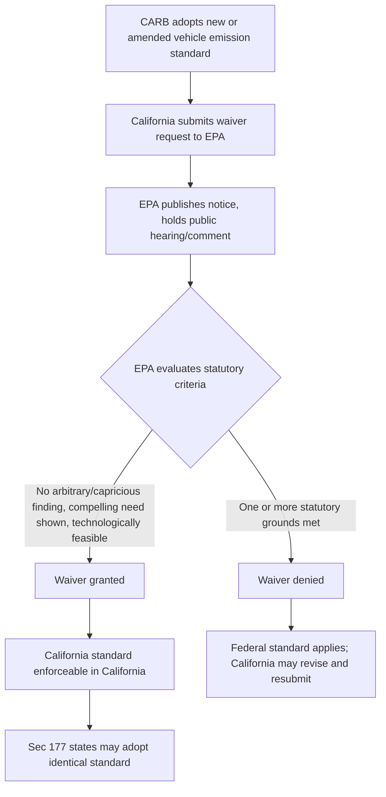

## California's Clean Air Act Waiver Authority and State Adoption of California Standards

### Statutory Structure: The § 209 Preemption/Waiver Framework

CAA § 209(a), 42 U.S.C. § 7543(a), broadly preempts states from adopting or enforcing "any standard relating to the control of emissions from new motor vehicles or new motor vehicle engines." This national uniformity requirement reflects Congress's judgment that manufacturers should not have to design different vehicles for different states. Section 209(b) carves out a unique exception solely for California, permitting EPA to waive preemption for California standards, in recognition that California adopted motor vehicle emission controls before the federal government did (pre-dating the 1967 Air Quality Act) and faces distinctive air quality challenges, particularly in the Los Angeles basin.

**Key Points**

- California is the only state that may receive a § 209(b) waiver; no other state may independently seek one.
- The waiver mechanism does not require California standards to be identical to or weaker than federal standards — it permits California to be *more stringent*.
- A waiver, once granted, does not expire on its own; it can be revisited, and its scope has been contested when California seeks to extend or modify existing standards.

### Statutory Criteria for Granting a Waiver

EPA must grant a waiver unless the Administrator makes one of three specific findings under § 209(b)(1):

1. California's determination that its standards are, in the aggregate, at least as protective of public health and welfare as applicable federal standards is arbitrary and capricious;
2. California does not need such standards to meet "compelling and extraordinary conditions"; or
3. California's standards and accompanying enforcement procedures are inconsistent with § 202(a) (i.e., not technologically feasible within the lead time provided, considering cost).

The burden is on parties opposing the waiver to demonstrate one of these grounds; EPA's longstanding practice (with a notable interruption discussed below) has been to apply a deferential standard favoring waiver approval, consistent with the statute's structure and legislative history treating California's compelling need as a settled premise for GHG/criteria pollutant regulation generally, subject to case-specific review.

### Waiver Process (Illustrative Diagram)

### Section 177: Opt-In States

CAA § 177, 42 U.S.C. § 7507, permits other states to adopt California's motor vehicle emission standards in lieu of federal standards, subject to conditions:

- The state must adopt standards **identical** to the California standards for which a waiver has been granted (states cannot mix-and-match or create hybrid standards).
- The state must provide at least two years of lead time before the standards take effect, to allow manufacturer compliance planning.
- States cannot create a third distinct regulatory regime; the only options under the CAA's preemption structure are the federal standard or the California standard.

As of recent years, a substantial bloc of states (commonly cited as approximately 17 states plus the District of Columbia, though membership fluctuates) has adopted some or all California vehicle standards under § 177, collectively representing a significant share of the U.S. new-vehicle market — a dynamic that gives California's standards practical influence well beyond the state's own borders.

### Historical Waiver Litigation and Revocation Episodes

**Table: Key Waiver Controversies**

| Episode | Standard at Issue | Outcome |
| --- | --- | --- |
| 2005–2009 GHG waiver dispute | California's first motor vehicle CO2 standards (AB 1493 / "Pavley" standards) | EPA (Bush administration) denied waiver in 2007; California sued; Obama EPA reversed and granted waiver in 2009, shortly after the Endangerment Finding process began |
| 2019 SAFE Rule "Part One" | Advanced Clean Cars I (ACC I) waiver and California's authority to set GHG/ZEV standards generally | Trump EPA revoked the waiver and asserted EPCA preempts state GHG and ZEV standards independent of § 209(b) |
| 2022 reinstatement | ACC I waiver | Biden EPA formally reinstated California's waiver authority, restoring the pre-2019 status quo |
| 2025 CRA actions | ACC I, its 2022 reinstatement, Advanced Clean Cars II (ZEV sales mandate), Advanced Clean Trucks, Heavy-Duty Omnibus NOx rule, Small Offroad Engine (SORE) amendments | Congress used the Congressional Review Act to revoke multiple waivers; GAO and the Senate Parliamentarian opined waivers are not "rules" subject to CRA review; California announced intent to litigate |

### The 2025 Congressional Review Act Controversy

[Unverified] This is a live, unresolved area of law as of this writing and should be checked against current sources:

- In 2025, EPA transmitted several California waivers to Congress, characterizing them as "rules" that should have been submitted for CRA review when originally granted, despite decades of prior practice treating § 209(b) waivers as adjudicative orders rather than rules.
- Both the Government Accountability Office and the Senate Parliamentarian issued opinions that CAA waivers do not constitute "rules" under the CRA and are therefore not subject to CRA repeal — a position California's Attorney General has relied on in announcing intent to sue.
- Despite these opinions, both chambers of Congress voted to repeal several waivers under the CRA in 2025, creating a direct conflict between the legislative branch's action and the nonpartisan GAO/Parliamentarian legal assessment.
- The core legal question — whether a § 209(b) waiver is a "rule" subject to CRA repeal, and if so, whether that repeal is valid notwithstanding the GAO/Parliamentarian opinions — has significant separation-of-powers and administrative law implications and may ultimately require judicial resolution.

### Distinguishing Waiver Types by Pollutant Category

**Key Points**

- **Criteria pollutant waivers**: California's authority to set stricter NOx, PM, CO, and HC standards for conventional vehicle emissions, the original and least legally contested category.
- **GHG/CO2 waivers**: Authority extended to greenhouse gas standards following the 2009 Endangerment Finding and *Massachusetts v. EPA*; more legally contested due to the EPCA preemption overlap.
- **ZEV sales mandate waivers**: Authority to require a minimum percentage of new vehicle sales be zero-emission vehicles (e.g., Advanced Clean Cars II); the most contested category, since it arguably regulates market composition and technology mandates rather than a per-vehicle emission limit in the traditional sense.
- **Off-road/nonroad equipment waivers**: California also holds separate authority under CAA § 209(e) for certain nonroad engines (though with more limited scope, excluding new farm and construction equipment under 175 hp from state regulation).

### Non-Vehicle Waiver Extension: Small Off-Road Engines

California's waiver authority under CAA § 209 has also been applied to non-vehicular categories such as small off-road engines (SORE) — lawn and garden equipment, generators, and similar devices — illustrating that the waiver mechanism, while most associated with cars and trucks, extends to other mobile source categories where California has sought and received EPA approval.

### Example

A manufacturer selling vehicles nationally must, in practice, design its compliance strategy around three potential regulatory tracks simultaneously: the federal EPA/NHTSA standard, the California standard (if the relevant waiver is in effect), and the § 177 opt-in states that have adopted the California standard. Historically, many manufacturers have chosen to build to the stricter California-aligned standard for their entire national fleet to avoid the cost of maintaining two separate vehicle platforms — meaning the practical stringency of "the" national vehicle emissions standard has often been set by California's waiver-authorized rules rather than the nominally applicable federal minimum, a dynamic now directly threatened by the 2025 CRA repeal actions if they are ultimately upheld.

**Related Topics**

- CAA § 202(a)(1) new motor vehicle emission standards and *Massachusetts v. EPA*
- EPCA preemption and its interaction with CAA § 209(b)
- Congressional Review Act procedure and scope of "rule" under 5 U.S.C. § 804
- Advanced Clean Cars II and zero-emission vehicle sales mandates
- Cooperative federalism models under the Clean Air Act
- Heavy-duty vehicle emission standards (Omnibus NOx Rule, Advanced Clean Trucks)
- Administrative law doctrines governing agency reversal of prior interpretive positions