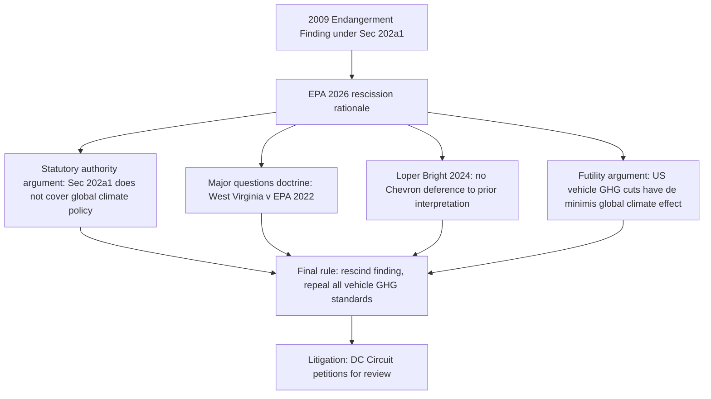

## The 2026 Rescission of the Endangerment Finding and Motor Vehicle Greenhouse Gas Standards

### Overview and Timeline

On February 18, 2026, EPA published a final rulerescinding the Agency's 2009 determination that greenhouse gas (GHG) emissions from motor vehicles and engines contribute to air pollution that endangers public health and welfare, titled Rescission of the Greenhouse Gas Endangerment Finding and Motor Vehicle Greenhouse Gas Emission Standards Under the Clean Air Act, published at 91 Fed. Reg. 7686 (Feb. 18, 2026). The final rule also repeals all GHG emission standards for new light-, medium-, and heavy-duty motor vehicles and engines manufactured for sale in the US, both prospectively and for all prior model years. [19 February 2026 +2](https://www.dlapiper.com/insights/publications/2026/02/epa-rescinds-endangerment-finding-and-eliminates-mobile-source-ghg-emissions-standards)

**Key Points — Procedural Timeline**

- January 2025: On the first day of his second term, President Trump issued an executive order directing EPA to evaluate the legality and continuing applicability of the Endangerment Finding. [davispolk](https://www.davispolk.com/insights/client-update/epa-s-endangerment-finding-danger-key-takeaways-and-uncertainties-repeal)
- March 2025: EPA Administrator Lee Zeldin formally recommended reconsideration. [davispolk](https://www.davispolk.com/insights/client-update/epa-s-endangerment-finding-danger-key-takeaways-and-uncertainties-repeal)
- August 2025: A proposed rule was published, drawing over 570,000 public comments. [davispolk](https://www.davispolk.com/insights/client-update/epa-s-endangerment-finding-danger-key-takeaways-and-uncertainties-repeal)
- February 12, 2026: The final rule was announced. [davispolk](https://www.davispolk.com/insights/client-update/epa-s-endangerment-finding-danger-key-takeaways-and-uncertainties-repeal)
- February 18, 2026: The final rule was published in the Federal Register. [davispolk](https://www.davispolk.com/insights/client-update/epa-s-endangerment-finding-danger-key-takeaways-and-uncertainties-repeal)
- Effective date: sources report slightly differing effective dates — April 26, 2026 per one tracker and April 20, 2026 per another; [Unverified] the precise effective date should be confirmed against the Federal Register text directly. [dlapiper](https://www.dlapiper.com/insights/publications/2026/02/epa-rescinds-endangerment-finding-and-eliminates-mobile-source-ghg-emissions-standards)[davispolk](https://www.davispolk.com/insights/client-update/epa-s-endangerment-finding-danger-key-takeaways-and-uncertainties-repeal)

### Scope of the Rescission

EPA's final rule rescinds the 2009 Endangerment Finding issued under section 202(a) of the CAA and repeals all GHG emissions standards for vehicles and engines manufactured or imported into the United States for model years 2012 to 2032 and beyond. The action reaches beyond simply halting future standards: [vnf](https://www.vnf.com/epa-rescinds-2009-endangerment-finding-and-repeals-vehicle-ghg-standards)

- The action removes existing regulations requiring manufacturers to measure, report, or comply with GHG emission standards, including standards for model years 2012 to 2027 and beyond, while preserving existing criteria pollutant and air toxics emission standards for vehicles. [butzel](https://www.butzel.com/alert-epa-rescinds-greenhouse-gas-endangerment-finding)
- The rule affects regulations in 40 CFR parts 85, 86, 600, 1036, 1037, and 1039. [butzel](https://www.butzel.com/alert-epa-rescinds-greenhouse-gas-endangerment-finding)
- The EPA's action eliminates emission standards for carbon dioxide (CO2), nitrous oxide (N2O), methane (CH4), and hydrofluorocarbons (HFCs) from air conditioning systems, and eliminates GHG-related testing, reporting, and compliance requirements while removing GHG credit programs and averaging, banking provisions that manufacturers previously used for compliance flexibility. [butzel](https://www.butzel.com/alert-epa-rescinds-greenhouse-gas-endangerment-finding)
- Notably, the Rescission Rule does not repeal the power plant GHG rules, oil and gas methane regulations, aircraft engine GHG standards, GHG permitting requirements, or the GHG Reporting Program — the rescission is targeted specifically at the motor vehicle Endangerment Finding and its dependent standards, not EPA's GHG authority generally. [davispolk](https://www.davispolk.com/insights/client-update/epa-s-endangerment-finding-danger-key-takeaways-and-uncertainties-repeal)

### EPA's Legal Rationale

**Key Points**

- The rescission of the Endangerment Finding does not rest on insufficiency of the climate change science supporting the finding. [Unverified — attributed to EPA's stated rationale] EPA has characterized its argument as resting on statutory authority rather than a scientific reassessment. [davispolk](https://www.davispolk.com/insights/client-update/epa-s-endangerment-finding-danger-key-takeaways-and-uncertainties-repeal)
- The agency determined that Clean Air Act Section 202(a)(1) does not authorize regulation of greenhouse gases in response to global climate change concerns, citing statutory interpretation and the major questions doctrine. [nffs](https://www.nffs.org/news/epa-rescinds-motor-vehicle-ghg-endangerment-finding-repeals-federal-emissions-standards)
- In the final rule, EPA advanced a primarily legal rationale for rescission, arguing that the Clean Air Act does not provide statutory authority to prescribe motor vehicle emission standards "for the purpose of addressing global climate change concerns." [jonesday](https://www.jonesday.com/de/insights/2026/06/challenges-to-epas-repeal-of-the-2009-endangerment-finding)
- The agency relied in part on more recent Supreme Court decisions, including the 2022 West Virginia v. EPA ruling, invoking the major questions doctrine, and the 2024 Loper Bright decision, overruling Chevron deference. [jonesday](https://www.jonesday.com/de/insights/2026/06/challenges-to-epas-repeal-of-the-2009-endangerment-finding)
- EPA additionally argues that the GHG standards are futile, asserting that even if all GHG emissions from new motor vehicles and engines in the United States were eliminated, there would be at best a de minimis impact on the global climate change concerns identified in the 2009 endangerment finding. [akingump](https://akingump.com/en/insights/alerts/epas-rescission-of-ghg-endangerment-finding-sets-up-a-highstakes-legal-fight)

### Legal Rationale Structure (Illustrative Diagram)

### Litigation: Two Tracks in the D.C. Circuit

The legal challenges are proceeding on two tracks in the U.S. Court of Appeals for the D.C. Circuit: one led by a coalition of health and environmental organizations, the other by a coalition of state and local governments. [jonesday](https://www.jonesday.com/de/insights/2026/06/challenges-to-epas-repeal-of-the-2009-endangerment-finding)

**Track 1 — Health and Environmental Organizations**

The first lawsuit, filed on February 18, 2026 (Case No. 26-01037), was brought by a broad coalition of 17 health and environmental organizations, including American Public Health Association, American Lung Association, Natural Resources Defense Council, Sierra Club, Environmental Defense Fund, and Center for Biological Diversity, naming EPA Administrator Lee Zeldin and EPA as defendants. On April 16, 2026, 16 of these groups filed a separate administrative petition with EPA asking the agency to reconsider its rescission (Docket No. EPA-HQ-OAR-2025-0194). [jonesday](https://www.jonesday.com/de/insights/2026/06/challenges-to-epas-repeal-of-the-2009-endangerment-finding)[jonesday](https://www.jonesday.com/de/insights/2026/06/challenges-to-epas-repeal-of-the-2009-endangerment-finding)

**Track 2 — States, Counties, and Cities**

On March 19, 2026, more than three dozen states and localities sued the Trump administration, arguing its repeal of the endangerment finding goes against the government's mandate under the Clean Air Act and accusing the administration of rehashing settled Supreme Court arguments. New York Attorney General Letitia James co-led the petition alongside attorneys general representing California, Massachusetts, and Connecticut. One state filing described the coalition as 24 states, the District of Columbia, the U.S. Virgin Islands, and 12 cities and counties. [States Challenge Trump EPA’s Endangerment Finding Repeal (2) +2](https://news.bloomberglaw.com/safety/states-cities-challenge-trump-epas-endangerment-finding-repeal)

### Petitioners' Core Arguments

- **Stare decisis / settled precedent**: Environmental groups argue that the EPA's rescission of the endangerment finding violates the concept of stare decisis, contending that in Massachusetts v. EPA, the Supreme Court recognized that Congress had provided clear authorization for regulating greenhouse gases under the Clean Air Act. [luc](https://blogs.luc.edu/compliance/?p=6872)
- **Statutory text was already found unambiguous**: The Court in Massachusetts found § 202(a)(1) to be "unambiguous" and to "reflect an intentional effort" by Congress to provide EPA with the flexibility to regulate dangerous air pollution while accounting for changing circumstances and scientific developments — a holding petitioners argue is in tension with EPA's reliance on *Loper Bright* and the major questions doctrine to narrow that same statutory grant. [akingump](https://akingump.com/en/insights/alerts/epas-rescission-of-ghg-endangerment-finding-sets-up-a-highstakes-legal-fight)
- **Futility argument is an improper policy consideration**: Petitioners may argue that EPA's claims about the efficacy (and thus futility) of GHG standards is a policy consideration that the Massachusetts Court prohibited the agency from considering when determining whether to regulate. [akingump](https://akingump.com/en/insights/alerts/epas-rescission-of-ghg-endangerment-finding-sets-up-a-highstakes-legal-fight)

### EPA's Counter-Framing

- EPA invokes the major questions doctrine, formally recognized in West Virginia v. EPA, to argue that regulation of global climate change concerns is an issue "of significant economic and political importance" that Congress would not have left for EPA to address without express authorization. [akingump](https://akingump.com/en/insights/alerts/epas-rescission-of-ghg-endangerment-finding-sets-up-a-highstakes-legal-fight)
- The rescission does not rest on insufficiency of the climate change science; rather, the Agency concluded that the Endangerment Finding exceeded its authority under the CAA, and that the rescission is consistent with recent Supreme Court case law. [vnf](https://www.vnf.com/epa-rescinds-2009-endangerment-finding-and-repeals-vehicle-ghg-standards)
- EPA cites the major questions doctrine as support for its view that Section 202(a)(1) does not authorize GHG regulation aimed at global climate change. [nffs](https://www.nffs.org/news/epa-rescinds-motor-vehicle-ghg-endangerment-finding-repeals-federal-emissions-standards)

### Anticipated Path to the Supreme Court

Litigation challenging the Rescission Rule has already begun and is expected to reach the Supreme Court. [Inference] Because the rule directly confronts a prior Supreme Court holding (*Massachusetts v. EPA*) using doctrines developed in later cases (*West Virginia v. EPA*, *Loper Bright*), the case presents an unusually direct doctrinal collision that commentators widely expect to require Supreme Court resolution rather than being settled definitively at the D.C. Circuit level. Legal experts anticipate the current lawsuit to be appealed to the Supreme Court, with the belief that a more conservative Supreme Court could be sympathetic to the EPA's arguments, particularly given the Court's 2022 decision in West Virginia v. EPA that the EPA lacked authority under the Clean Air Act to set an emissions cap for greenhouse gases. [davispolk](https://www.davispolk.com/insights/client-update/epa-s-endangerment-finding-danger-key-takeaways-and-uncertainties-repeal)[luc](https://blogs.luc.edu/compliance/?p=6872)

### Doctrinal Tension Chart

| Doctrine/Precedent | Petitioners' Reading | EPA's Reading |
| --- | --- | --- |
| *Massachusetts v. EPA* (2007) | Established GHGs as "air pollutants" and confirmed § 202(a)(1) unambiguously authorizes their regulation | Predates *West Virginia* and *Loper Bright*; does not resolve whether GHG regulation for climate purposes is a "major question" |
| *West Virginia v. EPA* (2022) | Concerned generation-shifting under § 111(d), a materially different statutory mechanism than direct vehicle tailpipe standards under § 202(a)(1) | Establishes that agency assertions of sweeping, economically/politically significant authority require clear congressional authorization, applicable here |
| *Loper Bright* (2024) | Irrelevant where the Court already found the statutory text unambiguous in *Massachusetts* | Eliminates any residual *Chevron* deference to EPA's own prior interpretation, requiring courts to determine the statute's "best reading" independently |

### Practical Consequences for Regulated Parties

**Key Points**

- Manufacturers are relieved of federal GHG compliance, testing, reporting, and credit-trading obligations tied to the CAA § 202(a)(1) program, pending the outcome of litigation and any stay motions.
- Criteria pollutant and air toxics standards for motor vehicles remain unaffected by this rule.
- The rescission does not directly affect state-level requirements under California's § 209(b) waiver authority (a separate and independently contested track of regulation), meaning manufacturers selling into California and § 177 opt-in states may still face state-level GHG-equivalent requirements even where paired federal requirements are ambiguous or in dispute pending appeal.
- [Inference] Because litigation is ongoing and a stay may be sought, regulated parties face significant near-term compliance uncertainty regarding whether to continue voluntary GHG compliance programs as a hedge against the rule being vacated or stayed on review.

### Relationship to *Massachusetts v. EPA* and the 2009 Endangerment Finding

This rescission represents the direct doctrinal endpoint of the regulatory chain traced from *Massachusetts v. EPA* through the original 2009 Endangerment Finding: the same statutory provision (§ 202(a)(1)) and the same predicate finding are now the subject of an attempted full reversal, using legal tools (the major questions doctrine, the end of *Chevron* deference) that did not exist, or were not yet formally recognized, when the original finding was made or upheld in *Coalition for Responsible Regulation v. EPA* (D.C. Cir. 2012).

**Example**

A light-duty vehicle manufacturer that had been complying with fleet-average CO2 targets and banking GHG credits under the pre-rescission program would, absent a judicial stay, no longer face federal GHG compliance obligations for any model year — but would need to separately assess whether California's § 209(b) waiver-authorized GHG-equivalent standards (to the extent any survive the parallel 2025 CRA waiver disputes) still apply to vehicles sold in California and § 177 opt-in states, creating a genuinely bifurcated compliance landscape during the pendency of both sets of litigation.

**Related Topics**

- *Massachusetts v. EPA* and the original recognition of GHGs as regulable air pollutants
- The 2009 Endangerment Finding and its original regulatory chain of consequences
- *West Virginia v. EPA* and the major questions doctrine
- *Loper Bright Enterprises v. Raimondo* and the end of *Chevron* deference
- California's § 209(b) waiver authority and the 2025 CRA waiver disputes
- Administrative Procedure Act standards for agency reversal of prior factual/legal determinations
- CAA § 111(d) existing stationary source GHG authority (unaffected by this rule)