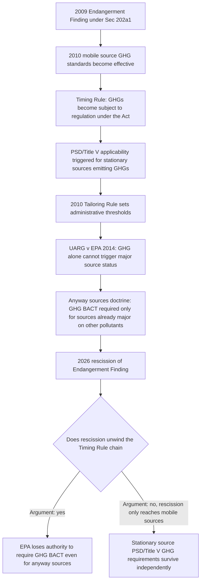

## Anticipated Litigation Over the Rescission and Its Effect on Stationary Source Authority

### Framing the Issue

The 2026 rescission of the 2009 Endangerment Finding was framed and litigated primarily as a mobile-source action under CAA § 202(a)(1), but its structural significance extends far beyond vehicles. The Endangerment Finding was the basis for regulating vehicle greenhouse gas (GHG) emissions and, thereafter, the underpinning for regulating GHG emissions from stationary sources like power plants. Because the CAA's PSD and Title V permitting programs turn on whether a pollutant is "subject to regulation under the Act," the elimination of the 2009 finding's mobile-source foundation threatens the doctrinal chain that first brought GHGs within PSD/Title V permitting scope in 2010–2011.

**Key Points**

- The rescission invalidates all current motor-vehicle and engine GHG standards issued under CAA section 202(a) and removes EPA's authority to regulate GHG emissions from such sources in the future under the CAA.
- The rescission also provides EPA with a potential regulatory basis for invalidating current and barring future GHG regulation of fossil fuel-fired power plants, oil and gas facilities, and other major source categories of GHG emissions under the CAA.
- EPA has signaled that it plans to repeal the current carbon dioxide standards for new and existing fossil fuel-fired power plants, and that it intends to revise methane standards for the oil and gas sector.

### The Doctrinal Chain from Mobile Sources to Stationary Sources

Because GHGs weren't explicitly listed in the Clean Air Act as air pollutants, it wasn't entirely clear how and when GHGs would become regulated pollutants at stationary sources under the Title V and PSD air permitting programs. EPA explored this issue in a December 18, 2008 memo, "EPA's Interpretation of Regulations that Determine Pollutants Covered by Federal Prevention of Significant Deterioration (PSD) Permit Program" (the "Johnson Memo"), which addressed the so-called "timing rule" question: precisely when a pollutant becomes "subject to regulation" for PSD/Title V purposes.

### The Core Legal Argument for Stationary-Source Spillover

An argument can be made that with the rescission of the Endangerment Finding, EPA would lack authority to regulate GHG emissions from stationary sources under the PSD and Title V programs, since the mobile-source finding was the historical trigger that made GHGs "subject to regulation" for purposes of those programs in the first place. If the triggering mechanism is invalidated retroactively or its legal predicate removed, the argument runs, the entire subsequent regulatory structure for GHGs — including PSD/Title V permitting for "anyway sources" under *Utility Air Regulatory Group v. EPA*, 573 U.S. 302 (2014), and § 111(b)/(d) standards for power plants — loses its foundational support.

### Counterarguments and Complicating Factors

[Inference] Several factors complicate a clean extension of the mobile-source rescission to stationary sources, and commentators have identified reasons the outcome is genuinely uncertain rather than automatic:

- **Independent statutory hooks**: Stationary source GHG regulation under § 111(b)/(d) and PSD/Title V does not depend solely on § 202(a)(1); EPA has made separate findings and promulgated separate rules for power plants and other source categories that could, in principle, stand on independent legal footing even if the mobile-source finding is rescinded.
- **No prior Supreme Court review of the finding itself**: The 2009 Endangerment Finding was never reviewed by the Supreme Court, so there are no previous Supreme Court decisions specifically on that finding's validity — meaning both the original finding and its 2026 rescission are litigating on a relatively open doctrinal field, complicating predictions in either direction.
- **Mixed track record for GHG stationary-source rules**: Not all of EPA's GHG rules have survived previous court challenges. Notably, the original Clean Power Plan was invalidated in *West Virginia v. EPA* (2022), and EPA's GHG Tailoring Rule was mostly invalidated in *Utility Air Regulatory Group v. EPA* (2014) — showing that stationary-source GHG authority was already narrowed by litigation well before the 2026 rescission, on grounds unrelated to the mobile-source Endangerment Finding itself.
- **"Anyway sources" independence**: Because *UARG* already confirmed that GHG BACT applies only to sources that are major for other, non-GHG pollutants, that narrower stationary-source authority arguably rests on the PSD program's general structure rather than exclusively on the mobile-source finding, giving EPA (or reviewing courts) a basis to sever the stationary-source question from the mobile-source rescission if they choose to.

### Anticipated Scope of Follow-On Stationary-Source Actions

**Key Points**

- EPA has signaled intent to repeal current carbon dioxide standards for new and existing fossil fuel-fired power plants.
- EPA intends to revise methane standards for the oil and gas sector.
- On September 16, 2025, EPA issued a proposed rule to remove or revise provisions of the Greenhouse Gas Reporting Program (40 C.F.R. Part 98), which requires large emitters and fuel or industrial gas suppliers to calculate and submit annual GHG data to EPA if emissions exceed 25,000 metric tons CO2-equivalent per year across listed source categories — indicating the deregulatory effort extends to GHG monitoring/reporting infrastructure, not solely emission limits.

### Effect on Nuisance Litigation and Common Law Claims

EPA rescinding the Endangerment Finding could prompt arguments affecting climate nuisance litigation risk: rescission of the Endangerment Finding will also create uncertainty about the validity of certain state laws and climate-related litigation under federal and state common law. [Inference] This connects to the doctrine of CAA displacement of federal common law nuisance claims established in *American Electric Power Co. v. Connecticut*, 564 U.S. 410 (2011) — if the CAA's GHG regulatory authority is narrowed or eliminated by the rescission, parties may argue that the displacement rationale (which rested on the existence of a comprehensive regulatory alternative) is undermined, potentially reopening avenues for common law claims that had been considered foreclosed.

### Litigation Posture and Likely Sequencing

The first court challenges to the rule were filed in federal court by environmental and public health organizations and advocates on the day the rule was published, proceeding in the D.C. Circuit on the two tracks described in the mobile-source rescission analysis (health/environmental organizations and state/local government coalitions). [Inference] Because the stationary-source implications depend on companion rulemakings EPA has signaled but not yet finalized (repeal of power plant CO2 standards, revision of oil and gas methane standards), litigation over stationary-source authority is likely to unfold as a second wave of challenges once those companion rules are proposed and finalized, rather than being fully resolved within the initial mobile-source rescission litigation — though petitioners in the mobile-source case may seek to establish favorable precedent on the underlying statutory authority questions that would carry over to the stationary-source rules.

### Table: Mobile vs. Stationary Source Litigation Posture

| Dimension | Mobile Sources (§ 202(a)(1)) | Stationary Sources (§ 111(b)/(d), PSD/Title V) |
| --- | --- | --- |
| Rescission status as of the 2026 rule | Final; effective April 2026 (subject to litigation) | Not yet rescinded; EPA has signaled intent to follow with separate rulemakings |
| Direct legal predicate challenged | 2009 Endangerment Finding under § 202(a)(1) | Downstream reliance on the same finding via the "timing rule" and independent § 111 findings |
| Key precedent favoring survival of authority | *Massachusetts v. EPA* (2007) | *UARG v. EPA* (2014) "anyway sources" doctrine; independent § 111 findings |
| Key precedent favoring rescission's validity | *West Virginia v. EPA* (2022); *Loper Bright* (2024) | Same, plus *West Virginia*'s direct invalidation of the Clean Power Plan's generation-shifting approach |
| Litigation stage | Filed and pending in D.C. Circuit | Anticipated once companion power plant/oil-and-gas rules are finalized |

### Example

A coal-fired power plant currently subject to GHG BACT requirements under its PSD permit (as an "anyway source" already major for SO2 and NOx) would not see those requirements automatically lifted by the mobile-source rescission alone; the plant's permit terms remain in effect unless and until EPA finalizes a companion rulemaking specifically addressing stationary-source GHG standards and that rulemaking survives its own judicial review — illustrating why stakeholders in the power sector are advised to treat the mobile-source rescission as a signal of anticipated future action rather than an immediate change to their own compliance obligations.

**Related Topics**

- The 2026 rescission of the Endangerment Finding and motor vehicle GHG standards
- *Utility Air Regulatory Group v. EPA* and the "anyway sources" doctrine
- *West Virginia v. EPA* and the major questions doctrine applied to § 111(d)
- The 2008 "Johnson Memo" and PSD/Title V "timing rule" for newly regulated pollutants
- *American Electric Power Co. v. Connecticut* and CAA displacement of federal common law nuisance claims
- Greenhouse Gas Reporting Program (40 C.F.R. Part 98) and its proposed revision
- Oil and gas sector methane standards under CAA § 111