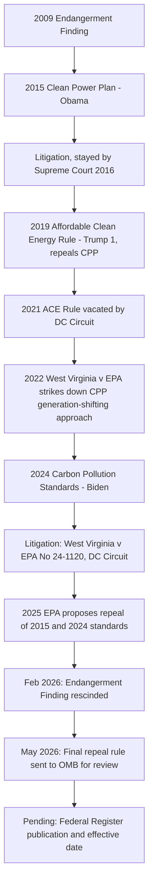

## Power Plant Carbon Regulation from the Clean Power Plan to Current Approaches

### Statutory Basis

Power plant GHG regulation proceeds under CAA § 111, 42 U.S.C. § 7411, which distinguishes between:

- **§ 111(b)**: New Source Performance Standards (NSPS) for newly constructed or modified sources within a regulated source category.
- **§ 111(d)**: Standards for existing sources within a category already regulated for new sources under § 111(b), implemented through EPA emission guidelines and state plans (structurally similar to the SIP process).

Both provisions require EPA to base standards on the "best system of emission reduction" (BSER) "adequately demonstrated," considering cost, health/environmental impacts, and energy requirements — language that has become the central battleground in the litigation history below.

$$\text{BSER standard} = f(\text{cost}, \text{health/environmental impact}, \text{energy requirements})$$

### Regulatory Timeline (Illustrative Diagram)

### Phase 1: The Clean Power Plan (2015)

The EPA first sought to limit power plant GHG emissions through the 2015 Clean Power Plan (CPP), issued under § 111(d) for existing fossil fuel-fired power plants. The CPP's defining and most controversial feature was its "generation-shifting" approach to BSER: rather than limiting emission controls to equipment installed at individual plants (inside-the-fenceline measures), the CPP's BSER contemplated shifting electricity generation from higher-emitting sources (coal) to lower-emitting sources (natural gas) and zero-emitting sources (renewables) across the grid.

- The CPP was stayed by the Supreme Court in February 2016, pending judicial review, and never took effect.
- The stay proved consequential: the rule was later replaced administratively before any court fully resolved its legality on the merits under normal appellate review.

### Phase 2: The Affordable Clean Energy Rule (2019)

The first Trump administration attempted to serve up an ACE with its Affordable Clean Energy Rule repealing the CPP. The ACE Rule replaced the CPP's generation-shifting BSER with a narrower, inside-the-fenceline approach limited to heat-rate efficiency improvements at individual coal plants — a much less stringent standard reflecting a fundamentally different reading of § 111's BSER authority.

- The ACE Rule was vacated by the D.C. Circuit in January 2021, on the last full day of the first Trump administration, which found EPA's interpretation that § 111 categorically forecloses generation-shifting measures to be unsupported.

### Phase 3: *West Virginia v. EPA* (2022)

Although the CPP itself never took effect and had already been superseded by the ACE Rule (then vacated), litigation over the underlying legal question — whether § 111(d) permits generation-shifting BSER — reached the Supreme Court. In *West Virginia v. EPA*, 597 U.S. 697 (2022), the Court held that EPA had overstepped its authority by attempting to restructure the nation's electricity generation mix, a matter of "major questions" requiring clear congressional authorization that the general BSER language of § 111 did not provide.

**Key Points**

- *West Virginia v. EPA* did not hold that EPA lacks all authority to regulate power plant GHG emissions under § 111; it specifically foreclosed the generation-shifting mechanism as a permissible BSER.
- The decision established the major questions doctrine as a significant constraint on ambitious agency interpretations of open-ended statutory delegations, later invoked again in the 2026 mobile-source Endangerment Finding rescission.
- The ruling left open the possibility of source-specific, inside-the-fenceline BSER measures (e.g., carbon capture and storage, efficiency improvements) as a narrower, but still viable, basis for § 111 power plant standards.

### Phase 4: The Carbon Pollution Standards (2024)

Following *West Virginia*, the Biden administration promulgated the 2024 Carbon Pollution Standards (CPS), finalized in April 2024, establishing performance standards for new sources and emissions guidelines for certain existing sources, grounded explicitly in inside-the-fenceline BSER measures — principally carbon capture and storage (CCS) for new baseload combustion turbines and existing coal plants with long operating horizons — designed to fit within *West Virginia*'s constraints while still achieving substantial emission reductions (a goal of controlling 90 percent of carbon emissions by 2032, with plants shutting down by 2032 exempt).

The 2024 CPS was immediately challenged in *State of West Virginia, et al. v. EPA*, No. 24-1120 (D.C. Cir., filed May 9, 2024), and remained in active litigation as EPA's own subsequent repeal effort proceeded in parallel.

### Phase 5: The 2025–2026 Repeal Effort

**Key Points — Timeline**

- June 11/17, 2025: EPA Administrator Lee Zeldin formally proposed repealing both the 2015 NSPS and the 2024 Carbon Pollution Standards under CAA § 111, framing the action as a move to ensure affordable and reliable energy supplies and reduce costs across transportation, heating, utilities, farming, and manufacturing.
- The proposal advanced the argument that fossil-fuel-fired power plants do not contribute significantly to dangerous air pollution under § 111 of the Clean Air Act — a "significant contribution" threshold argument distinct from, but related to, the endangerment-finding rescission rationale applied to mobile sources.
- As an alternative to a full repeal, EPA also proposed eliminating the most burdensome requirements specifically: emission guidelines for existing power plants and carbon capture and sequestration/storage-based requirements for new combustion turbines and modified coal plants — a narrower fallback if the full repeal does not survive review.
- A key argument driving the repeal is that greenhouse gas emissions are global in nature, making it difficult to attribute specific public health harms to the U.S. power sector alone — echoing the "futility" argument EPA also advanced in the mobile-source Endangerment Finding rescission.
- According to EPA estimates, the proposed repeal would yield approximately $19 billion in regulatory cost savings over a 20-year period, or roughly $1.2 billion annually beginning in 2026, attributed largely to eliminating CCS requirements and avoiding operational modifications.
- February 12, 2026: EPA finalized its rescission of the Endangerment Finding, eliminating a significant part of the cross-cutting legal foundation supporting GHG regulation generally, including for the power sector.
- May 14, 2026: EPA sent the final power plant repeal rule to the Office of Management and Budget (OMB) for review, describing the action as proposing "to repeal all greenhouse gas emissions standards for fossil fuel-fired power plants." OMB review can take up to 90 days before Federal Register publication.
- As of this writing, the final repeal rule has not yet been published in the Federal Register; its effective date and final scope remain pending.

### Relationship Between the Power Plant Repeal and the Endangerment Finding Rescission

The principles underlying the power plant repeal proposal — if adopted and then upheld — would inevitably lead to the undoing of effectively all direct regulation of stationary source GHG emissions under the Clean Air Act, extending well beyond the power sector specifically. This connects directly to the broader stationary-source spillover question raised by the mobile-source Endangerment Finding rescission: both actions rest on overlapping legal theories (statutory authority limits under § 111/§ 202, the major questions doctrine, and futility/attribution arguments about the causal link between U.S. emissions and global climate harm), such that success or failure of one rationale in litigation is likely to influence the other, even though they proceed as formally separate rulemakings and separate D.C. Circuit dockets.

### Table: Comparative Snapshot of Power Plant GHG Rules

| Rule | Year | BSER Approach | Legal Outcome |
| --- | --- | --- | --- |
| Clean Power Plan | 2015 | Generation-shifting (across-the-grid) | Stayed by SCOTUS 2016; never took effect; superseded |
| Affordable Clean Energy Rule | 2019 | Inside-the-fenceline (heat-rate improvements only) | Vacated by D.C. Circuit, January 2021 |
| — | 2022 | (Litigation over CPP's generation-shifting theory) | *West Virginia v. EPA*: generation-shifting BSER rejected under major questions doctrine |
| Carbon Pollution Standards | 2024 | Inside-the-fenceline (CCS-based) | Finalized; challenged in *West Virginia v. EPA*, No. 24-1120; subject to EPA's own 2025 repeal proposal |
| 2026 Repeal Rule | Proposed 2025, sent to OMB May 2026 | N/A — repeals GHG standards entirely (or alternative: narrows existing-source guidelines/CCS requirements) | Pending Federal Register publication; anticipated litigation |

### Significance for the Power Sector

Greenhouse gas emissions from the generation of electricity by fossil fuel-fired power plants, or electric generating units (EGUs), make up roughly 25% of US total GHG emissions, making this rulemaking sequence one of the highest-stakes domains of CAA climate regulation, comparable in scale to the mobile-source program. [Unverified] Because the repeal rule was pending OMB review as of the most recent available reporting, its final scope (full repeal versus the narrower CCS/existing-source-guideline-only alternative EPA also floated) and effective date should be verified against the Federal Register once published.

### Example

A utility operating an existing coal plant that had begun CCS retrofit planning to comply with the 2024 Carbon Pollution Standards faces significant near-term uncertainty: if EPA's full repeal is finalized and survives challenge, the CCS investment may no longer be legally required, but if the repeal is vacated on review (as happened to the ACE Rule) or if litigation results in a stay, the utility could find itself back under the 2024 standards' compliance deadlines with substantially less lead time than originally planned — illustrating the practical planning risk created by the rapid, multi-directional reversals characterizing this area of law since 2015.

**Related Topics**

- *West Virginia v. EPA* and the major questions doctrine
- The 2026 rescission of the Endangerment Finding and motor vehicle GHG standards
- Anticipated litigation over the rescission and its effect on stationary source authority
- CAA § 111 "best system of emission reduction" (BSER) standard-setting methodology
- Carbon capture and storage (CCS) as a BSER technology under § 111
- PSD/Title V permitting for GHGs and the "anyway sources" doctrine
- Cooperative federalism structures in § 111(d) existing-source state plans