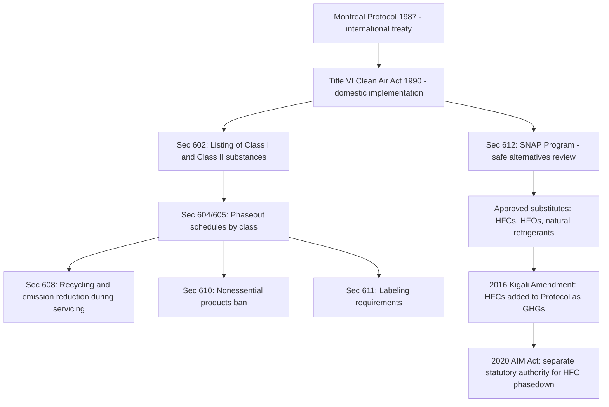

## Stratospheric Ozone Protection Under Title VI and the Montreal Protocol

### Statutory Basis and International Framework

Title VI of the Clean Air Act, 42 U.S.C. §§ 7671–7671q, added by the 1990 Amendments, implements U.S. obligations under the Montreal Protocol on Substances that Deplete the Ozone Layer (1987), an international agreement negotiated under the Vienna Convention for the Protection of the Ozone Layer (1985). Title VI represents a distinctive structure within the CAA: rather than relying on NAAQS/SIP or MACT-style source-category regulation, it uses a phased chemical-substance-elimination approach targeting ozone-depleting substances (ODS) directly by class and compound.

### Scientific Background

Stratospheric ozone (distinct from ground-level "bad" ozone regulated as a NAAQS criteria pollutant) absorbs harmful ultraviolet-B (UV-B) radiation, protecting terrestrial and marine life. Certain synthetic chemicals — chlorofluorocarbons (CFCs), halons, and related compounds — were found to catalytically destroy stratospheric ozone molecules, leading to measurable ozone depletion, including the Antarctic "ozone hole" first documented in the mid-1980s.

**Key Points**

- CFC molecules are chemically stable enough to survive transport into the stratosphere, where UV radiation breaks them apart, releasing chlorine atoms that catalytically destroy ozone (a single chlorine atom can destroy many thousands of ozone molecules before being removed from the stratosphere).
- Halons (used in fire suppression) contain bromine, which is even more efficient at ozone destruction per atom than chlorine.
- The relationship between ODS emissions and stratospheric ozone depletion is well-established scientific consensus, unlike some more contested areas of atmospheric science.

### Title VI Structure

Title VI is organized around several core mechanisms:

1. **§ 602 — Listing of Class I and Class II Substances**: EPA must list and classify ODS into two tiers based on ozone-depletion potential (ODP).
2. **§ 604 — Phaseout Schedule for Class I Substances**: Production and consumption of Class I substances (CFCs, halons, carbon tetrachloride, methyl chloroform, and others) subject to accelerated phaseout schedules.
3. **§ 605 — Phaseout Schedule for Class II Substances**: Hydrochlorofluorocarbons (HCFCs), transitional substitutes with lower but still nonzero ODP, subject to a later, more gradual phaseout.
4. **§ 606 — Accelerated Schedule Authority**: EPA may accelerate phaseout schedules if warranted by scientific developments or international commitments.
5. **§ 608 — National Recycling and Emission Reduction Program**: Requires recycling and proper handling of ODS refrigerants during servicing, maintenance, and disposal of appliances (e.g., refrigeration and air conditioning equipment).
6. **§ 609 — Standards for Motor Vehicle Air Conditioners**: Servicing and recycling requirements specific to motor vehicle AC systems.
7. **§ 610 — Nonessential Products Ban**: Prohibits nonessential products releasing Class I substances (e.g., certain aerosol propellants).
8. **§ 611 — Labeling Requirements**: Mandatory warning labels on products containing or manufactured with ODS.
9. **§ 612 — Safe Alternatives Policy (SNAP Program)**: Significant New Alternatives Policy program, requiring EPA review and approval of substitutes for ODS to ensure replacements do not pose comparable or greater risks.

### Classification System

| Class | Ozone-Depletion Potential | Examples | Phaseout Approach |
| --- | --- | --- | --- |
| Class I | High ODP | CFCs, halons, carbon tetrachloride, methyl chloroform | Rapid phaseout completed by 1996 (U.S. production) under accelerated domestic schedule |
| Class II | Lower but nonzero ODP | HCFCs (e.g., HCFC-22) | Gradual phaseout, U.S. production of virgin HCFCs ended January 1, 2020 |

### The Montreal Protocol's Evolving Scope

The Montreal Protocol has been amended and adjusted multiple times since 1987 to accelerate phaseout schedules and add substances as scientific understanding improved:

- **London Amendment (1990)**: Added carbon tetrachloride and methyl chloroform; accelerated CFC phaseout.
- **Copenhagen Amendment (1992)**: Added HCFCs and methyl bromide; further accelerated schedules.
- **Montreal Amendment (1997)**: Introduced licensing systems for trade in ODS.
- **Beijing Amendment (1999)**: Added bromochloromethane; further HCFC controls.
- **Kigali Amendment (2016)**: Added hydrofluorocarbons (HFCs) to the Protocol's phasedown obligations — notably, HFCs are not ozone-depleting substances themselves (they were developed as ODS replacements with zero ODP) but are potent greenhouse gases, marking a significant expansion of the Protocol's purpose from ozone protection to climate mitigation.

### Domestic Implementation of Kigali: The AIM Act

The American Innovation and Manufacturing (AIM) Act of 2020, a separate statutory authority from CAA Title VI, directs EPA to phase down HFC production and consumption in the U.S., implementing the Kigali Amendment domestically. [Unverified] Because the AIM Act is a distinct statutory basis from Title VI (though administered by the same EPA office and conceptually continuous with the ODS phaseout framework), students should distinguish it clearly from Title VI's CFC/HCFC phaseout structure, even though the two programs are often discussed together as a continuous chemical phaseout narrative.

### Regulatory Structure (Illustrative Diagram)

### SNAP Program Mechanics

**Key Points**

- Before a substitute for an ODS may be used in a given application (refrigeration, foam blowing, fire suppression, aerosols, solvents), EPA must review it under the SNAP program and place it on an approved list for that specific use.
- EPA evaluates substitutes based on ozone-depletion potential, global warming potential (GWP), flammability, toxicity, and other environmental and health/safety factors, ensuring replacements do not simply substitute one risk for another.
- The SNAP program has become the regulatory vehicle for phasing in HFC alternatives (including hydrofluoroolefins (HFOs) and natural refrigerants such as ammonia, CO2, and hydrocarbons) as HFCs themselves become subject to phasedown obligations.

### Enforcement Mechanisms

- **Production and import allowances**: EPA administers a cap-and-allowance-style system for Class I and Class II substances, allocating tradable production/import allowances that decline over time consistent with the statutory phaseout schedule.
- **Technician certification**: Section 608 requires certification of technicians who service, maintain, or dispose of equipment containing ODS refrigerants, along with recordkeeping and leak-repair requirements for large refrigeration/AC systems.
- **Import/export controls**: Given the global nature of the Montreal Protocol, illegal trade in ODS (particularly CFCs smuggled from non-Party or lower-compliance jurisdictions) has historically been a significant enforcement concern, addressed through licensing and customs coordination.

### Example

A commercial supermarket operating older refrigeration systems containing HCFC-22 (R-22) would, since the completion of the U.S. virgin HCFC-22 production phaseout on January 1, 2020, be limited to reclaimed/recycled R-22 supplies or transition to an approved SNAP-listed substitute refrigerant for system repairs and recharges — illustrating how the Title VI phaseout schedule directly drives equipment replacement and refrigerant transition decisions in real-world commercial and industrial HVAC/refrigeration operations, independent of any parallel HFC phasedown obligations that may separately apply under the AIM Act to the substitute refrigerant chosen.

### Notable Legal and Policy Considerations

[Inference] A few recurring themes are commonly emphasized in coursework covering Title VI:

- **Regulatory success narrative**: Title VI/Montreal Protocol implementation is frequently cited as one of the most successful examples of international environmental cooperation, with measurable stratospheric ozone recovery trends attributed to the phaseout program, in contrast to more contested or incomplete regulatory successes elsewhere in environmental law.
- **Chemical substitution risk**: The CFC-to-HCFC-to-HFC-to-HFO progression illustrates a recurring regulatory challenge — replacement chemicals developed to solve one environmental problem (ozone depletion) can create or contribute to another (climate forcing via high-GWP HFCs), requiring iterative regulatory correction.
- **Distinct doctrinal posture from GHG regulation generally**: Unlike the more legally contested CAA § 202(a)(1)/§ 111 GHG regulatory framework (subject to *Massachusetts v. EPA*, *West Virginia v. EPA*, and the 2026 Endangerment Finding rescission), the AIM Act's HFC phasedown authority rests on an express, freestanding congressional delegation rather than an interpretation of ambiguous "air pollutant" language — a structural distinction relevant to comparing the legal durability of the two GHG-adjacent regulatory programs.

**Related Topics**

- The AIM Act of 2020 and domestic HFC phasedown implementation
- SNAP Program substitute evaluation criteria and approved alternatives lists
- CAA § 608 technician certification and refrigerant recycling requirements
- Global warming potential (GWP) as a metric distinct from ozone-depletion potential (ODP)
- International environmental treaty implementation through domestic statutory authority
- Comparison of Title VI's chemical-phaseout model to NAAQS/SIP and MACT regulatory structures