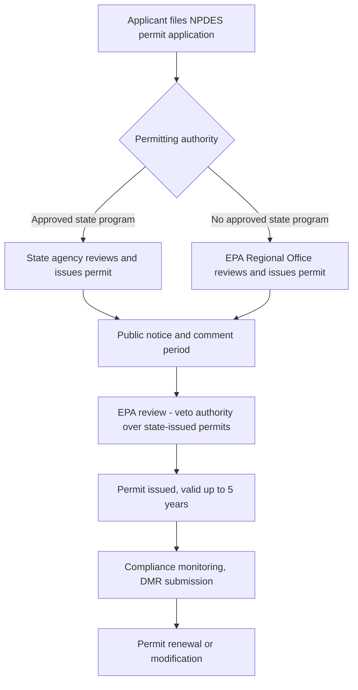

## The NPDES Permitting Program and Effluent Limitations

### Statutory Basis

The National Pollutant Discharge Elimination System (NPDES) is established under § 402 of the Clean Water Act (CWA), 33 U.S.C. § 1342, and constitutes the CWA's primary permitting mechanism for controlling point source discharges of pollutants into waters of the United States. NPDES operationalizes the CWA's central prohibition in § 301(a): the discharge of any pollutant by any person is unlawful except as authorized by, among other provisions, an NPDES permit.

**Key Points**

- "Discharge of a pollutant" means any addition of a pollutant to navigable waters from a point source, per § 502(12).
- "Point source" is defined broadly in § 502(14) to include any discernible, confined, and discrete conveyance (pipes, ditches, channels, tunnels, conduits, wells, concentrated animal feeding operations, and certain vessels), as distinguished from nonpoint source pollution (e.g., agricultural or urban runoff not channeled through a discrete conveyance), which is not directly regulated by NPDES.
- The permit functions as a shield: compliance with permit terms is deemed compliance with the CWA's substantive discharge prohibitions for the pollutants and outfalls covered, similar in concept to the Title V permit shield under the Clean Air Act.

### Permitting Authority: Federal and State Administration

EPA administers NPDES directly in states without an approved program, but the CWA allows states to obtain program authorization under § 402(b) to administer NPDES in lieu of EPA, subject to EPA oversight, veto authority over individual state-issued permits, and program withdrawal authority if a state fails to adequately administer its program. The large majority of states now administer EPA-approved NPDES programs.

### Two Categories of Effluent Limitations

NPDES permits impose numeric and/or narrative effluent limitations derived from two independent regulatory tracks, with the permit reflecting whichever is more stringent for each pollutant:

1. **Technology-based effluent limitations (TBELs)**: Minimum nationally applicable control levels based on the performance of specified treatment technologies, varying by industrial category and pollutant type (see technology standard tiers below). TBELs apply regardless of the receiving water's actual condition.
2. **Water quality-based effluent limitations (WQBELs)**: Additional or more stringent limitations required when TBELs alone are insufficient to meet applicable water quality standards for the receiving water body, incorporating the CWA § 303(d) impaired waters/TMDL framework where relevant.

### Technology-Based Standard Tiers

**Key Points — Industrial (Non-POTW) Dischargers**

- **BPT (Best Practicable Control Technology)**: The baseline/floor technology standard under § 301(b)(1)(A), based on average performance of existing plants, balancing cost against effluent reduction benefits.
- **BAT (Best Available Technology Economically Achievable)**: Applies to toxic and nonconventional pollutants under § 301(b)(2)(A), a more stringent standard than BPT, focused primarily on pollutant reduction capability with less weight on cost-benefit balancing.
- **BCT (Best Conventional Pollutant Control Technology)**: Applies to conventional pollutants (BOD, TSS, pH, fecal coliform, oil and grease) under § 301(b)(2)(E), incorporating a specific cost-reasonableness test comparing cost to the pollutant reduction benefit relative to POTW treatment costs.
- **NSPS (New Source Performance Standards)** under § 306: Applies to new sources, generally more stringent than BPT/BAT/BCT since new facilities can incorporate best available technology into initial design rather than retrofitting.

**Key Points — Publicly Owned Treatment Works (POTWs)**

- **Secondary treatment standards**: The baseline technology requirement for municipal sewage treatment plants under § 301(b)(1)(B), specified in EPA regulations (40 C.F.R. Part 133) with defined percent-removal and concentration-based limits for BOD, TSS, and pH.
- **Pretreatment program**: Industrial users discharging into POTW sewer systems (indirect dischargers) are regulated through categorical pretreatment standards under § 307(b)/(c), preventing pollutants that would pass through or interfere with POTW treatment or contaminate sewage sludge.

### Table: Technology Standards by Discharger and Pollutant Type

| Discharger Type | Pollutant Category | Standard | Statutory Basis |
| --- | --- | --- | --- |
| Existing industrial | Conventional pollutants | BCT | § 301(b)(2)(E) |
| Existing industrial | Toxic/nonconventional pollutants | BAT | § 301(b)(2)(A) |
| Existing industrial | All pollutants (historical baseline) | BPT | § 301(b)(1)(A) |
| New industrial source | All pollutants | NSPS | § 306 |
| POTW | Conventional pollutants | Secondary treatment | § 301(b)(1)(B) |
| Industrial user discharging to POTW | Categorical pollutants | Pretreatment standards | § 307(b)/(c) |

### Water Quality-Based Effluent Limitations (WQBELs)

Where technology-based limits alone would not ensure the receiving water meets applicable water quality standards (state-adopted designated uses and numeric/narrative criteria under CWA § 303), the permitting authority must impose more stringent WQBELs under § 301(b)(1)(C). This typically becomes necessary for waters listed as impaired under § 303(d), where a Total Maximum Daily Load (TMDL) allocates the maximum pollutant loading the water can assimilate while meeting standards, apportioned among point sources (wasteload allocations) and nonpoint sources (load allocations).

$$\text{TMDL} = \sum \text{WLA}_i + \sum \text{LA}_j + \text{MOS}$$

where WLA is wasteload allocation (point sources), LA is load allocation (nonpoint sources), and MOS is the margin of safety.

### Permit Application and Issuance Process

1. **Application**: Discharger submits Form 1 (general) plus applicable industry-specific forms (e.g., Form 2C for existing industrial dischargers), including outfall locations, pollutant characterization, and production data.
2. **Draft permit development**: Permitting authority calculates applicable TBELs and WQBELs, incorporates monitoring and reporting requirements.
3. **Public notice and comment**: Minimum 30-day public comment period; interested persons may request a public hearing.
4. **EPA review (state-issued permits)**: EPA retains authority to object to and, in some circumstances, veto state-issued permits that do not comply with CWA requirements.
5. **Issuance**: Permits are issued for a fixed term not to exceed 5 years (§ 402(b)(1)(B)), after which renewal (reissuance) is required.
6. **Administrative continuance**: A timely-filed renewal application generally allows the discharger to continue operating under the expired permit's terms pending issuance of the new permit ("administrative continuance"), analogous to the Title V application shield.

### Monitoring, Reporting, and Enforcement

**Key Points**

- **Discharge Monitoring Reports (DMRs)**: Permittees must self-monitor and report compliance data (typically monthly) to the permitting authority, a cornerstone of NPDES's largely self-reporting compliance architecture.
- **Citizen suits**: CWA § 505 authorizes citizen suits against permit violators based on DMR data, making self-reported exceedances a common and legally significant basis for third-party enforcement litigation.
- **Enforcement response**: Violations can trigger administrative penalties, civil judicial enforcement (including penalties up to statutory per-day, per-violation maximums), and, for knowing violations, criminal penalties under §§ 309(c).
- **Permit shield doctrine**: Compliance with permit terms generally shields the discharger from liability for pollutants and discharge points specifically disclosed and addressed in the permit application and permit itself, though the shield does not extend to pollutants not disclosed or reasonably anticipated at the time of permitting.

### Antidegradation and Antibacksliding Principles

- **Antidegradation**: State water quality standards must include antidegradation provisions preventing the lowering of water quality in high-quality waters, even where a proposed discharge would otherwise meet applicable numeric criteria.
- **Antibacksliding**: § 402(o) generally prohibits permit renewals or modifications from relaxing effluent limitations below the level in the previous permit, with limited statutory exceptions (e.g., material and substantial changes in circumstances, new information not available at previous issuance).

### Example

A pulp and paper mill discharging process wastewater into a river would be subject to BAT-based effluent limitations for toxic pollutants (e.g., dioxins, chlorinated compounds associated with bleaching processes) under its applicable industrial subcategory effluent guidelines, BCT-based limits for conventional pollutants like BOD and TSS, and, if the receiving river segment is listed as impaired for a relevant parameter under § 303(d), an additional WQBEL derived from the river's TMDL wasteload allocation — with the more stringent of the technology-based and water quality-based limits controlling for each pollutant in the final permit.

**Related Topics**

- Effluent limitation guidelines (ELGs) by industrial category (40 C.F.R. Subchapter N)
- Total Maximum Daily Loads (TMDLs) and § 303(d) impaired waters listing
- Pretreatment program and categorical standards for indirect dischargers
- Citizen suit enforcement under CWA § 505
- Nonpoint source pollution and its exclusion from direct NPDES regulation
- Wetlands permitting under CWA § 404 and its relationship to § 402
- Water quality standards: designated uses, criteria, and antidegradation policy