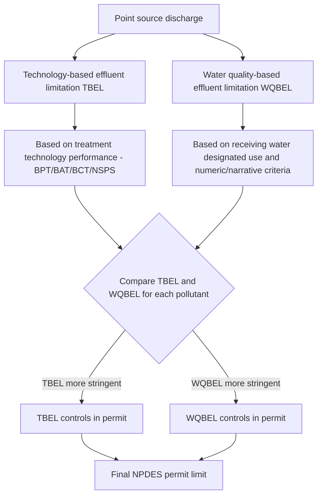

## Technology-Based Standards Versus Water Quality-Based Standards

### Two Independent Regulatory Tracks

The Clean Water Act imposes effluent limitations on point source dischargers through two conceptually distinct and independently operating regulatory approaches, both converging in the same NPDES permit. Understanding why the CWA uses both — rather than one alone — is central to understanding the statute's overall design philosophy.

**Key Points**

- **Technology-based effluent limitations (TBELs)**: Nationally uniform, technology-driven floors set by reference to what treatment technology can achieve, applied regardless of the condition of the specific receiving water.
- **Water quality-based effluent limitations (WQBELs)**: Site-specific, receiving-water-driven limits calculated to ensure the specific water body meets its designated uses and applicable water quality criteria.
- Under CWA § 301(b)(1)(C), a permit must include whichever limitation — technology-based or water quality-based — is more stringent for each pollutant; the two standards are not alternatives but a floor-and-ceiling structure where the stricter number always controls.

### Why Two Tracks Exist: The Underlying Policy Rationale

[Inference] The dual-track structure reflects a deliberate legislative compromise embedded in the 1972 CWA Amendments, responding to the perceived failure of the pre-1972 water-quality-only approach:

- **Pre-1972 water-quality-only regime**: Prior federal water pollution law relied primarily on ambient water quality standards, which proved difficult to enforce because establishing a causal link between a specific discharger's effluent and an ambient water quality violation was often scientifically and legally difficult, particularly with multiple dischargers on a single water body.
- **1972 shift toward technology-forcing**: Congress added TBELs to create clear, uniform, and more easily enforceable minimum requirements untethered to case-by-case water quality demonstrations — a discharger's technology-based limit is fixed and independently enforceable regardless of downstream water conditions.
- **Retention of water quality standards as a backstop**: Congress retained water-quality-based limits to address situations where uniform technology floors are insufficient to protect a particular sensitive or already-impaired water body, preserving a mechanism responsive to local conditions.

### Comparative Structure (Illustrative Diagram)

### Technology-Based Standards: Detailed Characteristics

**Key Points**

- **National uniformity**: TBELs are developed by EPA as industry-category-specific effluent limitation guidelines (ELGs), applied consistently to all similarly situated dischargers nationwide (subject to limited site-specific variances), reflecting Congress's judgment that dischargers should not gain competitive advantage by locating in areas with weaker water quality standards.
- **Cost consideration varies by tier**: BPT and BCT incorporate cost-reasonableness balancing tests; BAT for toxic pollutants weighs cost far less heavily, prioritizing pollutant reduction capability (a deliberately more aggressive standard for the most hazardous pollutant category).
- **Technology-forcing character**: TBELs, particularly BAT and NSPS, are designed to drive technological improvement over time — later standards may require technology not yet in widespread use if EPA determines it is achievable, distinguishing TBELs from a purely "current best practice" standard.
- **Applies regardless of receiving water condition**: A discharger into a pristine, high-quality stream and a discharger into an already-degraded stream face the same TBEL for the same pollutant and industrial category (absent a water-quality-driven WQBEL overlay).

### Water Quality-Based Standards: Detailed Characteristics

**Key Points**

- **Receiving-water-specific**: WQBELs derive from the state's water quality standards for the specific water body segment, comprising three components: designated uses (e.g., public water supply, aquatic life, recreation), numeric and/or narrative water quality criteria protective of those uses, and an antidegradation policy.
- **Triggered by insufficiency of TBELs**: WQBELs become operative specifically where technology-based limits alone would not ensure attainment of water quality standards — meaning a discharger may face identical TBELs to a similarly situated facility elsewhere, but a more stringent WQBEL if its particular receiving water cannot assimilate that technology-based loading while meeting standards.
- **TMDL-driven allocation for impaired waters**: For waters listed as impaired under § 303(d), WQBELs are typically derived from a Total Maximum Daily Load (TMDL) analysis, which calculates the total pollutant loading the water body can receive while meeting standards and allocates that loading among contributing point sources (wasteload allocations) and nonpoint sources (load allocations).
- **Can address pollutants not covered by applicable TBELs**: Because TBELs are organized by industrial category and pollutant type, a discharger may face a WQBEL for a pollutant with no applicable federal ELG at all, calculated instead directly from a reasonable potential analysis showing the discharge could cause or contribute to an exceedance of water quality criteria.

### Comparative Table

| Dimension | Technology-Based (TBEL) | Water Quality-Based (WQBEL) |
| --- | --- | --- |
| Basis | Treatment technology performance/availability | Receiving water designated uses and criteria |
| Geographic scope | National, uniform by industrial category | Site-specific, tied to particular water body segment |
| Statutory source | § 301(b)(1)(A)/(B), (b)(2), § 306, § 307 | § 301(b)(1)(C), § 303 |
| Triggering mechanism | Automatic — applies to all covered dischargers | Triggered when TBELs alone would not meet water quality standards |
| Cost consideration | Varies (BPT/BCT balance cost; BAT weighs it less) | Not directly cost-based; driven by water quality attainment need |
| Typical driver of stringency increase over time | New EPA ELG rulemakings, technology advancement | New/revised water quality standards, TMDL development, reduced assimilative capacity |
| Applies even to pristine waters | Yes | Only if needed to protect the specific designated use/antidegradation requirement |

### Reasonable Potential Analysis

Before imposing a WQBEL for a specific pollutant, the permitting authority typically conducts a "reasonable potential" analysis — assessing whether a discharge has the reasonable potential to cause or contribute to an excursion above a water quality criterion, considering factors such as existing controls, receiving water dilution, and background pollutant concentrations. If reasonable potential is found, a WQBEL must be included; if not, the TBEL alone controls for that pollutant.

$$C_{\text{effluent}} \times Q_{\text{effluent}} + C_{\text{background}} \times Q_{\text{receiving}} \leq C_{\text{criterion}} \times (Q_{\text{effluent}} + Q_{\text{receiving}})$$

*(Simplified mass-balance concept underlying reasonable potential and WQBEL derivation; actual EPA/state methodologies incorporate additional statistical and mixing-zone considerations.)*

### Interaction and Sequencing in Practice

1. Permit writer first calculates all applicable TBELs (BPT/BAT/BCT/NSPS or POTW secondary treatment/pretreatment standards) for each pollutant of concern.
2. Permit writer conducts a reasonable potential analysis for the receiving water, considering the discharge's contribution against applicable water quality standards.
3. If reasonable potential exists and the TBEL is insufficient, permit writer calculates a WQBEL using the state's approved methodology (often derived from a TMDL wasteload allocation, where one exists).
4. Final permit limit for each pollutant equals the more stringent of the TBEL and WQBEL.
5. Antibacksliding principles under § 402(o) generally prevent relaxing whichever limit was more stringent in a prior permit term, even if updated technology or water quality analyses would otherwise justify relaxation, absent a statutory exception.

### Example

A metal finishing facility subject to a federal BAT-based effluent guideline for chromium might face a TBEL limiting chromium discharge to a specified concentration nationwide. If that facility discharges into a small, low-flow stream already listed as impaired for chromium under § 303(d), with a TMDL allocating a wasteload allocation more stringent than the national BAT limit, the facility's NPDES permit would incorporate the TMDL-derived WQBEL instead — even though an identical facility discharging the same effluent concentration into a large, high-flow river with ample assimilative capacity might operate under the TBEL alone, since no reasonable potential to exceed water quality criteria would be shown for that discharge location.

### Litigation and Interpretive Themes

[Inference] Several recurring doctrinal issues are commonly emphasized in coursework comparing the two standards:

- **Deference to EPA's TBEL technology determinations**: Courts have generally extended significant deference to EPA's technical and economic judgments in setting BPT/BAT/BCT/NSPS limits, given the specialized engineering and economic analysis involved.
- **State authority over WQBELs and antidegradation**: Because water quality standards are primarily state-adopted (subject to EPA approval under § 303), WQBEL calculation methodologies can vary meaningfully between states, creating less national uniformity than the TBEL track and occasionally generating interstate disputes over upstream/downstream pollutant loading responsibility.
- **Interaction with TMDL litigation**: Disputes over TMDL adequacy (e.g., whether wasteload allocations are sufficiently protective, whether nonpoint source load allocations are realistic) directly affect downstream WQBEL calculations, making TMDL litigation a frequent indirect avenue for challenging effluent limitations that dischargers view as overly stringent.

**Related Topics**

- NPDES permitting program structure and effluent limitation derivation
- Total Maximum Daily Loads (TMDLs) and § 303(d) impaired waters listing
- BPT, BAT, BCT, and NSPS technology tiers in detail
- Reasonable potential analysis and mixing zone methodologies
- Antidegradation policy and antibacksliding principles under § 402(o)
- State water quality standards: designated uses and criteria development