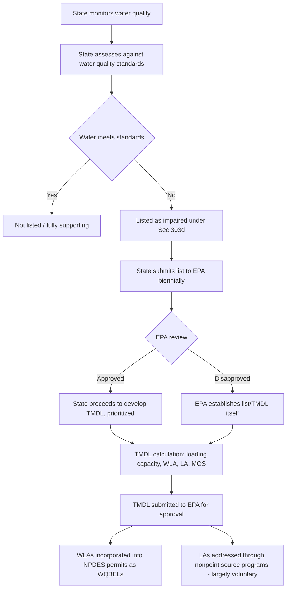

## Total Maximum Daily Loads and Impaired Waters Listing

### Statutory Basis

The impaired waters listing and Total Maximum Daily Load (TMDL) program derives from CWA § 303(d), 33 U.S.C. § 1313(d), which requires states to identify waters that do not meet applicable water quality standards even after implementation of technology-based effluent limitations, and to establish TMDLs for those waters ranked by priority. Unlike the NPDES program's direct point-source permitting focus, § 303(d) addresses situations where point-source technology controls alone are insufficient to achieve water quality goals — often because nonpoint source pollution, multiple cumulative dischargers, or naturally limited assimilative capacity are also contributing to the impairment.

### The Listing Process

**Key Points**

- Every two years, states must compile and submit to EPA a list of impaired waters — water body segments that fail to meet one or more applicable water quality standards despite existing pollution controls.
- States assess waters using monitoring data, applying methodologies (often called Integrated Reporting) that categorize waters from "fully supporting" all designated uses to "impaired" for one or more specific pollutants or stressors.
- EPA must review and approve or disapprove each state's § 303(d) list; if EPA disapproves a state list as inadequate, or if a state fails to submit a list, EPA has authority (and has historically exercised it in various circumstances) to establish the list and corresponding TMDLs itself.
- Waters are ranked by priority for TMDL development, considering factors such as the severity of pollution, the designated uses affected, and public health/ecological significance.

### Listing and TMDL Development Process (Illustrative Diagram)

### TMDL Definition and Components

A TMDL quantifies the maximum amount of a pollutant a water body can receive while still meeting applicable water quality standards, then allocates that total loading capacity among contributing sources.

$$\text{TMDL} = \sum_{i} \text{WLA}_i + \sum_{j} \text{LA}_j + \text{MOS}$$

Where:

- **Loading capacity**: The total pollutant load the water body can assimilate while meeting water quality standards for the relevant pollutant and designated use.
- **WLA (Wasteload Allocation)**: The portion of loading capacity allocated to existing and future point sources, individually or collectively, which becomes the basis for water quality-based effluent limitations in those sources' NPDES permits.
- **LA (Load Allocation)**: The portion allocated to nonpoint sources and natural background levels.
- **MOS (Margin of Safety)**: An explicit or implicit buffer accounting for uncertainty in the relationship between pollutant loading and water quality response; may be expressed as a separate numeric term (explicit MOS) or built conservatively into the other calculations (implicit MOS).

### TMDL Content Requirements

**Key Points**

- Identification of the pollutant(s) causing impairment and the water quality standard(s) not being met.
- Quantification of the loading capacity for the water body under critical conditions (e.g., low-flow, high-temperature periods when assimilative capacity is most limited).
- Allocation of that loading capacity among point sources (WLAs) and nonpoint sources (LAs), including a margin of safety.
- Consideration of seasonal variation and reasonable assurance that nonpoint source load allocations will actually be achieved (an area of significant practical and legal difficulty, discussed below).
- Where multiple pollutants or multiple water body segments interact (e.g., a watershed-scale nutrient TMDL spanning many tributaries), TMDLs may be developed at a broader geographic scale than a single discrete segment.

### The Point Source/Nonpoint Source Enforceability Gap

**Key Points**

- **Point source WLAs are directly enforceable**: Once incorporated into an NPDES permit as a WQBEL, a wasteload allocation becomes a legally binding, federally enforceable permit condition, subject to the full range of CWA compliance monitoring, citizen suit, and enforcement mechanisms.
- **Nonpoint source LAs are generally not directly enforceable under the CWA**: Because nonpoint source pollution (agricultural runoff, urban stormwater not captured by an MS4 or similar point source permit, silvicultural runoff) falls outside NPDES's point-source-focused jurisdiction, load allocations assigned to nonpoint sources typically rely on state nonpoint source management programs, best management practices (BMPs), and often voluntary or incentive-based compliance mechanisms rather than direct federal permitting authority.
- This asymmetry creates a structural tension: a TMDL may impose substantial WLA reductions on point sources (which are directly enforceable) while assuming, without a directly enforceable mechanism, that nonpoint sources will achieve their allocated reductions — a frequent point of litigation and policy critique, since point source dischargers may bear a disproportionate compliance burden if nonpoint source reductions do not materialize as assumed.

### Litigation History and Interpretive Issues

[Inference] Several recurring themes characterize § 303(d)/TMDL litigation and are commonly emphasized in coursework:

- **State/EPA listing disputes**: Litigation has frequently addressed whether states have adequately identified impaired waters, whether EPA's review of state lists was sufficiently rigorous, and whether EPA's own list-development authority (when it steps in for an inadequate state list) is properly exercised.
- **"Reasonable assurance" litigation**: Courts have grappled with how much certainty a TMDL must provide that nonpoint source load allocations will actually be achieved, particularly in TMDLs that rely heavily on assumed future BMP implementation to meet water quality standards.
- **Pollutant versus pollution distinction**: Some TMDL disputes have turned on whether a particular stressor (e.g., sediment, flow alteration, temperature) constitutes a "pollutant" subject to TMDL/WLA treatment or a broader "pollution" concept not squarely fitting the CWA's more pollutant-specific TMDL framework.
- **TMDL as a planning document versus enforceable standard**: A recurring conceptual point is that the TMDL itself is generally treated as a planning and allocation document — the enforceable regulatory teeth arise only once a WLA is translated into a specific NPDES permit WQBEL; the TMDL document itself does not directly regulate any discharger.

### Table: TMDL Program Components and Their Legal Character

| Component | Legal Character | Enforceability |
| --- | --- | --- |
| § 303(d) impaired waters list | Administrative listing/planning determination | Not independently enforceable against any discharger |
| TMDL loading capacity calculation | Technical/scientific determination | Not independently enforceable; informs subsequent permitting |
| Wasteload allocation (WLA) | Becomes binding once incorporated into an NPDES permit as a WQBEL | Fully enforceable — citizen suits, administrative/civil/criminal enforcement |
| Load allocation (LA) | Assigned to nonpoint sources | Generally not directly enforceable under the CWA; relies on state nonpoint programs |

### Watershed-Scale and Pollutant-Specific Examples

TMDLs vary considerably in scale and complexity depending on the pollutant and water body involved:

- **Simple, single-source TMDLs**: A short stream segment impaired for a single pollutant (e.g., dissolved oxygen depletion from a single permitted discharger) may involve a relatively straightforward WLA/LA allocation.
- **Complex, multi-jurisdictional nutrient TMDLs**: Large-scale nutrient TMDLs (e.g., for major estuaries or river basins experiencing eutrophication) often require allocating loading capacity across numerous point sources, multiple states, and diffuse nonpoint source categories (agricultural runoff, urban stormwater, atmospheric deposition), substantially increasing scientific and administrative complexity and the practical difficulty of "reasonable assurance" for nonpoint reductions.

### Example

A river segment listed as impaired for phosphorus due to agricultural runoff and municipal wastewater discharges would require a TMDL quantifying the total phosphorus loading capacity consistent with the river's designated aquatic life use, allocating a portion (WLA) to permitted point sources such as POTWs and industrial dischargers — which would then see that allocation incorporated as a numeric phosphorus WQBEL in their next NPDES permit renewal — while allocating the remaining portion (LA) to agricultural nonpoint sources, whose actual compliance would depend on voluntary adoption of best management practices (e.g., buffer strips, reduced fertilizer application) rather than any directly enforceable federal permit obligation.

**Related Topics**

- Water quality-based effluent limitations and their derivation from WLAs
- Technology-based versus water quality-based standards comparison
- State water quality standards: designated uses, criteria, and antidegradation
- Nonpoint source pollution management programs under CWA § 319
- NPDES permitting program structure and effluent limitations
- Municipal separate storm sewer system (MS4) permitting as a point source category