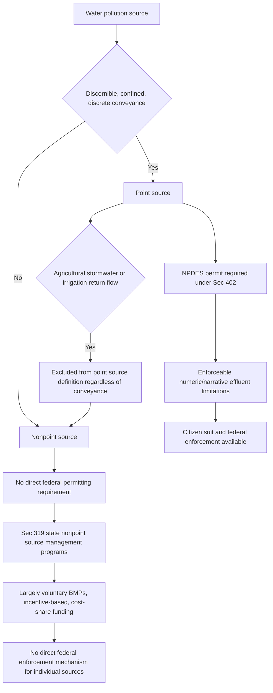

## The Regulatory Gap for Nonpoint Source Pollution

### Defining the Gap: Point Source Versus Nonpoint Source

The Clean Water Act's core regulatory mechanism — the NPDES permitting program under § 402 — applies only to discharges from a "point source," defined in § 502(14) as any discernible, confined, and discrete conveyance, including pipes, ditches, channels, tunnels, conduits, wells, and concentrated animal feeding operations (CAFOs). Pollution that reaches waters of the United States through diffuse, unchannelized pathways — commonly termed nonpoint source (NPS) pollution — falls outside this definition and is therefore not subject to direct federal permitting under § 402.

**Key Points**

- Nonpoint source pollution includes agricultural runoff (fertilizers, pesticides, sediment, animal waste from non-CAFO operations), urban and suburban stormwater runoff not captured by a regulated municipal separate storm sewer system (MS4), silvicultural (forestry) runoff, construction site runoff below regulatory thresholds, atmospheric deposition, and habitat/hydrologic modification.
- The CWA's statutory text does not define "nonpoint source" affirmatively; it is understood residually, as pollution reaching navigable waters other than through a point source.
- This is widely regarded as the most significant structural gap in the CWA's regulatory architecture, since nonpoint sources — particularly agricultural runoff — are frequently the dominant contributor to water quality impairment in many watersheds, especially for nutrients (nitrogen, phosphorus) and sediment.

### Why the Gap Exists: Statutory Design Choices

[Inference] The point/nonpoint distinction reflects deliberate, though consequential, choices made during the CWA's development:

- **Administrative feasibility of point source permitting**: Point sources are, by definition, discrete and identifiable, making individualized permit limits and monitoring administratively tractable. Nonpoint sources are diffuse, numerous, and often difficult to measure or attribute to a specific responsible party, making direct permitting far more administratively complex.
- **Agricultural exemption as a political compromise**: Congress has historically treated agricultural operations with particular deference, reflected in several explicit statutory exclusions (discussed below), reflecting the political influence of agricultural interests during the CWA's enactment and subsequent amendments.
- **Federalism preference for state-led nonpoint management**: Rather than imposing direct federal permitting, Congress opted for a cooperative federalism model for nonpoint sources, relying on state-developed management programs with federal funding support rather than federal command-and-control regulation.

### Statutory Point Source Exclusions Relevant to the Gap

**Key Points**

- **Agricultural stormwater discharges and irrigation return flows**: § 502(14) expressly excludes "agricultural stormwater discharges and return flows from irrigated agriculture" from the point source definition, regardless of whether the discharge is channeled — a significant and deliberate carve-out.
- **CAFOs remain point sources**: Concentrated Animal Feeding Operations are expressly included within the point source definition and therefore do remain subject to NPDES permitting, distinguishing large-scale, concentrated livestock operations from more diffuse agricultural runoff — an important line-drawing exercise in practice, since CAFO regulatory thresholds determine which livestock operations fall inside versus outside the permitting system.
- **Silviculture**: Certain forestry-related discharges have historically received similarly limited regulatory treatment, though the precise contours have been subject to litigation regarding whether specific silvicultural activities (e.g., stormwater from logging roads) constitute point source discharges.

### Regulatory Structure Comparison (Illustrative Diagram)

### Section 319: The Primary Federal Nonpoint Source Mechanism

CWA § 319, added by the 1987 Amendments, establishes the principal (though limited) federal framework addressing nonpoint source pollution:

1. **State assessment reports**: States must identify waters that cannot reasonably be expected to attain or maintain water quality standards without additional nonpoint source controls, and identify the categories of nonpoint sources contributing to those impairments.
2. **State management programs**: States must develop nonpoint source management programs identifying best management practices (BMPs) and a schedule for implementation, subject to EPA approval.
3. **Federal grant funding**: EPA provides grant funding to states to implement approved § 319 programs, functioning primarily as a funding and technical assistance mechanism rather than a regulatory permitting mechanism.
4. **No direct enforcement mechanism**: Critically, § 319 does not grant EPA or states direct enforcement authority over individual nonpoint source polluters; compliance with BMPs identified in state management programs is generally voluntary, incentivized through cost-share funding, technical assistance, and, in some states, more robust state-law requirements exceeding the federal floor.

### The TMDL Interaction: Load Allocations Without Direct Enforceability

As addressed in the TMDL/impaired waters framework, nonpoint sources receive load allocations (LAs) in a TMDL, representing their assumed contribution to a water body's total loading capacity. However, unlike wasteload allocations (WLAs) for point sources — which become binding water quality-based effluent limitations once incorporated into an NPDES permit — load allocations for nonpoint sources are not independently enforceable under the CWA. This creates the "reasonable assurance" problem: a TMDL may assume nonpoint sources will achieve specified reductions to meet overall water quality goals, but has no direct federal mechanism to compel that outcome if voluntary or state-incentivized measures prove insufficient.

$$\text{TMDL} = \underbrace{\sum \text{WLA}_i}_{\text{enforceable via NPDES}} + \underbrace{\sum \text{LA}_j}_{\text{generally not directly enforceable}} + \text{MOS}$$

### State-Level Responses to the Federal Gap

**Key Points**

- Some states have enacted state-law requirements for agricultural nonpoint sources exceeding the federal floor, including mandatory nutrient management planning, buffer strip requirements, or state-permitting programs for certain agricultural activities not covered by federal CAFO rules.
- Some states use water quality trading programs, allowing point sources to meet a portion of their WLA obligations by funding verified nonpoint source reductions (e.g., a wastewater treatment plant funding agricultural BMP implementation upstream) as a cost-effective alternative to further point-source treatment upgrades — though these programs raise their own additionality, verification, and enforceability questions given the underlying voluntary character of nonpoint source compliance.
- Variation in state approaches to nonpoint source regulation is substantial, reflecting the CWA's deliberate delegation of this area to state discretion rather than federal uniformity.

### Litigation and Doctrinal Themes

[Inference] Several recurring issues are commonly emphasized in coursework addressing the nonpoint source gap:

- **Line-drawing disputes over "point source" classification**: Litigation has repeatedly tested the boundary of the point source definition — for example, whether certain conveyances associated with agricultural or silvicultural operations (irrigation ditches, logging road culverts, concentrated flow from tile drainage systems) constitute point sources or fall within the agricultural/silvicultural exclusions.
- **CAFO threshold determinations**: Disputes frequently arise over whether a given livestock operation meets the regulatory definition and size thresholds for CAFO status (triggering point source/NPDES obligations) versus qualifying as a smaller operation outside direct federal permitting.
- **Adequacy of § 319 as a water quality tool**: A significant body of policy and legal commentary questions whether the voluntary, funding-based § 319 approach is adequate to address nonpoint source pollution's substantial contribution to water quality impairment nationally, particularly for nutrient pollution driving eutrophication and harmful algal blooms in many watersheds.
- **Interaction with state water quality standard attainment**: Because water quality standards apply to the water body as a whole regardless of source type, a water body may remain persistently impaired and unable to attain its designated uses even where all regulated point sources are in full compliance with their technology-based and water quality-based effluent limitations, if nonpoint sources continue contributing significant pollutant loading — a structural limitation on the CWA's overall effectiveness in nonpoint-source-dominated watersheds.

### Table: Point Source vs. Nonpoint Source Regulatory Comparison

| Dimension | Point Source | Nonpoint Source |
| --- | --- | --- |
| Statutory permitting mechanism | NPDES (§ 402) | None (no direct federal permit) |
| Primary federal tool | Technology-based and water quality-based effluent limitations | § 319 state management programs (funding/technical assistance) |
| Enforceability | Fully enforceable (citizen suits, civil/criminal penalties) | Generally not directly enforceable under federal law |
| TMDL allocation type | Wasteload allocation (WLA) | Load allocation (LA) |
| Compliance mechanism | Mandatory permit conditions | Largely voluntary BMPs, cost-share incentives |
| Federalism structure | Federal floor with state program delegation option | State-led, federally funded, minimal federal mandate |

### Example

A watershed experiencing recurring harmful algal blooms driven primarily by phosphorus and nitrogen loading might have all its permitted point sources — a municipal wastewater treatment plant and several small industrial dischargers — fully compliant with technology-based and water quality-based effluent limitations reflecting the watershed's TMDL wasteload allocations, yet the water body could remain impaired if the TMDL's nonpoint source load allocation (attributed primarily to surrounding agricultural operations applying fertilizer) is not actually achieved, since no CWA mechanism compels individual farms to adopt the nutrient management practices the TMDL assumed — illustrating how the regulatory gap can undermine water quality attainment even where the point source permitting system is functioning exactly as designed.

**Related Topics**

- Total Maximum Daily Loads and impaired waters listing under § 303(d)
- CAFO regulation and point source classification thresholds
- CWA § 319 nonpoint source management program structure
- Water quality trading programs between point and nonpoint sources
- Municipal separate storm sewer system (MS4) permitting as a point source category
- State water quality standards, designated uses, and antidegradation policy
- Federal-state cooperative federalism models across environmental statutes