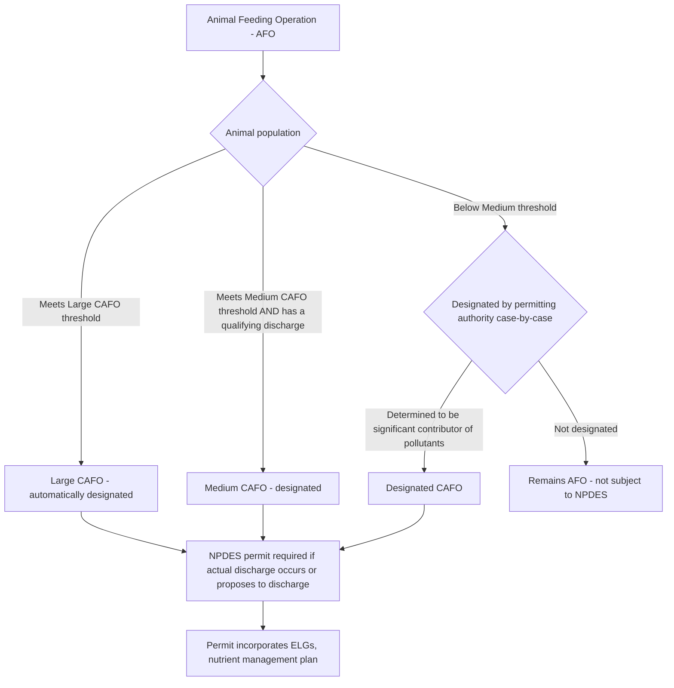

## Concentrated Animal Feeding Operations and Agricultural Discharges

### Statutory and Regulatory Basis

Concentrated Animal Feeding Operations (CAFOs) occupy a distinctive position within the Clean Water Act's point source/nonpoint source framework: § 502(14) expressly includes CAFOs within the statutory definition of "point source," making them subject to NPDES permitting under § 402 notwithstanding the broader statutory exclusion for agricultural stormwater and irrigation return flows. EPA's implementing regulations for CAFOs appear primarily at 40 C.F.R. Part 122 (NPDES permitting generally) and Part 412 (effluent limitation guidelines specific to the feedlot point source category).

**Key Points**

- CAFOs represent a deliberate legislative line-drawing exercise: Congress and EPA distinguish concentrated, industrial-scale livestock operations (treated as point sources) from more diffuse, smaller-scale agricultural livestock operations and general agricultural runoff (treated as nonpoint sources outside direct NPDES jurisdiction).
- The CAFO designation is a size- and management-based classification, not simply a function of raising livestock; two operations raising similar animal types can fall on different sides of the CAFO line depending on animal population, confinement method, and discharge characteristics.

### AFO-to-CAFO Classification Structure

Before reaching CAFO status, an operation must first qualify as an Animal Feeding Operation (AFO) — a lot or facility where animals are confined and fed for at least 45 days in a 12-month period, and where vegetation is not sustained in the confinement area during the normal growing season. AFOs are then evaluated against CAFO thresholds:

### Size Classification Thresholds (Illustrative — Cattle Example)

**Key Points**

- **Large CAFO**: Meets or exceeds specified animal population thresholds (e.g., 1,000 or more cattle other than mature dairy cattle or veal calves, 700 or more mature dairy cattle, 2,500 or more swine over 55 lbs, 125,000 or more chickens with a liquid manure handling system, among other species-specific thresholds) — automatically classified as a CAFO regardless of discharge status.
- **Medium CAFO**: Falls within an intermediate population range specified by regulation, and is classified as a CAFO only if it has a qualifying discharge — either through a man-made ditch/pipe directly into waters of the U.S., or where animals come into direct contact with waters of the U.S. that pass through the confinement area.
- **Designated (Small) CAFO**: Any AFO, regardless of size, may be individually designated as a CAFO by the permitting authority upon a determination that it is a significant contributor of pollutants to waters of the United States, typically following on-site inspection.
- Exact numeric thresholds vary by animal type (cattle, dairy cattle, swine, poultry with different manure handling systems, horses, sheep, ducks) and are set out in EPA's regulations at 40 C.F.R. § 122.23.

### NPDES Permitting Requirement: The "Propose to Discharge" Standard

A significant and historically litigated feature of CAFO regulation is the trigger for NPDES permitting obligations. EPA regulations have required CAFOs meeting size thresholds to obtain NPDES permits if they discharge or **propose to discharge** — a standard broader than requiring an actual, demonstrated discharge before permitting obligations attach.

[Inference] This "propose to discharge" standard has been a recurring point of litigation, with agricultural industry challengers arguing that CWA jurisdiction should require an actual discharge (consistent with the CWA's general point-source discharge-triggered structure) rather than a prospective, design-capacity-based determination, while environmental petitioners have argued that requiring proof of an actual discharge before permitting undermines the CWA's preventive regulatory purpose given the difficulty of directly observing agricultural discharges.

### Effluent Limitation Guidelines for CAFOs

CAFO effluent limitation guidelines under 40 C.F.R. Part 412 center on a "zero discharge" design standard for the production area (the confined animal housing, manure storage, and waste handling areas), reflecting the general policy goal that properly managed CAFO waste should not be discharged to surface waters except during unusually large storm events:

- **Production area**: CAFOs are generally required to design, construct, operate, and maintain a facility to contain all manure, litter, and process wastewater, including runoff from a storm event up to a specified design storm (commonly the 25-year, 24-hour storm), effectively imposing a no-discharge standard for normal operating conditions.
- **Land application areas**: Nutrient (primarily nitrogen and phosphorus) application to crop or pasture land used for manure disposal must be managed according to a site-specific Nutrient Management Plan (NMP), addressing application rates, timing, and methods to minimize nutrient runoff and leaching.

### Nutrient Management Plan (NMP) Requirements

**Key Points**

- NMPs must be developed for each CAFO and typically must address: field-specific rates of manure/wastewater application based on realistic crop yield expectations, appropriate soil testing protocols, setback distances from surface water and conduits to surface water, and record-keeping of actual application rates and dates.
- Since litigation in the mid-2000s, EPA regulations have generally required CAFO NMPs (or their nutrient application rate terms) to be incorporated into and made a publicly available, enforceable term of the NPDES permit itself, rather than existing solely as an internal, non-public planning document — a significant transparency and enforceability development in CAFO regulation.
- NMPs must be developed by a certified nutrient management planner or otherwise satisfy technical standards established by the permitting authority.

### The Agricultural Stormwater Exemption's Interaction with CAFO Status

A recurring and legally significant interpretive question is how the § 502(14) agricultural stormwater exemption interacts with CAFO land application areas. EPA's regulatory position has generally been that land application of manure consistent with the site's approved Nutrient Management Plan qualifies for treatment analogous to the agricultural stormwater exemption (i.e., runoff from properly conducted land application is not treated as a point source discharge requiring separate permitting), while land application inconsistent with an approved NMP (over-application, application too close to water, application during inappropriate weather conditions) may not qualify for that treatment and could constitute an unpermitted point source discharge.

### Table: CAFO Classification and Regulatory Consequences

| Classification | Basis | NPDES Permit Trigger | Key Requirement |
| --- | --- | --- | --- |
| Large CAFO | Population threshold met | Automatic if discharge or proposes to discharge | Full Part 412 ELGs, NMP required |
| Medium CAFO | Intermediate population threshold | Only if qualifying discharge pathway present (man-made conveyance or direct animal contact with waters) | Full Part 412 ELGs, NMP required if permitted |
| Designated (Small) CAFO | Case-by-case determination as significant pollutant contributor | Upon individual designation by permitting authority | Same as above, tailored to facility |
| AFO (non-CAFO) | Below thresholds, not designated | Not subject to NPDES | No federal permitting; agricultural stormwater exemption generally applies |

### Enforcement and Compliance Considerations

- **Self-monitoring and reporting**: Permitted CAFOs must maintain records demonstrating compliance with NMP terms, including manure/wastewater application records, and are subject to inspection.
- **Citizen suit exposure**: Because NMP terms are incorporated as enforceable permit conditions, violations (e.g., over-application of manure, discharge exceeding the design storm event, inadequate setback compliance) can trigger citizen suit liability under § 505 in addition to state/federal enforcement.
- **Manure as a "waste" versus "product" characterization**: [Inference] A recurring practical and sometimes litigated issue concerns whether manure transferred off-site to third parties for use as fertilizer remains subject to the originating CAFO's regulatory obligations, or whether the transfer shifts responsibility — an area where regulatory clarity has been incomplete and practices vary.

### Example

A large-scale dairy operation with 1,200 mature dairy cows, exceeding the Large CAFO threshold for that species category, would be required to obtain an NPDES permit incorporating Part 412 effluent limitation guidelines: its production area (barns, milking parlor wastewater, manure storage lagoons) would need to be designed to contain wastewater and manure through at least a 25-year, 24-hour storm event with no discharge under normal conditions, while its land application fields would operate under a site-specific Nutrient Management Plan specifying manure application rates calibrated to each field's crop nutrient needs and soil characteristics, with those application rate terms incorporated as enforceable, publicly available conditions of the facility's NPDES permit.

**Related Topics**

- The regulatory gap for nonpoint source pollution and the agricultural stormwater exemption
- NPDES permitting program structure and effluent limitations
- Technology-based versus water quality-based standards
- Total Maximum Daily Loads and nutrient impairment in agricultural watersheds
- Citizen suit enforcement under CWA § 505
- Waters of the United States (WOTUS) jurisdictional determinations