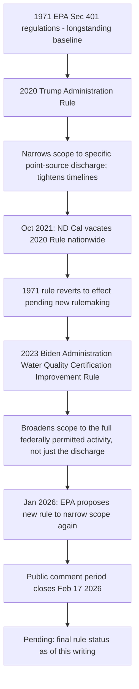

## Section 401 State Water Quality Certification

### Statutory Basis

CWA § 401, 33 U.S.C. § 1341, authorizes states (and authorized tribes) to review for compliance with appropriate federal, state, and tribal water quality requirements any discharge into waters of the United States that may result from a proposed activity that requires a federal license or permit. Unlike NPDES under § 402, which EPA or authorized states administer as the primary permitting authority, § 401 functions as a state/tribal veto-and-conditioning mechanism layered onto other federal licensing and permitting processes.

**Key Points**

- Federal agencies (FERC for hydropower licenses, the Army Corps of Engineers for § 404 dredge-and-fill permits, and others) cannot issue a federal license or permit for an activity that may result in a discharge to waters of the United States unless the state or tribe of jurisdiction either issues a § 401 certification, issues a certification with conditions, denies certification, or waives its certification authority (by failing to act within a reasonable period of time, not to exceed one year).
- A state's denial of certification effectively blocks the underlying federal license or permit; a state's certification with conditions requires those conditions to be incorporated into the federal permit — giving § 401 outsized practical leverage for states seeking to influence federally licensed projects (pipelines, hydropower facilities, dredge-and-fill activities) within their borders.
- § 401 is frequently described as a distinctive cooperative federalism mechanism, since it gives states/tribes a substantive check on federal permitting decisions rather than merely an implementation role within a federally defined program.

### Foundational Supreme Court Interpretation

*PUD No. 1 of Jefferson County v. Washington Department of Ecology*, 511 U.S. 700 (1994), remains the foundational Supreme Court interpretation of § 401's scope. The Court held that states may impose conditions in a § 401 certification that go beyond specific effluent limitations and may include broader water quality standard compliance measures (in that case, minimum stream flow requirements for a hydropower project, to protect fish habitat as part of the state's designated use determination), confirming that § 401 certification authority reaches beyond a narrow discharge-specific effluent limit analysis to broader water quality standard compliance.

### The Regulatory Pendulum: 2020–2026

Few CWA provisions have experienced as much rapid, successive federal regulatory reversal as § 401's implementing regulations, reflecting sharply differing views across administrations on the appropriate scope of state/tribal review authority relative to federal permitting efficiency concerns.

### Table: Comparative Scope Across Rulemaking Iterations

| Rule | Year | Scope of Review | General Direction |
| --- | --- | --- | --- |
| Original EPA regulations | 1971 | Longstanding baseline predating the modern rulemaking pendulum | Baseline |
| Trump Administration Certification Rule | 2020 | Narrowed to specific point-source discharge; tightened certification timelines | Narrower/faster |
| — | 2021 | 2020 Rule vacated nationwide by N.D. Cal.; 1971 rule reverts | Reversion |
| Water Quality Certification Improvement Rule (Biden Administration) | 2023 | Broadened scope to the full federally permitted "activity," not just the specific discharge | Broader/more state discretion |
| Proposed 2026 Rule | 2026 (proposed) | Proposes narrowing scope back to discharges specifically; standardizes submission requirements; tightens timing provisions | Narrower/faster (again) |

### The Core Recurring Dispute: "Discharge" Versus "Activity"

**Key Points**

- The central interpretive question across every recent rulemaking iteration has been whether state/tribal § 401 review authority extends only to the specific point-source discharge associated with a federally licensed activity, or to the broader federally permitted activity as a whole (potentially including non-discharge-related impacts of the project).
- A narrower "discharge-only" reading (reflected in both the 2020 and proposed 2026 rules) limits states to reviewing water quality impacts directly tied to the discharge itself, reducing the scope of conditions a state may impose and correspondingly increasing permitting predictability and speed for project developers.
- A broader "activity" reading (reflected in the 2023 rule) allows states to consider the full scope of water quality impacts from the permitted activity, giving states more expansive authority to condition or deny certification based on a wider range of project impacts, but correspondingly increasing scope for delay and litigation from developers' perspective.

### The 2026 Proposed Rule

On January 13/15, 2026 (the EPA's announcement and Federal Register publication dates are reported slightly differently across sources), EPA announced a proposed rule to revise the CWA § 401 water quality certification regulations (40 C.F.R. Part 121), published at 91 Fed. Reg. 2008 (Jan. 15, 2026). Key elements include:

- **Narrower scope of review**: A proposal to revise the certification scope to focus specifically on discharges, correcting what the agency describes as the 2023 rule's expansion of Section 401's scope.
- **Standardized submission requirements**: Uniform requirements for what must be included in certification requests and decisions.
- **Tightened timing provisions**: Provisions intended to prevent delays, with EPA seeking comment on alternatives designed to keep the overall process within a one-year window (consistent with the statutory maximum reasonable period of time).
- **Stated rationale**: EPA frames the proposal as correcting a fundamentally flawed 2023 EPA rule that allows delay tactics and protracted certification timelines inconsistent with the Clean Air Act, and states its position that Section 401 is limited to addressing only water quality-related impacts, an interpretation the agency had already signaled in a May 21, 2025 policy memo.
- **Public comment period**: The comment period closed February 17, 2026, following the standard 30-day comment window from Federal Register publication.
- [Unverified] As of this writing, the proposed rule had not yet been finalized; its ultimate scope, effective date, and any resulting litigation should be verified against current Federal Register and EPA sources.

### Opposition Arguments

Environmental and water quality advocacy organizations have opposed the 2026 proposal on several grounds reflected in public comments:

- **Characterization as federal overreach into state authority**: Opponents argue that certifications are an act of cooperative federalism that the proposed rule seeks to diminish, and that the changes would detrimentally limit the scope of state and tribe issued water quality certifications.
- **Tension with *PUD No. 1***: Opponents argue the proposal seeks to narrow certification scope in tension with judicial precedent, referencing the Supreme Court's affirmation in *PUD No. 1 of Jefferson County* of relatively broad state certification authority extending to water quality standard compliance generally, not merely a specific discharge's numeric limits.
- **Insufficient justification**: Some commenters argue EPA has not provided data or information regarding a problem with the status quo, framing the proposed rule as addressing a problem the agency has not adequately demonstrated exists.

### Practical Application: Federal Permits Requiring § 401 Certification

**Key Points**

- **CWA § 404 dredge-and-fill permits**: Issued by the Army Corps of Engineers for activities involving discharge of dredged or fill material into waters of the U.S. (including many wetlands), routinely require accompanying § 401 state certification.
- **FERC hydropower licenses**: Federal Energy Regulatory Commission licensing of hydroelectric projects requires § 401 certification, historically a significant point of state leverage over dam relicensing and new hydropower development (as illustrated in *PUD No. 1* itself).
- **Natural gas pipeline certificates**: FERC certificates for interstate natural gas pipelines crossing waters of the U.S. similarly require § 401 certification, making this provision a recurring flashpoint in state-level opposition to pipeline projects.

### Waiver Doctrine

If a state or tribe fails to act on a certification request within a reasonable period of time (not to exceed one year, as set by statute and implementing regulations), the certification requirement is deemed waived, and the federal permitting agency may proceed without state/tribal certification. The precise triggers for what constitutes a complete request (starting the clock) and what constitutes "action" sufficient to avoid waiver have themselves been recurring points of regulatory refinement and litigation across the successive rulemakings described above.

### Example

A proposed interstate natural gas pipeline crossing several streams and wetlands within a state would require both a § 404 dredge-and-fill permit from the Army Corps of Engineers and § 401 water quality certification from the state. Under a narrower "discharge-only" regulatory framework (as proposed in 2026), the state's certification review and any conditions it imposes would be limited to the specific water quality impacts of the discharge points themselves; under the broader "activity" framework applied under the 2023 rule, the state could potentially consider water quality impacts from the pipeline project more broadly, illustrating how the same underlying project could face a meaningfully different scope of state review and potential conditions depending on which regulatory iteration governs at the time of application.

**Related Topics**

- *PUD No. 1 of Jefferson County v. Washington Department of Ecology* (1994)
- CWA § 404 dredge-and-fill permitting and wetlands regulation
- FERC hydropower licensing and pipeline certification processes
- Waters of the United States (WOTUS) jurisdictional determinations
- Cooperative federalism structures across the Clean Water Act
- State water quality standards: designated uses and criteria